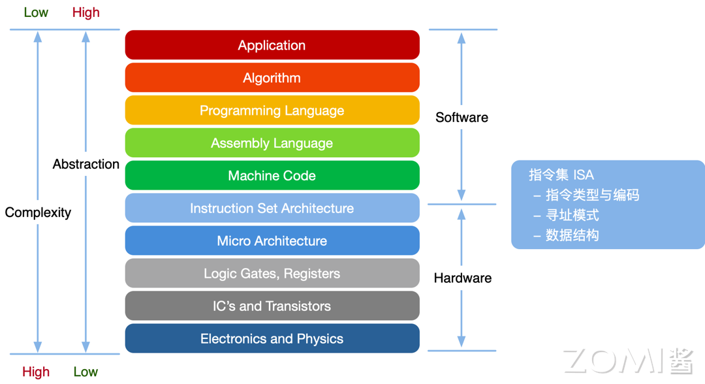
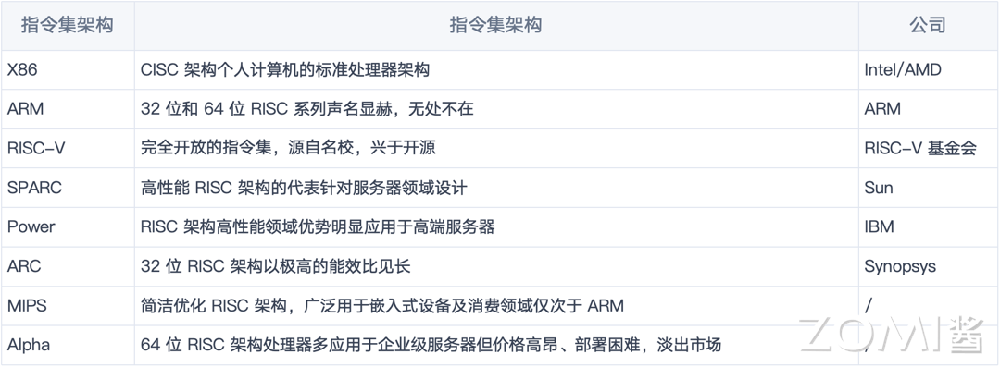
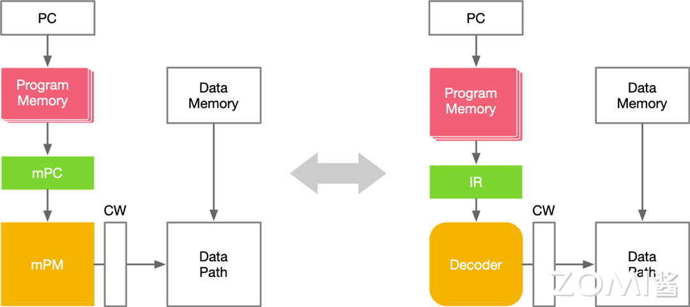
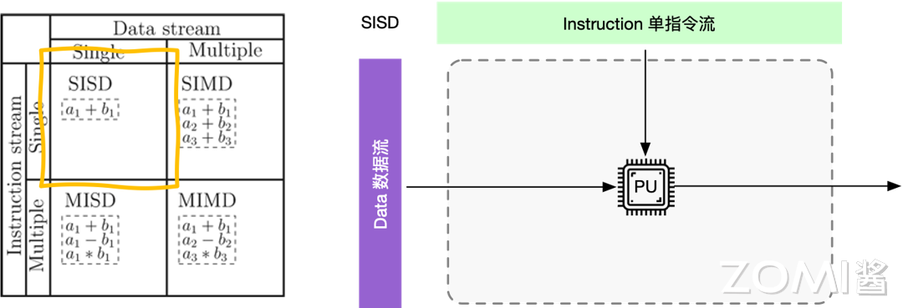
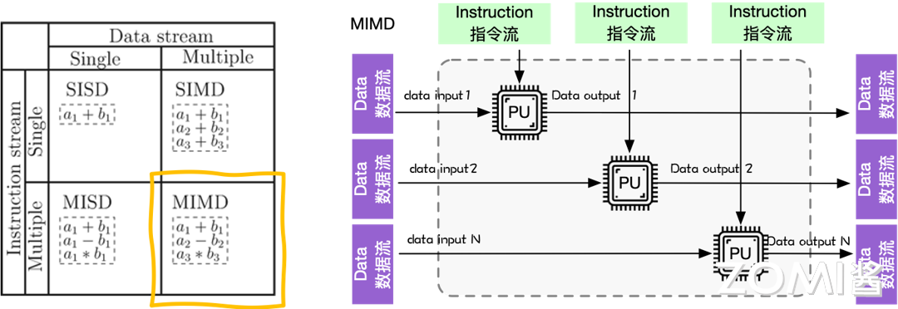
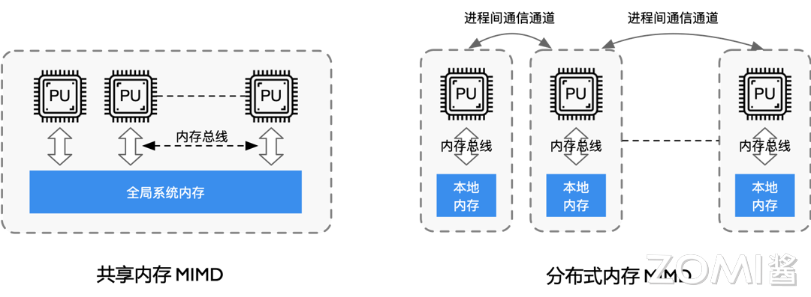

<!--Copyright 适用于[License](https://github.com/chenzomi12/AISystem)版权许可-->

# CPU 指令集架构 (DONE)

我们知道，计算机指令是指挥机器工作的指示和命令，程序就是一系列指令按照顺序排列的集合，执行程序的过程就是计算机的工作过程。从微观上看，我们输入指令的时候，计算机会将指令转换成二进制码存储在存储单元里面，然后在即将执行的时候拿出来。那么计算机是怎么知道我们输入的是什么指令，指令要怎么执行呢？

这就要提到 ISA 也就是指令集架构，本节内容主要围绕 CPU 的指令集架构 ISA 展开，学习 CISC 架构与 RISC 架构并并对比两种架构的优劣势，进而介绍相关的应用场景。

## ISA 指令集架构

通常用来区分 CPU 的标准是指令集架构（Instruction Set Architecture，ISA），简称 ISA。下面将会通过例子介绍 ISA 如何运作，ISA 的作用以及 ISA 的分类和生命周期。

### 什么是 ISA

ISA 是处理器支持的所有指令的语义，包括指令本身及其操作数的语义，以及与外围设备的接口。就像任何语言都有有限的单词一样，处理器可以支持的基本指令/基本命令的数量也必须是有限的，这组指令通常称为指令集（Instruction Set），基本指令的一些示例是加法、减法、乘法、逻辑或和逻辑非。

开发人员基于指令集架构（ISA），使用不同的处理器硬件实现方案，来设计不同性能的处理器，因此 ISA 又被视作 CPU 的灵魂。

指令集架构是软件感知硬件的方式，我们可以将其视为硬件输出到外部世界的基本功能列表。Intel 和 AMD CPU 使用 x86 指令集，IBM 处理器使用 PowerPC R 指令集，HP 处理器使用 PA-RISC 指令集，ARM 处理器使用 ARMR 指令集（或其变体，如 Thumb-1 和 Thumb-2）。

因此，不可能在基于 ARM 的系统上运行为 Intel 系统编译的二进制文件，因为指令集不兼容，但在大多数情况下，可以重用 C/C++程序。要在特定架构上运行 C/C++程序，我们需要为该特定架构购买一个编译器，然后适当地编译 C/C++程序。

现在从更宏观的视角来看看指令集架构，可以将指令集架构理解为一个抽象层，它是处理器底层硬件与运行在硬件上的软件之间桥梁和接口，如下层所示上面是软件部分，下面是硬件部分。

计算机可以通过指令集，判断这一段二进制码是什么意思，然后通过 CPU 转换成控制硬件执行的信号，从而完成整个操作，这样一来，指令集其实就是硬件和软件之间的接口（interface），我们不再需要直接和硬件进行交互，而是和具有更高的抽象程度的 ISA 进行交互，集中注意在指令的编写逻辑，提高工作效率。

对于 CPU 设计工程师来说，只需要设计一些基本的加法电路、减法电路、各种与门、或门、非门，就可以支持这些基本的加减乘除、与或非等逻辑运算。

CPU 在硬件电路上支持的这些指令的集合就是指令集。指令集是一个标准，定义了指令的种类、格式，需要的配套的寄存器等。CPU 在设计之前，就需要先设计一套指令集，或者说使用现成的指令集(如 ARM、X86 指令集)，在硬件电路上实现这些指令。

CPU 设计好后，还需要配套的编译器，编译器也需要参考这个指令集标准，将我们编写的 C 程序、C++程序编译成 CPU 硬件电路支持的加减乘除、与或非等指令，程序才能在 CPU 上运行。

指令集也可以说是一个标准，这个标准并不是一成不变的，会随着需求不断添加新的指令。比如随着多媒体技术的发展，需要对各种音频、视频等大量的数据做计算。一个简单的数组加法 $a[100]+b[100]$，就需要做 100 次运算，自从指令集添加了 SIMD 指令，一次运算就可以搞定了。

指令集添加了新的指令，CPU 工程师在设计 CPU 上，也要在硬件电路上增加对应的电路模块来支持新增加的指令，配套的编译器也会随着升级，将 $a[100]+b[100]$ 翻译成对应的 SIMD 运算，来提升效率。当然，编译器不升级也可以，还是将数组的每个元素分别运算，计算 100 次，CPU 也能运行，但是效率就慢了 100 倍。但是，如果一个 CPU 不支持 SIMD 指令，也就是说这个 CPU 电路没有可以运行 SIMD 指令的电路模块，此时如果你使用新的编译器编译生成的 SIMD 指令是不能在老的 CPU 上运行的。

由此可以看出，指令集架构的重要性，对于不同厂家的 CPU 而言，都会有自己独特的运算指令来做一些特殊的操作，指令编写的好坏直接影响着 CPU 的计算性能。指令集的强弱也是芯片的重要指标，指令集是提高处理器效率的最有效工具之一。采用相同架构的处理器，性能基本上已经锁定在一定的范围之内，不会有本质的区别。

### 指令例子解析

接下来我们把 ISA 其中的一个指令拿出来详细看看指令的组成，如下图所示是一个 MIPS 指令，这是一种采取精简指令集（RISC）的处理器架构。

======= 增加 MIPS 指令的介绍图 R、I、J 指令

> 精简指令集（RISC）的处理器架构：1981 年出现，由 MIPS 科技公司开发并授权，广泛被使用在许多电子产品、网络设备、个人娱乐设备与商业设备上。最早的 MIPS 架构是 32 位，最新的版本已经变成 64 位，RISC 指令集架构将在后面内容详细说明。

MIPS32 的指令字长是 32 位的定长格式，也就是由 32 个 0 或者 1 组成。采用的是寄存器与立即数方式相结合的寻址方式，在指令中给出寄存器编号或者立即数。

整个 MIPS32 指令集由三类指令构成：R 型（寄存器型）指令、I 型（立即数）型指令和 J 型（转移型）指令。

1. **R 类型**：R 型指令使用三个寄存器作为操作数，它们是 MIPS32 中最常用的指令类型。R 型指令的格式包括操作码（OP）、寄存器地址码（rs、rt、rd）以及移位量（shamt）和功能辅助说明（func）字段。R 型指令的例子包括算术逻辑指令（如 add、sub、and、or 等）、分支指令（如 beq、bne 等）、以及一些特殊的系统控制指令。

2. **I 类型**：具体操作由 op 指定，指令的低 16 位是立即数，运算时要将其扩展至 32 位，然后作为其中一个源操作数参与运算。I 型指令的例子包括加法指令 addi、减法指令 subi、分支指令（如 beqz、bnez 等）以及加载和存储指令（如 lw、sw 等）

3. **J 类型**：具体操作由 op 指定，一般是跳转指令，低 26 位是字地址，用于产生跳转的目标地址。J 型指令的例子包括无条件跳转 j、条件跳转 jal（跳转并链接）等。

接下来我们详细解释一条 MIPS32 指令，来加深读者对于指令的理解。如下图所示的是一条 addi 指令，那为什么是 addi 指令呢？决定这条指令功能的是前 6 位，也就是 op code，也可以理解为运算符，不同的 op code 对应了不同的操作，图中是以“加法”为例。

右边三个部分对应着的是操作对象，其中一共有三个参数分别是：目的操作数 Addr1、原操作数 Addr2 以及立即数 imediate Value。其中目的操作数 Addr1、原操作数 Addr2 都是 5 位所代表的是我们寄存器的地址，Addr1 用于存储计算后的结果，Addr2 地址中存储着要进行加法计算的数值。imediate Value 是一个立即数共 16 位，它是一个有符号的常量值，用于与 Addr2 寄存器中的值相加。

图中的立即数转化为十进制就是 350，这条指令会将寄存器 Addr2 中的值与立即数 355 相加，并将结果存储在 Addr1 寄存器中。

细心的读者应该是已经发现 addi 是 I 型（Immediate）指令，因为我们可以很明显的看到指令的后 16 位包含一个立即数操作数，立即数的大小通常限制在 16 位，这意味着它可以直接编码在指令中。在 MIPS32 中，立即数的范围通常是-32768 到 32767。addi 指令在执行时可能会发生溢出，但 MIPS 架构使用有符号数，因此溢出会导致符号位的扩展。

> 与 add 指令相比，addi 指令执行的是寄存器与立即数的加法，而不是两个寄存器之间的加法。因此 add 是一种 R 类型指令，当然感兴趣的读者也可以自行关注相关内容。

### ISA 基本分类

一般来说，指令都是从数据池里面取出数据，然后对数据处理，最后再将数据放回，这三部曲是指令的基本内容。寻址方式提供了从数据池读取或写入数据的地址，算是解决了这三部曲的关键问题。在计算机体系结构中，CPU 的运算指令、控制指令和数据移动指令是构成指令集的基本元素。

1. 运算指令：在 ALU 中执行的计算操作

2. 数据移动指令：读写存储操作（包括寄存器读写）

3. 控制指令：更改指令执行顺序，进行程序跳转，实现 if/else，循环等

CPU 的运算指令、控制指令和数据移动指令通常在底层编程语言和汇编语言中直接使用。这些指令是计算机硬件能够直接理解和执行的指令，因此在更高级的编程语言中，它们通常被隐藏或封装在更高层次的抽象中。

对于汇编语言是一种非常底层的编程语言，它允许程序员直接使用 CPU 的指令集。在汇编语言中，你可以直接编写像 MOV, ADD, JMP 这样的指令来控制 CPU 的行为。每一个汇编指令通常都对应一个或多个机器指令。

虽然 C 和 C++是高级语言，但它们提供了足够低的抽象级别，使得程序员可以访问底层功能，包括直接操作内存和数据。在 C/C++中，你可以使用指针来直接访问和操作内存中的数据。此外，通过内联汇编或特定的编译器扩展，你还可以在 C/C++代码中嵌入汇编指令。

除了汇编和 C/C++之外，还有一些其他编程语言，如 Rust、Go 等，它们也提供了对底层硬件的直接访问能力，尽管这种访问可能没有 C/C++那么直接。

像 Python、Java、JavaScript 等高级语言通常隐藏了底层的细节，如 CPU 指令和数据移动。这些语言提供了更高级别的抽象，使得程序员可以更专注于解决问题，而不是管理内存或处理低级指令。在这些语言中，CPU 指令和数据移动通常由运行时环境或虚拟机来管理。

总的来说，CPU 的运算指令、控制指令和数据移动指令主要在汇编语言和低级编程语言中使用。在高级编程语言中，这些底层细节通常被抽象化，使得程序员可以更加专注于应用逻辑的实现。

### ISA 生命周期

接下来我们简单介绍一下 ISA 的生命周期，生命周期所描述的是如何执行一条指令。主要分为如下所示的 6 个阶段，虽然不是所有指令都会循环所有阶段，但基本上大原则都不会变。

=========== 增加 ISA 声明周期的图片

1. FETCH：在这个阶段，CPU 的取指单元根据程序计数器（PC）的值，从内存中读取指令。程序计数器是一个寄存器，它存储了下一条要执行的指令的地址。取到指令后，该指令被加载到指令寄存器中，以便后续阶段使用。取指完成后，PC 通常会更新为下一条指令的地址，除非遇到跳转或分支指令。

2. DECODE：译码阶段是理解指令含义的关键步骤。控制单元会检查指令寄存器中的指令，并确定其操作码（Opcode）和操作数（Operands）。操作码决定了要执行的操作类型，如加法、减法、分支等。操作数则指定了操作的对象，可以是寄存器、内存地址或立即数。译码后，控制单元会生成一系列的控制信号，这些信号将驱动后续阶段的操作。

3. EVALUATE ADDRESS：对于访问内存的指令，如加载（Load）和存储（Store），在取数之前需要计算出内存地址。这通常涉及到基址寄存器和偏移量的组合，或者是一个间接寻址操作。计算出的地址用于访问内存，获取或存储数据。

4. FETCH OPERANDS：在取数阶段，CPU 从指定的源（寄存器、内存或立即数）获取操作数。如果操作数在寄存器中，那么直接从寄存器文件中读取；如果操作数在内存中，则需要通过内存总线进行访问。取数阶段可能会涉及多个操作数，如双操作数指令，两数相加等情况。

5. EXECUTE：执行阶段是指令周期的核心，所有的计算和逻辑操作都在此阶段完成。ALU 根据控制信号执行译码阶段确定的操作，如算术运算、逻辑运算或比较操作。执行阶段还可能涉及其他功能单元，如浮点单元（FPU）。

6. STORE RESULT：执行完成后，结果需要被存储起来。如果操作涉及寄存器，结果将写回相应的寄存器。如果是存储指令，结果将通过内存总线写入内存。对于分支指令，执行阶段的结果可能会影响程序计数器的值，从而改变程序的执行流程。

这个周期是顺序执行指令的模型，但在现代处理器中，为了提高性能，会采用流水线技术、乱序执行、分支预测等技术来优化指令的执行。这些技术允许处理器在不违反数据依赖性的情况下，同时执行多条指令的不同阶段，感兴趣的读者可以自行查阅相关知识。

## CISC vs RISC 

目前看来，按照指令系统复杂程度的不同，CPU 的 ISA 可分为 CISC 和 RISC 两大阵营。CISC 是指复杂指令系统计算机（Complex Instruction Set Computer）；RISC 是指精简指令系统计算机（Reduced Instruction Set Computer），如下图所示也是很好区分 RISC 和 CISC。

 

CISC 和 RISC 并不是具体的指令集，而是两种不同的指令体系，相当于指令集中的门派，是指令的设计思想。

### CISC 架构

CISC 代表“复杂指令集计算机”，这是一种计算机体系结构的设计哲学。与简单指令集计算机（RISC）相对，CISC 架构旨在通过提供大量的指令来减少程序的指令总数，从而减少执行特定任务所需的指令数量。

CISC 的设计原则主要强调通过复杂的指令集和多样的寻址模式来简化编程，减少程序指令数量，从而提高编程效率和代码密度。利用微代码控制来实现复杂指令则是为了在简化硬件设计的同时，确保复杂指令的执行。向后兼容性的设计思想则保证了新旧处理器之间的软件兼容性，使得 CISC 架构能够在长时间内维持其市场地位和应用广泛性。

CISC 处理器的主要特点包括复杂的指令集、多样的寻址模式、不定长的指令、微代码控制以及复杂的解码逻辑。复杂指令集允许每条指令执行多个操作，从而减少程序中的指令数量，提高代码密度。多样的寻址模式使得内存访问更加灵活，不定长的指令则提供了更大的编码灵活性。微代码控制器用于解释和执行复杂指令，简化了硬件设计的复杂性。由于指令复杂且长度不一，CISC 处理器需要更复杂的解码逻辑来正确解释和执行每条指令。

了解完 CISC 架构的基本内容，我们总结一下优缺点：

* CISC 架构优点：在于编程简便、代码密度高以及向后兼容性强。由于每条指令可以执行多个操作，程序员可以用较少的指令完成更多的任务，从而简化了编程过程。复杂指令减少了程序中的指令数量，提高了代码密度，节省了内存空间。此外，注重向后兼容性的新处理器可以运行旧的软件和操作系统，保护了现有的软件投资。

* CISC 架构缺点：由于指令复杂且不定长，解码和执行过程相对较慢，影响了整体性能。复杂的指令集和解码逻辑增加了硬件设计的复杂性和成本。相较于 RISC 处理器，CISC 处理器的能效较低，难以在高性能和低功耗之间取得平衡。

CISC 架构主要应用于需要高兼容性和多功能的领域，如桌面计算机和服务器。典型的 CISC 处理器包括 Intel x86 系列、IBM System/360 以及 Motorola 68000 系列。Intel x86 系列是最广泛使用的 CISC 处理器架构，广泛应用于个人计算机、服务器和工作站中。x86 处理器的兼容性和丰富的指令集使其成为 PC 市场的主导架构。IBM System/360 是早期的 CISC 处理器之一，应用于大型机系统，具有高度的兼容性和丰富的指令集。Motorola 68000 系列曾广泛应用于早期的 Apple Macintosh 计算机、Atari ST 和 Amiga 计算机中，具有复杂指令集和多种寻址模式。

=========== 增加 CISC 的图片

尽管传统 CISC 处理器在某些方面存在缺点，但现代 CISC 架构通过融合 RISC 设计理念，显著提升了性能。例如，现代的 x86 处理器在内部采用了一些 RISC 的设计思想，如微操作（micro-ops）和流水线技术，以提高指令执行的并行度和效率。这种结合使得现代 CISC 处理器能够在保留复杂指令集的优势同时，提高执行速度和效率，满足现代计算需求。

### RISC 架构

RISC 架构起源于 20 世纪 70 年代末和 80 年代初，当时计算机科学家发现，复杂指令集计算机（CISC）中的大部分指令很少被使用，并且许多复杂指令的执行速度较慢。为了提高处理器性能和简化硬件设计，研究人员提出了 RISC 架构，专注于简化指令集和优化执行效率。关键的研究课程包括 IBM 801 课程、加州大学伯克利分校的 RISC 课程以及斯坦福大学的 MIPS 课程，这些课程为 RISC 架构的发展奠定了基础。

RISC 架构的设计原则是通过简化指令集和统一指令执行时间来提高处理器效率。RISC 处理器仅支持少量的、固定长度的简单指令，每条指令通常只执行一个操作，这使得指令解码和执行过程更高效。RISC 架构广泛采用流水线技术，允许多个指令在不同的阶段并行处理，从而提高指令执行的吞吐量。RISC 处理器通常具有大量的通用寄存器，减少了对内存的访问次数，提高了数据处理速度。RISC 架构还依赖编译器优化，通过编译器生成高效的机器代码，确保指令的高效执行。

RISC 处理器的主要特点包括简化的指令集、固定长度指令、加载-存储架构、大量寄存器和硬件流水线。简化的指令集使得每条指令执行一个操作，从而简化了指令解码和执行过程。固定长度的指令（例如 32 位）简化了指令取指和解码过程，提高了处理效率。加载-存储架构将内存访问限制在特定的加载（load）和存储（store）指令上，其他指令只在寄存器之间操作，大大简化了指令集。大量的通用寄存器减少了内存访问次数，提高了数据处理速度。硬件流水线技术允许多个指令在不同阶段并行处理，提高了指令执行的吞吐量和处理器的整体性能。

了解完 RISC 架构的基本内容，我们总结一下优缺点：

* RISC 架构优点：包括指令执行速度快、硬件设计简单和高效的能量使用。由于每条指令执行一个操作且指令长度固定，指令解码和执行过程非常高效，允许处理器以更高的时钟速度运行。简化的指令集和固定长度的指令使得硬件设计更为简单，降低了设计复杂性和成本。由于指令执行效率高，RISC 处理器通常具有更高的能效，适用于需要低功耗和高性能的应用场景。

* RISC 架构缺点：包括程序代码长度较长和对编译器优化的依赖。由于每条指令执行的操作较少，实现同样功能的程序可能需要更多的指令，从而增加了程序代码的长度。RISC 架构依赖编译器生成高效的机器代码，这要求编译器具备较高的优化能力，以充分发挥处理器的性能。

随着技术的进步，现代 RISC 架构不断发展，通过引入更多的优化技术和改进设计，提高处理器性能和能效。例如，现代 RISC 处理器广泛采用超标量（superscalar）和超线程（hyper-threading）技术，提高指令级并行度和处理器资源利用率。此外，RISC 架构还引入了更多高级的编译器优化技术，如指令调度和寄存器分配，以进一步提升指令执行效率。

=========== 增加 RISC 的图片

### ISA 历史种类

对于 CPU 的历史在上一节中有着详细介绍，接下来我们简要介绍一下 ISA 的发展历史。因为 CPU 本质是一块集中了不同功能电路的芯片，要使用这些功能电路，CPU 需要调用对应的指令—也就是由 0、1 组成的二进制数。而用来规定指令格式的东西也就是指令集架构也有着不同的种类，不同的架构反映了设计者对同一功能的不同实现思路。CPU 于上世纪 60 年代问世，已发展几十年，有几十种不同的指令集架构相继诞生或消亡。

1940 年代末至 1950 年代初，随着 ENIAC、EDVAC 和 UNIVAC 等第一代电子计算机的出现，CPU 采用的是基于真空管的硬件设计，并使用二进制形式的机器指令。这些指令非常基础且功能有限，如加法、减法、移位和跳转等。由于当时计算机主要用于科学计算，所以指令集以执行数学运算为主，例如早期的 FORTRAN 语言就是为了解决科学计算问题而开发的。

随着冯·诺依曼体系结构的兴起，在 1946 年，约翰·冯·诺依曼提出的存储程序概念极大地推动了 CPU 指令集的发展。这一理念将程序和数据存储在同一块内存中，通过指令集控制 CPU 按照预设顺序读取和执行指令。这个时期出现了诸如 IBM 701、704 等早期计算机，它们的指令集开始具备了更丰富的算术逻辑单元（ALU）操作，如乘法、除法、比较等，并引入了分支指令用于控制流程。

到了 1980 年代，随着微处理器技术的进步，计算机应用领域逐渐扩展到了个人电脑和嵌入式设备，对 CPU 性能的要求越来越高。此时，出现了两种不同的 CPU 设计理念：精简指令集 RISC 和复杂指令集 CISC。RISC 架构强调简洁高效的指令集，减少指令种类以提高执行效率；而 CISC 架构则注重提供丰富多样的指令来简化编程。

RISC 架构代表性的 CPU 有 MIPS（Microprocessor without Interlocked Pipeline Stages）、ARM（Advanced RISC Machines），它们广泛应用于移动设备、网络路由器等领域。而 CISC 架构的代表如 Intel x86 系列，最初用于 IBM PC 上，后来成为个人计算机市场的主流架构。

随着 x86 架构的发展，英特尔和 AMD 不断推出新的 CPU 产品线，如 386、486、Pentium、Core i 系列等。为了适应更高的性能需求，x86 架构引入了许多新特性，如超标量处理、流水线技术、超线程等，使得单个核心就能并行执行多个指令，从而提升处理速度。同时，x86 指令集也变得更加庞大和复杂，包含了大量的多媒体指令和高级特性支持。

近年来，随着数据密集型计算的需求增加，x86-64 逐渐向 SIMD 扩展，CPU 厂商开始重视向单指令多数据（Single Instruction Multiple Data, SIMD）扩展。x86-64 架构引入了 MMX、SSE、AVX、AVX-512 等 SIMD 指令集，让 CPU 能够一次处理多个同类型的数据，极大提高了图像处理、音频编码等领域的性能。

接下来我们对这些常见的指令集架构简要介绍：

1. x86 架构：封闭架构，由英特尔和 AMD 牢牢掌握话语权，AMD 给 HG 授权 zen1 架构；VIA（台湾威盛）曾获得 x86 架构 Licence 授权，后来被 Z 芯收购；20 多年来没有第四家授权，其他芯片公司想用也用不了。

2. Arm 架构：开放架构，虽然由 Arm 公司所有，但授权开放，需要花钱购买。目前，华为和飞腾拥有 ARM v8 架构永久性授权；阿里平头哥、中兴等国内厂商购买了 ARM v9 架构 IP 授权。

3. MIPS 架构：开放架构，目前已开放了 MIPS 指令集的 R6 版本，以 Wave Computing 管理，但也难挽颓势，最后宣布终止开发，加入 RISC-V 基金会。LX 前期基于 MIPS 架构授权研发，后衍生出 LoongArch 自主架构。

4. Alpha 架构：开放架构，目前已经无实体主张该指令集的权利，但相关专利已被 HP、Intel 等瓜分。我国的申威前期基于 Alpha 架构，后衍生出 SW64 自主架构。

5. RISC-V 架构：开源架构，最特殊，不属于任何机构或国家，开源免费，想用就用，运营成本全靠基金会的兄弟们帮衬。由阿里平头哥主导，越来越多的创业公司加入 RISC-V 架构阵营。

对于国产芯片的指令集架构选择一直以来也备受关注，以芯片、服务器为代表的国产基础硬件类已进入“好用”阶段。目前，基于 ARM 指令集的鲲鹏、飞腾、麒麟，以及基于 X86 指令集的海光，以及自主 LoongArch 指令集的龙芯，这三大类芯片均拥有各自的生态，嵌入在各家国产服务器的产品中，应用于不同的场景。但是各个指令集架构的路线选择也要承担着相对应的风险：

1. x86 路线：依赖海外企业授权（Intel），自主可控风险高；

2. ARM 路线：Armv8 永久授权，但目前无 Armv9（性能提升 30%+）永久授权，存在长期隐患；

3. LoongArch 路线：23 年下半年完成流片的龙芯 3A6000 部分性能指标有望追上 Intel 第 12 代 Intel 酷睿 i7，意味着有 1 代或 3 年左右的性能差距，然而存在生态风险。

CPU 指令集从最初的二进制机器指令发展到如今包含丰富特性和多样化的 RISC 和 CISC 架构，其间经历了存储程序概念的确立、微处理器时代的兴起、不同架构的设计理念分化、以及针对高性能计算和大数据处理所需的 SIMD 扩展等多个重要阶段。未来，随着量子计算、AI 芯片等新型计算模式的出现，CPU 指令集将继续朝着更加智能、高效的方向演进。更多的指令集架构如图所示。

### 两者之间的异同

CISC 系列指令集的出现远早于 RISC，那时候设计指令集就是摸着石头过河，考虑比较局限，当时的程序员还都在使用汇编语言编写代码，总期望着一个指令可以多干一些事情，把工作转移给硬件电路，简化程序员的工作，但是这样做的结果就是指令越来越复杂，长短不一，参数繁多。

CPU 硬件电路的制造工艺虽然不断进步但其电路的设计始终被 CISC 的指令集限制，最终成为 CPU 性难以能提升、尺寸难以缩小的瓶颈。此时诞生了 RISC。其实最开始并没有 CISC 这个名字，只是后面出现了 RISC 为了作区分就将 RISC 之前的指令集统称 CISC。

CISC 中的指令集就是大杂烩，长短不一、使用频率不一、没有规则限定，而 RISC 相当于对 CISC 的一次重构，借鉴了 CISC 的经验，取其精华，弃其糟柏。在 RISC 中采用定长指令，大大提升译码效率；将复杂指令拆分成多个简单指令，减少了硬件电路的复杂性，给予 CPU 微架构设计更多的发挥空间（苹果的 M 系列芯片就是最典型的例子）；限制每个指令最多一个内存寻址操作数，推崇寄存器到寄存器的操作，保证每个指令都能在单个时钟周期内完成. RISC 旨在提高每个指令的执行时间，以此来提升 CPU 工作流水线整体性能。

无论是 CISC 还是 RISC 都是采用操作码 + 操作数的设计思路，指令集中的操作数可以是寄存器、立即数、内存地址三种，也对应了 CPU 寻址的三大类：

1. 寄存器寻址：寄存器寻址就是操作数是某一个寄存器，CPU 执行指令时需要从寄存器中获取或写入”数据“。如：mov ax, bx，将 bx 寄存器中的值写入 ax 寄存器。

2. 内存寻址：寄存器寻址就是操作数是一个内存地址，CPU 执行指令时需要从内存中获取或写入”数据“。内存寻址又分为直接寻址、基址寻址、变址寻址、基址变址寻址。我们这里只用最容易理解直接寻址，就是将直接在操作数中给出的数字作为内存地址，告诉 CPU 取此地址中的”数据“作为操作数。如：mov ax, [0x3000]，将 0x3000 地址中的”数据“写入 ax 寄存器。

3. 立即数寻址：立即数寻址就是操作数是一个常数。只所以叫立即数就是凸显这个”数据“CPU 拿来立即可以使用，在执行指令时无需去内存或寄存器中寻址。如：mov ax,  0x18，将数据 0x18 写入 ax 寄存器。

总结一下，CISC（复杂指令集计算机）和 RISC（精简指令集计算机）代表了两种不同的计算机指令集架构设计思想。CISC 架构通过丰富而复杂的指令集，旨在简化编程、提高代码密度和兼容性，但其复杂的指令解码和执行过程可能影响性能和增加硬件设计复杂性。

典型的 CISC 处理器如 Intel x86 在桌面计算机和服务器领域广泛应用。相对而言，RISC 架构强调简化指令集和统一指令执行时间，通过固定长度的简单指令和流水线技术来提高处理器效率和减少硬件复杂性，具有高效、低功耗的优势。RISC 处理器如 ARM 和 RISC-V 在移动设备、嵌入式系统和物联网中广泛应用。两种架构各有优缺点，适用于不同的应用场景。

## CPU 并行处理架构

1966 年，MichealFlynn 根据指令和数据流的概念对计算机的体系结构进行了分类，这就是所谓的 Flynn 分类法。Flynn 将计算机划分为四种基本类型，如下所示：

1. 单指令流单数流（SISD）系统

2. 单指令流多数据流（SIMD）系统

3. 多指令流单数据流（MISD）系统

4. 多指令流多数据流（MIMD）系统

### 单指令流单数流（SISD）

顾名思义只有一个处理器和一个存储器，每个指令部件每次仅译码一条指令，而且在执行时仅为操作部件提供一份数据，串行计算，硬件不支持并行计算；在时钟周期内，CPU 只能处理一个数据流，为了提高速度：

1. 采用流水线方式；

2. 设置多个功能部件，即为超标量处理机；

3. 多模块交叉方式组织存储器（内存的低位交叉编址）。

### 单指令流多数据流（SIMD）

单指令流多数据流（SIMD）系统采用一个控制器控制多个处理器，同时对一组数据中每一个分别执行相同操作，SIMD 主要执行向量、矩阵等数组运算，处理单元数目固定，适用于科学计算。特点是处理单元数量很多，但处理单元速度受计算机通信带宽传递速率的限制。一个指令流同时对多个数据流进行处理，同时称为数据级并行技术。各指令序列只能并发，不能并行。一个指令控制部件、多个处理单元。每个执行单元有各自的寄存器组、局部存储器、地址寄存器。

### 多指令流单数据流（MISD）

多指令流单数据流机器，采用多个指令流来处理单个数据流，这种方式没什么必要，所以仅作为理论模型出现，没有投入到实际应用之中。

### 多指令流多数据流（MIMD）

多指令流多数据流（MIMD）系统是在多个数据集上执行多个指令的多处理器机器，共享内存 MIMD 和分布式内存。特性是各处理器之间，可以通过 LOAD/STORE 指令，访问同一个主存储器，可通过主存相互传送数据。硬件组成为：一台计算机内，包含多个处理器加一个主存储器。多个处理器共享单一的物理地址空间。

MIMD 系统可以分为共享内存系统和分布式内存系统。共享内存系统中的处理器通过互连网络与内存连接，处理器之间隐式通信，共享内存。分布式内存系统中的每个处理器有自己私有的内存空间，通过互连网络通信（显式通信），如下图所示：

### 单指令多线程（SIMT）

SIMT 中文译为单指令多线程，英文全称为 Single Instruction Multiple Threads，其主要应用于 GPU。从硬件层面看，GPU 本质上与前面提到的 SIMD 相同，都是少量的指令部件带一大堆运算部件。

但是英伟达希望能够解决 SIMD 的这两个痛点。首先，在指令集的设计上，指令仍然像 SISD 一样，几个操作数就是几元运算，只不过在执行时，调度器会给这条指令分配很多套计算元件和寄存器。

这样做的第一个好处就是，这样的可执行代码可以通过一个类似高级语言多线程的编程模式编译而来，这个模式就是 CUDA，从而解决了第一个痛点。在用户看来，上述的“一套运算部件和寄存器”就像一个线程一样，因此这种模式被称为 SIMT。

此外，英伟达还为这些指令提供了很多修饰符，比如一个 Bit Mask 可以指定哪些线程干活，哪些空转，这样 SIMT 就可以很好地支持分支语句了，从而解决了第二个痛点。

因此，总的来说，英伟达提出 SIMT 的初衷是希望硬件像 SIMD 一样高效，编程起来又像多核多线程一样轻松。

## CPU 应用场景

在上一个小节，我们介绍了诸多指令集架构，像是 x86、Arm 等等，接下来我们就来聊一点更贴近生活的，分为服务器、PC 以及嵌入式三个领域来介绍一下相应指令集所对应的应用场景。

### 服务器领域

在服务器领域，x86 架构一直占据主导地位，尤其是在工业、金融业、科研、医疗等各大数据中心和企业级应用中。Intel 和 AMD 是主要供应商，提供高性能、高兼容性的处理器。x86 架构服务器广泛用于云计算、高性能计算（HPC）、大数据分析等应用场景。ARM 架构在服务器市场的渗透率较低，但近年来有所增长，主要得益于其低功耗、高效率的优势。像 AWS 的 Graviton 处理器和 Ampere 的 Altra 处理器，基于 ARM 架构，已在一些数据中心和边缘计算应用中得到采用。

对于在服务器中使用 X86 以及 ARM 的优缺点，在市场中是有着充分论证的。x86 架构的主要优点是高性能和成熟的生态系统，兼容性强，适合高计算需求的任务。缺点包括功耗较高和成本较高。ARM 架构的优点是低功耗和高扩展性，适合节能计算任务，且成本相对较低。缺点是软件生态较弱和单线程性能通常低于 x86。

从长远来看，x86 架构在高性能计算和企业级应用中将继续占据重要地位，但面临来自 ARM 架构的竞争。ARM 架构将在云计算、边缘计算等领域逐步增加市场份额，尤其在高效能和低功耗应用中。但由于这两种架构的授权等问题是持续存在的，国产化路线的选择也是近些年各大厂商一直在探索的问题。

========= 增加服务器 X86 和 ARM 的图片

### PC 领域

x86 架构在个人电脑领域是主流，Intel 和 AMD 的处理器在台式机和笔记本市场占据主要份额，如 Intel Core 系列、AMD Ryzen 系列主导着桌面电脑、笔记本电脑和工作站市场，不断迭代优化以提高单核性能、增加多核心数量和集成显卡性能，并支持新的接口和技术，Windows 和大部分主流软件对 x86 架构有良好支持。近年来，Apple 推出基于 ARM 架构的 M 系列芯片（如 M1、M2），在 MacBook 和 iMac 中取得显著成功，在轻薄、长续航、性能提升和 AI 加速器集成等方面持续发展，推动了 ARM 架构在个人电脑中的应用。

x86 架构的优点包括高性能和广泛的软件兼容性，适合各种复杂应用和游戏。缺点是功耗高和散热需求高。ARM 架构的优点是低功耗和高集成度，特别适合移动设备，续航时间长。缺点包括软件兼容性差和在某些高性能需求场景下表现不如 x86。

对于未来发展，x86 架构将在高性能和专业应用市场继续占据重要位置，但 ARM 架构在轻薄笔记本和高效办公领域的份额有望增加，特别是随着 Apple 的成功和其他厂商的跟进。

========= 增加 PC X86 和 ARM 的图片

### 嵌入式领域

在嵌入式领域，除了手机之外，还涵盖了工业控制、物联网（IoT）设备、汽车电子、家电和医疗设备等多个重要应用领域。在这些领域中，不同指令集架构各有应用现状、优缺点及未来趋势。

手机市场几乎完全由 ARM 架构主导，所有主流智能手机处理器（如 Apple A 系列、Qualcomm Snapdragon、Samsung Exynos 等）都基于 ARM 架构。在其他嵌入式领域，ARM（例如 Cortex-M 系列、Cortex-R 系列和 Cortex-A 系列）同样占据主导地位。ARM 处理器广泛用于物联网设备、智能家居、可穿戴设备、工业控制器、车载信息娱乐系统、仪表盘、智能家电、便携式医疗设备等。其低功耗、高集成度的特性使其在这些应用中非常受欢迎。此外，RISC-V 架构的开源特性、定制化优势和适应新兴应用的灵活性，使其在物联网、智能家居和传感器网络等领域受到越来越多的关注和应用。相比之下，x86 架构在嵌入式领域的应用相对较少，主要出现在一些需要高性能计算和复杂数据处理的场景，如高端工业控制系统、高性能网关、某些车载信息娱乐系统和高级医疗设备等。

ARM 架构的主要优点在于低功耗和高集成度，适合电池供电的便携设备和需要高效能的应用。此外，ARM 处理器成本较低，适合大规模生产和应用。其缺点包括在某些高性能需求场景下性能较低，软件兼容性较弱。x86 架构的优点则是高性能和成熟的生态系统，适合复杂计算和数据处理。其缺点是高功耗和成本较高，在资源受限的嵌入式设备中不具竞争力。

ARM 架构在嵌入式领域的普及将进一步扩大，特别是在物联网、智能家居、汽车电子和便携式医疗设备中。随着技术的发展，ARM 处理器的性能和能效将继续提升，进一步增强其市场竞争力。x86 架构则将在需要高性能计算和复杂数据处理的高端嵌入式系统中继续发挥作用，特别是在高性能边缘计算设备和高级工业控制系统中。总的来说，ARM 架构将凭借其灵活性和高效能在更多领域中占据主导地位，而 x86 架构将在特定高性能应用中继续保持重要地位，而例如 RISC-V 等架构则是只会出现在特定产品中，缺少相应生态的支持。

========= 增加服务器 X86 和 ARM 的图片

## 小结与思考

- 指令集架构（ISA）是定义 CPU 功能和操作的蓝图，对软件编程和硬件设计具有决定性影响。

- CISC 架构以复杂指令集简化编程，而 RISC 架构以精简指令集提升执行效率和硬件简化。

- CPU 并行处理架构通过不同的数据流和指令流组合，实现计算性能的提升，满足多样化的应用需求。

## 本节视频

<html>
<iframe src="https://player.bilibili.com/player.html?aid=396874348&bvid=BV1ro4y1W7xN&cid=1101969636&page=1&as_wide=1&high_quality=1&danmaku=0&t=30&autoplay=0" width="100%" height="500" scrolling="no" border="0" frameborder="no" framespacing="0" allowfullscreen="true"> </iframe>
</html>
