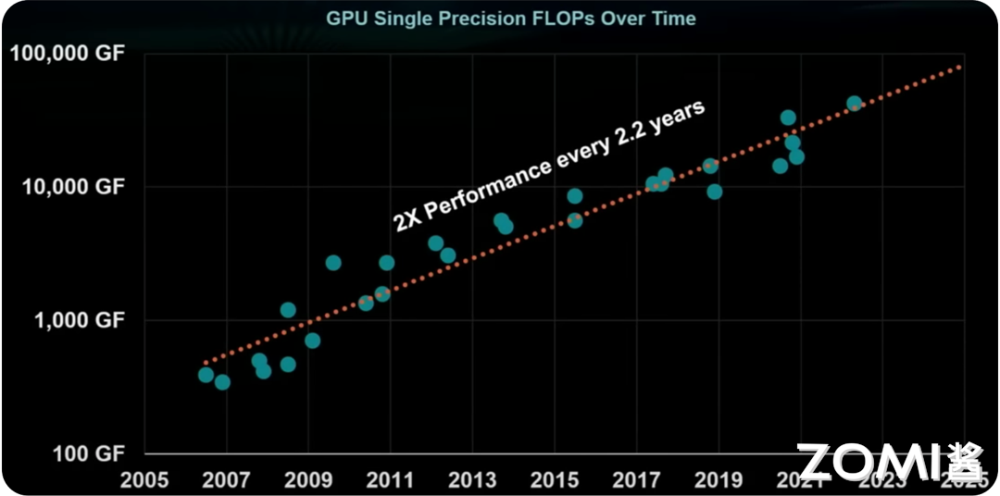
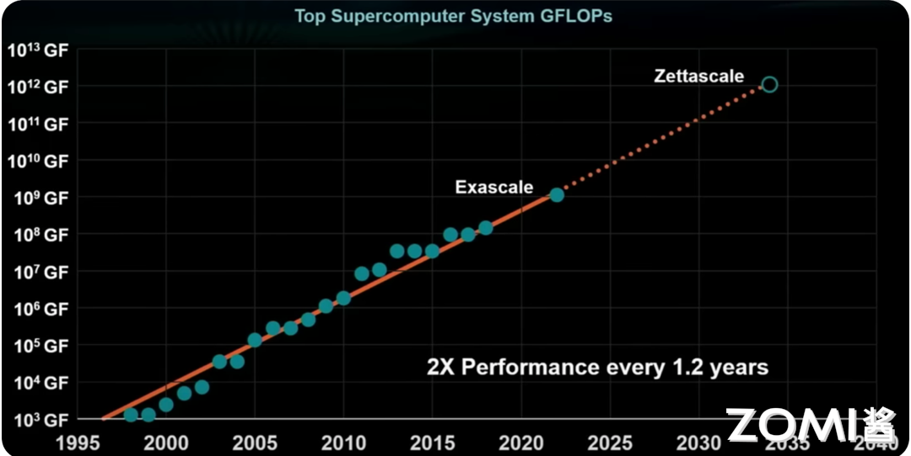
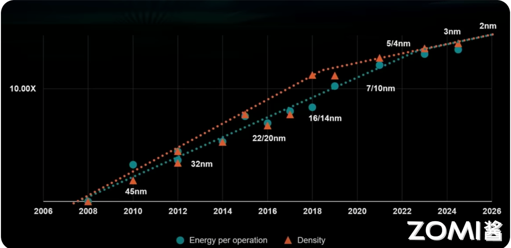

<!--Copyright 适用于[License](https://github.com/chenzomi12/AISystem)版权许可-->

## 从数据看CPU计算
平常我们关注CPU，一般都会更加关注CPU的算力FLOPs，但是当我们更加深入到计算本质的时候，可能会更加关注CPU的内核，这个章节我们将会从算力的敏感度，以及服务器和GPU等性能趋势，来看一下决定CPU性能的效率究竟是什么。

## 算力敏感度

算力敏感度是指计算性能对不同参数变化的敏感程度。在计算系统中，进行算力敏感度分析可以帮助我们了解系统在不同操作条件和数据下的性能表现，并识别出可能存在的性能瓶颈。算力敏感度分析是优化计算系统性能的关键工具。通过理解和分析不同参数对性能的影响，我们能够更好地设计和优化计算系统，从而提升整体性能和效率。

### 算力敏感度分析的关键要素

1. **操作强度（Operational Intensity）**：
   - **定义**：操作强度是指每字节数据进行的操作次数，通常用ops/byte表示。
   - **影响**：操作强度越高，处理器将花费更多时间在计算上，则处理器的数据带宽需求会降低低，反之亦然。

2. **处理元素（Processing Elements, PEs）**：
   - **定义**：处理元素是指计算系统中执行操作的基本单元。
   - **影响**：处理元素的数量和性能直接影响系统的理论峰值性能。

3. **带宽（Bandwidth）**：
   - **定义**：带宽是指系统在单位时间内可以处理的数据量，通常用GB/s或TB/s表示。
   - **影响**：带宽限制会影响高操作强度下的性能。

4. **理论峰值性能（Theoretical Peak Performance）**：
   - **定义**：系统在最佳条件下可以达到的最大性能。
   - **影响**：理论峰值性能受限于处理元素的数量和操作强度。

### 算力敏感度分析的重要性

- **识别性能瓶颈**：通过算力敏感度分析，可以识别系统在不同条件下的性能瓶颈，从而优化系统设计。
- **优化资源分配**：了解不同参数对性能的影响，可以更有效地分配计算资源，提高整体系统效率。
- **性能预测**：算力敏感度分析可以帮助预测系统在不同工作负载下的性能表现，指导系统设计和改进。

在上图中，我们可以看到计算系统的性能模型图，其中：
- **纵轴（Y轴）**：表示性能（ops/sec）。
- **横轴（X轴）**：表示操作强度（ops/byte）。
- **斜线区域**：表示带宽对处理元素的影响。
- **峰值性能区域**：代表系统的理论最大性能。

通过这种图表，我们可以直观地看到操作强度和带宽对系统性能的影响。在斜线区域，带宽对系统性能的影响是非常显著的，而在矩形区域，计算单元（PEs）对系统性能的影响更加突出。中间的转折点则代表了带宽和计算单元影响性能的平衡点。

## 服务器的性能趋势

这张图展示了服务器性能随时间的变化趋势,纵轴表示性能（Performance），显示了性能倍数（如10X和100X），而横轴表示时间（Time），从2009年3月到2022年4月，展示了近13年的服务器性能变化。

蓝色圆点代表不同时间点的服务器性能指标（SpecIntRate），我们可以在图中看到这些数据点随着时间推移不断上升。红色虚线表示性能增长的趋势，斜率表明性能的增长速度。图中说明了每2.4年服务器的性能就会翻倍，体现了在计算机硬件的领域，尤其在服务器性能的提升趋势。

## GPU性能趋势

这张图则展示了GPU性能随时间的变化趋势，纵轴表示单精度浮点运算性能（GFLOPs），显示性能倍数（如1,000 GF和100,000 GF），而横轴表示时间（Time），从2005年到2025年，展示了近20年来的GPU性能的变化。

图中的蓝色圆点代表不同时间点的GPU性能指标（单精度浮点运算每秒次数，GFLOPs），可以看到这些数据点随着时间推移不断上升。红色虚线则表示性能增长的趋势，斜率表明性能的增长速度。图中说明了每2.2年GPU的性能翻倍，也同样体现了GPU性能的提升趋势。

## 超算中心的性能趋势

这张图展示了超算中心性能随时间的变化趋势，纵轴表示浮点运算性能（GFLOPs），显示性能倍数（如10^3 GF、10^6 GF、10^9 GF和10^13 GF），而横轴表示时间（Time），从1995年到2040年，展示了约45年的超算中心性能变化趋势。

图中的蓝色圆点代表不同时间点的超算中心性能指标（浮点运算每秒次数，GFLOPs），可以看到这些数据点随着时间推移不断上升。红色虚线表示性能增长的趋势，斜率表明性能的增长速度。图中说明了每1.2年超算中心的性能翻倍，体现出了超算中心随着时间高速提升的速度和未来增长的趋势。

## 训练AI大模型的变化趋势

这张图展示了训练AI大模型所需时间随模型参数数量的变化趋势，纵轴表示训练时间，单位从“天”（Days）到“周”（Weeks）再到“月”（Months）；横轴表示模型参数的数量，范围从2亿到1008亿。

图中的折线代表了随着模型参数数量增加，训练时间的变化。可以看到，随着模型参数数量的增加，训练时间呈现出指数增长的趋势。例如，参数数量较少的Megatron和T-NLG训练时间在数天到数周之间，而参数数量更大的GPT-3、MT-NLG和GLaM的训练时间则显著增加，达到数月。图表底部的文字描述“Exponentially growing model sizes driving massive growth in compute and memory”进一步强调了模型规模的迅速增长，推动了计算和内存需求的巨大增长。

## 逻辑电路技术趋势预测

这张图展示了逻辑电路技术随时间的趋势预测，标题为“逻辑电路技术趋势预测”。纵轴表示性能倍数（如1.00X和10.00X），而横轴表示时间，从2006年到2026年，展示了20年的技术变化。

图中的蓝色圆点代表每次操作的能耗（Energy per operation），而橙色三角形代表密度(Density)。红色虚线表示密度随时间的增长趋势，绿色虚线表示每次操作能耗随时间的变化趋势。体现了逻辑电路技术在过去20年间取得了显著进步，随着工艺节点的缩小，每次操作的能耗不断降低，而晶体管的密度不断增加。

### 什么是算力
算力(Computational Power)，即计算能力，是计算机系统或设备执行数值计算和处理任务的核心能力。提升算力不仅仅可以更快地完成复杂的计算任务，还能够显著的提高计算效率和性能，从而直接影响应用加载速度，游戏流畅度等用户体验。

### 数据读取与CPU计算的关系

对于CPU来说，算力并不一定是最重要的。数据的加载和传输同样至关重要。如果内存每秒可以传输200 GB的数据（200 GBytes/sec），而计算单元每秒能够执行2000亿次双精度浮点运算（2000 GFLOPs），则需要考虑两者之间的平衡。

根据计算强度的公式：

$\text{Required Compute Intensity} = \frac{\text{FLOPs}}{\text{Data Rate}} = 80$

这意味着，为了使加载数据的成本值得，每加载一次数据，需要执行80次计算操作。

  **操作与数据加载的平衡点**：
  为了平衡计算和数据加载，每从内存中加载一个数据，需要执行80次计算操作。这种平衡点确保了计算单元和内存带宽都能得到充分利用，避免了计算资源的浪费或内存带宽的瓶颈。

因此，虽然提升计算性能（算力）很重要，但如果数据加载和传输无法跟上，即使计算单元的算力再强大，整体效率也无法提升。优化数据传输速率和数据加载策略，与提升计算性能同样重要，以确保系统的整体效率。

## 本节视频

<html>
<iframe src="https://player.bilibili.com/player.html?aid=354490381&bvid=BV17X4y1k7eF&cid=1078936733&page=1&as_wide=1&high_quality=1&danmaku=0&t=30&autoplay=0" width="100%" height="500" scrolling="no" border="0" frameborder="no" framespacing="0" allowfullscreen="true"> </iframe>
</html>
