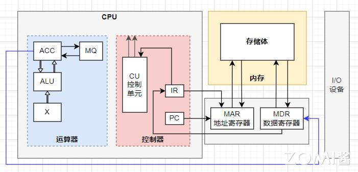
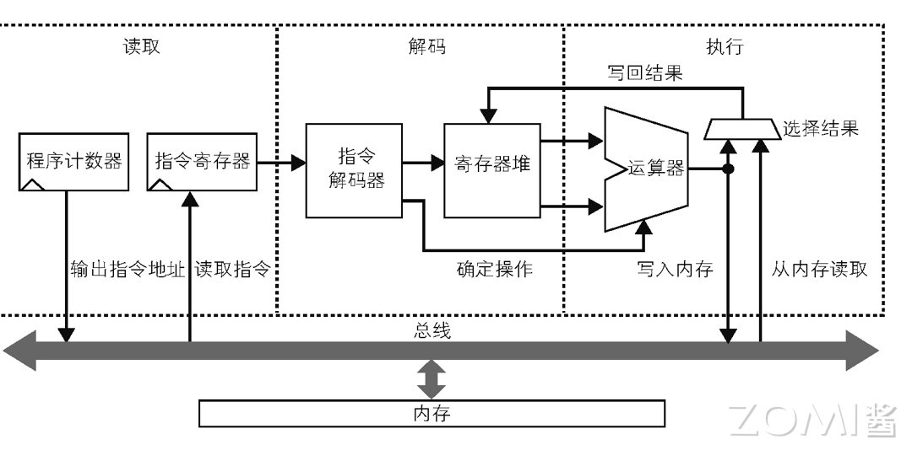
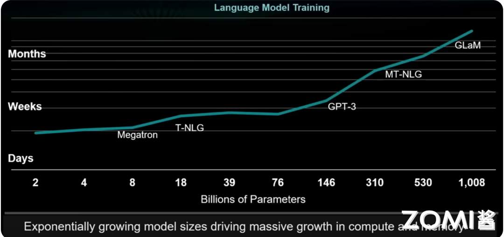

<!--Copyright 适用于[License](https://github.com/chenzomi12/AISystem)版权许可-->

# CPU（中央处理器）

======= XXXX，介绍本节需要讲述的内容，请参考其他文章。你是写文章，不是随便写哈。本节的思想是，先深入用一节 ## 去介绍 CPU 的基本原理，

主要问题点：
=========== 目录不要随心所欲，按照规范，markdown 的目录是有明确规范的。# ## ###，现在基本上是随心所欲的状态，请参考其他文章。
=========== 有图没有解释，基本上就是大问题，有个图，然后呢？
=========== 请留意下面 ===== 的内容

CPU（中央处理器）是计算机系统的核心部件，负责执行计算机程序中的指令。下面是 CPU 的主要组成部分及其功能：

## CPU 的组成

====== CPU 组成部分是什么？一段话介绍一下下面的要展开的模块介绍。

### 算术逻辑单元（ALU）

========= markdown 有明确目录结构，不需要自己家 1,2,3，请尊重标题按顺序标号 ###，不要随心所欲

ALU 是 CPU 中负责执行算术和逻辑运算的部分。它可以进行加法、减法、乘法、除法等算术运算，还可以执行与、或、非、异或等逻辑运算。

========= ALU 跟下面的图是什么关系？下面的图要介绍

### 控制单元（CU）

========= CU 的全名是什么？下面要介绍
控制单元是 CPU 的指挥中心，负责从内存中获取指令，解释这些指令，并将控制信号发送给其他部件以执行指令。控制单元包含指令寄存器和指令译码器。

CPU 的计算本质是通过执行一系列指令来处理数据，从指令执行、算数和逻辑运算、数据传输，到指令周期，这几个环节都很讲究速度，那么究竟什么决定了 CPU 的运行速度呢？

========= ？？是什么了？那么究竟什么决定了 CPU 的运行速度呢？你是写文章，不是出题目烤别人。。。。

### 存储单元

寄存器是 CPU 内部的一种高速存储器，用于暂时存储数据和指令。常见的寄存器包括累加器（ACC）、程序计数器（PC）、指令寄存器（IR）、地址寄存器（MAR）、数据寄存器（MDR）等。

======== 既然是三级目录菜单，那按道理应该展开内容介绍，三级目录一句话不太够。

缓存是位于 CPU 和主内存之间的高速存储器，用于存储经常访问的数据，以提高 CPU 的访问速度。缓存分为一级缓存（L1）、二级缓存（L2）和三级缓存（L3），其中 L1 缓存速度最快但容量最小，L3 缓存速度较慢但容量较大。

### 总线接口与时钟

总线接口单元负责 CPU 与其他部件（如内存、输入/输出设备）之间的数据传输。总线包括数据总线、地址总线和控制总线。

而时钟产生定时信号，以协调 CPU 内部各部分的工作。这些信号以固定的频率重复，称为时钟频率。时钟频率越高，CPU 的速度越快。

## CPU 的工作原理

CPU 的工作可以分为取指（Fetch）、译码（Decode）、执行（Execute）、访存（Memory Access）和写回（Write Back）五个阶段。这些阶段共同组成了指令周期。=== 详细点展开一段话。

======= 下面的内容都太简单了。而且纯文字描述太干，尽可能多配图，统一修改下

### 取指（Fetch）

取指阶段是从内存中获取指令的过程。具体步骤如下：

- **程序计数器（PC）**：程序计数器保存当前指令的地址。

- **地址传输**：控制单元将程序计数器中的地址传输到地址总线。

- **内存读取**：内存管理单元（MMU）根据地址总线的地址，从内存中读取指令，并将其存储在指令寄存器（IR）中。

- **程序计数器递增**：程序计数器递增，以指向下一条指令的地址。

### 译码（Decode）

译码阶段是对取出的指令进行解释的过程。具体步骤如下：

- **指令分析**：指令寄存器中的指令被传输到指令译码器中。

- **操作码解析**：指令译码器解析操作码，确定要执行的操作类型。

- **操作数解析**：指令译码器确定操作数的位置，可能需要从寄存器、内存或直接使用指令中的立即数。

### 执行（Execute）

执行阶段是实际进行指令操作的过程。具体步骤如下：

- **操作类型判断**：控制单元根据操作码确定是进行算术运算、逻辑运算、数据传输还是控制操作。

- **ALU 操作**：对于算术或逻辑运算，控制单元将操作数传输到算术逻辑单元（ALU），ALU 执行相应的操作，并将结果存储在累加器或其他目标寄存器中。

- **分支操作**：如果是分支指令，控制单元将更新程序计数器以跳转到新的指令地址。

### 访存（Memory Access）

访存阶段是访问内存的过程。具体步骤如下：

- **数据读取**：如果指令需要从内存中读取数据，控制单元将地址传输到内存管理单元（MMU），MMU 读取数据并将其存储在数据寄存器（MDR）中。

- **数据写入**：如果指令需要将数据写入内存，控制单元将数据和地址传输到 MMU，MMU 将数据写入指定的内存地址。

### 写回（Write Back）

写回阶段是将计算结果存储回寄存器或内存的过程。具体步骤如下：

- **寄存器写回**：如果操作结果需要存储在寄存器中，控制单元将结果传输到目标寄存器。

- **内存写回**：如果操作结果需要存储在内存中，控制单元将结果和地址传输到 MMU，MMU 将结果写入指定的内存地址。

> 现代 CPU 通常使用指令流水线技术，将上述五个阶段并行化，以提高执行效率。每个阶段由独立的硬件单元处理，不同指令在不同阶段同时进行，从而实现指令的重叠执行，提高整体性能。

## 从数据看 CPU 计算

平常我们关注 CPU，一般都会更加关注 CPU 的算力 FLOPs，但是当我们更加深入到计算本质的时候，可能会更加关注 CPU 的内核，这个章节我们将会从算力的敏感度，以及服务器和 GPU 等性能趋势，来看一下决定 CPU 性能的效率究竟是什么。

### CPU 算力

算力(Computational Power)，即计算能力，是计算机系统或设备执行数值计算和处理任务的核心能力。提升算力不仅仅可以更快地完成复杂的计算任务，还能够显著的提高计算效率和性能，从而直接影响应用加载速度，游戏流畅度等用户体验。

> 算力的大小通常通过计算机系统或设备的处理能力来衡量，主要包括 CPU 的性能、计算速度，以及并行处理能力等，这些都离不开一个很关键的知识，那就是浮点数运算。

1. 数据读取与 CPU 计算关系

对于 CPU 来说，算力并不一定是最重要的。数据的加载和传输同样至关重要。如果内存每秒可以传输 200 GB 的数据（200 GBytes/sec），而计算单元每秒能够执行 2000 亿次双精度浮点运算（2000 GFLOPs），则需要考虑两者之间的平衡。

根据计算强度的公式：

$$
\text{Required Compute Intensity} = \frac{\text{FLOPs}}{\text{Data Rate}} = 80
$$

这意味着，为了使加载数据的成本值得，每加载一次数据，需要执行 80 次计算操作。

**操作与数据加载的平衡点**：

为了平衡计算和数据加载，每从内存中加载一个数据，需要执行 80 次计算操作。这种平衡点确保了计算单元和内存带宽都能得到充分利用，避免了计算资源的浪费或内存带宽的瓶颈。

因此，虽然提升计算性能（算力）很重要，但如果数据加载和传输无法跟上，即使计算单元的算力再强大，整体效率也无法提升。优化数据传输速率和数据加载策略，与提升计算性能同样重要，以确保系统的整体效率。

CPU 的算力通常用每秒执行的浮点运算次数（FLOPS，Floating Point Operations Per Second）来衡量，这是一个非常重要的指标，尤其是在科学计算、工程模拟和图形处理等需要大量计算的领域。算力的计算可以通过了解 CPU 的核心数、每个核心的时钟频率以及每个时钟周期能够执行的浮点运算次数来进行。

2. CPU 算力计算公式

CPU 的算力可以通过以下公式计算：

$$
\text{算力 (FLOPS)} = \text{CPU 核心数} \times \text{每个核心的时钟频率 (Hz)} \times \text{每个时钟周期的浮点运算次数 (FLOP/cycle)}
$$

### 算力计算示例

1. 单核 CPU 算力计算

假设有一个单核 CPU，其时钟频率为 2.5 GHz，每个时钟周期可以执行 4 次浮点运算。

- **核心数**：1
- **时钟频率**：2.5 GHz = 2.5 × 10^9 Hz
- **每个时钟周期的浮点运算次数**：4 FLOP/cycle

suanli 算力计算：====== ？？？
 
$$
\text{算力 (FLOPS)} = 1 \times 2.5 \times 10^9 \times 4 = 10 \times 10^9 = 10 \text{ GFLOPS}
$$

2. 多核 CPU 算力计算

假设有一个四核 CPU，每个核心的时钟频率为 3.0 GHz，每个时钟周期可以执行 8 次浮点运算。

- **核心数**：4
- **时钟频率**：3.0 GHz = 3.0 × 10^9 Hz
- **每个时钟周期的浮点运算次数**：8 FLOP/cycle

算力计算：

$$
\text{算力 (FLOPS)} = 4 \times 3.0 \times 10^9 \times 8 = 96 \times 10^9 = 96 \text{ GFLOPS}
$$

3. 超级计算机算力计算

假设有一个超级计算机，有 10000 个 CPU，每个 CPU 有 8 个核心，每个核心的时钟频率为 2.5 GHz，每个时钟周期可以执行 16 次浮点运算。

- **CPU 数量**：10000
- **每个 CPU 的核心数**：8
- **时钟频率**：2.5 GHz = 2.5 × 10^9 Hz
- **每个时钟周期的浮点运算次数**：16 FLOP/cycle

单个 CPU 的算力：

$$
\text{单个 CPU 的算力 (FLOPS)} = 8 \times 2.5 \times 10^9 \times 16 = 320 \times 10^9 = 320 \text{ GFLOPS}
$$

整个超级计算机的算力：

$$
\text{超级计算机的算力 (FLOPS)} = 10,000 \times 320 \times 10^9 = 3.2 \times 10^6 \times 10^9 = 3.2 \text{ PFLOPS}
$$

### 影响 CPU 算力因素

1. **核心数量**：更多的核心通常意味着更高的并行处理能力。

2. **时钟频率**：更高的时钟频率可以提高每秒的计算次数。

3. **每个时钟周期的浮点运算次数**：现代 CPU 架构通过超标量设计和向量化技术增加每个时钟周期可以执行的浮点运算次数。

4. **缓存和内存带宽**：高效的缓存系统和内存带宽可以减少数据传输延迟，提高计算效率。

5. **指令集架构**：不同的指令集架构（如 x86、ARM、RISC-V）对浮点运算的支持程度和优化程度也会影响算力。

## 算力敏感度

算力敏感度是指计算性能对不同参数变化的敏感程度。在计算系统中，进行算力敏感度分析可以帮助我们了解系统在不同操作条件和数据下的性能表现，并识别出可能存在的性能瓶颈。算力敏感度分析是优化计算系统性能的关键工具。通过理解和分析不同参数对性能的影响，我们能够更好地设计和优化计算系统，从而提升整体性能和效率。

### 算力敏感度关键要素

===== PPT 可以使用大纲形式，但是文章要展开成段，成内容。不要像 PPT 那样罗列。

1. **操作强度（Operational Intensity）**：

   - **定义**：操作强度是指每字节数据进行的操作次数，通常用 ops/byte 表示。

   - **影响**：操作强度越高，处理器将花费更多时间在计算上，则处理器的数据带宽需求会降低低，反之亦然。

2. **处理元素（Processing Elements, PEs）**：

   - **定义**：处理元素是指计算系统中执行操作的基本单元。

   - **影响**：处理元素的数量和性能直接影响系统的理论峰值性能。

3. **带宽（Bandwidth）**：

   - **定义**：带宽是指系统在单位时间内可以处理的数据量，通常用 GB/s 或 TB/s 表示。

   - **影响**：带宽限制会影响高操作强度下的性能。

4. **理论峰值性能（Theoretical Peak Performance）**：

   - **定义**：系统在最佳条件下可以达到的最大性能。

   - **影响**：理论峰值性能受限于处理元素的数量和操作强度。

### 算力敏感度重要性

- **识别性能瓶颈**：通过算力敏感度分析，可以识别系统在不同条件下的性能瓶颈，从而优化系统设计。

- **优化资源分配**：了解不同参数对性能的影响，可以更有效地分配计算资源，提高整体系统效率。

- **性能预测**：算力敏感度分析可以帮助预测系统在不同工作负载下的性能表现，指导系统设计和改进。

单精度浮点数（Single Precision Floating Point）是一种用于表示实数的计算机数据类型，通常占用 32 位（4 字节）的存储空间。单精度浮点数提供了较高的精度和表示范围，常用于需要平衡存储空间和计算性能的应用中。

单精度浮点数采用 IEEE 754 标准进行表示，其结构如下：

## 算力发展趋势

1. 逻辑电路技术趋势预测

这张图展示了逻辑电路技术随时间的趋势预测，标题为“逻辑电路技术趋势预测”。纵轴表示性能倍数（如 1.00X 和 10.00X），而横轴表示时间，从 2006 年到 2026 年，展示了 20 年的技术变化。

图中的蓝色圆点代表每次操作的能耗（Energy per operation），而橙色三角形代表密度(Density)。红色虚线表示密度随时间的增长趋势，绿色虚线表示每次操作能耗随时间的变化趋势。体现了逻辑电路技术在过去 20 年间取得了显著进步，随着工艺节点的缩小，每次操作的能耗不断降低，而晶体管的密度不断增加。

2. X86 服务器的性能趋势

假设我们要表示单精度浮点数 6.75，我们来详细说明如何使用 IEEE 754 标准表示这个数。

这张图展示了服务器性能随时间的变化趋势,纵轴表示性能（Performance），显示了性能倍数（如 10X 和 100X），而横轴表示时间（Time），从 2009 年 3 月到 2022 年 4 月，展示了近 13 年的服务器性能变化。

蓝色圆点代表不同时间点的服务器性能指标（SpecIntRate），我们可以在图中看到这些数据点随着时间推移不断上升。红色虚线表示性能增长的趋势，斜率表明性能的增长速度。图中说明了每 2.4 年服务器的性能就会翻倍，体现了在计算机硬件的领域，尤其在服务器性能的提升趋势。

3. GPU 集群性能趋势

这张图则展示了 GPU 性能随时间的变化趋势，纵轴表示单精度浮点运算性能（GFLOPs），显示性能倍数（如 1,000 GF 和 100,000 GF），而横轴表示时间（Time），从 2005 年到 2025 年，展示了近 20 年来的 GPU 性能的变化。

图中的蓝色圆点代表不同时间点的 GPU 性能指标（单精度浮点运算每秒次数，GFLOPs），可以看到这些数据点随着时间推移不断上升。红色虚线则表示性能增长的趋势，斜率表明性能的增长速度。图中说明了每 2.2 年 GPU 的性能翻倍，也同样体现了 GPU 性能的提升趋势。

4. 超算中心的性能趋势

这张图展示了超算中心性能随时间的变化趋势，纵轴表示浮点运算性能（GFLOPs），显示性能倍数（如 10^3 GF、10^6 GF、10^9 GF 和 10^13 GF），而横轴表示时间（Time），从 1995 年到 2040 年，展示了约 45 年的超算中心性能变化趋势。

5. 训练 AI 大模型的变化趋势

这张图展示了训练 AI 大模型所需时间随模型参数数量的变化趋势，纵轴表示训练时间，单位从“天”（Days）到“周”（Weeks）再到“月”（Months）；横轴表示模型参数的数量，范围从 2 亿到 1008 亿。

图中的折线代表了随着模型参数数量增加，训练时间的变化。可以看到，随着模型参数数量的增加，训练时间呈现出指数增长的趋势。例如，参数数量较少的 Megatron 和 T-NLG 训练时间在数天到数周之间，而参数数量更大的 GPT-3、MT-NLG 和 GLaM 的训练时间则显著增加，达到数月。图表底部的文字描述“Exponentially growing model sizes driving massive growth in compute and memory”进一步强调了模型规模的迅速增长，推动了计算和内存需求的巨大增长。

## 小结与思考

======= 总结几个要点，1.XXXX，2.XXXX

## 本节视频

<html>
<iframe src="https://player.bilibili.com/player.html?aid=354490381&bvid=BV17X4y1k7eF&cid=1078936733&page=1&as_wide=1&high_quality=1&danmaku=0&t=30&autoplay=0" width="100%" height="500" scrolling="no" border="0" frameborder="no" framespacing="0" allowfullscreen="true"> </iframe>
</html>
