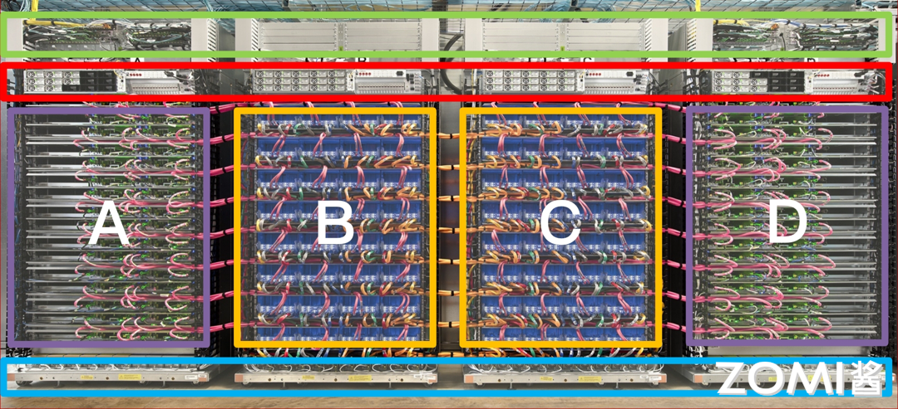
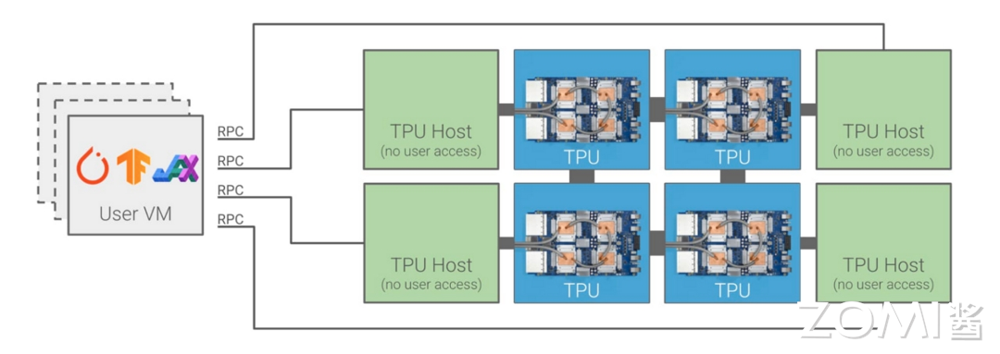
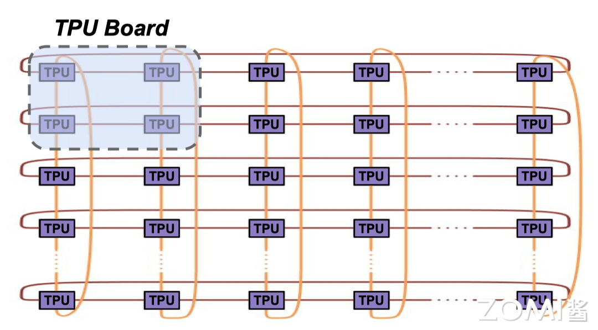

<!--Copyright © 适用于[License](https://github.com/chenzomi12/AISystem)版权许可-->

# 谷歌 TPUv3 POD 形态(DONE)

## TPU v3 vs. TPU v2

- TPU v3 实际上就是 TPU v2 的增强版。TPU v3 相比 TPU v2 有约 1.35 倍的时钟频率、ICI 贷款和内存带宽，两杯 MXU 数量，峰值性能提高 2.7 倍。在同样使用

- 除了显眼的蓝色外，相比于 TPU v2，TPU v3 在只增大 10%体积的情况下增加了 MXU 的数量，从 2 个翻倍到了 4 个。同时 TPU v3 时钟频率加快了 30%，进一步加快了计算速度；同时内存带宽扩大了 30%，容量翻倍；此外芯片之间的带宽也扩大了 30%，可连接的节点数是之前的 4 倍。

|                     | TPUv1  | TPUv2  | TPUv3  |
|---------------------|--------|--------|--------|
| Date introduced     | 2016   | 2017   | 2018   |
| Process node        | 28 nm  | 16 nm  | 16 nm  |
| Die size (mm²)      | 330mm  | 625mm  | 700mm  |
| On-chip memory (MB) | 28MB   | 64MB   | 64MB   |
| Clock speed (MHz)   | 700MHz | 700MHz | 940MHz |
| Memory              | 8 GB DDR3 | 16 GB HBM | 32 GiB HBM |
| Memory bandwidth    | 300 GB/s | 700 GB/s | 900 GB/s |
| TDP (W)             | 75     | 280    | 450    |
| TOPS (Tera/Second)  | 92     | 180    | 360    |
| TOPS/W              | 0.31   | 0.16   | 0.56   |

以上表格展示了 TPU v1，TPU v2 和 TPU v3 三代的具体参数。我们可以看到，虽然 TPU v3 和 v2 都采用了 16nm 的制程，但是在内存、频率、带宽等参数上相比 TPU v2 都有长足的进步。更重要的是，在能效方面，TPU v3 更是大幅领先于 TPU v2。背后的原因除了谷歌改进了芯片设计，对于深度学习场景有了更深和更广的优化面意外，最重要的一点就是 TPU v3 更好地管理了芯片的温度表现，用水冷代替风冷使得芯片更容易运行在合理温度之下。

下面这张图展示了 TPU v2 和 v3 的俯视图以及极度简化的结构。我们可以看到，左下角的 TPU v2 板卡上面有着四个芯片，散热全部依赖风冷，而 TPU v3 则使用水冷系统去管理四张芯片的温度，也就是这歌水冷系统为 TPU v3 提供了 1.6x 的功率。在这个基础上，TPUv3 又翻倍了 MXU 的数量，每个核心拥有了两个 MXU，并且扩大了 HBM 的大小，进一步强化了其计算能力。

## 基本概念澄清

在正式进入到我们对于 POD 的介绍之前，我们要先做一些概念澄清。现在我们做大模型的训练和推理都会有一个“集群”的概念。回到 2017-2018 年左右，Bert 出现之前，很多人是不相信一个模型需要用到一个集群进行训练的，因为当时很多的模型只需要单卡就能进行训练。而实际上的情况是，仅有（从当前的视角看）3 亿参数 Bert 在 4 个 TPUv3 Pod 上训练了整整四天，而当前各家的万亿参数的模型大部分都是用万卡的集群训练数个月的结果。

### 分布式架构 - 参数服务器

涉及到集群，我们在训练过程中就需要一个分布式的架构，在当时叫做参数服务器（Parameter Server）。在我们的训练过程中，我们需要在正向传播和反向传播中得到损失值和相应的梯度，而这个计算的压力是分布在每一张计算卡上的，因此在计算结束后需要把从每一张卡的计算结果进行梯度聚合，最后一步再进行参数的更新和参数的重新广播。

那么这个过程可以用同步或者异步的方式进行同步：

**【同步并行】**：在全部节点的完成本次的通信之后再进行下一轮本地计算

- **优点**：本地计算和通信同步严格顺序话，能够容易地保证并行的执行逻辑于串行相同；
- **缺点**：本地计算更早的工作节点需要等待其他工作节点处理，很容易造成计算硬件的浪费。

**【异步并行】**：当前 batch 迭代完后与其他服务器进行通信传输网络模型参数

- **优点**：执行效率高，中间除了单机通信时间以外没有任何通信和执行之间的阻塞等待；
- **缺点**：网络模型训练不收敛，训练时间长，模型参数反复使用导致无法工业化。

### POD 中的通信

超级计算机中，执行的大部分是神经网络模型的 DP（Data Parallel）计算，大量的数据被分成小块，然后分配给不同的计算节点进行处理。这种并行计算的一部分是权重更新时的通信过程，通常使用的是 all-reduce 操作，即所有节点将它们的部分计算结果汇总起来，以更新全局的权重。

在这样的环境下，出现了 Host Bound 和 Device Bound 的概念。Host Bound 指的是计算受到主机资源的限制，可能是由于通信或者其他的主机计算负载导致的。而 Device Bound 则是指计算受到设备资源的限制，比如节点的计算能力。

在集群环境中，由于大规模的神经网络模型需要处理大量的数据，并且需要进行复杂的计算，因此往往是设备资源受限制，这就使得 AI 应用在集群环境中更倾向于 Device Bound。

## 迎来 Supercomputer（Pod）

首先我们要定义一下什么叫做 Pod，谷歌官方给出的定义很简单：“TPU Pod 是一组通过专用网络连接在一起的连续 TPU 单元”，实际上也确实如此。相比于 TPU v1，初始设定为一个专用于推理的协处理器，由于训练场景的复杂性，TPU v2 和 v3 大幅度强化了芯片的互联能力，最主要的核心就是为了搭建这样的超大计算集群。

### TPU v2 基板和 Pod 形态

结合着下面这张图，我们来看一下上一章我们讲过 TPU v2 的基板组成

- A：四个 TPU v2 芯片和散热片

- B：2 个 BlueLink 25GB/s 电缆接口。其中 BlueLink 是 IBM BlueLink 端口协议，每 Socket 25Gb/s 的带宽，主要是提供 NPU 或是 TPU 之间的网络互联。

- C：Intel 全路径体系结构（OPA）电缆。其中 OPA 为英特尔 Intel Omni-Path Architecture（OPA）互联架构，与 InfiniBand 相似。

- D：电路板电源连接器

- 支持两种网络配置，分别问 10Gbps 以太网和 100Gbps Intel OPA 连接

下面两张图，左边是 tpu v2 的基板，右边是 TPU v2 Pod 形态，每个机柜中有 64 个 CPU 板和 64 个 TPU 板，共有 128 个 CPU 芯片和 256 个 TPU v2 芯片。中间两台蓝色的机器最大可以搭载 256 块 TPU v2 的芯片，而左右两边分别是 CPU 集群，根据下图的标注，来简单看一下 TPU v2 Pod 的基本架构。

- A 和 D：CPU 机架

- B 和 C： TPU v2 机架

- 蓝色框：电源管理系统（UPS）

- 红色框：电源接口

- 绿色框：机架式网络交换机和机架式交换机顶部，这部分更多的是网络模块

**存储**

在 TPU v2 机柜中，看不到任何存储模块。由数据中心网络连接至 CPU，同时没有任何光纤连接至机柜 B 和 C 的 TPU 集群，而 TPU v2 板上也没有任何网络连接。或许这正是下图中机柜上方大量蓝色光纤存在的原因。

**机柜**

我们不难发现，TPU v2 Pod 的机架排列紧凑，主要是为了避免信号衰减带来问题，BlueLink 或 OPA 的铜缆和光纤长度不能太长，因此 TPU 集群在中间，CPU 在两侧的方式排布。

### TPU v3 基板和 Pod 形态

看完 v2，我们再来看一下 TPU v3 的基板组成

- A：四个 TPU v2 芯片和**液冷**散热管；
- B：2 个 BlueLink 25GB/s 电缆接口
- C：Intel 全路径体系结构（OPA）电缆
- D：电路板电源连接器
- 支持两种网络配置，分别问 10Gbps 以太网和 100Gbps Intel OPA 连接

从下面的 TPU v3 Pod 的形态中我们就可以看到，相比于 TPU v2 Pod，它的规模大了非常多，有了更多的铜管和电缆，并且在芯片规模上整整大了 4 倍。TPU v3 Pod（1024 chips）：

### 虚拟架构图

下面是我们的虚拟架构图，整体的架构图也是比较明显的。AI 框架通过 RPC 远程连接到 TPU Host，基于 CPU 去控制 TPU 去实现真正的互联运作执行。

### POD 总结

- **TPU v2 的技术革新**：Google 的 TPU v2 通过增加核间互连结构（ICI），使得最多 256 个 TPU v2 能够组成一个高效的超级计算机。这种结构支持高效的大规模数据处理，尤其适合深度学习网络的训练。
  
- **TPU v3 的性能提升**：Google 进一步扩展其技术，通过组合 1024 个 TPU v3 创建了 TPU POD 超级计算机。该服务器采用水冷系统，功率提升高达 1.6 倍，而模具尺寸仅比 TPU v2 增加 6%。

- **高效的集群构建**：TPU v2 集群利用交换机提供的虚拟电路和无死锁路由功能，加上 ICI 结构，形成了高效的 2D tours。这种配置提供了 15.9T/s 的平分带宽，相比传统的集群组网，省去了集群网卡、交换机的成本，以及与集群 CPU 的通信延迟。

现在我们对比一下 TPU v2 和 v3 Pod，最大的区别就在算力上：TPU v2 有 256 块 TPU v2 组成，算力为 11.5 PFLOPS；Tpu v3 则由 1024 块 TPU v3 芯片组成，算力为 100 PFLOPS。这也就是为什么我们一直在说，TPU v3 是一个 TPU v2 的强化版，最本质的原因就是两者在核心架构上本质的区别没有那么明显，而主要的提升实际上是提升了规模化的能力。

## POD 通信方式

我们之前讨论到，在分布式机器学习中，异步训练和同步训练是两种主要的训练方式。异步训练理论上可以提供更快的速度，因为它允许每个节点独立更新模型权重，从而最大化计算效率。然而，在实际应用中，异步训练的特性以及分散的权重更新可能导致参数服务器与工作节点之间的带宽成为计算瓶颈。

相比之下，同步训练的关键在于平衡计算和通信两个步骤。在不同的学习节点之间，这两个步骤会调整权重。系统的性能受到最慢计算节点和网络中最慢消息传递速度的限制。因此，一个快速的网络连接对于实现快速训练至关重要。

谷歌在 TPU v2/v3 Pod 中采用了 2D Torus 网络结构，这种结构允许每个 TPU 芯片与相邻的 TPU 芯片直接连接，形成一个二维平面网络。这种设计减少了数据在芯片间传输时的通信延迟和带宽瓶颈，从而提高了整体的计算效率。基于此，谷歌优化了同步训练，在同等资源条件下，通过避免对参数服务器的依赖，通过 all reduce 的方法，最终在性能上达到对于异步 SGD 计算效率的领先。

## 小结与讨论

本章介绍了谷歌 TPU v3 和 TPU v2 的技术参数和应用架构。TPU v3 相较于 TPU v2 在时钟频率、内存带宽和计算能力上有显著提升，并采用了高效的水冷系统，能效大幅提高。TPU Pod 通过专用网络连接，使大规模数据处理和计算更高效。TPU v3 Pod 由 1024 块 TPU v3 芯片组成，算力达到 100 PFLOPS，比 TPU v2 Pod 大幅提升。

在当前集群算力都以 EFLOPS 打底的情况下来看，100Pflops 的 TPU v3 Pod 好像有点不够看，但是结合历史，在当年英伟达大规模集群业务伊始，谷歌就提前将精力放在了多卡交互和计算集群的研发上，可以看到谷歌的前瞻性。不止如此，谷歌对于深度学习实际上拥有一个接近“全栈”的解决方案，从框架代码层面的 TensorFlow，Jax，Keras 到服务器到计算集群，在大规模预训练模型的早期，谷歌的这一套方案可以说是在业界、学术界都遥遥领先于其他公司。

## 本节视频

<iframe src="//player.bilibili.com/player.html?isOutside=true&aid=704427239&bvid=BV1Pm4y1g7MG&cid=1294354169&p=1" scrolling="no" border="0" frameborder="no" framespacing="0" allowfullscreen="true"></iframe>
