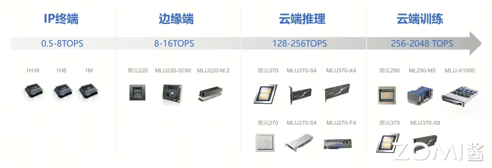
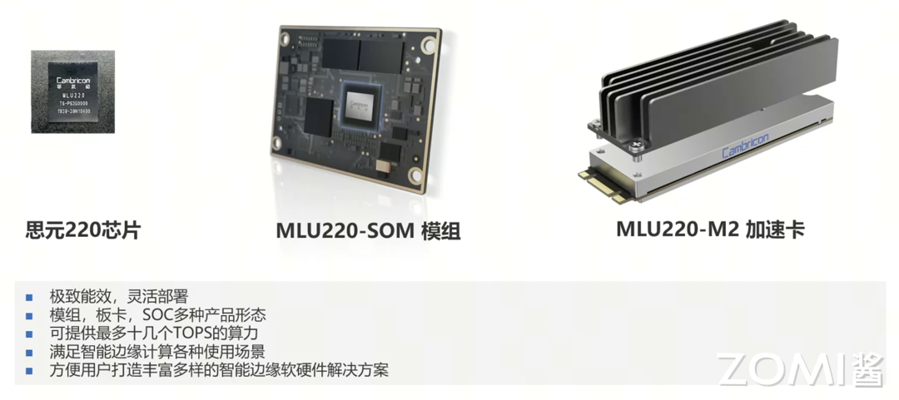

前置声明，本文档不讨论寒武纪公司尚未公布的信息，一切以寒武纪公司官方公布为准

# 中科寒武纪科技股份有限公司

寒武纪成立于2016年3月15日，其名字Cambricon是由Cambrian（寒武纪）和Silicon（硅）组合成。企业使命是：为客户创造价值，成为持续创新的智能时代领导者，企业愿景是让机器更好地理解和服务人类。（寒武纪聚焦端云一体、端云融合的智能新生态，致力打造各类智能云服务器、智能终端以及智能机器人的核心处理器芯片，让机器更好地理解和服务人类。）寒武纪提供云边端一体、软硬件协同、训练推理融合、具备统一生态的系列化智能芯片产品和平台化基础系统软件。寒武纪产品广泛应用于服务器厂商和产业公司，面向互联网、金融、交通、能源、电力和制造等领域的复杂 AI 应用场景提供充裕算力，推动人工智能赋能产业升级。

在2020年6月23日，证监会同意中科寒武纪科技股份有限公司科创板IPO注册。2022年12月15日，拜登政府将寒武纪科技以及关联公司列入“贸易黑名单”。

# 寒武纪的产品形态

下方视频首先介绍了从2016年至今寒武纪的各个产品，从1A处理器核，到思元（思考的单元）系列MLU100、MLU200、MLU300。终端智能处理器IP是寒武纪的入局产品，寒武纪是靠它打入的市场，后来发展出了云端训练芯片、云端推理芯片、边缘端芯片。

TODO：

产品一览：

IP终端 | 边缘端 | 云端推理 | 云端训练 
-------|--------| -------- | ------
1A、1H、1M | MLU220 | MLU370 MLU270| 思元290 MLU290-M5 MLU-X1000 MLU370

下面介绍一下上述MLU200 MLU300系列的产品

## 云端产品

寒武纪的典型云端产品包括：MLU370、MLU290、MLU-X1000，面向数据中心业务，涵盖训练推理，对标P100、V100、A100等。

下面我们来看一看这些产品。

### MLU270

思元270集成了寒武纪在处理器架构领域的一系列创新性技术，处理非稀疏人工智能模型的理论峰值性能提升至上一代思元100的4倍，达到128TOPS(INT8)；同时兼容INT4和INT16运算，理论峰值分别达到256TOPS和64TOPS；支持浮点运算和混合精度运算。

思元270采用寒武纪MLUv02架构，可支持视觉、语音、自然语言处理以及传统机器学习等多样化的人工智能应用，更为视觉应用集成了充裕的视频和图像编解码硬件单元。

#### MLU270-S4智能加速卡

为高能效比AI推理设计的数据中心级加速卡

思元270-S4加速卡功耗仅为70W，处理非稀疏人工智能模型的理论峰值性能提升至上一代思元100的4倍，可广泛支持视觉、语音、自然语言处理以及传统机器学习等高度多样化的人工智能应用，帮助AI推理平台实现超高能效比。

#### MLU270-F4智能加速卡

为桌面环境提供数据中心级AI计算力

思元270芯片采用寒武纪MLUv02架构，搭载EOTS（Edge outlet thermal system）主动散热技术的MLU270-F4，可轻松胜任非数据中心部署环境。可支持最高150W散热功率，在面向繁重AI推理任务时，思元270的推理性能可充分发挥。思元270处理非稀疏人工智能模型的理论峰值性能提升至上一代思元100的4倍，可广泛支持视觉、语音、自然语言处理以及传统机器学习等高度多样化的人工智能应用，面向个人电脑和工作站提供专业的AI加速能力。

### MLU290

寒武纪思元290芯片，采用创新性的MLUv02扩展架构，使用台积电7nm先进制程工艺制造，在一颗芯片上集成了高达460亿的晶体管。芯片具备多项关键性技术创新， MLU-Link™多芯互联技术，提供高带宽多链接的互连解决方案；HBM2内存提供AI训练中所需的高内存带宽；vMLU帮助客户实现云端虚拟化及容器级的资源隔离。多种全新技术帮助AI计算应对性能、效率、扩展性、可靠性等多样化的挑战。

#### 注释

这里澄清一下在对比算力的时候，UP主指出了290没有FP16算力指标的问题。实际上这是因为MLU290是设计为使用定点类型做训练的，它虽然也有FP16计算单元但是算力不足以支撑gemm等算子。有关定点训练可以参考张曦珊博士等的论文：《Adaptive Precision Training:Quantify Back Propagation in Neural Networks with Fixed Point Numbers》，概括总结地说，定点数运算器在实现难易度、功耗上相比浮点数运算器有优势，而训练场景对计算的精度很敏感导致定点计算难以应用于训练。论文提出一种方式，在使用定点数进行神经网络的训练的时候可以动态地调整定点数的位宽，优化计算速度、精度，从而实现使用定点数进行训练。

#### MLU290-M5加速卡

MLU290-M5智能加速卡搭载寒武纪首颗训练芯片思元290，采用台积电7nm先进制程工艺，采用MLUv02扩展架构。MLU290-M5智能加速卡采用开放加速模块OAM设计，具备64个MLU Core，1.23TB/s内存带宽以及全新MLU-Link芯片间互联技术，同时支持单机八卡机内互联，多机多卡机间互联，全面支持AI训练、推理或混合型人工智能计算加速任务。

### MLU370

基于7nm制程工艺，思元370是寒武纪首款采用chiplet（芯粒）技术的AI芯片，集成了390亿个晶体管，最大算力高达256TOPS(INT8)，是寒武纪第二代产品思元270算力的2倍。凭借寒武纪最新智能芯片架构MLUarch03，思元370实测性能表现更为优秀。思元370也是国内第一款公开发布支持LPDDR5内存的云端AI芯片，内存带宽是上一代产品的3倍，访存能效达GDDR6的1.5倍。搭载MLU-Link™多芯互联技术，在分布式训练或推理任务中为多颗思元370芯片提供高效协同能力。全新升级的寒武纪基础软件平台，新增推理加速引擎MagicMind，实现训推一体，大幅提升了开发部署的效率，降低用户的学习成本、开发成本和运营成本。

#### MLU370-S4/S8智能加速卡

面向高密度云端推理

MLU370-S4/S8加速卡采用思元370芯片，TSMC 7nm制程，寒武纪新一代人工智能芯片架构MLUarch03加持，支持PCIe Gen4，板卡功耗仅为75W，相较于同尺寸GPU，可提供3倍的解码能力和1.5倍的编码能力。MLU370-S4/S8加速卡的能效出色，体积小巧，可在服务器中实现高密度部署。

#### MLU370-X4智能加速卡

云端人工智能加速卡

MLU370-X4加速卡采用思元370芯片，为单槽位150w全尺寸加速卡，可提供高达256TOPS(INT8)推理算力，和24TFLOPS(FP32)训练算力，同时提供丰富的FP16、BF16等多种训练精度，配合全新基础系统软件平台，可充分满足推训一体AI任务需求。

#### MLU370-X8 智能加速卡

训推一体人工智能加速卡

MLU370-X8采用双芯思元370配置，为双槽位250w全尺寸智能加速卡，提供24TFLPOS(FP32)训练算力和256TOPS (INT8)推理算力，同时提供丰富的FP16、BF16等多种训练精度。基于双芯思元370打造的MLU370-X8整合了两倍于标准思元370加速卡的内存、编解码资源，同时MLU370-X8搭载MLU-Link多芯互联技术，每张加速卡可获得200GB/s的通讯吞吐性能，是PCIe 4.0带宽的3.1倍，支持单机八卡部署，可高效执行多芯多卡训练和分布式推理任务。

视频指出，产品手册相对国内其他厂商比较详细，软硬件架构可以进一步打开，让更多的开发者了解寒武纪的细节，参与到寒武纪在AI界的对接。

### 边缘端产品

寒武纪的典型边缘端产品包括：MLU220芯片 MLU220-SOM模组 MLU220-M2加速卡

它们追求极致能效，灵活部署，对标NV Jetson、Xavier，它们目前主要都是基于MLU220的。

MLU220是一款专门用于边缘计算应用场景的AI加速产品（边缘人工智能加速卡）。产品集成4核ARM CORTEX A55，LPDDR4x内存及丰富的外围接口。用户既可以使用MLU220作为AI加速协处理器，也可以使用其实现SOC方案。

#### MLU220-SOM

MLU220-SOM智能模组采用全新的MLUv02架构，基于信用卡大小的模组上可以实现16TOPS AI算力的单系统解决方案，功耗仅为15W。MLU220-SOM模组可广泛应用于智慧电力，智能制造，智慧轨交，智慧能源等边缘计算场景。支持视觉、语音、自然语言处理以及传统机器学习等高度多样化的人工智能应用，实现各种业务的边缘端智能化解决方案。

#### MLU220-M.2边缘端人工智能加速卡

思元220芯片基于寒武纪MLUv02架构，手指大小的标准M.2加速卡集成了8TOPS理论峰值性能，功耗仅为8.25W,可以轻松实现终端设备和边缘端设备的AI赋能方案。

MLU220-M.2加速卡可广泛应用于智能电网、智能制造、智慧轨交、智慧金融等边缘计算场景。支持视觉、语音、自然语言处理以及传统机器学习等多样化的人工智能应用，实现各种业务的边缘端智能化解决方案。

### IP产品

端侧产品目前公布的包括1A 1H 1M三代，但实际板卡中内部的IP core可能会比它们新。目前寒武纪官方公布的IP产品主要是1H 1M系列的以下型号。

#### 1H16

该版本IP作为1H系列高端版本

使用256MAC 16位浮点运算器以及512MAC 8位定点运算器。在1GHz主频下，进行16位浮点人工智能运算的峰值速度为0.5Tops；进行8位定点人工智能运算的峰值速度为1Tops。

#### 1H8

该版本IP作为1H系列中量级版本

使用512MAC 8位定点运算器。在1GHz主频下，进行8位定点人工智能运算的峰值速度为1Tops。

#### 1M-4K

该版本IP作为1M系列高端版本

使用了4096MAC 8位定点运算器。在1GHz主频下，进行8位定点人工智能运算的峰值速度为8Tops，进行16位定点人工智能运算的峰值速度为4Tops，进行32位定点人工智能运算的峰值速度为1Tops。

#### 1M-2K

该版本IP作为1M系列中量级版本

使用了2048MAC 8位定点运算器。在1GHz主频下，进行8位定点人工智能运算的峰值速度为4Tops，进行16位定点人工智能运算的峰值速度为2Tops，进行32位定点人工智能运算的峰值速度为0.5Tops。

#### 1M-1K

该版本IP作为1M系列轻量级版本

使用了1024MAC 8位定点运算器。在1GHz主频下，进行8位定点人工智能运算的峰值速度为2Tops，进行16位定点人工智能运算的峰值速度为1Tops，进行32位定点人工智能运算的峰值速度为0.25Tops。

## 小结

“云边端”一体化是寒武纪的一个重要发展战略，根据一些公开的信息可知，其含义主要是：云、边、端三种场景对于芯片的运算能力和功耗等特性有着不同要求，单一品类的智能芯片难以满足实际应用的需求。因此公司面向云、边、端三大场景分别研发了三种类型的芯片产品，分别为云端智能芯片及加速卡、边缘智能芯片及加速卡、IP 授权及软件。与此同时，公司为云边端全系列智能芯片与处理器产品提供统一的平台级基础系统软件 Cambricon Neuware（包含软件开发工具链等），打破了不同场景之间的软件开发壁垒，兼具高性能、灵活性和可扩展性的优势，可让同一人工智能应用程序便捷高效地运行在公司云边端系列化芯片与处理器产品之上，从而使得各种场景下AI模型迁移更方便。

## 本节视频

<html>
<iframe src="https://player.bilibili.com/player.html?aid=231283169&bvid=BV1Y8411m7Cd&cid=1207500944&page=1&as_wide=1&high_quality=1&danmaku=0&t=30&autoplay=0" width="100%" height="500" scrolling="no" border="0" frameborder="no" framespacing="0" allowfullscreen="true"> </iframe>
</html>
