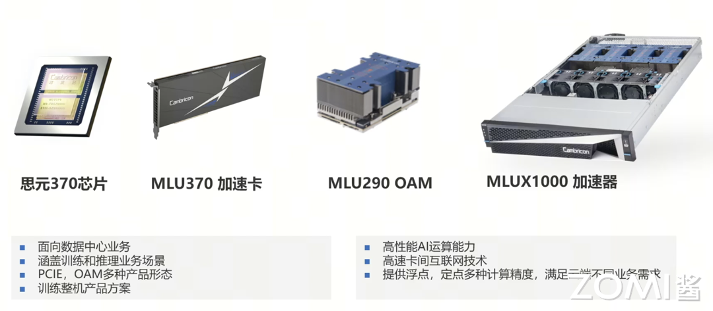

前置声明，本文档不讨论寒武纪公司尚未公布的信息，一切以寒武纪公司官方公布为准

# 寒武纪产品解读

寒武纪成立于2016年3月15日，其名字Cambricon是由Cambrian（寒武纪）和Silicon（硅）组合成。企业使命是：为客户创造价值，成为持续创新的智能时代领导者，企业愿景是让机器更好地理解和服务人类。（寒武纪聚焦端云一体、端云融合的智能新生态，致力打造各类智能云服务器、智能终端以及智能机器人的核心处理器芯片，让机器更好地理解和服务人类。）

## 寒武纪的产品形态

视频首先介绍了从2016年至今寒武纪的各个产品，从1A处理器核，到思元（思考的单元）系列MLU100、MLU200、MLU300。终端智能处理器IP是寒武纪的入局产品，寒武纪是靠它打入的市场，后来发展处了云端训练芯片、云端推理芯片、边缘端芯片。

产品一览：

IP终端 | 边缘端 | 云端推理 | 云端训练 
-------|--------| -------- | ------
1A、1H、1M | MLU220 | MLU370 MLU270| 思元290 MLU290-M5 MLU-X1000 MLU370

### 云端产品

列举了云端产品：MLU370、MLU290、MLU-X1000，面向数据中心业务，涵盖训练推理，对标P100、V100、A100

(注：这里视频里说法有点问题，290OAM不是基于思元370芯片，它的芯片是1M的）

接下来视频对比了寒武纪产品与英伟达的竞品，这里在对比算力的时候，UP主指出了290没有FP16算力指标，实际上这是因为MLU290是设计为使用定点类型做训练的，它虽然也有FP16计算单元但是算力不足以支撑gemm等算子。有关定点训练可以参考张曦珊博士等的论文：《Adaptive Precision Training:Quantify Back Propagation in Neural Networks with Fixed Point Numbers》

产品手册相对国内其他厂商比较详细，软硬件架构可以进一步打开，让更多的开发者了解寒武纪的细节，参与到寒武纪在AI界的对接

### 边缘端产品

MLU220芯片 MLU220-SOM模组 MLU220-M2加速卡

极致能效，灵活部署，对标NV Jetson、Xavier

### IP产品

端侧产品包括1H8 1H16 1M，（实际上早先还有1A也商用了，之后MLU370中的IP核比1M还要新，这里就不透露代号了）

## 小结

“云边端”一体化是寒武纪的一个重要发展战略，云、边、端使用同一套IP、软件栈，从而使得各种场景下AI模型迁移更方便，最直观的是二进制指令的兼容性。

关于一些UP主的思考，毕竟涉及到上市公司，这里就不再复述或者点评了。

## 本节视频

<html>
<iframe src="https://player.bilibili.com/player.html?aid=231283169&bvid=BV1Y8411m7Cd&cid=1207500944&page=1&as_wide=1&high_quality=1&danmaku=0&t=30&autoplay=0" width="100%" height="500" scrolling="no" border="0" frameborder="no" framespacing="0" allowfullscreen="true"> </iframe>
</html>
