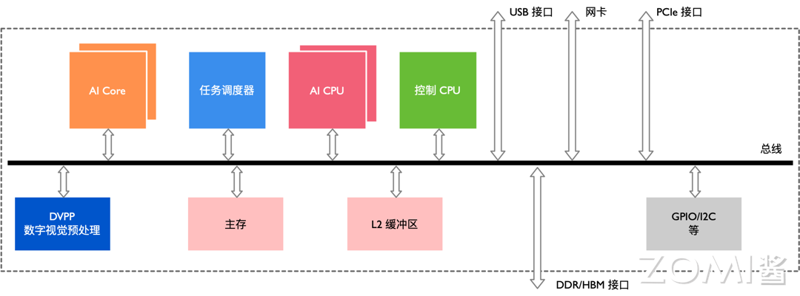
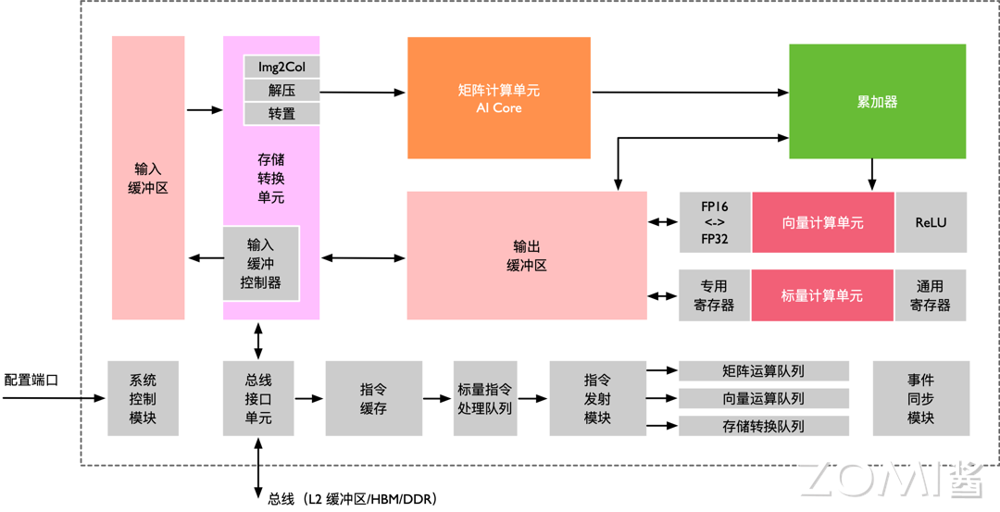
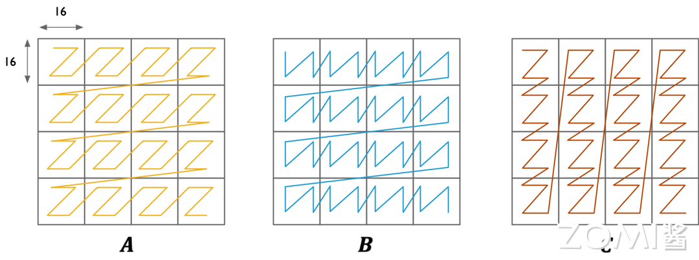
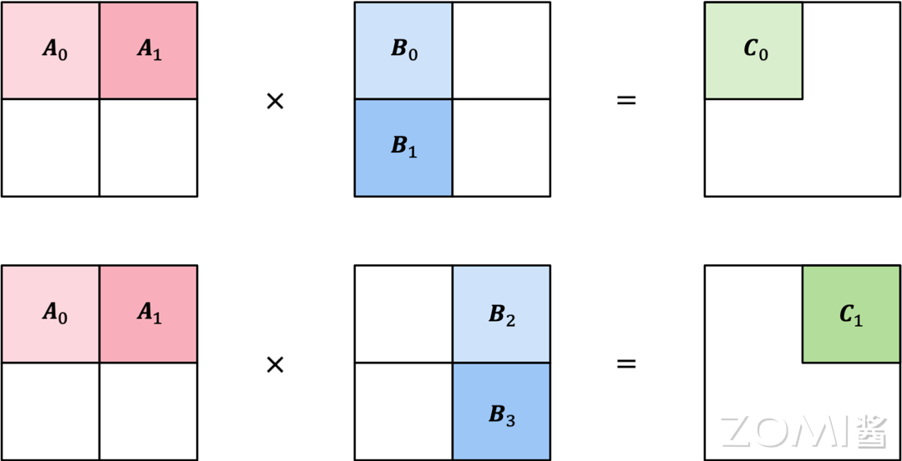
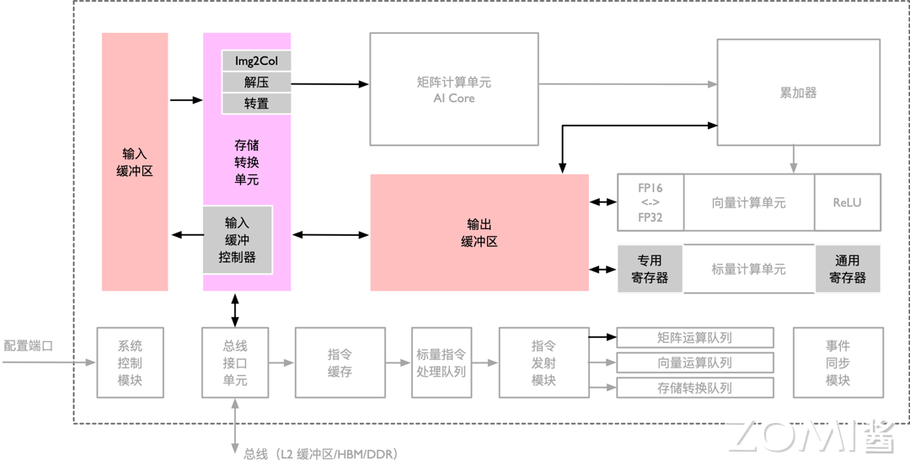
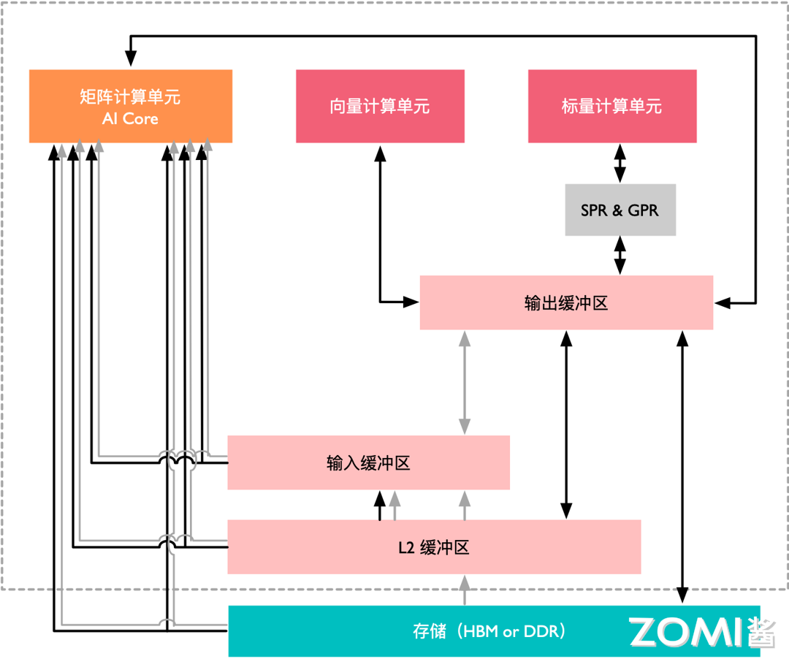
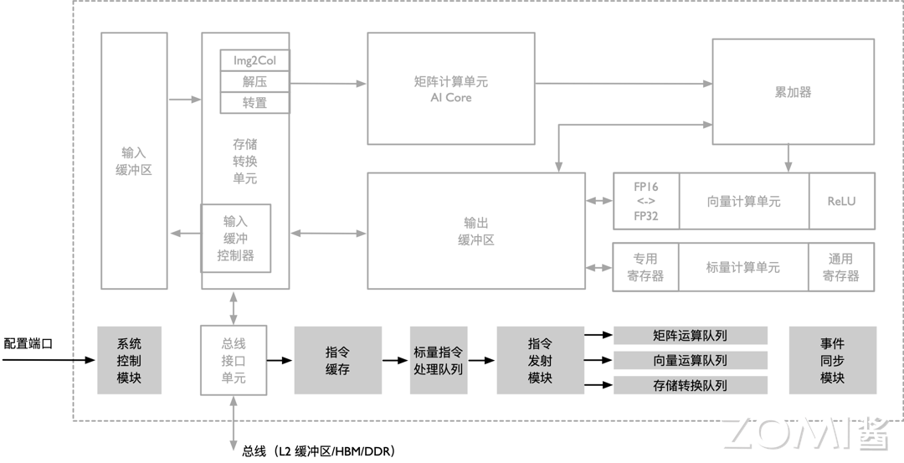
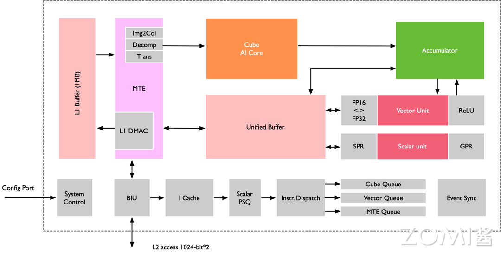
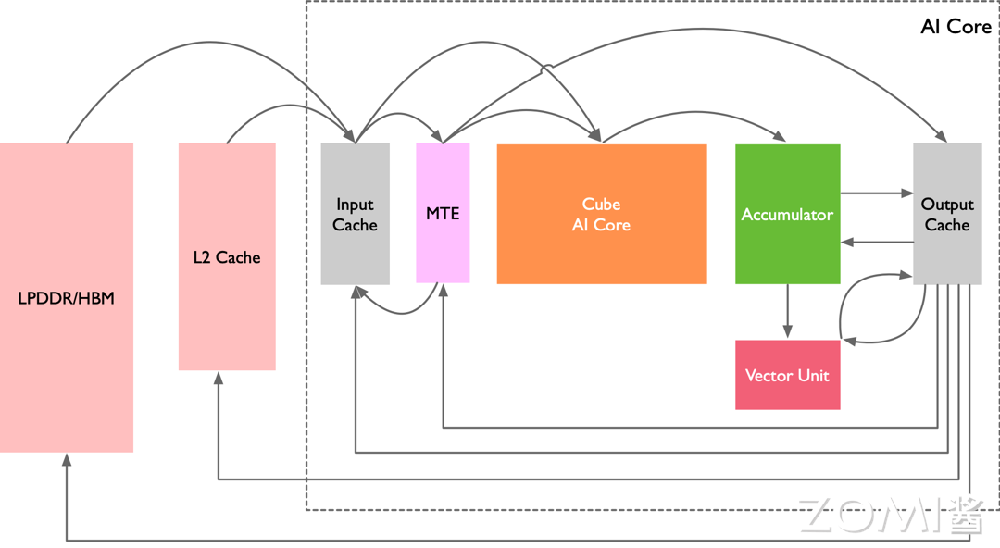

# 昇腾 AI 处理器
参考文献：《昇腾 AI 处理器架构与编程——深入理解 CANN 技术原理与应用》——梁晓峣，2019

华为公司针对人工智能领域专用计算量身打造了“达芬奇架构”，并于 2018 年推出了基于“达芬奇架构”的昇腾 AI 处理器，开启了华为的人工智能之旅。

从基础研究出发，立足于自然语言处理、机器视觉、自动驾驶等领域，昇腾 AI 处理器致力于打造面向云边端一体化的全栈全场景解决方案，同时为了配合其应用目标，打造了异构计算架构 CANN（Computer Architecture for Nerual Network），为昇腾 AI 处理器进行加速计算。全栈指技术方面，包括 IP、芯片、加速计算、AI 框架、应用使能等的全栈式设计方案。全场景包括公有云、私有云、各种边缘计算、物联网行业终端及消费者终端设备。围绕全栈全场景，华为正以昇腾 AI 处理器为核心，以算力为驱动，以工具为抓手，全力突破人工智能发展的极限。

自 2018 年伊始，昇腾 AI 处理器的训练和推理系列型号陆续推出。训练系列的处理器主要应用于云端，可以为深度学习的训练算法提供强大算力。推理系列的处理器则是面向移动计算场景的强算力人工智能片上系统（SoC，System on Chip）。

在设计上，昇腾 AI 处理器意图突破目前人工智能芯片功耗、运算性能和效率的约束，目的是极大提升能效比。昇腾 AI 处理器采用了华为自研的达芬奇架构，专门针对深度神经网络运算特征而量身定做，以高性能的 3D Cube 矩阵计算单元为基础，实现算力和能效比的大幅度提升。每个矩阵计算单元可以由一条指令完成 4096 次成家计算，并且处理器内部还支持多维计算模式，如标量、矢量、矩阵等，打破了其它人工智能专用芯片的局现象，增加了计算的灵活度。同时支持多种类混合精度计算，在实现推理应用的同时也强力支持了训练的数据精度要求。

达芬奇架构的统一性体现在多个应用场景的良好适配上，覆盖高、中、低全场景，一次开发可支持多场景部署、迁移和协同。从架构上提升了软件效率。功耗优势也是该架构的一个显著特点，统一的架构可以支持从几十毫瓦到几百瓦的芯片，可以进行多核灵活扩展，在不同应用场景下发挥出芯片的能耗优势。

达芬奇架构指令集采用了 CISC 指令且具有高度灵活性，可以应对日新月异、变化多端的新算法和新模型。高效的运算密集型 CISC 指令含有特殊专用指令，专门为神经网络打造，助力人工智能领域新模型的研发，同时帮助开发者更快速的实现新业务的部署，实现在线升级，促进行业发展。昇腾 AI 处理器在全业务流程加速方面，采用场景化视角，系统性设计，内置多种硬件加速器。昇腾 AI 处理器拥有丰富的 IO 接口，支持灵活可扩展和多种形态下的加速卡设计组合，很好应对云端、终端的算力和能效挑战，可以为各场景的应用强劲赋能。

## 芯片总览

昇腾 AI 处理器本质上是一个片上系统（System on Chip，SoC），主要可以应用在和图像、视频、语音、文字处理相关的应用场景。上图是早期昇腾其处理器的逻辑架构，其主要的架构组成部件包括特制的计算单元、大容量的存储单元和相应的控制单元。该处理器大致可以划为：芯片系统控制 CPU（Control CPU），AI 计算引擎（包括 AI Core 和 AI CPU），多层级的片上系统缓存（Cache）或缓冲区（Buffer），数字视觉预处理模块（Digital Vision Pre-Processing，DVPP）等。芯片可以采用 LPDDR4 高速主存控制器接口，价格较低。目前主流 SoC 芯片的主存一般由 DDR（Double Data Rate）或 HBM（High Bandwidth Memory）构成，用来存放大量的数据。HBM 相对于 DDR 存储带宽较高，是行业的发展方向。其它通用的外设接口模块包括 USB、磁盘、网卡、GPIO、I2C 和电源管理接口等。

当该处理器作为计算服务器的加速卡使用时，会通过 PCIe 总线接口和服务器其它单元实现数据互换。以上所有这些模块通过基于 CHI 协议的片上环形总线相连，实现模块间的数据连接通路并保证数据的共享和一致性。

昇腾 AI 处理器集成了多个 ARM 架构的 CPU 核心，每个核心都有独立的 L1 和 L2 缓存，所有核心共享一个片上 L3 缓存。集成的 CPU 核心按照功能可以划分为专用于控制芯片整体运行的主控 CPU 和专用于承担非矩阵类复杂计算的 AI CPU。两类任务占用的 CPU 核数可由软件根据系统实际运行情况动态分配。

除了 CPU 之外，该处理器真正的算力担当是采用了达芬奇架构的 AI Core。这些 AI Core 通过特别设计的架构和电路实现了高通量、大算力和低功耗，特别适合处理深度学习中神经网络必须的常用计算如矩阵相乘等。目前该处理器能对整数或浮点数提供强大的乘加计算力。由于采用了模块化的设计，可以很方便的通过叠加模块的方法提高后续处理器的计算力。

针对深度神经网络参数量大、中间值多的特点，该处理器还特意为 AI 计算引擎配备了一定容量的片上缓冲区（On-Chip Buffer），提供高带宽、低延迟、高效率的数据交换和访问。能够快速访问到所需的数据对于提高神经网络算法的整体性能至关重要，同时将大量需要复用的中间数据缓存在片上对于降低系统整体功耗意义重大。为了能够实现计算任务在 AI Core 上的高效分配和调度，还特意配备了一个专用 CPU 作为任务调度器（Task Scheduler，TS）。该 CPU 专门服务于 AI Core 和 AI CPU，而不承担任何其他的事务和工作。

数字视觉预处理模块主要完成图像视频的编解码，视频处理，对图像支持 JPEG 和 PNG 等格式的处理。来自主机端存储器或网络的视频和图像数据，在进入昇腾 AI 处理器的计算引擎处理之前，需要生成满足处理要求的输入格式、分辨率等，因此需要调用数字视觉预处理模块进行预处理以实现格式和精度转换等要求。数字视觉预处理模块主要实现视频解码（Video Decoder，VDEC），视频编码（Video Encoder，VENC），JPEG 编解码（JPEG Decoder/Encoder，JPEGD/E），PNG 解码（PNG Decoder，PNGD）和视觉预处理（Vision Pre-Processing Core，VPC）等功能。图像预处理可以完成对输入图像的上/下采样、裁剪、色调转换等多种功能。数字视觉预处理模块采用了专用定制电路的方式来实现高效率的图像处理功能，对应于每一种不同的功能都会设计一个相应的硬件电路模块来完成计算工作。在数字视觉预处理模块收到图像视频处理任务后，会读取需要处理的图像视频数据并分发到内部对应的处理模块进行处理，待处理完成后将数据写回到内存中等待后续步骤。

## 达芬奇架构


不同于传统的支持通用计算的 CPU 和 GPU，也不同于专用于某种特定算法的专用处理器 ASIC，达芬奇架构本质上是为了适应某个特定领域中的常见的应用和算法，通常称之为“特定域架构（Domain Specific Architecture，DSA）”处理器。

昇腾 AI 处理器的计算核心主要由 AI Core 构成，负责执行标量、向量和张量相关的计算密集型算子。AI Core 采用了达芬奇架构，其基本结构上图所示，从控制上可以看成是一个相对简化的现代微处理器的基本架构。它包括了三种基础计算资源：矩阵计算单元（Cube Unit）、向量计算单元（Vector Unit）和标量计算单元（Scalar Unit）。这三种计算单元分别对应了张量、向量和标量三种常见的计算模式，在实际的计算过程中各司其职，形成了三条独立的执行流水线，在系统软件的统一调度下互相配合达到优化的计算效率。此外在矩阵计算单元和向量计算单元内部还提供了不同精度、不同类型的计算模式。AI Core 中的矩阵计算单元目前可以支持 INT8 、 INT4 和 FP16 的计算； 向量计算单元目前可以支持 FP16 和 FP32 的计算。

为了配合 AI Core 中数据的传输和搬运，围绕着三种计算资源还分布式的设置了一系列的片上缓冲区，比如用来放置整体图像特征数据、网络参数以及中间结果的输入缓冲区和输出缓冲区，以及提供一些临时变量的高速寄存器单元，这些寄存器单元位于各个计算单元中。这些存储资源的设计架构和组织方式不尽相同，但目的都是为了更好的适应不同计算模式下格式、精度和数据排布的需求。这些存储资源和相关联的计算资源相连，或者和总线接口单元（Bus Interface Unit，BIU）相连从而可以获得外部总线上的数据。

在 AI Core 中，输入缓冲区之后设置了一个存储转换单元（Memory Transfer Unit，MTE）。这是达芬奇架构的特色之一，主要的目的是为了以极高的效率实现数据格式的转换。比如要通过矩阵计算来实现卷积，首先要通过 Img2Col 的方法把输入的网络和特征数据重新以一定的格式排列起来。这一步在 GPU 当中是通过软件来实现的，效率比较低下。达芬奇架构采用了一个专用的存储转换单元来完成这一过程，将这一步完全固化在硬件电路中，可以在很短的时间之内完成整个转置过程。由于类似转置的计算在深度神经网络中出现的极为频繁，这样定制化电路模块的设计可以提升 AI Core 的执行效率，从而能够实现不间断的卷积计算。

AI Core 中的控制单元主要包括系统控制模块、标量指令处理队列、指令发射模块、矩阵运算队列、向量运算队列、存储转换队列和事件同步模块。系统控制模块负责指挥和协调 AI Core 的整体运行模式，配置参数和实现功耗控制等。标量指令处理队列主要实现控制指令的译码。当指令被译码并通过指令发射模块顺次发射出去后，根据指令的不同类型，将会分别被发送到矩阵运算队列、向量运算队列和存储转换队列。三个队列中的指令依据先进先出的方式分别输出到矩阵计算单元、向量计算单元和存储转换单元进行相应的计算。不同的指令阵列和计算资源构成了独立的流水线，可以并行执行以提高指令执行效率。如果指令执行过程中出现依赖关系或者有强制的时间先后顺序要求，则可以通过事件同步模块来调整和维护指令的执行顺序。事件同步模块完全由软件控制，在软件编写的过程中可以通过插入同步符的方式来指定每一条流水线的执行时序从而达到调整指令执行顺序的目的。

在 AI Core 中，存储单元为各个计算单元提供转置过并符合要求的数据，计算单元返回运算的结果给存储单元，控制单元为计算单元和存储单元提供指令控制，三者相互协调合作完成计算任务。

### 计算单元
计算单元是 AI Core 中提供强大算力的核心单元，相当于 AI Core 的主力军。AI Core 计算单元主要包含矩阵计算单元、向量计算单元、标量计算单元和累加器，如下图加粗所示。矩阵计算单元和累加器主要完成与矩阵相关的运算，向量计算单元负责执行向量运算，标量计算单元主要负责各类型的标量数据运算和程序的流程控制。


#### 矩阵计算单元
##### 矩阵乘法


由于常见的深度神经网络算法中大量的使用了矩阵计算，达芬奇架构中特意对矩阵计算进行了深度的优化并定制了相应的矩阵计算单元来支持高吞吐量的矩阵处理。上图表示一个矩阵 A 和另一个矩阵 B 之间的乘法运算 C=A*B，其中 M 表示矩阵 A 的行数，K 表示矩阵 A 的列数以及矩阵 B 的行数，N 表示矩阵 B 的列数。在传统 CPU 中计算矩阵乘法的典型代码如下代码所示。

```C++
for(int m = 0; m < M; m++)
	for(int n = 0; n < N; n++)
		for(int k = 0;k < K; k++)
			C[m][m] += A[m][k] * B[k][n]
```

该程序需要用到 3 个循环进行一次完整的矩阵相乘计算，如果在一个单发射的 CPU 上执行至少需要 M\*K\*N 个指令周期才能完成，当矩阵非常庞大时执行过程极为耗时。

在 CPU 计算过程中，矩阵 A 是按照行的方式进行扫描，矩阵 B 以列的方式进行扫描。考虑到典型的矩阵存储方式，无论矩阵 A 还是矩阵 B 都会按照行的方式进行存放，也就是所谓的 Row-Major 的方式。而内存读取的方式是具有极强的数据局部性特征的，也就是说当读取内存中某个数的时候会打开内存中相应的一整行并且把同一行中所有的数都读取出来。这种内存的读取方式对矩阵 A 是非常高效的，但是对于矩阵 B 的读取却显得非常不友好，因为代码中矩阵 B 是需要一列一列读取的。为此需要将矩阵 B 的存储方式转成按列存储，也就是所谓的 Column-Major，如下图所示，这样才能够符合内存读取的高效率模式。因此，在矩阵计算中往往通过改变某个矩阵的存储方式来提升矩阵计算的效率。


一般在矩阵较大时，由于芯片上计算和存储资源有限，往往需要对矩阵进行分块平铺处理（Tiling），如下图所示。受限于片上缓存的容量，当一次难以装下整个矩阵 B 时，可以将矩阵 B 划分成为 B0、B1、B2 和 B3 等多个子矩阵。而每一个子矩阵的大小都可以适合一次性存储到芯片上的缓存中并与矩阵 A 进行计算从而得到结果子矩阵。这样做的目的是充分利用数据的局部性原理，尽可能的把缓存中的子矩阵数据重复使用完毕并得到所有相关的子矩阵结果后再读入新的子矩阵开始新的周期。如此往复可以依次将所有的子矩阵都一一搬运到缓存中，并完成整个矩阵计算的全过程，最终得到结果矩阵 C。分块的优点是充分利用了缓存的容量，并最大程度利用了数据计算过程中的局部性特征，可以高效实现大规模的矩阵乘法计算，是一种常见的优化手段。


##### 矩阵计算单元的计算方式
在深度神经网络中实现计算卷积过程，关键的步骤是将卷积运算转化为矩阵运算。在 CPU 中大规模的矩阵计算往往成为性能瓶颈，而矩阵计算在深度学习算法中又极为重要。为了解决这个矛盾， GPU 采用通用矩阵乘法（GEMM）的方法来实现矩阵乘法。例如要实现一个 16\*16 矩阵与另一个 16\*16 矩阵的乘法，需要安排 256 个并行的线程，并且每一个线程都可以独立计算完成结果矩阵中的一个输出点。假设每一个线程在一个时钟周期内可以完成一次乘加运算，则 GPU 完成整个矩阵计算需要 16 个指令周期，这个延时是 GPU 无法避免的瓶颈。而昇腾 AI 处理器针对这个问题做了深度的优化。因此 AI Core 对矩阵乘法运算的高效性为昇腾 AI 处理器作为深度神经网络的加速器提供了强大的性能保障。


达芬奇架构在 AI Core 中特意设计了矩阵计算单元作为昇腾 AI 处理器的核心计算模块，意图高效解决矩阵计算的瓶颈问题。矩阵计算单元提供强大的并行乘加计算能力，使得 AI Core 能够高速处理矩阵计算问题。通过精巧设计的定制电路和极致的后端优化手段，矩阵计算单元可以用一条指令完成两个 16\*16 矩阵的相乘运算（标记为 16^3，也是 Cube 这一名称的来历），等同于在极短时间内进行了 16^3=4096 个乘加运算，并且可以实现 FP16 的运算精度。如下图所示，矩阵计算单元在完成**A**\* **B** =**C** 的矩阵运算时，会事先将矩阵**A**按行存放在输入缓冲区中，同时将矩阵 B 按列存放在输入缓冲区中，通过矩阵计算单元计算后得到的结果矩阵**C**按行存放在输出缓冲区中。在矩阵相乘运算中，如下图 所示，矩阵**C**的第一元素由矩阵 A 的第一行的 16 个元素和矩阵**B**的第一列的 16 个元素由矩阵计算单元子电路进行 16 次乘法和 15 次加法运算得出。矩阵计算单元中共有 256 个矩阵计算子电路组成，可以由一条指令并行完成矩阵**C**的 256 个元素计算。


在有关矩阵的处理上，通常在进行完一次矩阵乘法后还需要和上一次的结果进行累加，以实现类似**C**=**A**\***B**+**C **的运算。矩阵计算单元的设计也考虑到了这种情况，为此专门在矩阵计算单元后面增加了一组累加器单元，可以实现将上一次的中间结果与当前的结果相累加，总共累加的次数可以由软件控制，并在累加完成之后将最终结果写入到输出缓冲区中。在卷积计算过程中，累加器可以完成加偏置的累加计算。

矩阵计算单元可以快速完成 16*16 的矩阵相乘。但当超过 16*16 大小的矩阵利用该单元进行计算时，则需要事先按照特定的数据格式进行矩阵的存储，并在计算的过程中以特定的分块方式进行数据的读取。如下图所示，矩阵**A**展示的切割和排序方式称作“大 **Z**小**z**”，直观的看就是矩阵**A **的各个分块之间按照行的顺序排序，称之为“大**Z**”方式；而每个块的内部数据也是按照行的方式排列，称为“小**z**”方式。与之形成对比的是矩阵**B**的各个分块之间按照行排序，而每个块的内部按照列排序，称为“大**Z**小**N**”的排序方式。按照矩阵计算的一般法则，如此排列的**A**、**B**矩阵相乘之后得到的结果矩阵**C**将会呈现出各个分块之间按照列排序，而每个块内部按照行排序的格式，称为“大**N** 小**Z**”的排列方式。



在利用矩阵计算单元进行大规模的矩阵运算时，由于矩阵计算单元的容量有限，往往不能一次存放下整个矩阵，所以也需要对矩阵进行分块并采用分步计算的方式，如下图所示，将矩阵**A**和矩阵**B**都等分成同样大小的块，每一块都可以是一个 16\*16 的子矩阵，排不满的地方可以通过补零实现。首先求 C1 结果子矩阵，需要分两步计算：第一步将**A1**和**B1**搬移到矩阵计算单元中，并算出**A1**\***B1** 的中间结果；第二步将**A2**和**B2**搬移到矩阵计算单元中，再次计算**A2**\***B2**，并把计算结果累加到上一次**A1**\*B1 的中间结果，这样才完成结果子矩阵**C1**的计算，之后将**C1**写入输出缓冲区。由于输出缓冲区容量也有限，所以需要尽快将**C1**子矩阵写入内存中，便于留出空间接受下一个结果子矩阵**C2**。同理依次类推可以完成整个大规模矩阵乘法的运算。



#### 向量计算单元
AI Core 中的向量计算单元主要负责完成和向量相关的运算，能够实现向量和标量，或双向量之间的计算，功能覆盖各种基本和多种定制的计算类型，主要包括 FP32、FP16、INT32 和 INT8 等数据类型的计算。

如下图所示，向量计算单元可以快速完成两个 FP16 类型的向量运算。向量计算单元的源操作数和目的操作数通常都保存在输出缓冲区中。对向量计算单元而言，输入的数据可以不连续，这取决于输入数据的寻址模式。向量计算单元支持的寻址模式包括了向量连续寻址和固定间隔寻址；在特殊情形下，对于地址不规律的向量，向量计算单元也提供了向量地址寄存器寻址来实现向量的不规则寻址。


向量计算单元可以作为矩阵计算单元和输出缓冲区之间的数据通路和桥梁。矩阵运算完成后的结果在向输出缓冲区传递的过程中，向量计算单元可以顺便完成在深度神经网络尤其是卷积神经网络计算中常用的 ReLU 激活函数、池化等功能并实现数据格式的转换。经过向量计算单元处理后的数据可以被写回到输出缓冲区或者矩阵计算单元中，以等待下一次运算。所有的这些操作都可以通过软件配合相应的向量单元指令来实现。向量计算单元提供了丰富的计算功能，也可以实现很多特殊的计算函数，从而和矩阵计算单元形成功能互补，全面完善了 AI Core 对非矩阵类型数据计算的能力。

#### 标量计算单元
标量计算单元负责完成 AI Core 中与标量相关的运算。它相当于一个微型 CPU，控制整个 AI Core 的运行。标量计算单元可以对程序中的循环进行控制，可以实现分支判断，其结果可以通过在事件同步模块中插入同步符的方式来控制 AI Core 中其它功能性单元的执行流水。它还为矩阵计算单元或向量计算单元提供数据地址和相关参数的计算，并且能够实现基本的算术运算。其它复杂度较高的标量运算则由专门的 AI CPU 通过算子完成。

在标量计算单元周围配备了多个通用寄存器（General Purpose Register，GPR）和专用寄存器（Special Purpose Register，SPR）。这些通用寄存器可以用于变量或地址的寄存，为算术逻辑运算提供源操作数和存储中间计算结果。专用寄存器的设计是为了支持指令集中一些指令的特殊功能，一般不可以直接访问，只有部分可以通过指令读写。

AI Core 中具有代表性的专用寄存器包括 CoreID（用于标识不同的 AI Core），VA（向量地址寄存器）以及 STATUS（AI Core 运行状态寄存器）等。软件可以通过监视这些专用寄存器来控制和改变 AI Core 的运行状态和模式。

### 存储系统
AI Core 的片上存储单元和相应的数据通路构成了存储系统。众所周知，几乎所有的深度学习算法都是数据密集型的应用。对于昇腾 AI 处理器来说，合理设计的数据存储和传输结构对于最终系统运行的性能至关重要。不合理的设计往往成为性能瓶颈，从而白白浪费了片上海量的计算资源。AI Core 通过各种类型分布式缓冲区之间的相互配合，为深度神经网络计算提供了大容量和及时的数据供应，为整体计算性能消除了数据流传输的瓶颈，从而支撑了深度学习计算中所需要的大规模、高并发数据的快速有效提取和传输。

#### 存储单元

处理器中的计算资源要想发挥强劲算力，必要条件是保证输入数据能够及时准确的出现在计算单元里。达芬奇架构通过精心设计的存储单元为计算资源保证了数据的供应，相当于 AI Core 中的后勤系统。AI Core 中的存储单元由存储控制单元、缓冲区和寄存器组成，如下图 中的加粗显示。存储控制单元通过总线接口可以直接访问 AI Core 之外的更低层级的缓存，并且也可以直通到 DDR 或 HBM 从而可以直接访问内存。存储控制单元中还设置了存储转换单元，其目的是将输入数据转换成 AI Core 中各类型计算单元所兼容的数据格式。缓冲区包括了用于暂存原始图像特征数据的输入缓冲区，以及处于中心的输出缓冲区来暂存各种形式的中间数据和输出数据。AI Core 中的各类寄存器资源主要是标量计算单元在使用。

所有的缓冲区和寄存器的读写都可以通过底层软件显式的控制，有经验的程序员可以通过巧妙的编程方式来防止存储单元中出现读写冲突而影响流水线的进程。对于类似卷积和矩阵这样规律性强的计算模式，高度优化的程序可以实现全程无阻塞的流水线执行。



上图中的总线接口单元作为 AI Core 的“大门”，是一个与系统总线交互的窗口，并以此通向外部世界。AI Core 通过总线接口从外部 L2 缓冲区、DDR 或 HBM 中读取或者写回数据。总线接口在这个过程中可以将 AI Core 内部发出的读写请求转换为符合总线要求的外部读写请求，并完成协议的交互和转换等工作。

输入数据从总线接口读入后就会经由存储转换单元进行处理。存储转换单元作为 AI Core 内部数据通路的传输控制器，负责 AI Core 内部数据在不同缓冲区之间的读写管理，以及完成一系列的格式转换操作，如补零，Img2Col，转置、解压缩等。存储转换单元还可以控制 AI Core 内部的输入缓冲区，从而实现局部数据的缓存。

在深度神经网络计算中，由于输入图像特征数据通道众多且数据量庞大，往往会采用输入缓冲区来暂时保留需要频繁重复使用的数据，以达到节省功耗、提高性能的效果。当输入缓冲区被用来暂存使用率较高的数据时，就不需要每次通过总线接口到 AI Core 的外部读取，从而在减少总线上数据访问频次的同时也降低了总线上产生拥堵的风险。另外，当存储转换单元进行数据的格式转换操作时，会产生巨大的带宽需求，达芬奇架构要求源数据必须被存放于输入缓冲区中，才能够进行格式转换，而输入缓冲控制器负责控制数据流入输入缓冲区中。输入缓冲区的存在有利于将大量用于矩阵计算的数据一次性的被搬移到 AI Core 内部，同时利用固化的硬件极高的提升了数据格式转换的速度，避免了矩阵计算单元的阻塞，消除了由于数据转换过程缓慢而带来的性能瓶颈。

在神经网络中往往可以把每层计算的中间结果放在输出缓冲区中，从而在进入下一层计算时方便的获取数据。由于通过总线读取数据的带宽低，延迟大，通过充分利用输出缓冲区就可以大大提升计算效率。

在矩阵计算单元还包含有直接的供数寄存器，提供当前正在进行计算的大小为 16\*16 的左、右输入矩阵。在矩阵计算单元之后，累加器也含有结果寄存器，用于缓存当前计算的大小为 16\*16 的结果矩阵。在累加器配合下可以不断的累积前次矩阵计算的结果，这在卷积神经网络的计算过程中极为常见。在软件的控制下，当累积的次数达到要求后，结果寄存器中的结果可以被一次性的传输到输出缓冲区中。

AI Core 中的存储系统为计算单元提供源源不断的数据，高效适配计算单元的强大算力，综合提升了 AI Core 的整体计算性能。与谷歌 TPU 设计中的统一缓冲区设计理念相类似，AI Core 采用了大容量的片上缓冲区设计，通过增大的片上缓存数据量来减少数据从片外存储系统搬运到 AI Core 中的频次，从而可以降低数据搬运过程中所产生的功耗，有效控制了整体计算的能耗。

达芬奇架构通过存储转换单元中内置的定制电路，在进行数据传输的同时，就可以实现诸如 Img2Col 或者其它类型的格式转化操作，不光是节省了格式转换过程中的消耗，同时也节省了数据转换的指令开销。这种能将数据在传输的同时进行转换的指令称为随路指令。硬件单元对随路指令的支持为程序设计提供了便捷性。

#### 数据通路



数据通路指的是 AI Core 在完成一个计算任务时，数据在 AI Core 中的流通路径。前文已经以矩阵相乘为例简单介绍了数据的搬运路径。上图 展示了达芬奇架构中一个 AI Core 内完整的数据传输路径。这其中包含了 DDR 或 HBM，以及 L2 缓冲区，这些都属于 AI Core 核外的数据存储系统。图中其它各类型的数据缓冲区都属于核内存储系统。

核外存储系统中的数据可以通过 LOAD 指令被直接搬运到矩阵计算单元中进行计算，输出的结果会被保存在输出缓冲区中。除了直接将数据通过 LOAD 指令发送到矩阵计算单元中，核外存储系统中的数据也可以通过 LOAD 指令先行传入输入缓冲区，再通过其它指令传输到矩阵计算单元中。这样做的好处是利用大容量的输入缓冲区来暂存需要被矩阵计算单元反复使用的数据。

矩阵计算单元和输出缓冲区之间是可以相互传输数据的。由于矩阵计算单元容量较小，部分矩阵运算结果可以写入输出缓冲区中，从而提供充裕的空间容纳后续的矩阵计算。当然也可以将输出缓冲区中的数据再次搬回矩阵计算单元作为后续计算的输入。输出缓冲区和向量计算单元、标量计算单元以及核外存储系统之间都有一条独立的双向数据通路。输出缓冲区中的数据可以通过专用寄存器或通用寄存器进出标量计算单元。

值得注意的是，AI Core 中的所有数据如果需要向外部传输，都必须经过输出缓冲区，才能够被写回到核外存储系统中。例如输入缓冲区中的图像特征数据如果需要被输出到系统内存中，则需要先经过矩阵计算单元处理后存入输出缓冲区中，最终从输出缓冲区写回到核外存储系统中。在 AI Core 中并没有一条从输入缓冲区直接写入到输出缓冲区的数据通路。因此输出缓冲区作为 AI Core 数据流出的闸口，能够统一的控制和协调所有核内数据的输出。

达芬奇架构数据通路的特点是多进单出，数据流入 AI Core 可以通过多条数据通路，可以从外部直接流入矩阵计算单元、输入缓冲区和输出缓冲区中的任何一个，流入路径的方式比较灵活，在软件的控制下由不同数据流水线分别进行管理。而数据输出则必须通过输出缓冲区，最终才能输出到核外存储系统中。

这样设计的理由主要是考虑到了深度神经网络计算的特征。神经网络在计算过程中，往往输入的数据种类繁多并且数量巨大，比如多个通道、多个卷积核的权重和偏置值以及多个通道的特征值等，而 AI Core 中对应这些数据的存储单元可以相对独立且固定，可以通过并行输入的方式来提高数据流入的效率，满足海量计算的需求。AI Core 中设计多个输入数据通路的好处是对输入数据流的限制少，能够为计算源源不断的输送源数据。与此相反，深度神经网络计算将多种输入数据处理完成后往往只生成输出特征矩阵，数据种类相对单一。根据神经网络输出数据的特点，在 AI Core 中设计了单输出的数据通路，一方面节约了芯片硬件资源，另一方面可以统一管理输出数据，将数据输出的控制硬件降到最低。

综上，达芬奇架构中的各个存储单元之间的数据通路以及多进单出的核内外数据交换机制是在深入研究了以卷积神经网络为代表的主流深度学习算法后开发出来的，目的是在保障数据良好的流动性前提下，减少芯片成本、提升计算性能、降低控制复杂度。

### 控制单元



在达芬奇架构下，控制单元为整个计算过程提供了指令控制，相当于 AI Core 的司令部，负责整个 AI Core 的运行，起到了至关重要的作用。控制单元的主要组成部分为系统控制模块、指令缓存、标量指令处理队列、指令发射模块、矩阵运算队列、向量运算队列、存储转换队列和事件同步模块，如上图中加粗所示。

在指令执行过程中，可以提前预取后续指令，并一次读入多条指令进入缓存，提升指令执行效率。多条指令从系统内存通过总线接口进入到 AI Core 的指令缓存中并等待后续硬件快速自动解码或运算。指令被解码后便会被导入标量队列中，实现地址解码与运算控制。这些指令包括矩阵计算指令、向量计算指令以及存储转换指令等。在进入指令发射模块之前，所有指令都作为普通标量指令被逐条顺次处理。标量队列将这些指令的地址和参数解码配置好后，由指令发射模块根据指令的类型分别发送到对应的指令执行队列中，而标量指令会驻留在标量指令处理队列中进行后续执行，如上图所示。

指令执行队列由矩阵运算队列、向量运算队列和存储转换队列组成。矩阵计算指令进入矩阵运算队列，向量计算指令进入向量运算队列，存储转换指令进入存储转换队列，同一个指令执行队列中的指令是按照进入队列的顺序进行执行的，不同指令执行队列之间可以并行执行，通过多个指令执行队列的并行执行可以提升整体执行效率。

当指令执行队列中的指令到达队列头部时就进入真正的指令执行环节，并被分发到相应的执行单元中，如矩阵计算指令会发送到矩阵计算单元，存储转换指令会发送到存储转换单元。不同的执行单元可以并行的按照指令来进行计算或处理数据，同一个指令队列中指令执行的流程被称作为指令流水线。

对于指令流水线之间可能出现的数据依赖，达芬奇架构的解决方案是通过设置事件同步模块来统一协调各个流水线的进程。事件同步模块时刻控制每条流水线的执行状态，并分析不同流水线的依赖关系，从而解决数据依赖和同步的问题。比如矩阵运算队列的当前指令需要依赖向量计算单元的结果，在执行过程中，事件同步控制模块会暂停矩阵运算队列执行流程，要求其等待向量计算单元的结果。而当向量计算单元完成计算并输出结果后，此时事件同步模块则通知矩阵运算队列需要的数据已经准备好，可以继续执行。在事件同步模块准许放行之后矩阵运算队列才会发射当前指令。在达芬奇架构中，无论是流水线内部的同步还是流水线之间的同步，都是通过事件同步模块利用软件控制来实现的。



如上图所示，示意了四条流水线的执行流程。标量指令处理队列首先执行标量指令 0、1 和 2 三条标量指令，由于向量运算队列中的指令 0 和存储转换队列中的指令 0 与标量指令 2 存在数据依赖性，需要等到标量指令 2 完成才能发射并启动。由于指令是被顺序发射的，因此只能等到时刻 4 时才能发射并启动矩阵运算指令 0 和标量指令 3，这时四条指令流水线可以并行执行。直到标量指令处理队列中的全局同步标量指令 7 生效后，由事件同步模块对矩阵流水线、向量流水线和存储转换流水线进行全局同步控制，需要等待矩阵运算指令 0、向量运算指令 1 和存储转换指令 1 都执行完成后，事件同步模块才会允许标量流水线继续执行标量指令 8。

在控制单元中还存在一个系统控制模块。在 AI Core 运行之前，需要外部的任务调度器来控制和初始化 AI Core 的各种配置接口，如指令信息、参数信息以及任务块信息等。这里的任务块是指 AI Core 中的最小的计算任务粒度。在配置完成后，系统控制模块会控制任务块的执行进程，同时在任务块执行完成后，系统控制模块会进行中断处理和状态申报。如果在执行过程中出现了错误，系统控制模块将会把执行的错误状态报告给任务调度器，进而反馈当前 AI Core 的状态信息给整个昇腾 AI 系统。

## 卷积加速原理
在深度神经网络中，卷积计算一直扮演着至关重要的角色。在一个多层的卷积神经网络中，卷积计算的计算量往往是决定性的，将直接影响到系统运行的实际性能。昇腾 AI 处理器作为人工智能加速器自然也不会忽略这一点，并且从软硬件架构上都对卷积计算进行了深度的优化。


上图展示的是一个典型的卷积层计算过程，其中**X**为输入特征矩阵，**W**为权重矩阵；**b**为偏置值；**Y**o 为中间输出；Y 为输出特征矩阵，GEMM 表示通用矩阵乘法。输入特征矩阵**X**和**W**先经过 Img2Col 展开处理后得到重构矩阵 XI2C 和 WI2C 通过矩阵**X**I2C 和矩阵**W**I2C 进行矩阵相乘运算后得到中间输出矩阵**Y**o；接着累加偏置**b**，得到最终输出特征矩阵**Y**，这就完成了一个卷积神经网络中的卷积层处理。

利用 AI Core 来加速通用卷积计算，总线接口从核外 L2 缓冲区或者直接从内存中读取卷积程序编译后的指令，送入指令缓存中，完成指令预取等操作，等待标量指令处理队列进行译码。如果标量指令处理队列当前无正在执行的指令，就会即刻读入指令缓存中的指令，并进行地址和参数配置，之后再由指令发射模块按照指令类型分别送入相应的指令队列进行执行。在卷积计算中首先发射的指令是数据搬运指令，该指令会被发送到存储转换队列中，再最终转发到存储转换单元中。



卷积整个数据流如上图所示，如果所有数据都在 DDR 或 HBM 中，存储转换单元收到读取数据指令后，会将矩阵***X***和***W***由总线接口单元从核外存储器中由数据通路 1 读取到输入缓冲区中，并且经过数据通路 3 进入存储转换单元，由存储转换单元对***X***和***W***进行补零和 Img2Col 重组后得到***X***I2C 和***W***I2C 两个重构矩阵，从而完成卷积计算到矩阵计算的格式变换。在格式转换的过程中，存储转换队列可以发送下一个指令给存储转换单元，通知存储转换单元在矩阵转换结束后将***X***I2C 和***W***I2C 经过数据通路 5 送入矩阵计算单元中等待计算。根据数据的局部性特性，在卷积过程中如果权重***W***I2C 需要重复多次计算，可以将权重经过数据通路 17 固定在输入缓冲区中，在每次需要用到该组权重时再经过数据通路 18 传递到矩阵计算单元中。在格式转换过程中，存储转换单元还会同时将偏置数据从核外存储经由数据通路 4 读入到输出缓冲区中，经过数据通路 6 由存储转换单元将偏置数据从原始的向量格式重组成矩阵后，经过数据通路 7 转存入输出缓冲区中，再经过数据通路 9 存入累加器中的寄存器中，以便后续利用累加器进行偏置值累加。

当左、右矩阵数据都准备好了以后，矩阵运算队列会将矩阵相乘指令通过数据通路 5 发送给矩阵计算单元。***X***I2C 和***W***I2C 矩阵会被分块组合成 16\*16 的矩阵，由矩阵计算单元进行矩阵乘法运算。如果输入矩阵较大则可能会重复以上步骤多次并累加得到***Y***o 中间结果矩阵，存放于矩阵计算单元中。矩阵相乘完成后如果还需要处理偏置值，累加器会收到偏置累加指令，并从输出缓冲区中通过数据通路 9 读入偏置值，同时经过数据通路 8 读入矩阵计算单元中的中间结果***Y***o 并累加，最终得到输出特征矩阵***Y***，经过数据通路 10 被转移到输出缓冲区中等待后续指令进行处理。

AI Core 通过矩阵相乘完成了网络的卷积计算，之后向量执行单元会收到池化和激活指令，输出特征矩阵***Y***就会经过数据通路 12 进入向量计算单元进行池化和激活处理，得到的结果***Y***会经过数据通路 13 存入输出缓冲区中。向量计算单元能够处理激活函数等一些常见的特殊计算，并且可以高效实现降维的操作，特别适合做池化计算。在执行多层神经网络计算时，***Y***会被再次从输出缓冲区经过数据通路 14 转存到输入缓冲区中，作为输入重新开始下一层网络的计算。

达芬奇架构针对通用卷积的计算特征和数据流规律，采用功能高度定制化的设计，将存储、计算和控制单元进行有效的结合，在每个模块完成独立功能的同时实现了整体的优化设计。AI Core 高效组合了矩阵计算单元与数据缓冲区，缩短了存储到计算的数据传输路径，降低延时。

同时 AI Core 在片上集成了大容量的输入缓冲区和输出缓冲区，一次可以读取并缓存充足的数据，减少了对核外存储系统的访问频次，提升了数据搬移的效率。同时各类缓冲区相对于核外存储系统具有较高的访问速度，大量片上缓冲区的使用也极大提升了计算中实际可获得的数据带宽。

同时针对深度神经网络的结构多样性，AI Core 采用了灵活的数据通路，使得数据在片上缓冲区、核外存储系统、存储转换单元以及计算单元之间可以快速流动和切换，从而满足不同结构的深度神经网络的计算要求，使得 AI Core 对各种类型的计算具有一定的通用性。

