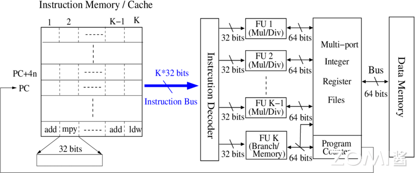
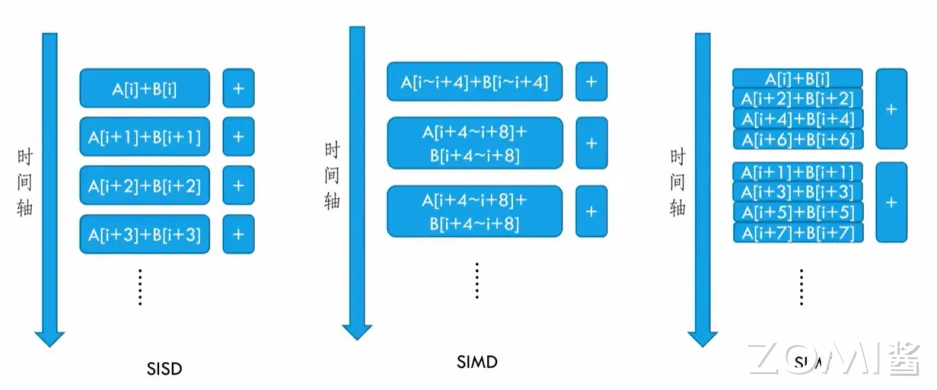
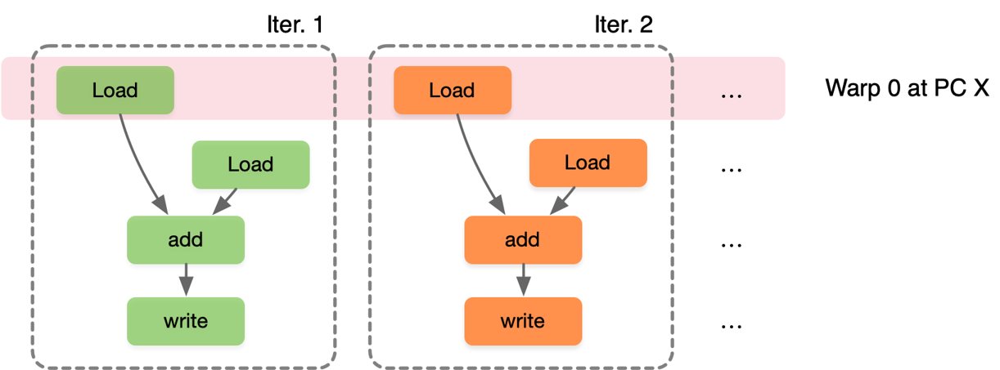
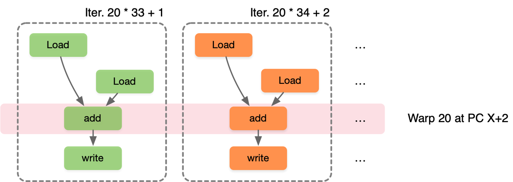
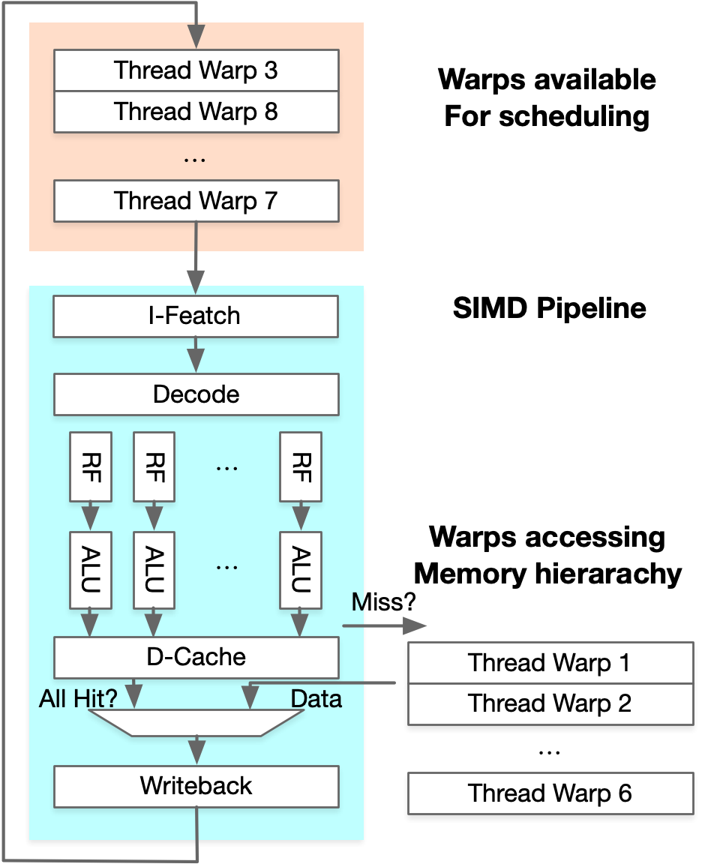
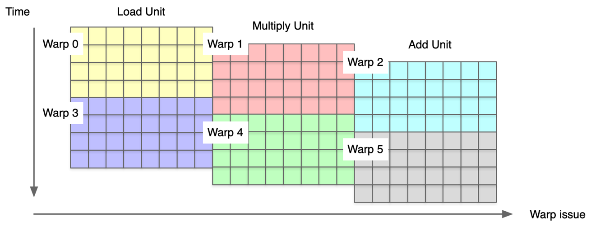

# CUDA/SIMD/SIMT/DSA 关系

前面的小节对 AI 芯片 SIMD 和 SIMT 计算本质进行了分析，结合 NVIDIA CUDA 实现对 SIMD 和 SIMT 进行了对比，本节将对不同并行的编程方式进行讲解，以英伟达 GPU 为例，讲解 GPU 的编程模型。

## 实现并行的编程方式

从指令级别的执行方式来看，一共有三种不同的编程模型，串行（SISD）、数据并行（SIMD）和多线程（MIMD/SPMD）：

- SISD（Single Instruction, Single Data）：程序按顺序执行，每条指令依次处理单个数据。这是传统的串行编程模型，适合于简单的顺序执行任务，如传统的单线程程序。 这种方式适合于简单的任务和小规模数据处理，但在处理大规模数据或需要高性能的情况下，串行编程效率较低。

- SIMD（Single Instruction, Multiple Data）：程序通过向量化或并行化指令来处理多个数据，每个处理单元独立执行相同的任务，但是处理不同的数据。程序员可以编写单一指令，但该指令会同时应用于多个数据元素。这种模型适合于需要高度并行化处理的任务，如图像处理或科学计算。

- MIMD（Multiple Instruction, Multiple Data）/SPMD（Single Program, Multiple Data）：多个处理器同时执行不同的指令，处理不同的数据，充分利用多核处理器的性能。每个处理器可以独立执行不同的程序，也可以执行相同的程序但处理不同的数据。这种模型适合于需要并发执行多个任务的场景，如分布式系统或并行计算。

从编程模型的角度看，选择合适的并行计算模型可以更好地利用硬件资源，提高程序的性能和效率。

### 串行执行 SISD

串行执行与 SISD（Single Instruction, Single Data）类似，以向量相加的操作来举例说明，每一次 for 循环，都要执行一次向量 A 和向量 B 相加之后得到向量 C 的操作，在 CPU 中经常使用这种方式。一般在 CPU 中会采用流水执行，乱序执行和超长指令集 VLIW 架构来提高计算效率。

```c
for (int i = 0; i < N; ++i) 
{
    C[i] = A[i] + B[i];
}
```


**（1）流水执行 PPE**

流水执行 PPE（Pipeline Execution）是流水执行中的一种处理器架构，指令被分成多个阶段（如取指、译码、执行、访存、写回），每个阶段由一个专门的处理单元负责执行，从而实现指令的并行处理。程序执行时，多条指令重叠进行操作的一种任务分解技术，将**取值-->译码-->执行**分别放在未使用流水线和使用流水线中进行指令执行，在未使用流水线时每次 for 循环都要占用独立的时间分别进行**取值-->译码-->执行**相关操作，当使用流水线时，充分利用空余的时间去同时执行不同的指令操作，提高了指令的并行度。


**（2）乱序执行 OOE**

乱序执行（Out-of-Order Execution，OOE）中，处理器可以在不改变程序语义的情况下，通过重新排序指令的执行顺序来提高指令级并行度和性能，处理器会根据指令的依赖关系和可用资源来动态调整指令的执行顺序。当没有采用乱序执行时首先对指令 1 进行取值、译码、执行和写回，然后再进行下一个指令 2 同样的操作，此时在 CPU 执行周期内会有大量的空闲。


因此采用乱序执行，在 CPU 空闲时间执行指令 2，由于指令 4 的执行需要指令 1 在写回结果之后，所以需要把依赖性指令移到独立指令后，在指令 1 完全执行之后再执行指令 4，同时 for 循环由硬件通过指令动态展开。


**（3）超长指令集 VLIW 架构**

超长指令集（Very Long Instruction Word，VLIW）是一种处理器架构，其特点是一条指令可以同时包含多个操作，这些操作可以在同一时钟周期内并行执行。VLIW 处理器在编译时就将多个操作打包成一条指令，因此并行执行指令由编译器来完成，编译器的优化能力直接影响程序在超长指令字处理器上的性能，由硬件执行编译之后的并行指令，从而提高指令级并行度和性能。



### 数据并行 SIMD

数据并行主要通过循环中的每个迭代独立实现，在程序层面，程序员编写 SIMD 指令或编译器生成 SIMD 指令，在不同数据的迭代中执行相同指令，在硬件层面通过提供 SIMD 较宽的 ALU 执行单元。同样以 for 循环计算向量加法为例，在执行 VLD: A to V1 时，迭代 1（Iter.1）读取的数据是 A[0]，迭代 2（Iter.2）读取的数据是 A[1]，之后的 VLD、VADD 和 VST 指令也一样，硬件每次执行的指令相同，但是读取的数据不同，从而实现数据并行。


### 多线程 SPMD

SPMD（Single Program Multiple Data）是一种并行计算模型，多线程 SPMD 指的是在 SPMD 模型中使用多个线程来执行并行计算任务。在多线程 SPMD 中，每个线程都执行相同的程序，但处理不同的数据，通过并发执行来加速计算过程。SPMD 通过循环中的每个迭代独立实现，在程序上，程序员或编译器生成线程来执行每次迭代，使得每个线程在不同的数据上执行相同的计算，SIMT 独立的线程管理硬件来使能硬件处理方式。

SPMD 和 SIMD 不同之处在于，SIMD 在相同指令下执行不同的数据实现并行，而 SPMD 则是提出使用线程来管理每个迭代，SPMD 最终执行在 SIMD 机器上，因此发展出新的单指令多线程硬件执行模式 SIMT（Single Instruction Multiple Thread）。


## SIMT-GPU SIMD 机制

GPU 的 SIMT 实际上是具体硬件执行 SIMD 的编程指令，采用并行编程模式使用 SPMD 来控制线程的方式。每个线程对不同的数据执行执行相同指令代码，同时每个线程都有独立的上下文。执行相同指令时一组线程由硬件动态分为一组 Wrap，硬件 Warp 实际上是由 SIMD 操作形成的，由 SIMT 构成前端并在 SIMD 后端中执行。


在英伟达 GPU 中，Warp 是执行相同指令的线程集合，作为 GPU 的硬件 SM 调度单位，Warp 里的线程执行 SIMD，因此每个 Warp 中就能实现单指令多数据。CUDA 的编程模式实际上是 SPMD，因此从编程人员的视角来看只需要实现单程序多数据，具体到 GPU 的硬件执行模式则是采用了 SIMT，硬件实现单指令多线程。


因此综合前面的分析，SISD、SIMD、SIMT、SPMD 和 DSA 相关概念就有了一个清晰的定义和区分：

- SISD、SIMD 和 SIMT 按照时间轴的执行方式如下所示。


- SIMD 代指指令的执行方式和对应映射的硬件体系结构。

- SIMT 以 SIMD 指令为主，具有 warp scheduler 等硬件模块，支持 SPMD 编程模型的硬件架构。

- SPMD 指代一种具体的并行编程模型，类似于 CUDA。

- DSA（Distributed System Architecture）指代具体的特殊硬件架构，NPU/TPU 等专门针对 AI 的特殊硬件架构，应用于大规模数据处理、分布式存储等场景。**NVIDAI 在 GPU 架构设计中加入 Tensor Core，专门用于神经网络矩阵计算，同时支持混合精度计算，因此 NVIDIA GPU 也变成 SIMT+DSA 的模式。**

## GPU 编程模型

NVIDIA 公司于 2007 年发布了 CUDA，支持编程人员利用更为通用的方式对 GPU 进行编程，更好地发挥底层硬件强大的计算能力，以英伟达 GPU 为例对 GPU 的编程模型进行讲解。

### SIMD vs. SIMT 执行模式

SIMD 是单顺序的指令流执行，每条指令多个数据输入并同时执行，大多数 AI 芯片采用的硬件架构体系，向量加法的 SIMD 执行指令如下：

```c
[VLD, VLD, VADD, VST], VLEN
```

SIMT 是标量指令的多个指令流，可以动态地把线程按 wrap 分组执行，向量加法的 SIMT 执行指令如下：

```c
[LD, LD, ADD, ST], NumThreads
```

英伟达 GPU 采用了 SIMT 的指令执行模式，给相关产品带来以下优势：

- 相比较 SIMD 无需开发者费时费力地把数据凑成合适的矢量长度，然后再传入硬件中；

- 从硬件设计上解决大部分 SIMD data path 的流水编排问题，对编译器和程序开发者在流水编排时更加友好；

- 线程可以独立执行，使得每个线程相对灵活，允许每个线程有不同的分支，这也是 SIMT 的核心；

- 一组执行相同指令的线程由硬件动态组织成线程组 warp，加快了 SIMD 的计算并行度。

假设一个 Warp 包含 32 个线程，如果需要进行 32000 次迭代，每个迭代执行一个线程，因此需要 1000 个 warp。第一个迭代 Warp0 执行第 0~32 个线程，第二个迭代 Warp1 执行第 33~64 个线程，第二十一个迭代 Warp20 执行第 20x33+1 ~ 20x33+32 个线程，可以看出 SIMT 是标量指令的多个指令流，可以动态地把线程按 wrap 分组执行，使并行度增加。






由于程序并行执行最大的瓶颈是访存和控制流，因此 SIMD 架构中单线程 CPU 通过大量控制逻辑进行超前执行、缓存、预取等机制来强行缓解计算瓶颈。SIMT 架构 GPU 通过细粒度的多线程（Fine-Grained Multi-Threading，FGMT）调度将处理器的执行流水线细分为更小的单元，使得不同线程的指令可以交错执行，从而减少指令执行的等待时间和资源浪费，以此来实现访存和计算并行。

### Warps 和 Warp-Level FGMT 关系

Warp 是在不同地址数据下，执行相同指令的线程集合，所有线程执行相同的代码，可以看出 Thread Warp 中有很多个 Thread，多个 Warp 组成 SIMD Pipeline 执行对应的操作。



SIMT 架构通过细粒度多线程（FGMT）隐藏延迟，SIMD Pipeline 中每个线程一次执行一条指令，Warp 支持乱序执行以隐藏访存延迟，并不是通过顺序的方式调度执行，此外线程寄存器值都保留在 RF（Register File）中，并且 FGMT 允许长延迟。英伟达通过添加 Warp schedluer 硬件调度，使 Warp 先访存完毕之后交给 SIMD Pipeline 去执行尽可能多的指令，隐藏其它 Warp 的访存时间。


SIMT 相比 SIMD 在可编程性上最根本性的优势在于硬件层面解决了大部分流水编排的问题，Warp 指令级并行中每个 warp 有 32 个线程和 8 条执行通道，每个时钟周期执行一次 Warp，一次 Warp 完成 24 次操作。



在 GPU 宏观架构层面，GDDR 里面的数据通过内存控制器（Memory Controller）传输到片内总线（Interconnection Network），然后分发到具体的核心（Cuda Core/Tensor Core），在每个执行核心中会有 SIMD 执行单元，从而实现并行计算。



## 总结

本节主要从硬件执行模型和编程模型两个方面介绍了实现并行计算的指令执行方式，主要对比传统 SIMD（Traditional SIMD）和基于 Warp 的 SIMD（Warp-base SIMD(SIMT)），同时讲解了在英伟达 GPU 上实际采用的 SPMD 编程模型，以下是相关总结：

| 执行模型 | Traditional SIMD | （1）包含单条指令执行；（2）指令集架构（Instruction Set Architecture，ISA）包含矢量/SMD 指令信息；（3）SIMD 指令中的锁同步操作，即顺序指令执行；（4）编程模型是直接控制指令，没有额外线程控制，软件层面需要知道数据长度 |
| --- | --- | --- |
| 执行模型 | Warp-base SIMD (SIMT) | （1）以 SIMD 方式执行的多个标量线程组成；（2）ISA 是标量，SIMD 操作可以动态形成；（3）每条线程都可以单独处理，启用多线程和灵活的线程动态分组；（4）本质上，是在 SIMD 硬件上实现 SPMD 编程模型，CUDA 采用了这种方式 |
| 编程模型 | SPMD | （1）通过单个程序，控制多路数据；（2）针对不同的数据，单个线程执行相同的过程代码；（3）本质上，多个指令流执行同一个程序；（4）每个程序：1）处理不同数据，2）在运行时可以执行不同的控制流路径；（5）在 SIMD 硬件上以 SPMD 的方式对 GPGPU 进行编程控制，因此出现了 CUDA 编程 |

## 思考

> AMD 的显卡也是有大量的计算单元和计算核心，为什么没有 SIMT 的编程模式？

2016 年 AMD 推出开放计算平台（Radeon Open Computing platform，ROCm），对全新 Radeon GPU 硬件的软件支持，全新数学库和基础雄厚的现代编程语言，旨在加速高性能，高能效异构计算系统开发。在相当大的程度上兼容 CUDA，目标是建立替代 CUDA 生态。在 2020 年 CDNA 架构面世前，AMD 数据中心 GPU 一直使用的是 GCN 系列架构，搭载 GCN 系列架构的产品在 2012 年就已推出，虽然在游戏机等场景获得较高市场份额，但在数据中心市场并未取得显著成果，这与其性能表现有关。目前 AMD 将其 GPU 架构开发分为单独的 CDNA 和 RDNA 线路，分别专门用于计算和图形。

2023 年 AMD 发布 MI300X，将计算拆分到加速器复合芯片 (XCD) 上，每个 XCD 包含一组核心和一个共享缓存。具体来说，每个 XCD 物理上都有 40 个 CDNA 3 计算单元，其中 38 个在 MI300X 上的每个 XCD 上启用。XCD 上也有一个 4 MB 二级缓存，为芯片的所有 CU 提供服务。MI300X 有 8 个 XCD，总共有 304 个计算单元。以 CDNA 3 架构的 MI300X 可以将所有这些 CU 公开为单个 GPU。


每个 CU 有 4 个 SIMD 计算单元，每个周期 CU 调度程序会从 4 个 SIMD 中选择一个进行执行，并检查线程是否准备好执行。AMD MI300 支持 ROCm 6，支持 TF32 和 FP8 数据类型，Transformer Engine 和结构化稀疏性，AI/ML 框架等。


NVIDIA 的 H100 由 132 个流式多处理器 （SM）组成，作为一个大型统一的 GPU 呈现给程序员。计算通过 CUDA 程序分发到具体的核心（Cuda Core/Tensor Core），每个执行核心有 SIMD 执行单元，从而实现并行计算。


> NVIDA 推出 CUDA 并遵循自定义的 SIMT 架构做对了什么？

NVIDIA 推出 CUDA 并遵循自定义的 SIMT 架构基于 SIMD，并构建了用户易于实现的 SPMD 编程模型，实现了对通用计算的高效支持。如今整个科学计算、HPC 和 AI 的软件生态大多构建在 CUDA 的基础之上。CUDA 作为软件生态的标杆，从软件库的覆盖面、 AI 框架和算子库的支持程度两方面来讲，都是目前最完善的。开发者使用 CUDA 进行并行计算编程，利用 GPU 的大规模并行计算能力来加速各种应用程序，包括科学计算、深度学习、图形渲染等。

## 参考文献

<div id="ref1"></div>
[1] 未名超算队. "北大未名超算队 高性能计算入门讲座（一）:概论." Bilibili, [https://www.bilibili.com/video/BV1814y1g7YC/](https://www.bilibili.com/video/BV1814y1g7YC/).

<div id="ref2"></div>
[2] 专用架构与 AI 软件栈（1）. "专用架构与 AI 软件栈（1）." Zhihu, [https://zhuanlan.zhihu.com/p/387269513](https://zhuanlan.zhihu.com/p/387269513).

<div id="ref3"></div>
[3] "AMD’s CDNA 3 Compute Architecture." Chips and Cheese, [https://chipsandcheese.com/2023/12/17/amds-cdna-3-compute-architecture/](https://chipsandcheese.com/2023/12/17/amds-cdna-3-compute-architecture/).

<div id="ref4"></div>
[4] CUDA 生态才是英伟达 AI 霸主护城河-深度分析 2024. "CUDA 生态才是英伟达 AI 霸主护城河-深度分析 2024." WeChat, [https://mp.weixin.qq.com/s/VGej8Jjags5v0JsHIuf_tQ](https://mp.weixin.qq.com/s/VGej8Jjags5v0JsHIuf_tQ). 

## 本节视频

<html>
<iframe src="//player.bilibili.com/player.html?aid=749419136&bvid=BV1WC4y1w79T&cid=1359752518&p=1&as_wide=1&high_quality=1&danmaku=0&t=30&autoplay=0" width="100%" height="500" scrolling="no" border="0" frameborder="no" framespacing="0" allowfullscreen="true"> </iframe>
</html>

<html>
<iframe src="//player.bilibili.com/player.html?aid=282100205&bvid=BV16c41117vp&cid=1361312451&p=1&as_wide=1&high_quality=1&danmaku=0&t=30&autoplay=0" width="100%" height="500" scrolling="no" border="0" frameborder="no" framespacing="0" allowfullscreen="true"> </iframe>
</html>