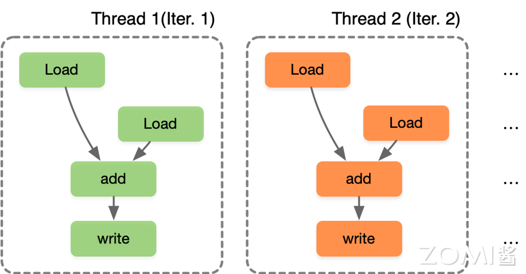
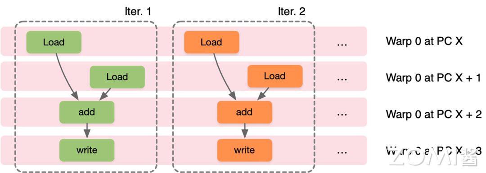

#  SIMD & SIMT 与 CUDA 关系

前面的小节对 AI 芯片 SIMD 和 SIMT 计算本质进行了分析，结合 NVIDIA CUDA 实现对 SIMD 和 SIMT 进行了对比，本节将对不同并行的编程方式进行讲解，以英伟达 GPU 为例，讲解 GPU 的编程模型。

## 实现并行的编程方式

从指令级别的执行方式来看，一共有三种不同的编程模型，串行（SISD）、数据并行（SIMD）和多线程（MIMD/SPMD）：

- **SISD（Single Instruction, Single Data）**：程序按顺序执行，每条指令依次处理单个数据。这是传统的串行编程模型，适合于简单的顺序执行任务，如传统的单线程程序。 这种方式适合于简单的任务和小规模数据处理，但在处理大规模数据或需要高性能的情况下，串行编程效率较低。

- **SIMD（Single Instruction, Multiple Data）**：程序通过向量化或并行化指令来处理多个数据，每个处理单元独立执行相同的任务，但是处理不同的数据。程序员可以编写单一指令，但该指令会同时应用于多个数据元素。这种模型适合于需要高度并行化处理的任务，如图像处理或科学计算。

- **MIMD（Multiple Instruction, Multiple Data）/SPMD（Single Program, Multiple Data）**：多个处理器同时执行不同的指令，处理不同的数据，充分利用多核处理器的性能。每个处理器可以独立执行不同的程序，也可以执行相同的程序但处理不同的数据。这种模型适合于需要并发执行多个任务的场景，如分布式系统或并行计算。

从编程模型的角度看，选择合适的并行计算模型可以更好地利用硬件资源，提高程序的性能和效率。

## 串行执行 SISD

串行执行与 SISD（Single Instruction, Single Data）类似，以向量相加 $C[i] = A[i] + B[i]$ 的操作来举例说明，每一次 for 循环（Iter.i），都要执行一次向量 A 和向量 B 相加之后得到向量 C 的操作，在 CPU 中经常使用这种方式。一般在 CPU 中会采用流水执行，乱序执行和超长指令集（VLIW）架构来提高计算效率。

```c
for (int i = 0; i < N; ++i) 
{
    C[i] = A[i] + B[i];
}
```

### 流水执行 PPE

流水执行 PPE（Pipeline Execution）是流水执行中的一种处理器架构，指令被分成多个阶段（如取指、译码、执行、访存、写回），每个阶段由一个专门的处理单元负责执行，从而实现指令的并行处理。程序执行时，多条指令重叠进行操作的一种任务分解技术，将**取值-->译码-->执行**分别放在未使用流水线和使用流水线中进行指令执行，在未使用流水线时每次 for 循环都要占用独立的时间分别进行**取值-->译码-->执行**相关操作，当使用流水线时，充分利用空余的时间去同时执行不同的指令操作，提高了指令的并行度。


### 乱序执行 OOE

乱序执行（Out-of-Order Execution，OOE）中，处理器可以在不改变程序语义的情况下，通过重新排序指令的执行顺序来提高指令级并行度和性能，处理器会根据指令的依赖关系和可用资源来动态调整指令的执行顺序。当没有采用乱序执行时首先对指令 1 进行取值、译码、执行和写回，然后再进行下一个指令 2 同样的操作，此时在 CPU 执行周期内会有大量的空闲。


因此采用乱序执行，在 CPU 空闲时间执行指令 2，由于指令 4 的执行需要指令 1 在写回结果之后，所以需要把依赖性指令移到独立指令后，在指令 1 完全执行之后再执行指令 4，同时 for 循环由硬件通过指令动态展开。


### 超长指令集 VLIW

超长指令集（Very Long Instruction Word，VLIW）是一种处理器架构，其特点是一条指令可以同时包含多个操作，这些操作可以在同一时钟周期内并行执行。VLIW 处理器在编译时就将多个操作打包成一条指令，因此并行执行指令由编译器来完成，编译器的优化能力直接影响程序在超长指令字处理器上的性能，由硬件执行编译之后的并行指令，从而提高指令级并行度和性能。


## 数据并行 SIMD

数据并行主要通过循环中的每个迭代独立实现，在程序层面，程序员编写 SIMD 指令或编译器生成 SIMD 指令，在不同数据的迭代中执行相同指令，在硬件层面通过提供 SIMD 较宽的 ALU 执行单元。同样以 for 循环计算向量加法为例，在执行 VLD: A to V1 时，迭代 1（Iter.1）读取的数据是 A[0]，迭代 2（Iter.2）读取的数据是 A[1]，之后的 VLD、VADD 和 VST 指令也一样，硬件每次执行的指令相同，但是读取的数据不同，从而实现数据并行。


## 多线程 SPMD

SPMD（Single Program Multiple Data）是一种并行计算模型，多线程 SPMD 指的是在 SPMD 模型中使用多个线程来执行并行计算任务。在多线程 SPMD 中，每个线程（Thread i）都执行相同的程序，但处理不同的数据，通过并发执行来加速计算过程。SPMD 通过循环中的每个迭代独立实现，在程序上，程序员或编译器生成线程来执行每次迭代，使得每个线程在不同的数据上执行相同的计算，SIMT 独立的线程管理硬件来使能硬件处理方式。



SPMD 和 SIMD 不同之处在于，SIMD 在相同指令下执行不同的数据实现并行，而 SPMD 则是提出使用线程来管理每个迭代，SPMD 最终执行在 SIMD 机器上，因此发展出新的单指令多线程硬件执行模式 SIMT（Single Instruction Multiple Thread）。

## 英伟达 SIMT 机制

GPU 的 SIMT 实际上是具体硬件执行 SIMD 指令，采用并行编程模式使用 SPMD 来控制线程的方式。每个线程对不同的数据执行相同的指令代码，同时每个线程都有独立的上下文。执行相同指令时一组线程由硬件动态分为一组 Wrap，硬件 Warp 实际上是由 SIMD 操作形成的，由 SIMT 构成前端并在 SIMD 后端中执行。


在英伟达 GPU 中，Warp 是执行相同指令的线程集合，作为 GPU 的硬件 SM 调度单位，Warp 里的线程执行 SIMD，因此每个 Warp 中就能实现单指令多数据。CUDA 的编程模式实际上是 SPMD，因此从编程人员的视角来看只需要实现单程序多数据，具体到 GPU 的硬件执行模式则是采用了 SIMT，硬件实现单指令多线程。



## 三者间关系

SISD、SIMD 和 SIMT 按照时间轴的执行方式如下所示。


因此综合前面的分析，SISD、SIMD、SIMT、SPMD 和 DSA 相关概念就有了一个清晰的定义和区分：

- SIMD：指令的执行方式和对应映射的硬件体系结构。

- SIMT：以 SIMD 指令为主，具有 Warp Scheduler 等硬件模块，支持 SPMD 编程模型的硬件架构。

- SPMD：一种具体的并行编程模型，类似于 CUDA 所提供的编程模式。

- DSA：具体的特殊硬件架构，NPU/TPU 等专门针对 AI 的特殊硬件架构，应用于大规模数据处理、分布式存储等场景。

值得注意的是，NVIDIA 在 GPU 架构设计中加入 Tensor Core，专门用于神经网络矩阵计算，同时支持混合精度计算，因此 NVIDIA GPU 也变成 SIMT+DSA 的模式。

| 方式 | 硬件架构 or 执行模型 | 方式 |
| --- | --- | --- |
| 执行模型 | Traditional SIMD | （1）包含单条指令执行；（2）指令集架构（Instruction Set Architecture，ISA）包含矢量/SMD 指令信息；（3）SIMD 指令中的锁同步操作，即顺序指令执行；（4）编程模型是直接控制指令，没有额外线程控制，软件层面需要知道数据长度 |
| 执行模型 | Warp-base SIMD (SIMT) | （1）以 SIMD 方式执行的多个标量线程组成；（2）ISA 是标量，SIMD 操作可以动态形成；（3）每条线程都可以单独处理，启用多线程和灵活的线程动态分组；（4）本质上，是在 SIMD 硬件上实现 SPMD 编程模型，CUDA 采用了这种方式 |
| 编程模型 | SPMD | （1）通过单个程序，控制多路数据；（2）针对不同的数据，单个线程执行相同的过程代码；（3）本质上，多个指令流执行同一个程序；（4）每个程序：1）处理不同数据，2）在运行时可以执行不同的控制流路径；（5）在 SIMD 硬件上以 SPMD 的方式对 GPGPU 进行编程控制，因此出现了 CUDA 编程 |

## 小结与思考

本节主要从硬件执行模型和编程模型两个方面介绍了实现并行计算的指令执行方式，主要对比传统 SIMD（Traditional SIMD）和基于 Warp 的 SIMD（Warp-base SIMD(SIMT)），同时讲解了在英伟达 GPU 上实际采用的 SPMD 编程模型。

## 本节视频

<html>
<iframe src="//player.bilibili.com/player.html?aid=749419136&bvid=BV1WC4y1w79T&cid=1359752518&p=1&as_wide=1&high_quality=1&danmaku=0&t=30&autoplay=0" width="100%" height="500" scrolling="no" border="0" frameborder="no" framespacing="0" allowfullscreen="true"> </iframe>
</html>

## 参考文献

[1] 未名超算队. "北大未名超算队 高性能计算入门讲座（一）:概论." Bilibili, [https://www.bilibili.com/video/BV1814y1g7YC/]

[2] 专用架构与 AI 软件栈（1）. Zhihu, [https://zhuanlan.zhihu.com/p/387269513]

[3] "AMD’s CDNA 3 Compute Architecture." Chips and Cheese, [https://chipsandcheese.com/2023/12/17/amds-cdna-3-compute-architecture/]

[4] CUDA 生态才是英伟达 AI 霸主护城河-深度分析 2024. WeChat, [https://mp.weixin.qq.com/s/VGej8Jjags5v0JsHIuf_tQ]