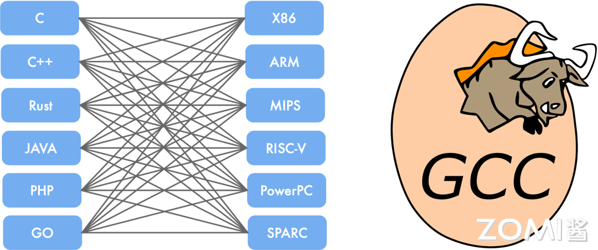
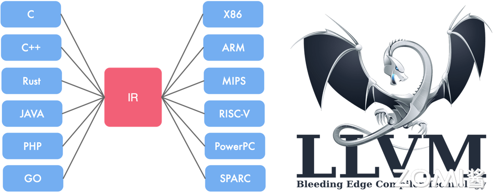

<!--Copyright © ZOMI 适用于[License](https://github.com/chenzomi12/AISystem)版权许可-->

# LLVM 架构设计和原理(DONE)

在上一节中，我们详细探讨了 GCC 的编译过程和原理。然而，由于 GCC 存在代码耦合度高、难以进行独立操作以及庞大的代码量等缺点。正是由于对这些问题的意识，人们开始期待新一代编译器的出现。在本节，我们将深入研究 LLVM 的架构设计和原理，以探索其与 GCC 不同之处。

## LLVM 发展历程

在早期的 Apple MAC 电脑选择使用 GNU 编译器集合（GCC）作为官方编译器。尽管 GCC 在开源世界中表现良好，但苹果对编译工具提出了更高要求。苹果在增强 Objective-C 和 C 语言方面投入了大量努力，但 GCC 开发者对苹果在 Objective-C 支持方面的努力表示不满。因此，苹果基于 GCC 分为两个分支进行独立开发，导致苹果的编译器版本明显落后于官方 GCC 版本。


另一方面，GCC 的代码过于耦合，难以独立开发。随着版本更新，代码质量逐渐下降，而 GCC 无法以模块化方式调用实现 Apple 渴望的更好集成开发环境支持，这限制了 Apple 在编译器领域的发展。

面对这一系列问题，苹果一直寻找高效、模块化和更自由的开源替代方案。最终，苹果聘请了编译器领域的专家克里斯·拉特纳来领导 LLVM 项目的实现，标志着 LLVM 编译器的诞生。


LLVM 项目起源于 2000 年伊利诺伊大学厄巴纳-香槟分校的维克拉姆·艾夫（Vikram Adve）和克里斯·拉特纳（Chris Lattner）的研究，旨在为所有静态和动态语言创建动态编译技术。LLVM 是以 BSD 许可证开发的开源软件。2005 年，苹果公司雇用了克里斯·拉特纳及其团队为 macOS 和 iOS 开发工具，LLVM 成为了这些平台开发工具的一部分。

项目最初被命名为低级虚拟机（Low Level Virtual Machine）的首字母缩写。然而，随着 LLVM 项目的发展，该缩写引起了混淆，因为项目范围不仅局限于创建虚拟机。随着 LLVM 发展壮大，它成为了许多编译工具和低级工具技术的统称，这使得缩写变得不再合适。于是开发者决定摒弃缩写的含义，现在 LLVM 已经成为一个品牌，用于指代 LLVM 项目下的所有子项目，包括 LLVM 中介码（LLVM IR）、LLVM 调试工具、LLVM C++标准库等。

从 9.0.0 版本开始，LLVM 改用带有 LLVM 额外条款的 Apache 许可证 2.0。自 2019 年 10 月起，LLVM 项目的代码存储已正式迁移到 GitHub。

LLVM 项目已经迅速发展成为一个庞大的编译器工具集合。LLVM 激发了许多人为多种编程语言开发新的编译器，其中最引人注目的之一是 Clang。作为一个新的编译器，Clang 提供对 C、Objective-C 和 C++ 的支持，并且得到了苹果公司的大力支持。Clang 的目标是取代 GCC 在系统中的 C 和 Objective-C 编译器，它能够更轻松地集成到现代开发环境（IDE）中，并且支持线程的更好处理。从 Clang 3.8 版本开始，它还开始支持 OpenMP。GCC 在 Objective-C 方面的发展已经停滞，苹果已经将其支持转移到其他维护分支上。

在 2021 年 jetbrains 开发者调查中表示 GCC 编译器拥有 78%的用户使用率，Clean 编译器有 43% 的用户使用率。


> 由于 LLVM 对产业的重大贡献，计算机协会在 2012 年授予维克拉姆·艾夫、克里斯·拉特纳和 Evan ChengACM 软件系统奖。

## LLVM 架构特点

LLVM 架构具有独立的组件和库化的特点，使得前端和后端工程师能够相对独立地进行工作，从而提高了开发效率和代码维护性。其核心在于中间表示（IR），通过统一且灵活的 IR 实现了对不同编程语言和目标平台的支持。优化器能够将 IR 转换为高效的形式，再由后端生成目标平台的机器码。这种设计使得 LLVM 具有适应不同编程需求和硬件架构的灵活性和高性能，为软件开发提供了强大的支持。

### LLVM 组件独立性

LLVM 具有一个显著的特点，即其组件的独立性和库化架构。在使用 LLVM 时，前端工程师只需实现相应的前端，而无需修改后端部分，从而使得添加新的编程语言变得更加简便。这是因为后端只需要将中间表示（IR）翻译成目标平台的机器码即可。

对于后端工程师而言，他们只需将目标硬件的特性如寄存器、硬件调度以及指令调度与 IR 进行对接，而无需干涉前端部分。这种灵活的架构使得编译器的前端和后端工程师能够相对独立地进行工作，从而极大地提高了开发效率和维护性。

在 LLVM 中，IR 扮演着至关重要的角色。它是一种类似汇编语言的底层语言，但具有强类型和精简指令集的特点（RISC），并对目标指令集进行了抽象。例如，在 IR 中，目标指令集的函数调用惯例会被抽象为 call 和 ret 指令，并使用明确的参数。

LLVM 支持三种不同的 IR 表达形式：人类可读的汇编形式、在 C++ 中的对象形式以及序列化后的 bitcode 形式。这种多样化的表达形式使得开发人员更好地理解和处理 IR，从而实现更加灵活和高效的编译工作。通过 IR 的抽象和统一，LLVM 极大地推动了编译体系的创新，为编程语言的快速开发和跨平台支持提供了强大的基础。

### LLVM 中间表达

LLVM 提供了一套适用于编译器系统的中间语言（Intermediate Representation，IR），并围绕这个中间语言进行了大量的变换和优化。经过这些变换和优化，IR 可以被转换为目标平台相关的汇编语言代码。

与传统 GCC 的前端直接对应于后端不同，LLVM 的 IR 是统一的，可以适用于多种平台，进行优化和代码生成。

> 根据 2011 年的测试结果，LLVM 的性能在运行时平均比 GCC 低 10%。2013 年的测试显示，LLVM 能够编译出与 GCC 性能相近的执行代码。

GCC：

 

LLVM：



LLVM IR 的优点包括：

1. 更独立：LLVM IR 设计为可在编译器之外的任意工具中重用，使得轻松集成其他类型的工具，如静态分析器和插桩器成为可能。

2. 更正式：拥有明确定义和规范化的 C++ API，使得处理、转换和分析变得更加便捷。

3. 更接近硬件：LLVM IR 提供了类似 RISCV 的模拟指令集和强类型系统，实现了其“通用表示”的目标。具有足够底层指令和细粒度类型的特性使得上层语言和 IR 的隔离变得简单，同时 IR 的行为更接近硬件，为进一步在 LLVM IR 上进行分析提供了可能性。

## LLVM 整体架构

LLVM 是一个模块化和可重用的编译器和工具链技术库。它的整体架构包含从前端语言处理到最终生成目标机器码的完整优化流程。对于用户而言，通常会使用 Clang 作为前端，而 LLVM 的优化器和后端处理则是透明的。


- 前端（Front-End）：负责处理高级语言（如 C/C++/Obj-C）的编译，生成中间表示（IR）。
- 优化器（Optimizer）：对中间表示进行各种优化，提高代码执行效率。
- 后端（Back-End）：将优化后的中间表示转换为目标平台的机器码。


当用户编写的 C/C++/Obj-C 代码输入到 Clang 前端时，Clang 会执行以下步骤：

- 词法分析（Lexical Analysis）：将源代码转换为标记（tokens）。
- 语法分析（Syntax Analysis）：将标记转换为抽象语法树（AST）。
- 语义分析（Semantic Analysis）：检查语义正确性，生成中间表示（IR）。

生成的抽象语法树（AST）通过进一步处理，转换为 LLVM 的中间表示（IR）。这个中间表示是一种平台无关的低级编程语言，用于连接前端和后端。

在详细的架构图中，我们可以看到 LLVM 的前端、优化器、后端等各个组件的交互。在前端，Clang 会将高级语言代码转换为为 LLVM 的中间表示（IR）。


LLVM 的优化器通过多个优化 pass 来提升中间表示（IR）的性能。每个 pass 都对 IR 进行特定的优化操作，例如：

- 常量折叠（Constant Folding）：将编译时已知的常量表达式直接计算并替换。
- 循环优化（Loop Optimizations）：如循环展开、循环交换等，以提高循环执行效率。
- 死代码消除（Dead Code Elimination）：移除不必要的代码，提高执行效率。
经过优化后的 IR 是一个更高效的中间表示，准备好进行后续的代码生成。


LLVM 的后端负责将优化后的中间表示转换为目标平台的机器码。这包含以下步骤：

- 指令选择（Instruction Selection）：将 IR 转换为目标架构的汇编指令。
- 寄存器分配（Register Allocation）：为指令分配合适的寄存器。
- 指令调度（Instruction Scheduling）：优化指令执行顺序，以提高指令流水线的效率。
- 代码布局（Code Layout）：调整代码的排列顺序，以适应目标硬件的执行特性。
- 代码生成（Code Generation）：生成目标平台的汇编代码和最终的机器码。
最终，LLVM 后端输出目标平台的可执行文件。

LLVM 的整体架构清晰地分为前端、优化器和后端三个部分。用户与 Clang 前端直接交互，输入高级语言代码，而 Clang 将其转换为中间表示。之后，LLVM 的优化器和后端在后台处理，进行复杂的优化和代码生成步骤，最终输出高效的目标机器码。


在使用 LLVM 时，我们会从原始的 C 代码开始。这个 C 代码会经过一系列的预处理步骤，最终被转换为 LLVM 的中间表示文件（.ll 文件）或者 LLVM 字节码文件（.bc 文件）。

接下来使用 LLVM 的前端工具将中间表示文件编译成 IR。IR 的表示有两种方式，一种是 LLVM 汇编语言（.ll 文件），另一种是 LLVM 字节码（.bc 文件）。LLVM 汇编语言更为易读，方便人类阅读和理解。

IR 经过 LLVM 的后端编译器工具 llc 将 IR 转换为汇编代码（assembly code）。这个汇编代码是目标机器特定机器码指令的文本表示。

最后的两个步骤是将汇编代码汇编（assemble）成机器码文件，然后链接（link）生成可执行二进制文件，使其可以在特定平台上运行。

## Clang + LLVM 案例实践

以下是对 Clang 编译过程中各个步骤的说明，其中 hello.c 是我们需要编译的 c 文件。

1. 生成.i 文件

```shell
clang -E -c .\hello.c -o .\hello.i
```
这一步使用 Clang 的预处理器将 hello.c 文件中的所有预处理指令展开，生成预处理后的文件 hello.i。这包括展开宏定义、处理 #include 头文件等，生成一个纯 C 代码文件。

2. 将预处理过后的.i 文件转化为.bc 文件

```shell
clang -emit-llvm .\hello.i -c -o .\hello.bc
```
这一步将预处理后的 hello.i 文件编译为 LLVM 位代码（bitcode）文件 hello.bc。LLVM 位代码是中间表示形式，可供进一步优化和转换。

```shell
clang -emit-llvm .\hello.c -S -o .\hello.ll
```

这一步将 hello.c 文件直接编译成 LLVM 中间表示的汇编代码文件 hello.ll，这是一种人类可读的中间表示形式，适用于进一步的分析和优化。

3. llc

在前面两个步骤中，我们生成了 .i 文件和 LLVM 位代码文件 .bc 或中间表示文件 .ll。接下来，我们可以使用 llc 工具将这些中间表示文件转换为目标平台的汇编代码。

```shell
llc .\hello.ll -o .\hello.s
llc .\hello.bc -o .\hello2.s
```

通过以上命令，我们分别将 hello.ll 文件和 hello.bc 文件编译为汇编代码文件 hello.s 和 hello2.s。由于 hello.ll 和 hello.bc 表示相同的代码逻辑，所以生成的汇编代码文件 hello.s 和 hello2.s 是相同的。

1. 转变为可执行的二进制文件

```
clang .\hello.s -o hello
```

5. 查看编译过程

```
clang -ccc-print-phases .\hello.c
```

```shell
                +- 0: input, ".\hello.c", c
            +- 1: preprocessor, {0}, cpp-output
        +- 2: compiler, {1}, ir
    +- 3: backend, {2}, assembler
    +- 4: assembler, {3}, object
  +-5: linker, {4}, image
6: bind-arch,"x86_64", {5}, image
```

其中 0 是输入，1 是预处理，2 是编译，3 是后端优化，4 是产生汇编指令，5 是库链接，6 是生成可执行的 x86_64 二进制文件。

## 小结与思考

- LLVM 把编译器移植到新语言只需要实现编译前端，复用已有的优化和后端；

- LLVM 实现不同组件隔离为单独程序库，易于在整个编译流水线中集成转换和优化 Pass；

- LLVM 作为实现各种静态和运行时编译语言的通用基础结构。

## 本节视频

<html>
<iframe src="https://player.bilibili.com/player.html?aid=817933285&bvid=BV1CG4y1V7Dn&cid=900870578&p=1&as_wide=1&high_quality=1&danmaku=0&t=30&autoplay=0" width="100%" height="500" scrolling="no" border="0" frameborder="no" framespacing="0" allowfullscreen="true"> </iframe>
</html>

## 引用

1. https://www.jetbrains.com/lp/devecosystem-2021/cpp/
2. https://zh.wikipedia.org/wiki/LLVM
3. https://github.com/llvm/llvm-project
4. https://bbs.huaweicloud.com/blogs/398739
