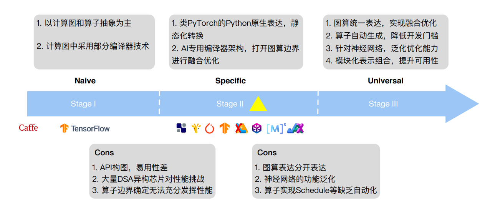
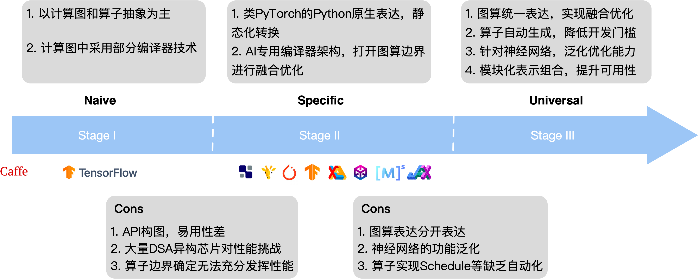
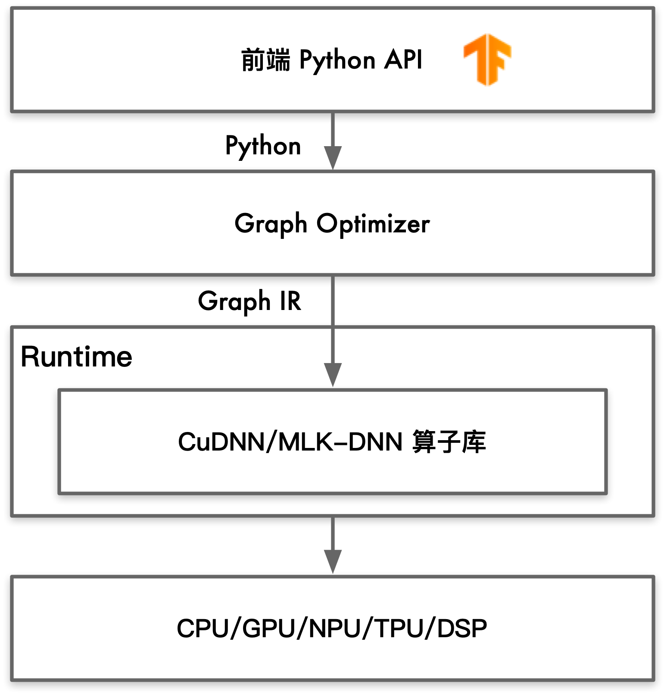
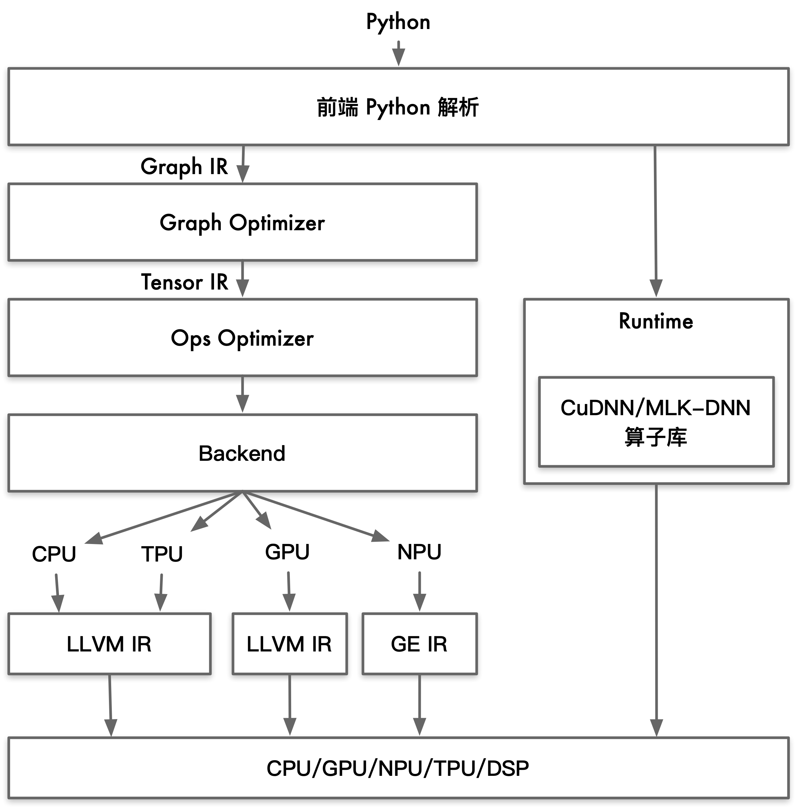

============== 图片统一命名，多次强调图片命名格式哈，一定要按规范。

# AI 编译器历史阶段

======= 一句话介绍 AI 编译器历史阶段，本节要讲的内容。

## AI 编译器设计目标

AI 编译器在人工智能领域的应用主要分为两个场景：推理场景和训练场景。这两个场景分别对应了 AI 模型生命周期中的不同阶段，并且对编译器的要求也有所不同。

推理场景指的是 AI 模型已经训练完成，并且需要在实际应用中对新的数据进行预测的过程。在这个阶段，模型的权重和结构已经固定，编译器的任务是将训练好的模型文件转换成能够在特定硬件上高效执行的程序。推理场景的关键点包括：

* 性能优化：推理时对性能要求很高，因为通常需要实时或近实时的响应。编译器需要优化模型以减少延迟和提高吞吐量。

* 资源利用：在推理时，编译器需要高效地利用硬件资源，如 CPU、GPU 或专用 AI 加速器，以实现最佳的能效比。

* 模型压缩：编译器可能会进行模型压缩，减少模型大小，以适应资源受限的部署环境，如移动设备或嵌入式系统。

* 硬件兼容性：编译器需要确保生成的程序能够在不同的硬件平台上运行，包括不同的处理器架构和加速器。

训练场景是指使用大量标注数据来训练神经网络模型的过程。在这个阶段，模型的参数（权重和偏置）是未知的，需要通过学习数据来确定。编译器在此阶段的任务是将用高级语言编写的神经网络代码转换成能够在硬件上高效执行的训练程序。训练场景的关键点包括：

* 代码生成：编译器需要将高级语言描述的神经网络算法转换成可以执行的低级代码。

* 梯度计算：在训练过程中，编译器需要支持自动微分，以计算损失函数相对于模型参数的梯度。

* 并行计算：编译器需要优化数据并行和模型并行策略，以利用多个处理器或多个设备进行训练。

* 内存管理：由于训练过程中数据和中间结果可能非常庞大，编译器需要有效管理内存，以避免内存溢出和提高计算效率。

推理场景和训练场景是 AI 编译器应用的两个主要领域，它们各自有着不同的优化目标和挑战。推理场景更注重性能和资源利用，而训练场景则更侧重于代码生成、梯度计算和并行优化。AI 编译器的发展需要同时满足这两个场景的需求，以支持 AI 模型从开发到部署的整个生命周期。

## 什么是 AI 编译器

AI 编译器是一种针对人工智能和机器学习应用特别优化的编译器，它能够满足推理场景和训练场景不同需求，将高级语言编写的程序或者训练好的模型文件转换成可以在特定硬件上高效执行的程序。结合当前人们对 AI 编译器的认识，大概可以分为以下四个特征:

1. AI 编译器拥有以 Python 为主的动态解释器语言前端，Python 是一种广泛用于人工智能领域的高级编程语言，因其简洁的语法和强大的库支持而受到欢迎。动态解释器语言前端指的是编译器在处理 Python 代码时，会进行动态类型检查和解释执行，这有助于在运行时捕获和处理类型错误。

2. AI 编译器拥有多层 IR 设计，包括图编译 IR、算子编译 IR、代码生成 IR 等。IR（Intermediate Representation，中间表示）是编译过程中的一个抽象层次，它将高级语言代码转换为一种中间形式，以便进行进一步的优化和转换。图编译指的是将程序表示为计算图，这是一种数据结构，用于表示程序中的操作和它们之间的依赖关系。算子编译是指将计算图中的操作（算子）转换为特定硬件或平台的优化代码。代码生成是将优化后的 IR 转换为目标平台的代码，这一步通常涉及到寄存器分配、指令调度等优化技术。

3. 既然 AI 编译器是一种针对人工智能和机器学习应用的编译器，那么它一定面向神经网络、深度学习进行了特定的优化，使其处理神经网络的计算任务拥有更好的效率。AI 编译器会针对神经网络和深度学习模型的特点进行优化，比如自动微分、梯度下降等操作。这些优化可能包括内存访问模式的优化、并行计算的调度、以及针对特定深度学习框架（如 TensorFlow、PyTorch）的定制化支持。编译器可能会集成高级优化技术，如模型剪枝、量化、混合精度计算等，以减少模型的计算复杂性和内存占用。

4. AI 编译器还应该针对 DSA 芯片架构进行支持。DSA（Domain-Specific Architecture，特定领域架构）是一种针对特定应用领域设计的硬件架构。DSA 芯片通常具有高度定制化的硬件组件，如专门的张量处理单元（TPU）、神经网络处理器（NPU）等，这些组件可以显著提高特定任务的处理效率。AI 编译器需要能够理解和利用这些 DSA 芯片的特性，生成能够充分利用这些定制化硬件的代码，从而实现性能的最优化。

综上所述，AI 编译器是一个复杂的系统，它结合了多种编译技术，针对 AI 和机器学习应用进行了深度优化，以实现在特定硬件上高效运行的目标。

## AI 编译器发展阶段

xxx
========= 一句话介绍下面的图片，有图的地方就应该有介绍。

### 朴素 AI 编译器

AI 编译器的第一个阶段，我们可以将其看作是朴素 AI 编译器阶段。它主要存在于 TensorFlow 早期版本，基于神经网络的编程模型，主要进行了 graph 图和 ops 算子两层抽象。

#### 图层抽象

在 TensorFlow 中，图是由一系列节点（Nodes）和边（Edges）组成的有向图。通过声明式的编程方式，以静态图方式执行。声明式编程是一种编程范式，开发者描述“要做什么”，而不是“怎么做”。在 TensorFlow 中，这意味着开发者定义计算的依赖关系，而不是执行顺序。通过使用 TensorFlow 的 API，开发者创建了一系列的运算节点（ops）和它们之间的数据流（tensors），这些构成了计算图。静态图是指在程序执行之前就已经定义好的图结构。在 TensorFlow 中，一旦图被构建完成，它的结构就固定下来，不会在运行时改变。

静态图的执行模式允许 TensorFlow 的编译器在执行前对整个图进行分析和优化。TensorFlow 在执行静态图之前会进行硬件无关和硬件相关的编译优化。

1. 硬件无关的优化

    * 表达式化简：去除冗余的运算，例如将多个连续的加法或乘法操作合并为单个操作，简化计算流程。

    * 常量折叠：在图构建阶段，将所有的常量表达式计算出来，减少运行时的计算量，提高执行效率。

    * 自动微分：TensorFlow 能够自动计算图中任意节点的梯度，这对于训练神经网络至关重要，因为梯度信息用于反向传播算法。

2. 硬件相关的优化

    * 算子融合：将多个连续的运算融合为一个单独的运算，减少中间数据的存储和传输，降低内存占用，提高运算效率。

    * 内存分配：优化内存使用，例如通过重用内存空间来减少内存分配和释放的开销，或者优化数据在内存中的存储布局以提高缓存利用率。

静态图允许编译器进行全局优化，因为整个计算流程在执行前就已经确定。并且，通过硬件无关和硬件相关的优化，可以显著提高程序的执行效率。然而，静态图的固定结构可能限制了某些动态执行的需求，例如动态控制流。通过这种声明式编程和静态图执行的方式，TensorFlow 早期版本为深度学习应用提供了强大的优化能力，使得程序能够在各种硬件平台上高效运行。

======= 图片统一命名，刷新图片地址

#### 算子抽象

在深度学习框架中，算子是执行具体计算的操作单元，例如矩阵乘法、卷积、激活函数等。Kernel 在深度学习中通常指的是在底层硬件上执行特定计算任务的函数或代码块。手写 Kernel 意味着开发者需要手动编写这些函数，以确保它们能够在特定的硬件上以最高效率运行。这通常需要深入理解目标硬件的架构和编程模型，例如 GPU 的内存层次结构、线程组织等。

在 TensorFlow 中，为了实现高性能的算子，开发者可能会直接编写 CUDA 代码来创建算子的实现，这些实现直接编译为 GPU 上的机器指令，并在 GPU 上执行。或者对于一些较为通用的算子，TensorFlow 可以直接使用 CuDNN 库中的算子实现，而无需开发者手动编写 CUDA 代码。这种方式简化了开发过程，同时确保了计算的高性能。

总结来说，TensorFlow 早期版本中算子层的手写 Kernel 和对 CuDNN 的依赖是为了在 NVIDIA GPU 上实现高性能计算。这种方式虽然提供了优化性能的可能性，但也带来了开发和维护上的挑战。

#### 朴素编译器的缺点

TensorFlow 早期的静态图设计，有其天然的劣势。

1. 在 TensorFlow 早期版本中，静态图的概念不是 Python 语言原生支持的，因此，开发者需要使用 TensorFlow 框架提供的 API 来构建计算图。这意味着开发者不能直接使用 Python 的控制流语句来动态地构建图，这限制了表达的灵活性和直观性。

2. 由于静态图的构建方式与 Python 的动态特性不完全兼容，新开发者可能会觉得难以理解和使用。静态图要求开发者在执行任何计算之前就定义好完整的计算流程，这与 Python 中动态构建和修改对象的习惯不同，因此可能会降低易用性。

3. 随着专门为深度学习设计的 DSA 芯片（如谷歌的 TPU 等）的出现，编译器和算子实现需要更好地适应这些硬件的特性，以充分发挥它们的性能。这些芯片通常具有与传统 CPU 不同的架构特性，如并行处理单元、高带宽内存等，这对编译器的优化策略提出了新的要求。

4. 在静态图中，算子的粒度（即算子的大小和复杂性）和边界（即算子之间的界限）通常在图构建时就已经确定。这种预先确定的粒度和边界可能限制了编译器在运行时根据具体硬件特性进行更细粒度优化的能力，从而无法完全发挥硬件的性能。

5. 硬件厂商通常会提供针对其硬件优化的算子库（如 NVIDIA 的 CuDNN），但这些库可能不是最优的，因为：模型和 shape 确定情况下的优化：在某些情况下，可能存在比库中提供的实现更优的算子版本，特别是当模型结构和数据形状（shape）已经确定时。

6. SIMT 和 SIMD 架构中的优化空间：在单指令多线程（SIMT）和单指令多数据（SIMD）架构中，编译器可以通过调度（Scheduling）和分块（Tiling）等技术进一步优化性能，这些是硬件厂商的库可能没有充分利用的。

### 专用 AI 编译器

在 AI 编译器的发展中，阶段二标志着专用 AI 编译器的诞生，这一阶段的编译器开始针对 AI 和深度学习工作负载进行优化。

#### 表达形式演进

PyTorch 框架以其动态图（也称为即时执行模式）而受到欢迎，它允许开发者以 Python 原生的方式编写和修改神经网络模型。这种灵活性甚至成为了当前所有 AI 框架设计的参考标准，促使编译器开发者考虑如何将类似 PyTorch 的表达方式转换为优化的中间表示（IR）。

尽管动态图提供了灵活性，但在性能关键的应用中，静态图的优化潜力更大。因此，编译器需要能够将动态图转换为静态图，以便于进行进一步的优化。同时，PyTorch 引入了 AI 专用编译器架构，打开开图算边界进行融合优化，够更好地处理 AI 工作负载的特点，自动管理图和算子的边界。

### 性能上的差异

在阶段二的 AI 编译器中，性能优化是一个关键的焦点，特别是在如何充分利用硬件资源方面。目前工业界已经有了很多产品在这一方面进行了尝试，如：TVM、Meta 推出的 TC、谷歌推出的 XLA 等。

在之前的编译器中，算子的边界是固定的，这意味着每个算子作为一个独立的单元执行，与其他算子的交互有限。而在当前阶段编译器开始打破这些边界，允许算子之间的更深层次的交互和优化。通过重新组合优化，编译器能够更有效地利用硬件资源，如 CPU、GPU 或专用 AI 加速器。编译器可能将大的计算子图拆解为更小的算子，这样可以更细致地进行优化（子图展开）；也可能将多个小算子合并为一个更大的算子，减少数据传输和内存访问，提高执行效率（算子融合）。

Buffer Fusion 是一种优化技术，它通过合并多个连续的内存访问操作来减少内存的分配和释放，从而降低内存碎片和提高内存访问效率。在深度学习中，大量的中间数据需要在算子之间传递，Buffer Fusion 可以减少这些数据的存储和传输开销。水平融合（Horizontal Fusion）涉及将执行数据并行操作的算子合并，以提高数据吞吐量。例如，如果一个神经网络层可以并行处理多个输入特征，水平融合可以将这些操作合并为一个更高效的算子。

优化策略需要根据目标硬件的特性来定制，不同的硬件平台可能需要不同的优化方法。由于硬件架构和神经网络模型的多样性，编译器需要具备自动调优的能力，以找到最佳的优化策略。阶段二的 AI 编译器通过打开计算图和算子的边界，并运用各种编译优化技术，能够更有效地利用硬件资源，提高深度学习模型的性能。这要求编译器具备深入的硬件理解、自动调优能力以及与开发者的协作能力。

总的来说，阶段二的 AI 编译器在表达和性能上都进行了显著的改进。在表达上，编译器能够处理类似 PyTorch 的灵活表达方式，并通过转换为计算图 IR 来进行优化。在性能上，通过打开计算图和算子的边界，并运用先进的编译优化技术，编译器能够更有效地利用硬件资源，提高深度学习模型的性能。这些改进使得 AI 编译器更加强大和灵活，能够满足日益增长的 AI 应用需求。

### 通用 AI 编译器

阶段二的专用 AI 编译器目前的发展还是存在着很多问题：

1. 计算图的构建（表达层）与算子的具体实现（算子层）是分开的。这种分离意味着算法工程师主要关注于如何使用框架提供的 API 来构建和表达计算图，而算子的底层实现则由框架开发者和芯片厂商负责。这种分离导致了责任和知识的分工，但同时也增加了两者之间协作和集成的复杂性。

2. 尽管专用 AI 编译器在表达上已经足够灵活，但它在泛化功能方面依然存在局限。

    * 在某些场景下，需要根据运行时信息动态调整计算图结构，而专用编译器在这方面的支持不足。
    * 当输入数据的形状（例如批量大小或输入特征维度）在运行时变化时，专用编译器难以适应这种动态性。
    * 对于稀疏数据集，专用编译器可能没有优化计算路径以减少不必要的计算和内存使用。
    * 在多设备或多节点上进行模型训练和推理时，专用编译器可能缺乏有效的并行化策略和优化。

3. 专用 AI 编译器在算子实现方面依然缺乏自动化的优化手段，如调度（Schedule）、分块（Tiling）和代码生成（Codegen）。这导致开发者在实现算子时需要手动进行这些优化，增加了开发的门槛和复杂性。开发者不仅需要深入了解算子的计算逻辑，还需要熟悉目标硬件的体系架构，以便编写高效且可移植的代码。

在阶段二专用 AI 编译器之后，就是 AI 编译器发展阶段三的到来。阶段三代表着通用 AI 编译器的重要发展阶段。阶段三的通用 AI 编译器代表了 AI 编译器技术的进一步成熟和进步。目前工业界的发展还处于 AI 编译器发展阶段的阶段二，也就是专用 AI 编译器的发展阶段。

但展望未来，阶段三的通用 AI 编译器将带来一系列创新特点，成为我们的发展目标：

* 统一表达：在阶段三，通用 AI 编译器将实现计算图（Graph）和算子（Operators）的统一表达。这一创新意味着编译器能够在统一的框架下，同时进行图级别的优化和算子级别的优化，提升了编译过程的效率和效果。

* 自动化优化：通用 AI 编译器将在算子层实现自动调度（Schedule）、自动分块（Tiling）和自动代码生成（CodeGen），从而大幅降低开发难度，提高开发效率。

* 泛化优化能力：通用 AI 编译器将具备更广泛的优化能力，包括动静统一、动态形状（Shape）处理、稀疏性优化、高阶微分以及自动并行化等高级特性。

* 模块化设计：通用 AI 编译器将编译器本身、运行时系统、异构计算支持以及从边缘设备到数据中心的部署需求划分为独立的、可重用和可组合的模块。这种设计不仅增强了系统的灵活性和可扩展性，使其能够适应多样化的硬件架构和计算环境，而且通过提供简单直观的 API、详尽的文档和强大的工具支持，显著降低了开发难度，加快了开发速度，使得 AI 应用的部署和维护变得更加容易和高效。

## 小结与思考

通过对 AI 编译器发展阶段的认识，我们重新来总结一下，什么是 AI 编译器？

* 图算统一表达，实现融合优化。
* 算子自动生成，降低开发门槛。
* 针对神经网络，泛化优化能力。
* 模块化表示和组合，提升可用性。

======= 对 AI 编译器历史的三阶段，分三句话分别总结。 - 阶段 1 朴素 AI 编译器：xxxx。

## 本节视频

<html>
<iframe src="https://player.bilibili.com/player.html?isOutside=true&aid=475776530&bvid=BV1QK411R7iy&cid=911968190&p=1&as_wide=1&high_quality=1&danmaku=0&t=30&autoplay=0" width="100%" height="500" scrolling="no" border="0" frameborder="no" framespacing="0" allowfullscreen="true"> </iframe>
</html>
