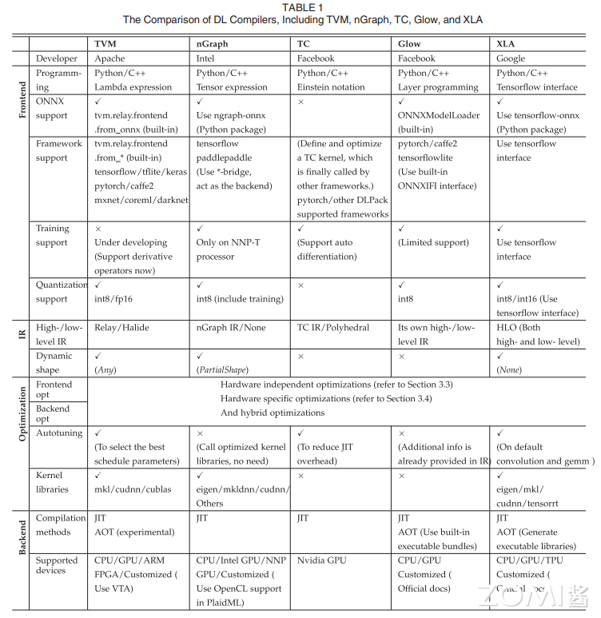
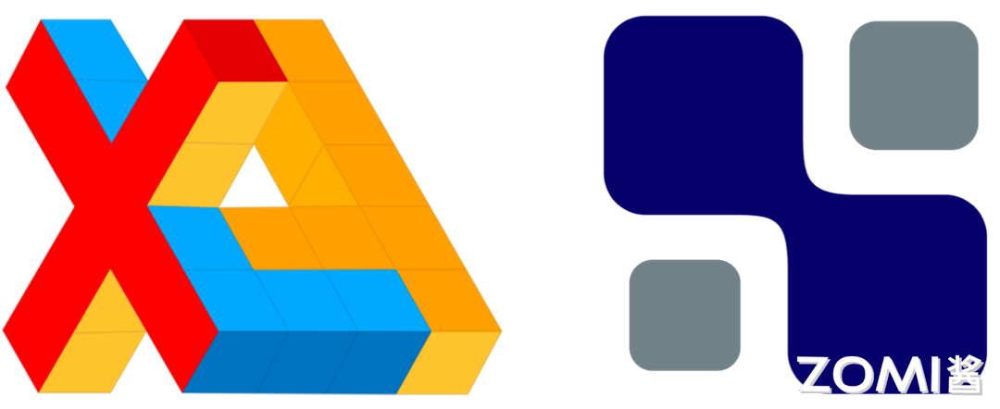
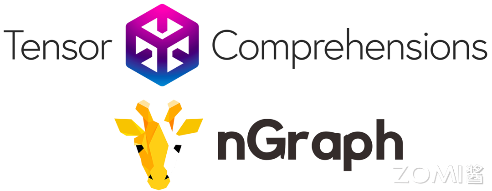

# AI 编译器挑战与思考

本节首先会基于 The Deep Learning Compiler: A Comprehensive Survey 中的调研做一个热门 AI 编译器的横向对比，并简要介绍几个当前常用的 AI 编译器。随后会分析当前 AI 编译器面临的诸多挑战，并展望 AI 编译器的未来。

## 业界主流 AI 编译器对比

在 The Deep Learning Compiler: A Comprehensive Survey 文中做了一个调研，横向对比了**TVM、nGraph、TC、Glow 和 XLA**共五个热门 AI 编译器，如下图所示。



下面将分别介绍这五个业界主流的 AI 编译器。

### TVM

TVM 是 Apache 公司的一个开源的深度学习编译器堆栈，旨在通过对神经网络模型的端到端优化，使其在各种硬件平台（包括 CPU、GPU 和专用加速器）上高效运行。TVM 由一群研究者和工程师开发，主要目标是提供一个灵活的、高性能的编译器框架，以满足神经网络模型在不同硬件上的高效执行需求。

TVM 是一个分层的深度学习编译器堆栈，由 Relay 和 TVM 两层组成。Relay 层负责计算图的全局优化和与各种前端深度学习框架的接入，通过算子间融合、常量折叠、公共子表达式消除等优化策略，提高计算图的整体性能。Relay 设计的目标是能够轻松接入包括 TensorFlow、PyTorch、MXNet 在内的各种前端框架，实现前端框架之间的无缝切换，并充分利用 TVM 的优化能力。另一方面，TVM 层专注于具体算子的优化和生成，采用 Compute（计算逻辑）和 Schedule（调度策略）分离的设计，Compute 负责定义算子的计算逻辑，而 Schedule 则负责指定算子的调度和优化策略，包括内存布局、并行化、向量化等。这样的设计允许用户定义新算子的计算逻辑和优化策略，从而生成高效的内核代码，进一步提高执行效率。

TVM 的开放架构允许用户灵活扩展和自定义，不仅可以作为独立的算子开发和编译工具，还能在算子级别进行高度的灵活性和可扩展性操作。通过 Relay 和 TVM 的协同工作，TVM 接收来自 Relay 层优化后的子图，并针对每个算子进行底层优化和内核生成，这些优化和生成根据具体硬件平台进行定制，以最大化硬件利用率和执行效率。TVM 的强大之处在于其广泛的跨平台支持，包括 CPU、GPU 和专用硬件加速器（如 FPGA、TPU），使其能够在多种应用场景中提供高性能解决方案。

TVM 通过 Relay 层的全局计算图优化和 TVM 层的算子级别优化，显著提升了神经网络模型的执行效率，其开放和灵活的架构使其在快速发展的深度学习领域中具有极强的适应性和生命力。

### XLA

XLA（加速线性代数）是一个专门针对特定领域的线性代数编译器，旨在加速深度学习框架 TensorFlow 中的计算过程。其核心思想是通过对计算图进行优化和编译，以实现更高效的计算。XLA 可以自动地优化 TensorFlow 模型的计算图，并将其编译成针对特定硬件的高效执行代码，从而提高模型的运行速度和性能表现。最重要的是，使用 XLA 可能完全不需要更改 TensorFlow 模型的源代码，因为 XLA 可以直接与 TensorFlow 集成，作为其优化和加速的一部分。这使得开发者能够轻松地利用 XLA 提供的优势，而无需对现有代码进行修改，从而快速地实现模型的性能提升。

在 XLA 的优化过程中，关键的挑战之一是如何将原本复杂的大算子打开成小算子。这需要对模型的计算逻辑进行深入分析和理解，以找出合适的切分点和拆解方式。而小算子经过优化后，可能需要重新融合成新的大算子，这要求对各个小算子的优化效果进行全面评估，并采取合适的融合策略。最后，通过使用高级优化语言（如 HLO/LLO）和底层编译器（如 LLVM IR）来实现整体的设计，所有的优化 Pass 规则都需要手工提前指定，以确保编译器能够正确地识别和应用优化策略。这种综合利用高级语言和底层编译器的设计，使得 XLA 能够在保持模型功能不变的前提下，显著提升模型的执行效率，为神经网络模型的推理过程提供了强大的支持。



### nGraph

nGraph 是 Intel 开发的一个开源深度学习编译器框架，旨在提供跨平台的高性能计算支持。nGraph 通过将神经网络模型转换为优化的计算图，并生成针对不同硬件平台（如 CPU、GPU、FPGA 等）的高效代码，从而提高模型的执行性能。

nGraph 的运作可以被视为深度学习框架中更为复杂的深度神经网络（DNN）运算的基石。它在神经网络模型的推理计算和训练过程中发挥着至关重要的作用，通过优化算法和硬件支持，确保模型在不同阶段的计算中取得理想的效率平衡点。在推理计算阶段，nGraph 确保模型能够以最低的延迟和最高的吞吐量进行推断，从而实现快速的预测和推断能力。而在训练阶段，nGraph 则致力于提高模型的收敛速度和训练效率，通过并行化处理、内存优化等技术，加速训练过程并提高训练数据的处理效率。总之，nGraph 作为深度学习框架的基石，旨在确保模型在推理计算与训练计算之间取得理想的效率平衡，从而实现神经网络模型在不同应用场景下的高效部署和执行。

### TC

TC 是一个用于深度学习的编译器工具，其全称为 Tensor Comprehensions，由 Meta 公司开发管理。Tensor Comprehensions 旨在简化和加速神经网络模型的开发和部署过程。它通过一种名为“tensor comprehension”的领域特定语言（DSL），将神经网络模型表示为张量计算的表达式，然后利用编译技术将这些表达式转换为高效的计算图和执行计划。

Tensor Comprehensions 的一个重要特点是它可以用于构建 Just-In-Time (JIT) 系统。JIT 编译器在运行时动态地将高级编程语言代码转换为底层代码，这使得程序员能够在运行时即时编译和优化代码，从而获得更高的性能和效率。在 Tensor Comprehensions 中，程序员可以使用高级编程语言（如 C++）编写 tensor comprehension 表达式，描述神经网络模型的计算过程。然后，Tensor Comprehensions 的 JIT 编译器会将这些表达式转换为底层的 GPU 代码，以实现高效的计算。这种动态编译和优化的过程使得程序员能够更加灵活地实现复杂的深度学习计算，同时又能够获得接近原生 GPU 性能的执行效率。通过 Tensor Comprehensions，程序员可以利用高级编程语言的优势，如易读性、易维护性和抽象性，同时又能够充分利用底层硬件的性能优势。这种融合了高级编程语言和底层代码优化技术的方法，使得神经网络模型的开发和部署变得更加高效和灵活。

在 AI 编译器中，实现算子（操作）的计算逻辑通常相对容易，因为它主要涉及到实现数学运算和计算图的基本操作。但是，算子的 Schedule 开发却相对困难，因为它需要同时了解算法逻辑和硬件体系结构。在算子的 Schedule 开发中，需要考虑如何在硬件上高效执行计算，包括内存访问模式、并行化策略、数据布局等方面的优化。特别是在图算法的边界打开之后，当进行小算子的融合后，可能会生成新的算子和 kernel。对于这些新算子，传统的方法是手动定义其 Schedule 模板，这需要深入了解硬件的架构和特性，以及算法本身的优化策略。这种手动定义的方法不仅耗时耗力，而且难以保证生成的 Schedule 能够在不同硬件平台上达到最佳性能。

TC 希望通过 Polyhedral model 来实现自动调度（auto schedule）。Polyhedral model 是一种用于描述多维循环嵌套的数学框架，它可以帮助优化循环结构并生成高效的调度策略。通过将 Polyhedral model 应用于 TC 中，可以实现对算子 Schedule 的自动化优化。这样一来，开发者无需手动定义 Schedule，而是由 TC 自动推导出最佳的调度策略，从而减轻了开发者的工作负担，同时又能够获得高性能的计算结果。

### Glow

Glow 是 Meta 开源的一个强大的深度学习推理框架，它不仅具备跨硬件支持和图优化技术，还提供了丰富的运行时性能优化功能，包括内存预分配、异步执行和低精度计算等。这些优化技术可以有效地提高模型的推理速度和吞吐量，使得模型在实际应用中表现出色。

此外，Glow 还支持灵活的部署选项，可以适用于嵌入式设备、云端服务器和边缘计算等多种场景，满足不同应用需求。在 Meta 内部，Glow 已经被广泛应用于各种课程中，为用户提供快速、高效的深度学习推理服务，助力各种应用领域的发展和创新。



## AI 编译器面临挑战

这里总结了五个当前 AI 编译器面临的挑战。分别是**动态 Shape 问题**、**Python 编译静态化**、**发挥硬件性能**、**特殊优化方法**以及**易用性与性能兼顾问题**。

### 动态 Shape 泛化

AI 编译器的发展一直在不断演进，尤其是针对动态计算图的支持。目前的主流 AI 编译器确实更擅长处理静态形状的输入数据，因为静态形状在编译时更容易进行优化。这主要适用于诸如图像处理、自然语言处理等领域，其中输入数据的形状通常是已知的。

然而，对于包含动态 shape 输入或者控制流语义的动态计算图，AI 编译器的支持确实有限。这是因为非固定 shape 的输入以及控制流语义会使计算图的结构在运行时变得不确定，这给编译器带来了挑战。在这种情况下，编译器通常需要依赖运行时系统动态地跟踪和执行计算图，而无法像静态计算图那样进行完全的静态优化。例如在 NLP 任务中，输入给网络模型的一个序列长度是不固定的，某些句子会长一点某些句子会短一点，此时就会引起大量的动态 shape 需求。

在当前的 AI 领域中，一些任务并不能简单地通过人工修改来实现静态化。特别是在涉及到金字塔结构的检测模型等情况下，这种情况尤为突出。金字塔结构通常用于处理多尺度信息，例如在目标检测任务中，我们需要同时检测不同尺度的目标。这种金字塔结构的复杂性使得编译器难以有效地进行优化。因为金字塔结构的构建需要考虑多个尺度的输入数据以及相应的处理流程，这使得计算图的结构在编译时变得难以确定。由于金字塔结构的特性，其输入数据的形状和计算流程通常会在运行时动态地变化，这给编译器带来了挑战。

### Python 编译静态化

Python 静态化通常指的是将 Python 代码转换为静态类型语言的过程，例如将 Python 代码转换为 C 或者 C++等语言。这个过程的目的是为了在 Python 代码中引入静态类型信息，以提高程序的性能和执行效率。

在对 Python 静态化问题分析之前，先来对 Python 的执行流程做一个简单的了解。

如图所示，Python 执行时，首先会将.py 文件中的源代码编译成 Python 的 byte code(字节码)，其格式为.pyc。然后编译器对这些字节码进行编译处理，再对程序进行执行操作。


Python 在执行时一般有两种方法。第一种是生成字节码后通过 Python 虚拟机（Python Virtual Machine）交给硬件去执行，这也是最通用的一种执行方式。第二种是通过 Python 提供的 JIT（Just-In-Time）即时编译器进行编译生成一个机器码，然后直接交给硬件去执行。

接下来介绍两个 Python 中最常见的语言解释器，即 CPython 和 PyPy，他们分别使用了上述的第一种执行方法和第二种执行方法。

**CPython**

在 Python 中，CPython 是最为常用的 Python 解释器之一。它采用了一种混合编译和解释的策略，将 Python 源代码首先编译成一系列中间字节码。这些字节码被设计成与平台无关的形式，以便于在不同的操作系统和硬件上执行。

一旦字节码被生成，CPython 虚拟机就会介入，它是解释器的核心组成部分。在程序执行过程中，CPython 虚拟机会进入一个循环，不断地匹配和执行字节码指令。这个内部的 while 循环扮演着重要的角色，它是程序执行的引擎，负责解释和执行字节码指令。

在 CPython 虚拟机的内部，存在着一个由多条 C 函数组成的庞大函数库。这些 C 函数与字节码指令一一对应，通过一系列的 case 分支来执行相应的操作。例如，当解释器遇到 LOAD_CONST 指令时，它会调用相应的 C 函数来加载常量值到栈中；当遇到 CALL_FUNCTION 指令时，它会调用另一个 C 函数来执行函数调用操作。

这种混合编译和解释的方式使得 CPython 具有了良好的灵活性和性能表现。编译过程提前将代码转换成字节码，避免了每次执行都需要重新解析源代码的开销，而解释器内部的 C 函数库则为执行字节码指令提供了高效的底层支持。这样一来，CPython 在保持了 Python 语言的灵活性和易用性的同时，也能够在一定程度上提高程序的执行效率。


**PyPy**

PyPy 是一个基于 RPython 语言构建的 Python 解释器实现。与传统的解释器不同，PyPy 利用即时编译（JIT）技术来执行 Python 代码。这意味着 PyPy 在运行 Python 程序时，并不会逐行地解释和执行代码，而是在执行程序之前，通过即时编译将部分代码直接转换成机器码。

这种即时编译的方式使得 PyPy 能够在运行时动态地优化程序的执行，根据实际执行情况生成更高效的机器码，从而提高程序的性能。与传统的解释器相比，PyPy 在执行速度上有了显著的提升，尤其是对于一些计算密集型的 Python 程序。

同时，PyPy 也保持了与 CPython 的兼容性，这意味着它可以运行绝大部分的 Python 代码，并且与 CPython 在语言特性和标准库方面保持一致。这使得开发者可以无需修改现有的 Python 代码，就可以享受到 PyPy 带来的性能提升。


此时则可以提出第一个 Python 静态化的操作方法，即使用 Python JIT 虚拟机：期望在 Python 解释执行的基础上增加 JIT 编译加速的能力，例如使用 PyPy 或者 CPython，但由于前期设计问题 Python JIT 虚拟机兼容难。

Python 第二个静态化的方案是通过修饰符。目前 AI 框架静态化方案普遍采用修饰符方法。

修饰符方法也基本分为两个路线。

第一个路线是函数提取静态分析，即 Tracing Based 方法，常用 PyTorch 中的 PyTorch.fx 方法。PyTorch.fx 是 PyTorch 中的一个模块，其中 fx 代表“Function Extraction”。其可以执行函数提取工作，即将 PyTorch 模型中的函数提取出来，形成一个独立的函数图（Function Graph），这个图描述了函数之间的调用关系和数据流动情况；同时也可以对提取出的函数图进行静态分析，识别函数之间的依赖关系和数据流动路径，以及执行过程中的优化机会。在变量前加上此修饰符，可以逐句进行跟踪并做出翻译，例如下面所示代码操作。

```python
@torch.fx.wrap
def torch_randn(x, shape):
    return torch.randn(shape)

def f(x):
    return x + torch_randn(x, 5)
fx.symbolic_trace(f)    
```

第二个路线是源码转换，即 AST Transform 方法，常用 PyTorch 中的 PyTorch.jit.trace 方法。torch.jit.trace 是 PyTorch 中用于函数追踪的一个函数。它用于将给定的 Python 函数或者模块转换为 Torch Script，从而允许在静态图上执行函数，以提高执行效率和部署性能。在用户自定义的函数前加上此修饰符，即可对函数进行一个源码转换，例如下面所示代码操作。

```python
def foo(x, y):
    return 2 * x + y

traced_foo = torch.jit.trace(foo, (torch.rand(3), torch.rand(3)))

@torch.jit.script
def bar(x):
    return traced_foo(x, x)
```

虽然 PyTorch 提出了诸如 JIT 虚拟机以及修饰符等针对 Python 静态化的方案，但都存在瑕疵。下面罗列一些当前 AI 编译器在 Python 静态化上面临的挑战。

**类型推导**:将 Python 动态类型转换为编译器 IR 静态类型是一项挑战，需要编译器在运行时收集类型信息、处理类型不确定性，并在精度和性能之间寻找平衡，以确保正确推导出变量的静态类型。

**控制流表达**：在将 Python 代码静态化的过程中，对控制流表达（如 if、else、while、for 等）的处理也是难点之一。编译器需要分析和转换这些控制结构，确保在静态化后仍能正确执行程序逻辑，包括条件分支的静态推导、循环结构的终止条件确定、循环不变量提取、迭代器和生成器的处理以及异常处理的转换。通过对这些控制流表达进行静态化，编译器能够为 Python 代码提供更好的类型检查、优化和部署支持。

**灵活的语和数据类型转换**：在将 Python 代码静态化的过程中，灵活的语和数据类型转换是一个关键挑战，特别是针对 Slice（切片）、Dict（字典）、Index（索引）等操作。编译器需要能够静态地分析和处理这些操作，确保在静态化后仍能正确地进行切片取值、字典操作和索引访问等动态特性，从而实现对 Python 代码的有效静态化转换。

**JIT 的编译性能**：JIT 的编译性能无论是基于 Tracing Based 还是 AST Transform，都可能会面临额外的编译开销。在 Tracing Based 方式中，编译器会根据程序的实际执行情况进行优化，但追踪和编译过程会增加额外开销。而在 AST Transform 方式中，编译器需要将抽象语法树转换为中间表示形式，这也会带来一定的编译成本。因此，在选择 JIT 编译方式时，需要权衡编译性能和执行效率之间的平衡。

### 发挥硬件性能

当开发出一款新的 AI 框架并希望其在不同硬件设备上都能很好的激发硬件性能时，不可能让硬件对 AI 框架做出适应性修改，故需要极度依赖 AI 编译器适配各种硬件的能力。

但目前编译器进行性能优化的难度和复杂度挑战逐渐变大。一是性能优化依赖图算融合优化，图层和算子层独立优化无法充分发挥芯片性能，需要图算融合优化，例如子图切分、子图内垂直融合优化和水平并行优化；二是随着硬件架构的复杂度上升，会有更多专有性优化被提出，从而想实现泛化优化会变得更加困难，这是一个矛盾的点。

当前 AI 编译器尚未形成统一完善的方案，但在不断探索多种优化方法，以提高模型的执行效率和性能。其中，一项重要的探索是通过打开图和算子的边界，重新组合优化计算图的结构，以最大限度地发挥底层硬件芯片的性能潜力。这种优化涉及到对计算图的边界进行开放式的重组和优化，使得计算和数据在不同层次上更加紧密地配合，减少了内存访问开销和计算资源的浪费。同时，AI 编译器还将多种优化手段融合在一起，包括垂直融合优化（如 Buffer Fusion 等）和水平并行优化（如 Data Parallel 等），以在不同层次上进一步提高模型的执行效率。此外，重新组合优化后的子图的 Kernel 代码也将自动生成，包括调度（scheduling）、切片（tilling）、向量化（vectorizing）等操作，以便针对特定硬件平台进行优化。这些努力旨在实现更高效、更灵活的模型执行和部署，但仍需要持续不断的研究和探索，以达到更统一、更完善的解决方案。

### 特殊优化方法

当前 AI 编译器在解决大模型训练中的内存墙、性能墙等挑战时，借助复杂的并行策略来实现自动并行化。这包括通过规模扩展（Scale out）采用多维混合并行能力，如数据并行、张量并行和流水线并行，将计算任务分布到多个计算节点或设备上，以提高训练效率；同时，通过性能提升（Scale up）采用重计算、混合精度和异构并行等技术，对单个计算节点或设备进行性能优化。这些策略的综合应用旨在有效地应对大模型训练中的性能瓶颈，提高训练速度和效率。

Scale Out/Up 的最大挑战之一是效率墙，其解决依赖于复杂的切分策略，对开发者来说，这是一项门槛较高且效率较低的任务。手工配置切分策略需要开发者具备深入的领域知识和丰富的经验，这不仅增加了开发时间和成本，还可能导致性能优化不足或过度优化的问题。尽管半自动并行可以解决部分效率问题，但真正要解放开发者，需要依赖编译技术和凸优化问题，以自动找到最优的并行策略。通过自动化的编译和优化过程，AI 编译器可以帮助开发者在规模扩展和性能提升方面取得更好的效果，从而克服效率墙带来的挑战。

在面向 HPC 场景下，自动微分的要求更高，尤其是针对控制流和高阶微分的挑战。在动态图中，通过 Python 执行控制流可能会导致性能下降，尤其是当循环次数较多时，这会限制模型的效率。为了克服这一挑战，一种解决方案是将动态图静态化，以便在编译时优化控制流。另一方面，静态图的自动微分需要解决逻辑拼接或计算图展开等问题，以确保在高效率下进行微分操作。此外，高阶微分方面也是一个挑战，开发者需要灵活地控制图的展开方式，并且需要研究如何通过 Jacobian 矩阵和 Hessian 矩阵等方式进行高效计算，以满足复杂模型的需求。综上所述，面向 HPC 场景的自动微分需要综合考虑控制流和高阶微分等方面的挑战，以实现更高效、更可靠的计算。

### 易用性与性能兼顾

**与 AI 框架的边界和对接**：不同 AI 框架对深度学习任务的抽象描述和 API 接口不同，语义和机制上有各自的特点。需要考虑如何在不保证所有算子被完整支持的情况下透明化的支持用户的计算图描述。

**对用户透明性问题**：部分 AI 编译器并非完全自动的编译工具，性能表现依赖于用户提供的高层抽象的实现模版，如 TVM。主要是为算子开发工程师提供效率工具，降低用户人工调优各种算子实现的人力成本。现有抽象却常常无法足够描述创新的硬件体系结构上所需要的算子实现。需要对编译器架构足够熟悉的情况下对其进行二次开发甚至架构上的重构，门槛及开发负担仍然很高。

**编译开销**：AI 编译器作为性能优化工具，只有在编译开销对比带来的性能收益有足够优势才有实用价值。部分应用场景下对于编译开销的要求较高。对于开发者而言，使用 AI 编译器阻碍其快速的完成模型的调试和验证工作，极大增加开发和部署的难度和负担。

**性能问题**：编译器的优化本质上是将人工的优化方法，或者人力不易探究到的优化方法通过泛化性的沉淀和抽象，以有限的编译开销来替代手工优化的人力成本。深度学习编译器只有在性能上真正能够代替或者超过人工优化才能真正发挥价值。

**鲁棒性**：AI 编译器大多数处于研究型，产品成熟度距离工业级应用有较大差距。是否能够顺利对计算图编译，计算结果的正确性，对错误进行跟踪调试都需要考虑。

在这里，向读者抛出几个问题，希望读者能去认真思考

**图算能否统一表达，统一编译优化，形成通用的 AI 编译器？**当前的 AI 框架下，图层和算子层是分开表达和优化，算法工程师主要是接触图层表达，AI 框架、芯片、kernel 开发工程师主要是负责算子的表达，未来能否会有 IR 打破图算之间的 GAP，未来在 AI+科学计算、AI+大数据等新场景驱动下，使得计算图层和算子层不再清晰，能否统一 AI 的编译优化？

**完全的自动并行是否可行？**自动并行能根据用户输入的串行网络模型和提供的集群资源信息自动进行分布式训练，通过采用统一分布式计算图和统一资源图设计可支持任意并行策略和各类硬件集群资源上分布式训练，并且还能利用基于全局代价模型的规划器来自适应为训练任务选择硬件感知的并行策略。实际上自动并行是一个策略搜索问题，策略搜索能够在有限的搜索空间找到一个次有的答案，但是真正意义上的自动并行能否做到需要进一步思考和验证。

**AI 芯片需要编译器吗？AI 芯片需要 AI 编译器吗？**AI 芯片对于编译器的依赖取决于芯片本身的设计。越灵活的芯片对于编译器的依赖会越大。在 AI 芯片设计之初，有 CISC 风格把优化在芯片内部解决。但是随着专用领域的演化，为了支持更加灵活的需求，AI 芯片本身会在保留张量指令集和特殊内存结构的前提下越来越灵活。未来的架构师需要芯片和系统协同设计，自动化也会越来越多地被应用到专用芯片中去。

## AI 编译器的未来

针对 AI 编译器的未来，可能存在着许多未知的问题，但仍然是十分可观的。

**编译器形态**：未来的 AI 编译器将分为推理和训练两个阶段，采用 AOT（Ahead-of-Time）和 JIT（Just-in-Time）两种编译方式。在推理阶段，编译器将预先编译模型以实现高效执行；而在训练阶段，编译器则倾向于即时编译以应对动态需求。这种灵活性将使编译器能够根据任务需求和系统资源选择最佳编译方式，从而提高性能和资源利用率。

**IR 形态**：未来的 AI 编译器需要一个类似于 MLIR 的统一中间表示（IR），能够灵活地表示和优化各种类型的 AI 模型。这个 IR 将支持多种编程语言和框架，使得跨框架的模型优化和转换变得更加高效。

**自动并行**：未来的 AI 编译器将具备自动并行的编译优化能力，能够跨机器、跨节点进行任务的并行处理。这种自动并行化能力将使得在分布式系统中部署和执行 AI 模型变得更加高效和简便。编译器将能够自动检测并行执行的机会，根据任务的特性和系统资源自动分配和调度任务，以最大化系统的利用率和性能。这种功能的引入将为大模型的训练和推理提供更强大的支持，同时也为分布式 AI 应用的开发和部署带来了更大的便利。

**自动微分**：未来的 AI 编译器将提供先进的自动微分功能，能够支持高阶微分的计算方式，并且方便对计算图进行操作。这种功能将使得对复杂模型进行优化和训练变得更加高效和灵活。编译器将能够自动推导出高阶导数，为模型的优化和调整提供更深入的信息。同时，它也将提供丰富的图操作接口，使得用户可以方便地对模型的结构进行修改和优化。这种自动微分的能力将为未来 AI 模型的研究和开发带来更大的灵活性和创造性。

**Kernel 自动生成**：未来的 AI 编译器将实现自动化的 Kernel 生成功能，从而降低开发门槛，快速实现高效且泛化性强的算子。这意味着编译器将能够根据给定的算法和硬件环境自动生成优化的计算核心，无需手动编写特定的硬件优化代码。这种自动生成 Kernel 的功能将大大简化算法开发和优化的流程，减少了手工调优的时间和精力。同时，生成的 Kernel 将针对不同的硬件平台进行优化，从而实现更高的性能和更好的泛化性能。这将使得开发者能够更专注于算法本身的创新，而不必过多关注底层的实现细节。

## 小结与思考

**目前主流AI编译器**：TVM、XLA、nGraph、TC（Tensor Comprehensions）、Glow等。

**AI编译器目前遇到的挑战**：AI编译器目前主要遇到五个挑战，分别是动态 Shape 问题、Python 编译静态化、发挥硬件性能、特殊优化方法以及易用性与性能兼顾问题。

**AI编译器的未来**:未来的 AI 编译器将分为推理和训练两个阶段，采用 AOT（Ahead-of-Time）和 JIT（Just-in-Time）两种编译方式；将拥有一个统一的中间表达IR；能够实现自动并行编译优化；能够提供先进的自动微分功能，支持高阶微分计算方式；能实现自动化Kernel代码生成，降低开发门槛。

**思考问题**：图算能否统一表达，统一编译优化，形成通用的 AI 编译器？完全的自动并行是否可行？AI 芯片需要编译器吗？AI 芯片需要 AI 编译器吗？

## 本节视频

<html>
<iframe src="https://player.bilibili.com/player.html?isOutside=true&aid=563475228&bvid=BV1Hv4y1R7uc&cid=913460214&p=1&as_wide=1&high_quality=1&danmaku=0&t=30&autoplay=0" width="100%" height="500" scrolling="no" border="0" frameborder="no" framespacing="0" allowfullscreen="true"> </iframe>
</html>
