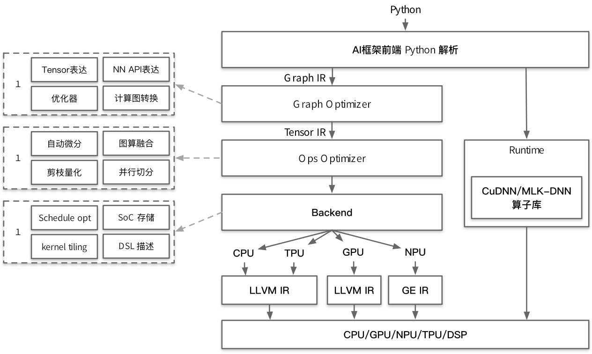

# AI 编译器前端优化

AI编译器的前端优化的整体框图如下图所示，最上层为AI框架，例如TensorFlow、PyTorch、MindSpore等，这些AI框架的主要作用为解析Python代码产生计算图，并将计算图传递给AI编译器进行前端优化。

AI编译器的前端优化中包含许多Pass，图层优化的内容较多，本章将介绍一些优化Pass，包括算子融合Pass、内存分配Pass、内存排布Pass、常量折叠Pass等，不同的Pass执行不同的优化逻辑，相互组合共同完成AI编译器的前端优化。

# Where we are

AI编译器整体架构图如上图所示。在图中最上层，AI框架前端将对Python代码进行解析产生GraphIR，而AI编译器的前端优化将对生成的GraphIR进行多种优化处理，处理方式包括但不限于上文中提及的各种优化Pass等。

在AI编译器整体架构图中其他的部分，如AI编译器的后端优化等，将在后续章节中进行介绍。

# 前端优化
在如下图所示的AI编译器前端优化流程图中，AI编译器将对输入的GraphIR，依次执行包括但不限于常量折叠、常量传播、算子融合、表达式简化、表达式替换、公共子表达式消除等各种前端优化Pass，各个Pass的执行结果仍然为GraphIR并将输入到下一个Pass中，直到前端优化结束并输出最终优化后的GraphIR。

## 本节视频

<html>
<iframe src="//player.bilibili.com/player.html?isOutside=true&aid=263727934&bvid=BV1ne411w7n2&cid=922979928&p=1" scrolling="no" border="0" frameborder="no" framespacing="0" allowfullscreen="true"></iframe>
</html>
