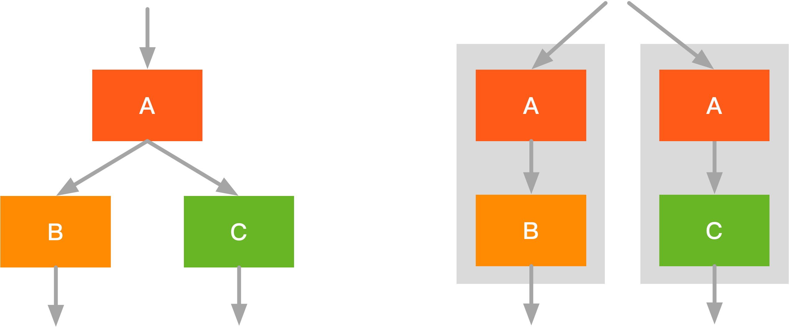
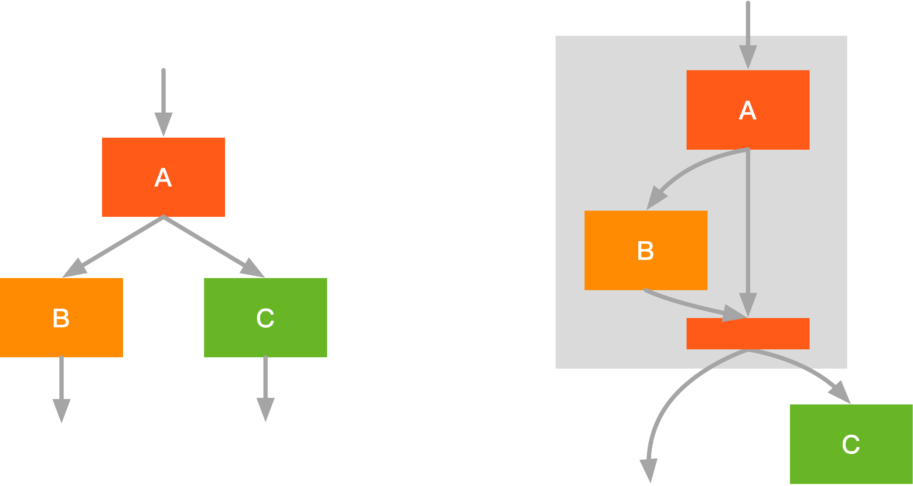
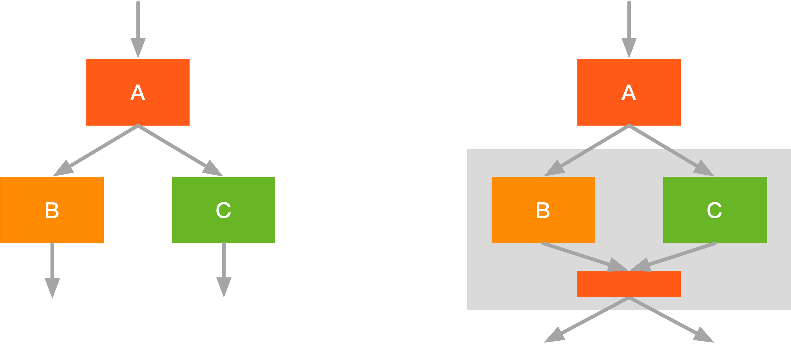

# 算子融合

> 待更新中，卷的不行了卷得不行了！ZOMI 一个人晚上下班后才能更新视频和文章，如果您有兴趣也非常希望您能够参与进来（Github Issues 区留言或者B站私信ZOMI哦），一起写AI系统，一起分享AI系统的知识。

算子融合的核心目的是减少访存次数与kernel开销；主要解决由内存墙和并行墙导致计算效率低的问题。

- **内存墙**：主要是访存瓶颈引起。算子融合主要通过对计算图上存在数据依赖的“生产者-消费者”算子进行融合，从而提升中间Tensor数据的访存局部性，以此来解决内存墙问题。这种融合技术也统称为“Buffer融合”。在很长一段时间，Buffer融合一直是算子融合的主流技术。早期的AI框架，主要通过手工方式实现固定Pattern的Buffer融合。
-  **并行墙**：主要是由于芯片多核增加与单算子多核并行度不匹配引起。可以将计算图中的算子节点进行并行编排，从而提升整体计算并行度。特别是对于网络中存在可并行的分支节点，这种方式可以获得较好的并行加速效果。

## 算子融合方式

### 纵向融合

&emsp;将C与D两个算子融合成一个算子，可减少一次访存与kernel的开销。

&emsp;&emsp;下图左侧A算子执行后，B与C算子访问A计算结果，并行执行；将A与B，A与C算子融合后，可对AB与AC算子并行执行无需访存算子A的中间计算结果。

&emsp;&emsp;下图左侧需要3次kernel开销；右侧将A与B算子融合后仅需2次kernel开销，将A与B的结果保存供C访问，以提高内存访效率。

### 横向融合

&emsp;&emsp;下图左侧B与C并发，执行ABC算子共需3次kernel开销；右侧将BC算子融合后仅需2次kernel开销，两者计算都依赖A的结果放入内存，以提高内存访效率。

### 小结

- Enlarge conv & Fuse conv：扩大卷积核权重，实现横向算子融合；本质以是增大计算复杂度为代价，减小访存次数与kernel的开销。

- Fuse conv + add：将conv与add算子进行纵向融合；

- Fuse conv + relue：将conv与relu算子进行纵向融合。

&emsp;&emsp;**注：通过横向融合与纵向融合，最终将5个算子融合为2个算子。**

## Conv-BN-ReLU算子融合

### BN计算流程

&emsp;&emsp;在BN 前向计算过程中，首先求输入数据的均值与方差，然后使用均值、方差对每个输入数据进行归一化及缩放操作。其中均值及方差依赖于输入数据；归一化及缩放计算的输入则依赖于输入数据、均值、方差以及两个超参数。下图为前向计算过程中BN 的数据依赖关系：

&emsp;&emsp;BN反向计算过程中，首先求参数误差；然后使用参数误差Δγ、Δβ 计算输入误差ΔX 。参数误差导数依赖于输出结果误差ΔY 以及输入X；输入误差ΔX 依赖于参数误差导数及输入X、输出误差ΔY。反向过程包括求参数误差以及输入误差两部分，BN反向计算的关键访存特征是两次使用输入特征X 及输出误差ΔY，分别用于计算参数误差Δγ、Δβ及输入数据误差ΔX。

### 计算访存分析

&emsp;&emsp;前向计算过程中，每层的计算结果需写出主存，用于反向计算过程中计算输入误差；反向计算过程中，每层的结果误差也需写出到主存，原因是反向计算时BN层及卷积层都需要进行两次计算，分别求参数误差及输入数据误差，图X、ΔY 加载两次来计算参数误差Δγ、Δβ 及输入误差ΔX。ReLU输入Y 不需要保存，直接依据结果Z 即可计算出其输入数据误差。

### 模型重构及算子融合

&emsp;&emsp;前向过程中，BN重构为两个子层：BN_A和BN_B。其中BN_A计算均值与方差，BN_B完成归一化与缩放，分别融合于相邻卷积层及激活层。首先从主存读取输入X、均值μ、方差δ2 、参数γ、β，计算BN_B，完成归一化及缩放计算，将结果Y 用于激活计算，输出Z 用于卷积计算，卷积结果X′ 写出到主存之前，计算BN_A，即求均值μ′ 与方差δ2 ‘。完成“**归一化缩放->激活层->卷积层->计算卷积结果均值与方差**”结构模块的前向计算过程只需要读取一次，并写回卷积计算结果X′ 及相关参数。

&emsp;&emsp;具体融合计算过程如下所示：

- 卷积计算

$$
{z} = {w} * {x} + {b}
$$

- BN计算：

$$
y = \frac{{\left( {z - mean} \right)}}{{\sqrt {\operatorname{var} } }}\beta  + \gamma 
$$

- 融合卷积与BN的运算：

$$
\begin{gathered}
  w' = \frac{w}{{\sqrt {\operatorname{var} } }}\beta  \hfill \\
  b' = \frac{{\left( {b - mean} \right)}}{{\sqrt {\operatorname{var} } }}\beta  + \gamma  \hfill \\
  {{\hat f}_{i,j}} = {W_{BN}} * \left( {{W_{conv}} * {f_{i,j}} + {b_{conv}}} \right) + {b_{BN}} \hfill \\ 
\end{gathered} 
$$

## 融合规则与算法

### TVM支配树
支配树与支配点：
- 支配树：各个点的支配点构成的树；
- 支配点：所有能够到达当前节点的路径的公共祖先点（ Least Common Ancestors，LCA）；

支配树作用：

- 检查每个Node到其支配点的Node是否符合融合条件
- 融合的基本规则是融合掉的Node节点不会对剩下的节点产生影响

支配树生成：

- 根据DAG生成DFS树
- 根据DFS树及对应的边生成DOM树
- 使用Group来描述多个Node是否能被融合

## 小结

- 算子的融合方式有横向融合和纵向融合，但根据AI模型结构和算子的排列，可以衍生出更多不同的融合方式。
- 通过Conv-BN-ReLU 算子融合栗子，了解到如何对算子进行融合和融合后的计算，可以减少对于对访存的压力。
- 在编译器中，一般融合规则都是通过Pass来承载，不同的Pass处理不同的融合规则，而融合规则主要是人工定义好。

## 本节视频

<html>

<iframe src="https:&as_wide=1&high_quality=1&danmaku=0&t=30&autoplay=0" width="100%" height="500" scrolling="no" border="0" frameborder="no" framespacing="0" allowfullscreen="true"> </iframe>
</html>
