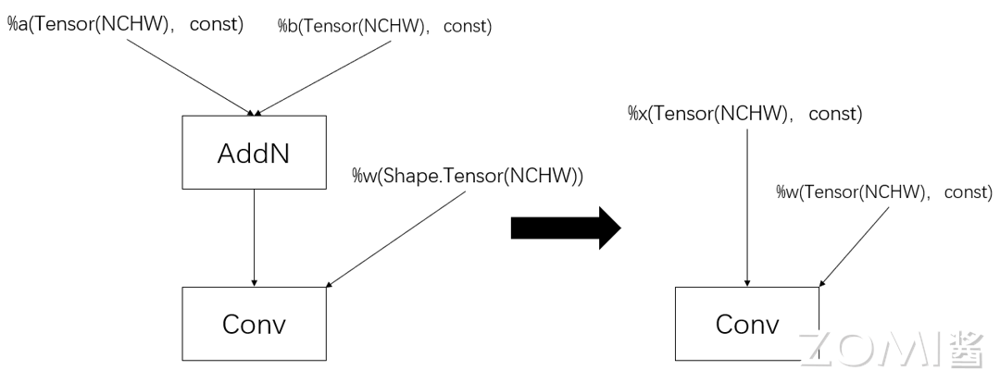
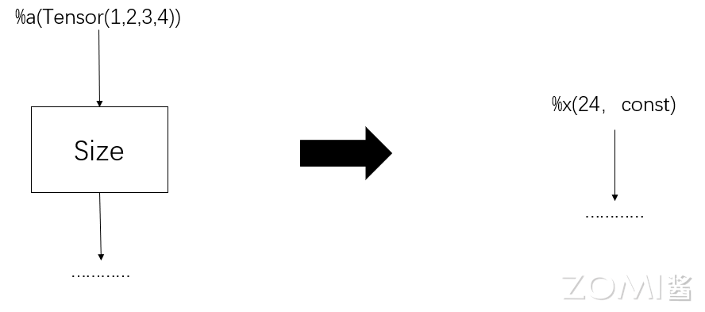

<!--Copyright 适用于[License](https://github.com/chenzomi12/AISystem)版权许可-->

# 常量折叠原理

常量折叠（Constant Folding）是编译器的一种优化技术，它通过在编译期间对常量表达式进行计算，将其结果替换为常量值，从而减少程序运行时的计算和开销。下面我们将分别介绍传统编译器和 AI 编译器的常量折叠优化。

============= 建议后面的案例统一用 python 或者 C++，不要引入 JAVA 或者 GO

## 传统编译器的常量折叠

传统编译器在编译期间，编译器会设法识别出常量表达式，对其进行求值，然后用求值的结果来替换表达式，从而使得运行时更精简。

```python
day_ sec = 24*60*60
```

 当编译器遇到这样的一个常量表达式时，表达式会被计算值所替换。因此上述表达式可以等效地被执行为 :

 ```python
day_sec = 86400
```

以 python 为例，在 python 中，使用反汇编模块 Disassembler 获取 day_ sec = 24×60×60 的 CPython 的字节码。

 ```python
import dis

dis.dis("day_sec=24*60*60")
```

```text
  1           0 LOAD_CONST               0 (86400)
              2 STORE_NAME               0 (day_sec)
              4 LOAD_CONST               1 (None)
              6 RETURN_VALUE
```

上述的 CPython 的字节码表明，python 在对 day_sec 赋值是直接加载计算结果 86400，相比于 3 次载入数据和两次乘法，更加地高效。

常量折叠发生的条件：

- 必须是编译期常量之间进行运算才会进行常量折叠。

- 编译期常量就是“编译的时候就可以确定其值的常量”。即字面量(数字字面量，字符串字面量等等)，常量传播可达的变量。

举个例子 ：

```c++
int x = 14;
int y = 7 - x / 2;
return y * (28 / x + 2);
```

编译器首先会进行一次常量传播，将所有对 x 的引用替换成 14 ：

```c++
int x = 14;
int y = 7 - 14 / 2;
return y * (28 / 14 + 2);
```

对于 y = 7 - 14 / 2 这个表达式，所有参与计算的都是常量(字面量)，所以会被常量折叠成 y = 0 ：

```c++
int x = 14;
int y = 0;
return y * (28 / 14 + 2);
```

编译器再次对 y 进行常量传播以及对于 y * (28 / 14 + 2)进行常量折叠后得到 ：

```c++
int x = 14;
int y = 0;
return 0;
```

通过上述的例子可以得知一个表达式如果可以进行常量折叠，那么其参与计算的所有值最后都应该是字面值，因为常量变量可以通过常量传播转化为字面值。

不同的编译器对于编译期常量的定义不同，有些编译器需要特殊的关键字标识才会被认定为编译期常量。这将会影响一个表达式能否进行常量折叠的判断。比如下面 java 进行字符串计算的例子 ：

```java
String a = "a";
String bc = "bc";
String s1 = a + bc;
```

在 java 中，只有被 **final** 修饰的变量，且该变量初始化的值是编译期常量，才是编译期常量。上述例子中，s1 不会被常量折叠成“abc”,而是根据 String 类特有的 **+** 运算符重载，变成类似下面这样的代码，不会进行常量折叠：

```java
String s2 = new StringBuilder(a).append(b).toString(); 
```

所以了解编译器对于编译期常量的定义是一件很重要的事情，这将决定你的代码能否进行常量折叠优化。除此之外，还有其他的一些情况可能会影响常量折叠，比如在 python 中，下面两种情况就不会被常量折叠：

- 当常量表达式计算的结果溢出时，编译器不会进行常量折叠。比如 2 的 64 次幂会被折叠，而 4 的 64 次幂不会被折叠 ：

======= 格式参考我上面改的一样，输出不要用这个格式哦。

    ```python
    >>> dis.dis("day_sec=2**64")
  1           0 LOAD_CONST               0 (18446744073709551616)
                2 STORE_NAME               0 (day_sec)
                4 LOAD_CONST               1 (None)
                6 RETURN_VALUE 
    ```

    ```python
    >>> dis.dis("day_sec=4**64")
  1           0 LOAD_CONST               0 (4)
                2 LOAD_CONST               1 (64)
                4 BINARY_POWER
                6 STORE_NAME               0 (day_sec)
                8 LOAD_CONST               2 (None)
                10 RETURN_VALUE
    ```

上面两图分别是 2 的 64 次幂和 4 的 64 次幂的 CPython 字节码，可以看出 2 的 64 次幂会被折叠成一个具体的数，而 4 的 64 次幂不会。

- 当进行字符串运算的时候，比如两个字符串相加，当且仅当字符串相加的结果大小小于等于 4096 时，该常量表达式才会被折叠，否者不会进行折叠：

```python
>>> dis.dis("day_sec='-'*4097")
1           0 LOAD_CONST               0 ('-')
            2 LOAD_CONST               1 (4097)
            4 BINARY_MULTIPLY
            6 STORE_NAME               0 (day_sec)
            8 LOAD_CONST               2 (None)
            10 RETURN_VALUE
```

上面给出了结果大小为 4097 的字节码，可以看出并不会被折叠。而大小为 4096 会被折叠，由于会被折叠，得到的字符串是非常长的，这里就不给出例子了，读者可以自行尝试。

不同编译器的常量折叠的实现细节不尽相同，下面以 python 为例来描述传统编译器的常量折叠的一种实现。

在 python 中，CPython 会调用 astfold_expr 来对表达式进行常量折叠。astfold_expr 以递归的方式遍历 AST（抽象语法树），并尝试折叠所有的表达式。比如二值运算操作，astfold_expr 会先递归处理该二值操作的左操作数和右操作数，然后将此折叠操作代理给特定的折叠函数 fold_binop。在 fold_binop 中，首先会判断左操作数和右操作数是否都是常量，如果为常量，则判断该二值操作的具体操作类型，然后调用对应基本运算操作，比如 ADD 运算，会调用 PyNumber_Add。最后将计算出来的结果更新到 AST 对应的节点中。

## AI 编译器的常量折叠

常量折叠作为传统编译器的一种优化技术，其迁移到 AI 编译器依然适用。传统编译器通常是对抽象语法树进行常量折叠优化，而 AI 编译器是对计算图进行常量折叠优化。AI 编译器会对计算图中的每个操作节点进行分析，判断其是否可进行常量折叠。如果可以，则通过计算得到结果替换该节点。

以下是 AI 编译器常量折叠的几个类型：

- 当计算图中某个节点的数据输入节点均为编译期常量(不同 AI 编译器的定义可能完全不相同)的节点，则可以提前计算出该节点的值来完全替换该节点。

  

  以 AddN 为例，对于两个形状大小为(N,C,H,W)四维常量 Tensor，AddN 的计算结果在编译期间是可以确定的，可以生成一个与该结果等值的数据节点替换掉 AddN。这样就不需要给 Add 节点分配额外的存储资源，在计算图执行的过程中，也不需要反复计算 AddN 这个操作，可直接进行访问。

- 输入形状确定的 Shape 类型的操作，比如 Size、Shape 等操作。这些操作都只与输入的形状有关，与输入的具体值无关，而相比于具体输入值来说，当输入的形状在编译期间是一个可以确定的值时，AI 编译器就可以直接计算出 Shape 类型操作的值。

  

  以 Size 为例，对于形状大小为(1,2,3,4)的四维变量 Tensor，Size 的计算在编译期间是可以确定，AI 编译器会生成一个值为 24 的常量数据节点来替换 Size 节点。

- 数据输入节点不全为编译常量节点，但是这部分节点是可常量折叠的节点，即经过一系列的常量折叠后，该节点会被替换成编译常量节点。

  

  如上图，依旧以 AddN 为例，可以看出 AddN2 并不满足第一类的折叠规则，但是 AI 编译器发现 AddN1 是个可常量折叠的节点，AI 编译器生成一个常量数据节点替换掉 AddN1 后，发现 AddN2 也满足第一类的折叠规则，所以 AI 编译器会再生成一个常量数据节点替换掉 AddN2。

与传统编译器相同，AI 编译器在进行常量折叠的时候也会被诸多因素所影响，比如 如果常量的大小（以字节为单位）太大，则不替换它。这可以防止图的大小变得过大。

不同的 AI 编译器对于常量折叠的细节不尽相同，这里以 tensorflow 为例，描述其常量折叠的实现细节：

1. 获得逆后续节点集。使用反向深度优先搜索对计算图进行遍历，获取逆后续节点集。这样可以保证在处理当前节点时，其所有输入的节点都已经处理完毕了。

2. 构建常量集和 Shape 操作节点集。常量集存储编译期常量，可常量折叠节点（包括 Shape 操作节点）。Shape 操作节点集用于存储可常量折叠 Shape 操作节点，由于可常量折叠的 Shape 的特殊性——可以直接计算出结果，所以需要单独存储可常量折叠的 Shape 操作节点及其对应的计算结果，以区分于其他的可常量折叠节点——这些节点有可能是第一类或第三类可常量折叠节点，无法立刻确定其计算结果。

3. 构建常量图。遍历常量集，对于常量集中的每个节点，如果其在 Shape 操作节点集中，则使用 Shape 操作节点集中提前存储的计算结果生成一个常量数据节点，加入常量图中；如果其不在 Shape 操作节点集中，记该节点为 n，先将 n 的副本加入常量图中，然后遍历 n 在原图中的所有数据入边，重新在常量图中构建这些边，由于 n 的所有数据输入均是常量且由于逆后续节点集的关系，n 的所有输入节点都已经处理过，并已处于常量图中。

4. 获取需要可常量折叠节点集。遍历常量图中的所有节点，对于某个节点 n，如果其存在一个输出节点不在常量图中，则将其加入需要可常量折叠节点集中。

5. 常量折叠。判断需要可常量折叠节点集是否为空，如果为空，则说明常量图中的所有常量节点无论替换与否都不会影响原图的计算，这些点通常可能是死代码或者冗余节点，会被后续的优化处理给删除掉，这种情况则不需要进行常量折叠；如果不为空，那么会将生成一个值与该节点的计算结果相同的常量数据节点来替换该节点。

  

  如上图中，AddN2 的输出为 Conv（不在常量图中），tensorflow 会计算 AddN2 的输出结果，由于可以肯定其输入要么是编译期常量要么是可折叠常量节点，递归处理其所有输入节点即可。

## 小结与思考

- 无论是传统编译器还是 AI 编译都是希望通过常量折叠将将程序中的常量表达式计算为一个常量值，并将其替换为该常量值的结果，以此来减少程序的运行时间和资源消耗，提高代码的性能和效率。

- 传统编译器通常处理较为简单的常量类型，如整数和浮点数，而 AI 编译器可能会处理各种类型的常量，例如张量、矩阵等，以适应神经网络的复杂计算。

## 本节视频

<html>
<iframe src="https://player.bilibili.com/player.html?isOutside=true&aid=221454991&bvid=BV1P8411W7dY&cid=928689217&p=1&as_wide=1&high_quality=1&danmaku=0&t=30&autoplay=0" width="100%" height="500" scrolling="no" border="0" frameborder="no" framespacing="0" allowfullscreen="true"> </iframe>
</html>
