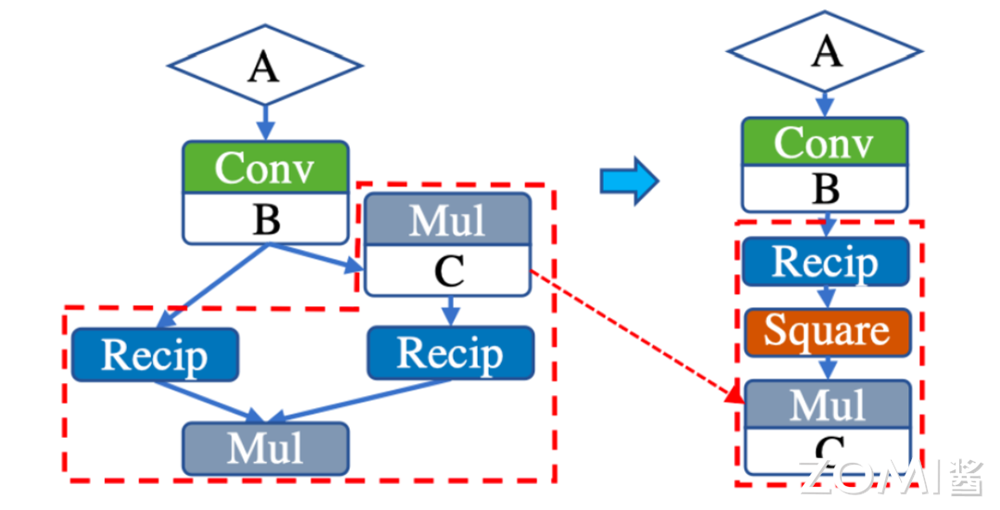
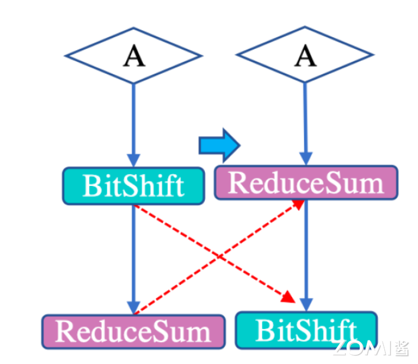
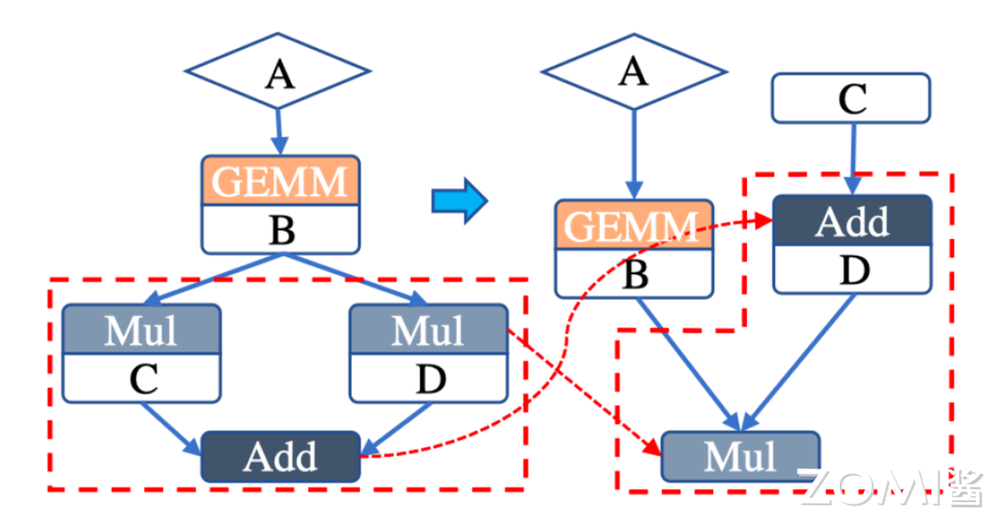
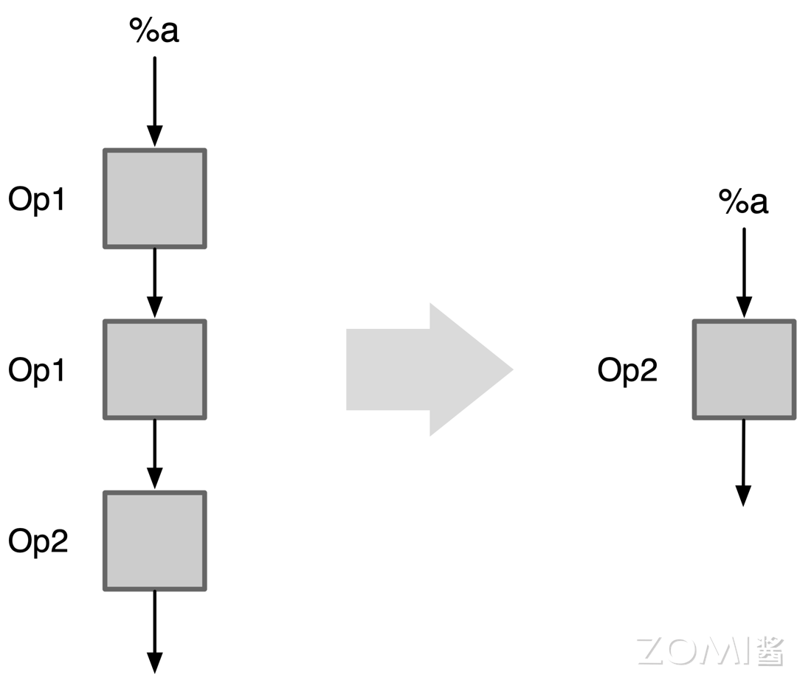
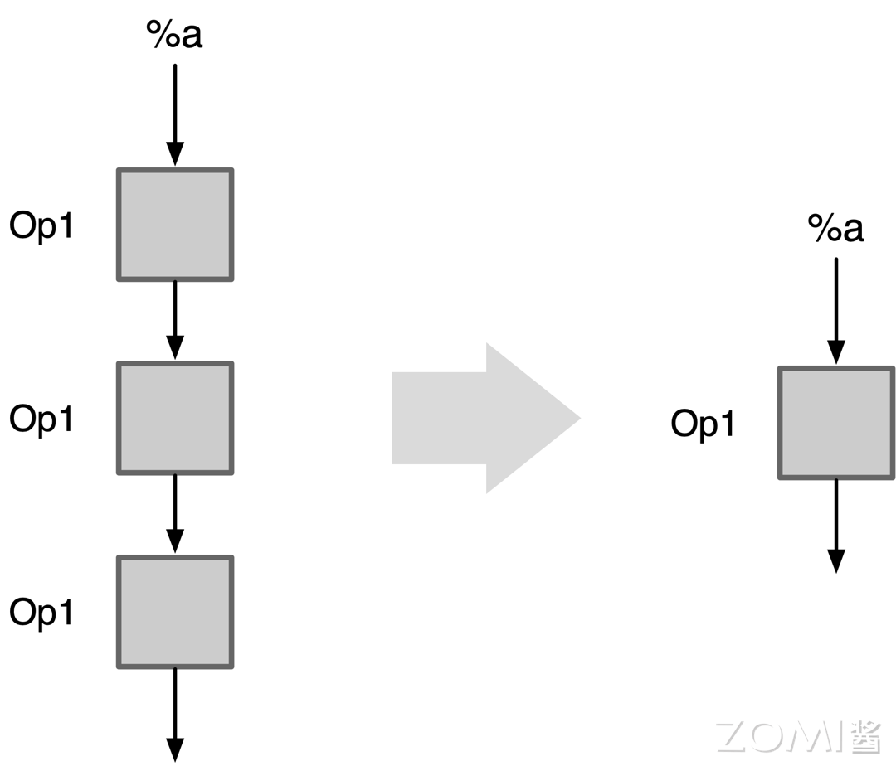

<!--Copyright © 适用于[License](https://github.com/chenzomi12/AISystem)版权许可-->

# 代数简化(DONE)

代数简化（Algebraic Reduced）是一种从数学上来指导我们优化计算图的方法。其目的是利用交换率、结合律等规律调整图中算子的**执行顺序**，或者删除不必要的算子，以提高图整体的计算效率。

代数化简可以通过子图替换的方式完成，具体实现：1）可以先抽象出一套通用的子图替换框架，再对各规则实例化。2）可以针对每一个具体的规则实现专门的优化逻辑。下面我们将介绍三种不同的代数简化方案。

## 算术简化

顾名思义，算术化简就是通过利用代数之间算术运算法则，在计算图中可以确定优化的运算符执行顺序，从而用新的运算符替换原有复杂的运算符组合。我们给出结合律，分配律，交换律的例子。

### 结合律

非正式的讲，结合律是说： 不论我们怎样结合数字（即先计算那些数字），答案都是一样的。即：

$$
(a+b)+c = a+(b+c)
$$

形式化的讲，令 $*$ 是非空集合 $S$ 上的二元运算，如果 $\forall x,y,z\in S$，都有

$$
(x*y)*z = x*(y*z)
$$

则称运算 $*$ 在 $S$ 上是**可结合的**，或者说运算 $*$ 在 $S$ 上满足**结合律**。

根据这样的思想，我们可以发现以下的规则符合结合律，令 $A,B,C$ 是张量集合 $\Gamma$ 的元素，即 $A,B,C\in \Gamma$，则有

$$
(A\star B)^{-1}\diamond ((A\star B)C)^{-1} \rightarrow(A\star B)^{-2}\diamond C
$$

其中 $\star$ 是卷积 Conv，$\diamond$ 是矩阵乘法 Mul；形式上讲，我们称上述公式为在张量集合 $\Gamma$ 上的二元运算 $\star$、$\diamond$ 满足结合律。

有了这样的规则，便可以指导我们进行实例的优化，例如下面的实例算子，令 $A,B,C$ 为具体的张量，其他算子均为图示，优化规则如上所述：

根据上述结合律规则，我们可以把 A 与 B 的卷积给抽离出来，讲红色方框部分做简化，这样我们就减少运算算子，也减少了运算开销。

当然还有许多符合结合律的化简，我们列几个在下方供读者参考。

$$
Recip(A) \diamond Recipe(A \diamond B) \rightarrow Square(Recip(A)) \diamond B
\\
(A \diamond \sqrt B) \diamond (\sqrt B \diamond C) \rightarrow A \diamond B \diamond C
\\
(A \diamond ReduceSum(B)) \diamond (ReduceSum(B) \diamond C) \rightarrow A Square(ReduceSum(B)) \diamond C
$$

### 交换律

交换律是说：我们可以**把数的位置对换**而答案不变，即：

$$
a+b = b+c \\
a*b = b*a \\
$$

形式化的讲，令 $*$ 是非空集合 $S$ 上的二元运算，如果 $\forall x,y\in S$，都有

$$
x*y= y*x
$$

则称运算 $*$ 在 $S$ 上是**可交换的**，或者说运算 $*$ 在 $S$ 上满足**交换律**。

根据这样简洁优美的思想，我们可以发现以下的规则符合结合律：

$$
ReduceSum(BitShift(A)) \rightarrow BitShift(ReduceSum(A))
$$

根据这样的规则我们可以看到如下实例的优化：

如图所示，A 是一个张量，相比较先位移再 ReduceSum 的操作顺序，我们可以根据结合律，先 ReduceSum，得到一个维度更小的 batch，再进行 BitShift，显然运算的开销减少了。

当然还有许多符合交换律的化简，我们列几个在下方供读者参考。

$$
ReduceProd(Exp(A)) \rightarrow Exp(ReduceSum(A))
$$

### 分配律 

分配律简化，即

$$
a*(b+c) = (a*c)+(a*b)
$$

形式化的讲，令 $*$ 和 $\circ$ 是非空集合 $S$ 上的二元运算，如果 $\forall x,y,z\in S$，**都**有

$$
x*(y\circ z) = (x*y)\circ (x*z)
\\
(y\circ z)*x = (y*x)\circ (z*x)
$$

则称运算 $*$ 对 $\circ$ 在 $S$ 上是**可分配的**，或者说运算 $*$ 对 $\circ$ 在 $S$ 上满足**分配律**。

这个公式从右往左的过程也可以称为提取公因式。根据上述思想，我们可以发现以下的规则符合分配律：

$$
(A\cdot B)\star C + (A\cdot B)\star D \rightarrow (A\cdot B)\star (C+D)
$$

根据这样的规则我们可以看到如下实例的优化：

我们会发现，$A\cdot B$ 之后与 $C,D$ 分别做乘法操作时没有必要的，于是可以提取公因式，将 $C,D$ 单独加和再做乘法，将 4 次算子操作降低为 3 次操作，减少了运算开销。

当然还有许多符合分配律的化简，我们列几个在下方供读者参考。

$$
A+A\diamond B \rightarrow A \diamond (B+1)
\\
Square(A+B)-(A+B)\diamond C \rightarrow (A+B)\diamond(A+B-C)
$$

> 注：当我们做代数简化时，一定要先注意到算子是否符合例如交换律，结合律等规则，例如矩阵乘法中 $AB \neq  BA$。

最后，我们向大家推荐一篇关于算术简化规则的文章：

[DNNFusion: accelerating deep neural networks execution with advanced operator fusion.](https://arxiv.org/abs/2108.13342) 

其中还包括更多复杂的简化规则供读者参考。

## 运行简化

运算简化，是**减少**运算或执行时，**冗余**的算子或者算子对；我们给出两种规则来解释。

- 逆函数等于其自身函数的对合算子化简：

  $$
  f(f(x)) = x \\
  f(x) = f^{-1}(x)
  $$

  例如取反操作：$-(-x) = x$，倒数，逻辑非，矩阵转置（以及你键盘中英文切换，当你快速按下两次切换的时候，你会发现什么都没有发生，当然次数太多就不一定了）等。

- 幂等算子化简，即作用再某一元素两次与一次相同：
  
  $$
  f(f(x))=f(x)
  $$

  一个具体的实例如下：

  $$
  Reshape(Reshape(x, shape1),shape2) \rightarrow Reshape(x, shape2)
  $$

  其中，$Shape2$ 的大小小于 $Shape1$。

我们用图来展示上述两中运行化简：

如图所示，对于对合算子 Op1,两次对合后，根据对合性质可得等价于没有操作，所以运行化简后只剩下 Op2。

如图所示，对于幂等算子 Op1，多个幂等算子等价与一次操作，于是运行化简后等价与一个 Op1 算子。

## 广播简化

当多个张量形状 Shape 不同情况下，需要进行广播（broadcast）将张量的形状拓展为相同 shape 再进行运算，化简为最小计算所需的广播运算数量。

我们还是以一个简单的例子为准，考虑以下 2 个矩阵与 2 个向量的相加：

$$
(S_1+Mat_1)+(S_2+Mat_2) \rightarrow(S_1+S_2)+(Mat_1+Mat_2)
$$

假设矩阵的维度为 4，则一个向量与 4 维矩阵相加时，要先广播为 4 维，再与 Mat 相加，显然左式需要广播两次；但我们可以通过位置替换，将两个向量首先相加再广播，此时就节省了一个广播的开销，达到我们优化的目的。

## 小结与思考

- 代数的简化原理其实归结是在一个代数系统上的一组规则，输入若干个子图，不断的将规则应用于子图替换。

- 代数简化虽然看上去简单，但对于许多算子也并不适用条件：例如算子不符合交换律等；因此规则的发掘依旧需要我们具体问题具体分析，而不是有一个抽象空泛的数学概念。

## 本节视频

<html>
<iframe src="https://player.bilibili.com/player.html?isOutside=true&aid=691534433&bvid=BV1g24y1Q7qC&cid=931474080&p=1&as_wide=1&high_quality=1&danmaku=0&t=30&autoplay=0" width="100%" height="500" scrolling="no" border="0" frameborder="no" framespacing="0" allowfullscreen="true"> </iframe>
</html>