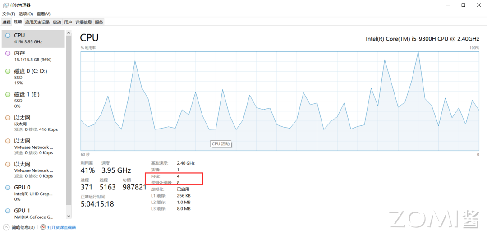

# 算子循环优化(DONE)

在具体硬件执行计算的时候，实际会大量地使用 for 等循环指令不断地去读取不同的数据执行重复的指令（SIMT/SIMD），因此循环优化主要是为了提升数据的局部性或者计算的并行性，从而提升整体算子性能，当然这二者都需要 AI 芯片硬件的支持。

## 循环优化挑战

### 数据局部性

数据的局部性与计算机存储层次有关，计算机有速度由慢到快，容量由大到小的多层次存储器，以最优的控制调度算法和合理的成本，构成存储系统。最上层的寄存器一般在 CPU 芯片内，直接参与运算，它们的速度最快但是价格最高、容量最小。主存存放运行中的程序与数据，但是其速度与 CPU 差距较大，为了匹配它们之间的速度差异，在主存与 CPU 之间插入了一种比主存速度更快、容量更小的高速缓冲存储器即 Cache。主存与 Cache 之间的数据迁移由硬件自动完成，对于程序员来说是透明的、无法直接编程控制的。



在现代多核 CPU 架构中，Cache 也是分为三层即 L1、L2、L3 级 Cache，对计算机运算速度影响最大的是 L3 Cache，因为该级 Cache 的不命中将导致片外访存。L3 Cache 的大小一般在几 MB 至几十 MB 之间，其容量也较小，因此无法把所有的数据都放到 Cache 里，Cache 里应该放 CPU 最有可能会对它进行处理的数据。


在这里有两个著名的程序运行时局部性原理，诠释了什么样的数据很可能会被 CPU 处理：

- 时间局部性：CPU 处理了一个数据以后它很有可能会对它进行第二次处理。

- 空间局部性：CPU 处理了内存中某一块的数据，它很可能会还对它附近的数据块进行读写操作。

这两个局部性原理十分匹配循环的特点，试想一下存在一个两层嵌套循环如下代码：

```C++
for i in range(n):
    for j in range(m):
        A[i] += B[j]
# 这个计算可能并没有什么意义，只是为了举例
```

从时间局部性来看，A[i]的在内层循环（J 循环）完整的结束一次后被重用，每一个 A 中的元素会被重用 m 次；B[j]的在每一次内层循环都改变，在 i 循环时重用，每一个 B 中的元素会被重用 n 次。

从空间局部性来看，A 中的元素在 m 次后切换到下一个元素。而 B 中的元素在每次都会切换到下一个。这两个数组具有不同的模式，A 的时间局部性更明显，B 的空间局部性更明显。

那么为什么要分析数据的局部性呢？因为 Cache 的容量小的特点，一次只能容纳一部分数据，对于 Cache 来说，如果 CPU 要进行读写操作的数据在 Cache 中，则称为命中啊，可以在 Cache 这一级别返回数据，如果不在 Cache 中，则没有命中，需要去下一级存储取数据，增加了 IO 的开销。

### 计算并行性

现代 CPU 通常是多核结构，可以进行线程级并行。在单核 CPU 上运行多任务时，通常是模拟进行的并行，通过进程调度算法如时间片轮转算法来同时进行多任务，实际上 CPU 在一个时刻只进行了一个任务。

在多核 CPU 上，每一个核都可以进行计算，搭配超线程技术（Intel CPU）时，一个核可以执行两个线程。通过将多个计算线程分配到多个核，可以同时执行多线程计算实现并行加速，这是 CPU 上最有效的优化方式。

在 window 可以通过任务管理器查看内核与逻辑处理器数量。逻辑处理器就是用超线程技术模拟的，能让处理器在同一时间段内同时处理多个线程，从而实现更好的多任务处理能力。


向量化是一种数据级并行优化。向量化即“批量操作”，在计算机中常见执行模型是单指令多数据（SIMD，Single Instruction Multiple Data）。通过对批量数据同时进行相同计算以提高效率。向量体系结构获取在存储器中散布的数据集，将多个数据元素放在大型的顺序寄存器堆即向量寄存器中，对整个寄存器进行操作从而同时计算了多个数据元素。向量本身可以容纳不同大小数据，因此如果一个向量寄存器可以容纳 64 个 64 bit 元素，那么也可以容纳 128 个 32 bit 元素或者 512 个 8 bit 元素。凭借这种硬件上的多样性，向量化特别适合用于多媒体应用和科学计算。

传统的执行方式为单指令单数据（SISD，Single Instruction Single Data），硬件不支持并行计算。现代 CPU 几乎都支持 SIMD 指令集，如 Intel 的 SSE（Streaming SIMD Extensions）和 AVX（Advanced Vector Extensions）系列指令集。


## 循环优化

循环的优化方案针对不同的数据局部性和计算并行性，有不同的优化方案，如循环分块、循环展开、循环重排、循环融合、循环拆分等。下面重点接受不同的循环优化方案细节。

### 循环分块

循环分块是利用 Cache 的数据局部性进行优化的一种方法。现代 CPU 通常具有多级 Cache，在存储体系中，Cache 是除 CPU 寄存器外最接近 CPU 的存储层次，相比主存速度更快，但是容量更小。Cache 中复制有 CPU 频繁使用的数据以进行快速访问。由于 Cache 的容量有限，数据会在 Cache 中进行换入换出。当访问的数据在 Cache 中没有时，产生 Cache miss，会向低一级存储层次发出访问请求，然后该数据存储进 Cache，这时访问数据的时间就大大提高。当访问数据就在 Cache 中时，会直接使用该数据以进行复用。

循环分块主要针对大型数据集进行优化，大数据集无法一次全部存入 Cache 中。当遍历该数据集时，循环按照顺序进行访问，会替换掉之前加载进 Cache 的数据，导致后面的指令对之前的数据无法复用，要重新加载数据，产生大量的 Cache miss，数据的复用性很差。程序执行时间变长，大量时间花费在载入数据上。

循环分块将大数据集分成多个小块以充分进行数据复用。数据块的内存访问是一个具有高内存局部性的小邻域。该数据块可以一次加载进 Cache，执行完所有或者尽可能多的计算任务后才被替换出。

在实现中将一层内层循环分成 outer loop * inner loop。然后把 outer loop 移到更外层去，从而确保 inner loop 一定能满足 Cache。

原始的数据存储访问模式和分块后的存储访问模式见下图：


以这个代码为例，分析其 Cache 利用率：

```C++
for i in range(n):
    for j in range(m):
        A[i] += B[j]
```

假设 m 和 n 是很大的数（大数组），所以对于每一轮 I 循环，等到 B[m-1]被访问时，B[1]、B[2]等已经被清出缓存了。假设每个 Cache line 可以容纳 b 个数组元素，以全相联的方式管理，则 A 的 Cache miss 是 n/b，B 的 Cache miss 是 n\*m/b。

如果把 j 层循环进行 tile，分为 j_o 和 j_i 两层循环，并把 j_o 提到最外面，循环就变成了：

```C++
for j_o in range(0, m, T):
    for i in range(n):
        for j_i in range(j_o, min(j_o + T, m)):
            A[i] += B[j_i]
```

当 T 个 B 中的元素可以放进 Cache 中时，在 i 层循环即使 i 切换了，但是 B 此时数据还在 Cache 中，只有 j_o 循环变换时，B 中的数据才会发生 Cache miss，对于 B 来说 Cache miss 为 m/T \* T/b = m/b。但是对于 A 来说，Cache miss 变为了 m/T \* n/b = nm / Tb，反而增加了。那么再对 i 层循环进行 tile，最终变为了:

```C++
for i_o in range(0, n, W):
    for j_o in range(0, m, T):
        for i_i in range(i_o, min(i_o + W, n)):
            for j_i in range(j_o, min(j_o + T, m)):
                A[i_i] += B[j_i]
```

假设 W 个 A 中的元素也能一次性放入 Cache。B 的 Cache miss 没变，A 的 Cache miss 变为 n/W  \* W/b = n/b。

从公式上推导，似乎只要 T 和 W 满足了能放进 Cache 的数量，那么 Cache miss 与 T、W 就无关，不同 T、W 的性能应该是一样的，但实际运行并不是这样的。tile 大小的选择受到 Cache line 大小、Cache 关联度、数据替换策略、硬件存储架构等多个因素的共同影响，分块过大时数据尚未充分利用 Cache 的重用就被替换出去从而导致 miss，而分块过小又会造成较大的成本开销从而掩盖带来的性能优势。tile 大小的选择目前还没有一个确定的算法，目前流行的方法有基于分析的方法、基于经验搜索的算法[^1]等。

- 基于分析的方法：早期有研究者对嵌套循环和硬件存储特征进行静态分析，为编译器选择合适的分块大小。这类方法主要用来解决容量失效、自干扰失效、交叉干扰失效导致的 Cache 不命中和局部性优化问题。这类方法在实际使用时存在一定缺陷：1）理论分析不能完全反应实际存储的复杂过程，影响程序分块性能的因素很多，导致实际最优分块的性能和分析方法选择的分块性能差距较大；2）分析建模过程复杂，成本较高，对硬件和程序布局依赖严重，不具有通用性。

- 基于经验搜索的方法：将循环嵌套看做是一个黑盒，根据经验选择一系列不同分块大小的组合，在目标机器上对这些分块组合进行自动调优，并从较好的分块大小组合中选取性能最优的分块大小。这类方法的缺陷是对多层循环进行分块时，要遍历庞大的搜索空间，导致时间成本过高。

### 循环展开

循环展开（Loop Unrolling）将一个循环中的多次迭代展开成多个单独的迭代，以减少程序执行的开销，提高代码的运行效率。在计算机执行程序的流水线中，每次跳转到循环体内部都需要进行额外的指令处理和跳转操作，这会增加程序的开销。而循环展开可以通过减少跳转次数、减少指令处理次数等方式，降低指令分支预测的开销来优化程序性能，提高程序执行的速度。

通常循环展开包含以下几个步骤：

1. 复制循环体 n 次，使展开后循环体包括原来循环体 n 个拷贝。这里的 n 一般被称为展开因子

2. 调整数组索引变量的增量以及内存读写操作的地址

3. 删除除了最后一个循环体外的所有循环体中的循环计数变量的增加操作，并且修改最后一个循环体中循环计数变量的增量为原来的 n 倍

4. 删除除了最后一个循环体外的所有循环中的循环条件判断语句

例如原始循环：

```python
for i in range(m):
    a[i] += b[i]
```

通过循环展开，可以将其转换为以下形式：

```c++
for i in range(0, m-3, 4):
    a[i] += b[i]
    a[i+1] += b[i+1]
    a[i+2] += b[i+2]
    a[i+3] += b[i+3]
for i in range(m-3, m):
    a[i] += b[i]
```

在展开后的循环中，原本执行了 *n* 次循环迭代，变成了执行 *n/4* 次循环展开。

从循环展开的优化有效上分析，循环展开不仅可以减少循环开销，如循环变量测试及分支语句等，还提高了指令之间的并发度，并且因为减少了分支语句从而减少流水线停顿，提升了流水线效率。另外一个分析角度是循环展开后可能会为其他优化提供更多机会。循环展开也有可能会带来负面效果。如果展开后循环体超过指令缓存容量，会引起缓存失效，造成程序性能的下降。并且循环展开会增加寄存器压力，可能导致生成更多的寄存器溢出处理操作，从而降低优化效果。

循环展开最关键的是确定展开因子，目前主要有三种方法[^2]：

1. 启发式方法：对循环体代码进行分析，然后使用静态模型计算展开因子。在分析时需要考虑循环本身减少的循环开销、循环展开与其他优化的交互关系等，建立模型需要充分考虑指令级并行度、流水线效率、数据局部性、指令缓存与寄存器的限制等。

2. 根据循环的特征将循环分类，通过大量样本学习，使用分类器建立循环类型和展开因子之间的映射，在实际优化循环时根据循环类型确定最优展开因子。

3. 迭代编译：使用不同展开因子编译生成多个版本的程序并实际运行，选取运行时间最短的作为最优展开因子。

比较上面三个方法可以看到：启发式方法开销最小，展开因子的选择依赖于静态模型的准确性；机器学习开销次之，展开因子的选择不仅依赖于提取的循环特征，而且还需要大量样本进行训练；迭代编译开销最大，但在不考虑开销的情况下肯定可以找到最优展开因子。

### 循环重排

循环重排序（reorder）是矩阵乘法常见的优化方式，指的是对程序中的循环结构重新排列顺序，以优化数据访问模式，特别是在 CNN 中卷积层的应用。通过改变循环的嵌套顺序或者循环内部的迭代顺序，可以改善数据的局部性，减少缓存失效。如下图循环重排序示意图，在矩阵乘法计算中，B 是逐列访问的，在行优先的存储模式下访问模式很不友好。切换内层的循环顺序可以使得所有元素按顺序读取和写入。一次计算输出的一行，得到的是中间结果，全部累加即可得到结果矩阵的一行最终结果，这种方式利用的是内存的空间局部性。


### 循环融合

循环融合（Loop Fusion）用于将多个循环合并为一个更大的循环，将相邻或紧密间隔的循环融合在一起。通过合并多个循环，可以减少程序中的循环次数，从而减少循环开销。合并循环可以减少内存访问次数，提高数据局部性，减少缓存未命中的可能性，从而提高程序执行效率。

以下是一个简单的循环融合的示例代码：

两个独立的循环如下：

```python
# 独立的循环
for i in range(len(a)):
    a[i] = b[i] + x

for i in range(len(b)):
    d[i] = a[i] + y
```

在第一个循环中，a 的值被依次写入，在第二个循环中又被马上读取，当数组非常大时，在第二个循环时要读取 a[0]时，a[0]早已因为 Cache 容量的限制而被清除，需要从下一级存储中读取。

通过循环融合，可以将这两个循环合并为一个循环：

```python
# 循环融合
for i in range(len(a)):
    a[i] = b[i] + x
    d[i] = a[i] + y
```

这样在第二个对 a 的读取语句执行的时候，a 的元素还在 Cache 中。除了这种数据局部性的收益，循环融合还减少了对于分支跳转指令的生成。循环融合并不总是具有正向收益的，有时反而会降低性能甚至导致错误的结果。

当前后两个循环存在数据依赖关系时，将它们融合可能会导致错误的结果：

```python
# 第一个循环
for i in range(N):
    A[i] = B[i] + C1

# 第二个循环
for i in range(N):
    D[i] = A[i+1] + C2
    
# 循环融合
for i in range(N):
     A[i] = B[i] + C1
     D[i] = A[i+1] + C2
```

将上面的循环融合后，第二个循环本来要读取的 A 改变之后的值，但是现在读取的是改变之前的值，导致错误的结果。当然也可以通过修改源代码的方式进行对齐，然后把公共部分融合，如下：

```python
A[0] = B[0] + C1
for i in range(2, N-1):
    A[i] = B[i] + C1
    D[i-1] = A[i] + C2
D[N-1] = A[N] + C2
```

### 循环拆分

拆分主要是将循环分成多个循环，可以在有条件的循环中使用，分为无条件循环和含条件循环。

```python
for i in range(n):
    A[i] = a[i] + b[i]
    c[i]=2 * a[i]
    if(temp[i] > data):
        d[i] = a[i]
 
#循环拆分
for i in range(n):
    A[i] = a[i] + b[i]
    c[i]=2 * a[i]

for i in range(n):
    if(temp[i] > data):
        d[i] = a[i]
```

通过拆分，将包含控制流的代码独立为一个循环。一部分代码只有计算，可以在加速器上计算，而加速器不支持的控制流部分就可以回退到 CPU 计算。

循环拆分一般可以创造出更多的优化机会，例如和循环融合结合：

```python
# 第一个循环
for i in range(N):
    A[i] = B[i] + C1
    E[i] = K[i] * 2

# 第二个循环
for i in range(N):
    D[i] = A[i+1] + E[i]
```

这两个循环无法直接合并，因为 A 数组在两个循环之间存在依赖关系。但是可以通过对第一个循环进行拆分，把 E 数组的部分拆分出来，再融合进第二个循环中：

```python
# 拆分
for i in range(N):
    A[i] = B[i] + C1
    
# 融合
for i in range(N):
    E[i] = K[i] * 2
    D[i] = A[i+1] + E[i]
```

这样做可以提升数组 E 的局部性，减少 Cache miss。

## 小结与思考

- 因为 Cache 的容量小的特点，一次只能容纳一部分数据，因此需要分析计算的时间局部性和空间局部性。

- 循环的优化方案针对不同的数据局部性和计算并行性，有循环分块、循环展开、循环重排、循环融合、循环拆分等方案。

- 循环优化的目的是提升数据的局部性或计算的并行性，以提高整体算子性能。其挑战包括数据局部性和计算并行性。

## 本节视频

<html>
<iframe src="https://player.bilibili.com/player.html?isOutside=true&aid=776857139&bvid=BV1r14y1w7hG&cid=937441251&p=1&as_wide=1&high_quality=1&danmaku=0&t=30&autoplay=0" width="100%" height="500" scrolling="no" border="0" frameborder="no" framespacing="0" allowfullscreen="true"> </iframe>
</html>
