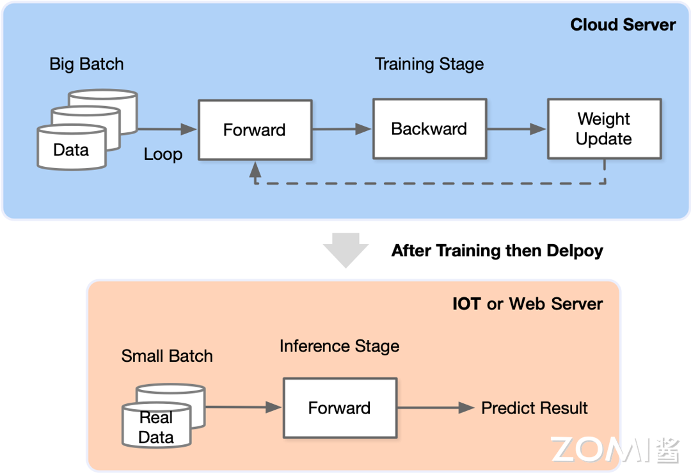

<!--Copyright © 适用于[License](https://github.com/chenzomi12/AISystem)版权许可-->

# 推理系统介绍

推理系统是一个专门用于部署神经网络模型，执行推理预测任务的人工智能系统。它类似于传统的 Web 服务或移动端应用系统，但专注于 AI 模型的部署与运行。通过推理系统，可以将神经网络模型部署到云端或者边缘端，并服务和处理用户的请求。因此，推理系统也需要应对模型部署和服务生命周期中遇到的挑战和问题。

在本节中，将首先概述训练和推理的基本流程，随后深入分析训练阶段与推理阶段之间的差异。接着，将深入探讨推理系统的优化目标以及面临的挑战。最后，通过比较推理系统与推理引擎的流程结构，将进一步揭示两者在设计和实施时需考虑的关键要素。

## AI 生命周期

在日常生活中，深度学习的相关方法已经广泛的部署到各类的应用当中。例如上一节所描述的人脸检测与手势检测应用，它们是通过实时输入摄像头获取的画面，对人脸或人手上的关键点进行检测，然后返回对应关键点位置和类别等相关信息，并通过诸如 OpenCV 等计算机视觉库工具根据返回的关键点位置信息在画面中绘制展示的效果。其中，对于关键点的检测可以通过如 Faster R-CNN、YOLO 等 AI 模型进行输入到输出的映射与转换。

生活中所接触到的应用神经网络模型的应用，其神经网络模型可以部署在数据中心，接受用户的应用程序或者网页服务的请求，也可以部署在边缘侧移动端的 APP 上或者 IoT（Internet of Things, 物联网）设备中实时响应请求。在后面介绍的推理系统的介绍中，以数据中心的服务端推理系统为主，兼顾边缘侧移动端推理的场景，但是这些策略本身大部分是数据中心与边缘侧都适用的。

接下来，先从深度学习训练过程和推理过程对比两者的相同点和不同点，以及在生命周期所处的环节，进而便于理解深度学习推理系统所侧重的目标。


如上图所示，神经网络模型的生命周期（Life Cycle）最核心的主要由数据准备、模型训练推理以及模型部署三个阶段组成。

### 数据准备

首先，在数据的准备阶段中，需要从存储系统或其他数据源收集和准备训练数据用于神经网络模型。其中，对于模型的训练可以采用传统的中心化训练方式，将所有的数据都集中存储在一个中心服务器上，模型在这个中心服务器上进行训练。然而，随着数据量的增加，将所有数据集中存储会导致显著的通信和隐私问题。因此，也可以采用将数据分散存储在不同的地方，同时通过联合学习的方式进行模型训练的去中心化分布式训练。

另外，在原始的训练数据中，由于每一维特征的来源以及度量单位不同，会造成特征值的分布范围差异很大，当计算不同样本之间的欧氏距离时，取值范围大的特征会起到主导作用。因此，对于深度学习的训练可以先对样本进行数据的预处理，将各维度特征归一化到同一取值区间，并且消除不同特征之间的相关性，才能获得理想的结果。

同时，对于训练数据可以对它进行数据增强的操作。在深度学习方法中，海量的训练数据意味着能够使用更深层次的网络结构，从而能够训练出更好的模型。所以，在原始数据上做些改动，即数据增强的操作，就能得到很多其它的数据。以图片数据集举例，可以通过加入随机噪声、将原始图片旋转、截取（crop）原始图片的一部分等操作来进行数据增强。

### 训练与推理

在数据的准备阶段之后，就进入了模型的训练阶段。对于模型的训练阶段如下图的蓝色部分所示，在这个阶段会在云服务器上进行。将准备好的数据通过特定的批量大小进行分组，并以迭代的方式向模型进行模型的训练。

在每一个迭代过程中，输入数据先会通过模型进行前向传播（Forward Propagation），模型会根据当前的参数设置产生出预测结果，并与实际标签进行比较，以计算损失（Loss）。其中，计算损失所用的损失函数（如均方误差、交叉熵等）主要是用于衡量模型的预测结果与真实标签之间的差异。

在计算损失之后，所计算的损失会通过反向传播（Back Propagation）算法从输出层开始，逐层传回神经网络模型网络的每一层。在每一层中，算法会去计算损失相对于该层权重和偏置的梯度，即损失对这些参数的变化率，这些梯度信息指明了如何调整权重和偏置以减小误差。然后就使用优化算法（如梯度下降法、Adam 等）和计算出的梯度信息来更新每一层的权重和偏置（Weight Update）。

网络模型更新的方向是梯度的反方向，目的是减小损失函数的值，从而提高模型的预测准确性。需要注意的是，反向传播算法的核心在于利用链式法则去计算梯度，并通过优化算法调整权重和偏置。这个过程需要计算大量的梯度和进行参数更新，因此在实际应用中，通常会使用高效的计算库和 AI 框架（如 PyTorch 等）来加速训练过程。

上述的迭代过程均会进行前向传播、反向传播、参数更新的步骤，直到满足某种停止条件（如达到预设的迭代次数 $k$、准确度超过某个阈值 $m$ 等），在这个过程中，模型的预测准确率会逐渐提高，损失函数的值会逐渐减小。

而在训练停止之后，整个模型的权重和偏置等参数已经被确定下来，也即得到一个固定化的网络模型，可以将其用于后续的数据预测或推理任务。



在完成了训练阶段后，就可以得到固定网络模型参数的权重参数，并通过离线和在线优化（例如压缩、量化等），内核编译（例如内核调优与代码生成）等技术将该模型加载部署在推理系统中。

对于模型的推理阶段如上图的红色部分所示，可以将整个的模型部署在 Web 服务器上或者是 IoT 设备上，通过对外暴露接口（例如，Http 或 gRPC 等），接收用户请求或系统调用，模型通过推理处理完请求后，返回给用户相应的响应结果，完成推理任务。

与训练阶段类似，在推理阶段中需要输入小批量真实世界的数据样本，执行前向传播过程通过神经网络模型后，得到计算输出的预测结果。其中，这个过程不涉及反向传播，也就不需要计算梯度来更新模型的权重。

另外值得注意的是，虽然推理（Inference）阶段与深度学习中的测试（Testing）阶段都通过将输入数据送入模型中，经过前向传播得到输出预测结果。但是，推理通常指的是在训练完成后，将模型应用于新的数据集或实际场景中，并生成预测输出，推理的目的是利用训练好的模型来对未知数据进行预测或分类。

同时，因为推理过程通常是在生产环境中执行的，因此性能和效率至关重要。因此，需要优化模型的计算速度和内存占用，以便实时或高吞吐量地处理输入数据。而测试则是评估模型性能的过程，通常包括在一组已知的测试数据上运行训练好的模型，并评估其在测试数据上的表现，以了解模型的准确性、精确度、召回率等性能指标。测试的目的是验证模型是否能够在真实场景下有效地工作，检查模型在未知数据上的泛化能力。

### 模型部署

推理系统一般可以部署在云或者边缘。云端部署的推理系统更像传统 Web 服务，在边缘侧部署的模型更像手机应用和 IOT 应用系统。两者有以下特点：

- 云（Cloud）端：云端有更大的算力，内存，且电更加充足满足模型的功耗需求，同时与训练平台连接更加紧密，更容易使用最新版本模型，同时安全和隐私更容易保证。相比边缘侧可以达到更高的推理吞吐量。但是用户的请求需要经过网络传输到数据中心并进行返回，同时使用的是服务提供商的软硬件资源。

- 边缘（Edge）端：边缘侧设备资源更紧张（例如，手机和 IOT 设备），且功耗受电池约束，需要更加在意资源的使用和执行的效率。用户的响应只需要在自身设备完成，且不需消耗服务提供商的资源。

在训练阶段与推理阶段之间需要通过部署的方式将训练好的模型加载到 Web 服务器或 IoT 设备上，对于推理系统中的部署涉及以下多个步骤，确保训练好的模型能够有效地应用于实际场景。

首先，通过剪枝（减少不必要的参数和连接）、量化（减少数值精度以减小模型大小和计算量）以及蒸馏（利用更小的模型传递主模型的知识）等技术对模型进行优化和压缩，用于提高部署阶段的效率和性能。

其次，根据具体需求和平台限制，选择适合的推理引擎。常用的推理引擎如 TensorRT、OpenVINO、ONNX Runtime 等针对不同硬件设备进行优化，提供高效的模型推理能力。有时需要将模型从训练框架转换为推理引擎支持的格式。

> 例如，常见的转换方案包括将 PyTorch 模型转换为 ONNX 格式，然后再转换为特定推理引擎的格式。将优化后的模型集成到目标环境中，并与其他系统或应用程序进行集成。

然后，在部署中可能涉及创建 API 接口、配置服务器、设置数据传输和存储等。在部署后，持续监控模型的性能，并根据需要进行优化。这可能包括调整模型参数、更新推理引擎版本、优化硬件资源分配等。值得注意的是，不同的推理引擎和硬件平台可能具有不同的特性和优化方法，因此在实际部署过程中需要根据具体情况进行调整和优化。

## 推理场景的重点

训练任务通常在数据中心的异构集群管理系统中进行，这些任务类似于传统的批处理任务，需要数小时乃至数天才能完成。训练任务一般要配置较大的批量尺寸追求较大的吞吐量的中心服务器，将模型训练达到指定的准确度或错误率。

而在推理任务方面，以 HMS Core 为例，它采用 MindSpore 作为推理引擎。由于 HMS Core 需要为全球用户提供服务，因此它必须保持 $7 \times 24$ 小时不间断运行，类似于传统的在线服务模式。

此外，由于每天的调用量超过亿次，且需要快速响应每个服务请求，这对参与推理任务的模型提出了极高的要求。这些模型必须具备高效、稳定且准确的推理能力，以确保用户体验和数据处理的实时性。

在深度学习中，推理任务相较于训练任务确实具有一系列独特的新特点与挑战。具体来说，这些特点和挑战包括：

1. 长期运行服务需求

    神经网络模型在推理阶段通常被部署为长期运行的服务，如互联网服务。这类服务对请求的响应有严格的低延迟（Low Latency）和高吞吐（High Throughput）要求。例如，为了保障用户体验，互联网服务通常需要在极短的时间内响应用户请求，并同时处理大量的用户请求。

2. 推理资源约束更为苛刻

    与训练阶段相比，推理阶段通常面临更为严格的资源约束，如更小的内存、更低的功耗等。这是因为推理任务通常需要在各种设备上运行，如手机、嵌入式设备等，这些设备的资源远小于数据中心的商用服务器。

3. 不需要反向传播和梯度下降

    在推理阶段，模型不再需要反向传播和梯度下降来进行参数更新。因此，为了提升推理速度和效率，可以采取一些牺牲数据精度的策略，如量化、稀疏性等。这些策略可以在一定程度上换取推理性能的提升。

4. 部署设备型号多样性

    由于神经网络模型需要在各种设备上进行推理，但是这些设备的型号和配置可能各不相同，为了在各种设备上实现高效的推理，因此需要进行多样化的定制和优化。例如，在服务器端，可以通过 Docker 等容器化技术解决环境问题；而在移动端和 IoT 设备端，由于平台、操作系统、芯片和上层软件栈的多样性，需要更为复杂的工具和系统来支持编译和适配。

具体可以看上图（深度学习中模型的训练与推理），深度学习训练与推理相比。在训练阶段中，通常需要大量的输入数据，并且倾向于使用更大的批量大小（Batch Size）来训练神经网络模型。更大的批量大小有助于提升训练过程的稳定性和效率，尤其是在使用梯度下降等优化算法时，能够更准确地估计梯度，加速模型的收敛。

然而，在推理阶段中，数据经过训练好的网络模型用于发现和预测新输入中的信息。在这个阶段，这些输入数据通过更小的批量大小输入网络，且由于有延迟的约束，大的批量大小需要所有批量内样本都处理完才能响应，容易造成延迟超出约束（例如，每个用户请求要求 100ms 内进行响应）。

对于推理阶段，性能目标与训练阶段有所不同。为了最大限度地减少网络的端到端响应时间（End to End Response Time），推理通常比训练批量输入更少的输入样本，也就是更小的批量大小，因为依赖推理工作的服务（例如，基于云的图像处理管道）需要尽可能的更快响应，因此用户不需要让系统累积样本形成更大的批量大小，从而避免了等待几秒钟的响应时间。在推理阶段，低延迟是更为关键的性能指标，而高吞吐量虽然在训练期间是重要的，但在推理时则相对次要。

接下来，可以通过以下使用 Pytorch 实现的 ResNet50 模型在 TensorRT 的推理过程实例来了解模型推理的常见步骤。

```python
import torch
import torchvision.models as models
import tensorrt as trt
import numpy as np
import pycuda.driver as cuda
import pycuda.autoinit

# 步骤 1：加载 PyTorch 模型并转换为 ONNX 格式
model = models.resnet50(pretrained=True) # 加载预训练的 ResNet50 模型
model.eval()
dummy_input = torch.randn(1, 3, 224, 224) # 创建一个示例输入
torch.onnx.export(model, dummy_input, "resnet50.onnx", opset_version=11) # 将模型导出为 ONNX 格式

# 步骤 2：使用 TensorRT 将 ONNX 模型转换为 TensorRT 引擎
TRT_LOGGER = trt.Logger(trt.Logger.WARNING) # 创建一个 Logger
EXPLICIT_BATCH = 1 << int(trt.NetworkDefinitionCreationFlag.EXPLICIT_BATCH) # 如果是动态输入，需要显式指定 EXPLICIT_BATCH
with trt.Builder(TRT_LOGGER) as builder, builder.create_network(EXPLICIT_BATCH) as network, trt.OnnxParser(network, TRT_LOGGER) as parser:
    # 创建一个 Builder 和 Network
    # builder 创建计算图 INetworkDefinition
    builder.max_workspace_size = 1 << 30  # 1GB ICudaEngine 执行时 GPU 最大需要的空间
    builder.max_batch_size = 1 # 执行时最大可以使用的 batchsize

    with open("resnet50.onnx", "rb") as model_file:
        parser.parse(model_file.read())  # 解析 ONNX 文件

    engine = builder.build_cuda_engine(network)  # 构建 TensorRT 引擎

    with open("resnet50.trt", "wb") as f:
        # 将引擎保存到文件
        f.write(engine.serialize())

# 步骤 3：使用 TensorRT 引擎进行推理
def load_engine(engine_file_path):
    # 加载 TensorRT 引擎
    with open(engine_file_path, "rb") as f, trt.Runtime(TRT_LOGGER) as runtime:
        return runtime.deserialize_cuda_engine(f.read())

engine = load_engine("resnet50.trt")
context = engine.create_execution_context() # 将引擎应用到不同的 GPU 上配置执行环境

# 准备输入和输出缓冲区
input_shape = (1, 3, 224, 224)
output_shape = (1, 1000)
input_size = trt.volume(input_shape) * trt.float32.itemsize
output_size = trt.volume(output_shape) * trt.float32.itemsize
d_input = cuda.mem_alloc(input_size)
d_output = cuda.mem_alloc(output_size)
stream = cuda.Stream() # 创建流
input_data = np.random.random(input_shape).astype(np.float32)# 创建输入数据
cuda.memcpy_htod_async(d_input, input_data, stream) # 复制输入数据到 GPU

# 推理
context.execute_async_v2(bindings=[int(d_input), int(d_output)], stream_handle=stream.handle)
# 从 GPU 复制输出数据
output_data = np.empty(output_shape, dtype=np.float32)
cuda.memcpy_dtoh_async(output_data, d_output, stream) # 获取推理结果，并将结果拷贝到主存
stream.synchronize() # 同步流
print("Predicted output:", output_data)

```

类似其他的推理系统，它们通常也遵循类似的步骤和架构原则。确实，在许多场景中，尤其是在需要高吞吐量或低延迟的应用中，直接使用 CPU 进行推理可以避免数据在主存与设备内存（如 GPU 内存）之间的拷贝开销。此外，操作系统对 CPU 上的任务提供了更成熟的隔离与任务调度管理支持，这有助于确保推理任务的稳定性和效率。

通过上面的代码实例，可以对推理系统的主干流程有一个基本的了解。当模型被部署之后，可以通过以下图示来观察常见推理系统的模块、与推理系统交互的系统以及推理任务的流水线。


从上图的推理服务系统架构图中，可以清晰地看到推理服务系统的流程。首先，经过训练后的模型会被保存在文件系统中。随着训练效果的不断优化，可能会产生多个版本的模型，这些模型将按照既定的版本管理规则被妥善存储于文件系统中。

随后，这些模型将通过服务系统部署并上线。在上线过程中，推理系统会首先将模型加载至内存中，并对其进行版本管理，确保支持新版本的快速上线和旧版本的便捷回滚。同时，该系统还会对输入数据进行批量大小的动态优化，以适应不同的处理需求。此外，推理系统提供了多样化的服务接口（如 HTTP、gRPC 等），以便客户端轻松调用。

用户可以通过这些接口不断向推理服务系统发起请求，并接收相应的响应。除了直接面向用户提供服务外，推理系统还可以作为一个微服务，被数据中心中的其他微服务所调用，从而在整个请求处理流程中发挥其特定的功能与职责。

当然，推理系统并非仅仅局限于以数据中心作为其核心服务方式，它同样需要充分适应并服务于边缘移动设备的场景。谈及整个推理服务的策略，不仅要考虑到数据中心的高效推理能力，还要兼顾边缘设备的推理需求。因此，推理系统是一个相当复杂的系统工程，其复杂性体现在它要综合考量多个方面的因素。

## 优化目标和约束

针对在线推荐系统的服务需求，以某在线短视频 APP 公司为例，深入探讨了应用场景对推理系统提出的具体要求。

该公司计划引入内容个性化推荐服务，并期望该服务满足以下几个方面的需求：首先是低延迟，即在互联网上响应请求的延迟通常应小于 100 毫秒，为用户带来流畅的观看体验；其次是高吞吐，因为突发事件可能引发用户量的急剧增加，因此系统需要具备迅速而有效地处理大量请求的能力；再者，系统需具备良好的扩展性，以适应不断扩大的用户群体；最后是准确度，系统需要实时捕捉视频内容和用户兴趣变化之间的关系，持续提供精准且个性化的推荐服务。


根据上图示的 AI 框架、推理系统与硬件之间的关系，可以看到，除了应对应用场景的多样化需求，推理系统还需克服由不同训练框架和推理硬件所带来的部署环境多样性挑战，这些挑战不仅增加了部署优化和维护的难度，而且易于出错。

在框架方面，各种框架通常是为训练而设计和优化的，因此需要考虑诸如批量大小、批处理作业对延迟的不敏感性、分布式训练的支持以及更高数据精度的需求等因素。开发人员需要将各种必要的软件组件拼凑在一起，以确保兼容数据读取、客户端请求、模型推理等多个阶段的处理。此外，还需要跨越多个不断发展的框架集成和推理需求，包括对 PyTorch 等框架以及不同框架版本的支持。

在硬件方面，需要支持多种部署硬件，考虑到移动端部署场景和相关约束的多样性（例如自动驾驶、智能家居等），这带来了各种空间限制和功耗约束。与此同时，大量专有场景的芯片厂也催生了多样化的芯片体系结构和软件栈。

### 优化目标

综上所述，可以总结设计推理系统的主要优化目标，主要有以下六点，可以通过下表简单了解这些目标的原因以及相关的策略。

| 优化目标 | 原因                                     | 相关策略                                                     |
| :---: | ---- | ------ |
|  灵活性  | 支持多种框架，适应不同应用场景           | 使用模型转换工具，如 ONNX；支持多种语言接口和逻辑应用         |
|  延迟  | 减少用户查询后的等待时间                 | 模型压缩、剪枝、量化；优化数据预处理和后处理；分布式系统设计；预测性模型加载和初始化 |
| 吞吐量 | 应对大量服务请求，确保服务及时性和高效性 | 多线程、多进程、分布式计算；服务网格；异步处理和消息队列；内存数据库和缓存 |
|  高效率  | 降低推理服务成本，提升系统性能           | DVFS、低功耗模式；高效算法；智能调度算法                     |
| 扩展性 | 应对不断增长的用户或设备需求             | Kubernetes 部署平台；云计算资源弹性扩展；负载均衡器 |
|  可靠性  | 保证推理服务稳定性和满足 SLA 要求          | 多服务副本和跨地域部署；故障转移机制；限流和降级策略；健康检查；数据一致性和准确性保障 |

#### 灵活性（Flexibility）

首先是灵活性，这包括支持多种框架，为构建不同应用提供灵活性，以扩大神经网络模型部署的覆盖场景，增强部署的生产力。需要考虑到 AI 框架的不断更新，特别是针对训练优化的迭代，而某些框架甚至不支持在线推理，系统需要具备足够的兼容性。

为了支持多种框架，可以利用模型转换工具，将不同框架的模型转换为一种通用的中间表示。ONNX（Open Neural Network Exchange）是一个广泛采用的中间表示格式，它允许开发者在不同 AI 框架之间转换和部署模型。

此外，系统还应能与不同语言接口和逻辑的应用结合，例如在 Web 服务器或 IoT 设备上部署时，需采用相应的 API 接口和特定的操作处理。

具体实现上，可以采用容器技术（如 Docker）和微服务架构，将神经网络模型和推理服务打包成独立的容器，这样不仅便于跨平台和环境部署，也有助于实现与不同语言接口和逻辑的应用的集成。同时，为了与 Web 服务器或 IoT 设备集成，可以使用 API 网关和 RESTful 接口来提供标准的 HTTP 请求和响应，这样开发者就能在不同设备上轻松地调用和集成推理服务。

#### 延迟（Latency）

其次，低延迟是推理系统的重要考量指标，它直接影响用户查询后获取推理结果的等待时间。推理服务通常位于关键路径上，因此预测必须快速并满足有限的尾部延迟(Tail Latency)，实现次秒级别（Sub-second）的延迟，以满足服务等级协议（SLA），从而提供更优质的用户体验并增强商业竞争力。

在实际操作中，会运用模型压缩、剪枝、量化等技术降低模型的复杂度和大小，从而减少推理时间。这些技术能有效减少模型所需的计算资源，提升推理速度。此外，还会对数据预处理和后处理步骤进行优化，以降低整个推理管道的延迟。例如，采用更快速的编解码器和图像处理库等方法。同时，分布式系统设计，如负载均衡、数据局部性优化等策略，也能有效提升系统整体性能和降低延迟。进一步地，通过分析用户行为模式，可以预测性地加载和初始化模型，从而减少用户请求时的延迟。最后，实施 SLA 监控和告警系统，可以实时监测系统的性能和延迟，确保系统达到预定的性能目标。

#### 吞吐量（Throughputs）

再者，高吞吐量是确保系统能应对大量服务请求的关键。通过提升吞吐量，系统可以服务更多的请求和用户，确保服务的及时性和高效性。

在实际操作中，可以采取多种策略来提升系统的吞吐量。首先，利用多线程、多进程或分布式计算技术，系统可以并行处理多个推理请求，显著提高处理能力。其次，服务网格（如 Istio、Linkerd）和分布式系统设计能够有效管理和优化服务间的通信，进一步提升系统整体的吞吐量。此外，采用异步处理和消息队列技术可以解耦系统的不同组件，避免因等待某些操作完成而造成系统阻塞，从而提高吞吐量。使用内存数据库和缓存机制可以加快数据读写速度，减少数据访问延迟，进一步提升系统性能。同时，通过减少数据在网络中的传输次数和距离，以及使用高效的数据序列化格式（如 Protocol Buffers）和压缩技术，可以降低网络延迟，提高吞吐量。

#### 高效率（Efficiency）

同时，高效率是降低推理服务成本、提升系统性能的核心。系统应实现高效执行，低功耗使用 GPU 和 CPU，通过降本增效来优化推理服务的整体成本效益。

为了实现这一目标，可以采用动态电压与频率调整（DVFS）、低功耗模式等技术，根据实时计算需求动态调整硬件功耗。此外，研究和开发更高效的算法也是提升效率的重要途径，这些算法能够在保持或提升模型精度的同时减少计算需求。通过智能调度算法优化资源分配，从而进一步提高系统的整体效率。

#### 扩展性（Scalability）

然后，可扩展性是应对不断增长的用户或设备需求的基础。系统需要能够灵活扩展，以应对突发和持续增长的用户请求。通过自动部署更多解决方案，随着请求负载的增加，系统能够提升推理吞吐量，提供更高的推理吞吐和可靠性。

借助底层 Kubernetes 部署平台，用户可以便捷地配置和自动部署多个推理服务副本，并通过前端负载均衡服务达到高扩展性和提升吞吐量，进一步增强推理服务的可靠性。另外，云计算平台如 AWS、Azure、谷歌 Cloud 等提供了弹性的计算、存储和网络服务，这些服务可以根据需求快速扩展资源。使用负载均衡器（如 Ingress 控制器）可以分发进入网络的流量，确保请求均匀分配到不同的服务实例上，从而提高系统的吞吐量和可靠性。通过这些策略，系统能够在用户或设备需求不断增长的情况下保持高性能和稳定性，确保推理服务能够满足不断变化的市场需求。

#### 可靠性（Reliability）

最后，可靠性是保障推理服务持续运行和用户体验的关键。系统需要具备对不一致数据、软件故障、用户配置错误以及底层执行环境故障等造成中断的弹性（Resilient）应对能力，以确保推理服务的稳定性和服务等级协议的达标。

为了实现高可靠性，可以部署多个服务副本，并在多个数据中心或云区域进行跨地域部署，这样即使某些组件出现故障，系统也能持续运行。在设计系统时，应考虑故障转移机制，如采用主备或多活架构，确保在发生故障时能够迅速切换到备用系统。面对高负载或潜在的故障情况，系统应通过限流和降级策略来保护自身，防止因过载而导致的系统崩溃。使用健康检查机制（如 Kubernetes 的 Liveness 和 Readiness 探针）来监控应用的健康状态，并在检测到问题时自动重启或替换有问题的容器或服务。为了确保数据的一致性和准确性，可以采用分布式事务、数据校验和去重等技术。同时，使用 Prometheus、Grafana 等监控工具，并结合告警规则，可以在潜在问题发生时及时通知相关人员，以便快速响应和解决问题。通过这些措施，可以大大增强系统的可靠性，确保推理服务能够稳定运行，为用户提供持续不间断的服务体验。

### 设计约束

在设计推理系统时，除了之前提到的优化目标外，还需考虑满足更多的约束。首先在延迟方面，交互式应用程序对低延迟的要求与训练阶段 AI 框架的设计目标并不完全一致。另外，简单模型虽然速度快，但复杂模型通常更为准确，其浮点运算量也相应增大。为了满足指定时间内返回请求的要求，需要将模型返回请求的延迟控制在次秒级别。

然而，这种次秒级别延迟的约束也会影响到批量大小的选择，同时模型融合等复杂操作可能导致长尾延迟的产生，进一步增加了实时响应的挑战。

其次，资源约束是推理系统必须面对的现实问题。设备端功耗约束尤为显著，特别是在物联网（IoT）设备中，如手机、汽车等，由于通常采用电池供电，电池电量有限，无法承受计算量过大导致的过高能耗。同时，设备与服务端在内存资源上也存在显著差异，移动端设备的内存普遍小于服务端服务器。在云端部署应用时，还需考虑资源预算约束，因为云端资源通常按使用时长和消耗量计费，企业通常会有明确的预算限制。

最后，准确度也是推理系统必须考虑的关键因素。虽然使用近似模型可能会产生一定的误差，但在某些场景下，这些误差是可以接受的。通过模型压缩、量化、低精度推理等手段，可以在一定程度上实现推理加速，以精度换取速度。这种权衡使得推理系统能够在满足实时性和资源约束的同时，保持足够的准确性。

## 推理系统 vs 推理引擎

下面主要介绍推理系统与推理引擎的区别，从而更好地理解后续章节重点介绍的推理引擎的核心技术点。

### 推理系统

如下图的推理系统组件与架构图所示，推理系统中常常涉及相应模块并完成相应功能，将在后面章节中逐步展开。通过下图可以看到推理系统的全貌：


推理系统的构建涉及到多个核心环节，以确保请求与响应的高效处理、资源的高效调度、推理引擎的灵活适配、模型版本的有效管理、服务的健康监控以及边缘推理芯片与代码编译的优化。

推理系统在处理请求与响应时，首要任务是高效地序列化和反序列化数据，确保后端能够迅速执行并满足严格的响应延迟标准。与传统 Web 服务不同，推理系统经常需要处理图像、文本、音频等非结构化数据，这些数据的单请求或响应量通常更大。因此，推理系统需要采用高效的传输、序列化、压缩与解压缩机制，以确保数据传输的效率和性能，进而实现低延迟、高吞吐的服务。

在请求调度方面，系统可以根据后端资源的实时利用率，动态调整批处理大小、模型资源分配，从而提高资源利用率和吞吐量。当使用加速器进行推理加速时，还需考虑主存与加速器内存之间的数据传输，通过调度或预取策略，在计算的间隙中准备好数据，确保推理过程的连续性和高效性。

推理引擎是系统的核心组件，它负责将请求映射到相应的模型作为输入，并在运行时调度神经网络模型的内核进行多阶段处理。当系统部署在异构硬件或多样化的环境中时，推理引擎还可以利用编译器进行代码生成与内核算子优化，使模型能够自动转换为特定平台的高效可执行机器码，进一步提升推理性能。

在模型版本管理方面，随着云端算法工程师不断验证和开发新版本模型，系统需要有一套完善的协议来确保版本更新与回滚的顺利进行。定期或满足一定条件的新模型会被上线替换旧模型，以提升推理服务的效果。然而，由于某些指标只能在线上测试，如果新模型效果不理想，系统还需支持回滚机制，确保模型能够迅速回退到稳定的旧版本。

健康监控是保障云端服务稳定性的重要环节。通过可观测的日志和监控工具，服务端工程师可以实时监控服务的运行状态，及时发现并修复潜在问题，确保服务的稳定性和 SLA 达标。例如，当响应速度变慢时，运维工程师可以通过可观测的日志迅速定位瓶颈环节，并采取相应的策略进行优化，防止服务突发性无法响应。

在边缘端等场景中，推理系统还需要面对更多样化的硬件、驱动和开发库。为了确保模型能够在这些设备上高效运行，需要通过编译器进行代码生成和性能优化，使模型能够跨设备高效执行。

### 推理引擎

推理引擎本身可视为一种基础软件，它提供了一组丰富的 API，使得开发者能够在多种特定平台（如 CPU、GPU 和 VPU）上高效执行推理任务。以英特尔的 OpenVINO 为例，推理引擎被定义为一系列 C++库，这些库提供了通用的 API 接口，能够在用户选择的平台上提供强大的推理解决方案。

通过推理引擎的 API，开发者可以轻松读取模型的中间表示（IR）、设置输入输出的数据格式，并在指定的设备上执行模型推理。虽然 C++库是主要的实现方式，但为了方便不同开发者的使用，也提供了 C 库和 Python bindings（即通过 Python 直接调用 C/C++库）。


上图展示的是推理引擎的架构图。展示了整个推理引擎的流程结构与相关的算法，整个框架从上到下可以分为四个主要部分：API 接口输入、模型压缩与优化、Runtime 优化和 Kernel 优化。

首先是 API 接口部分，这部分负责为不同编程语言（如 Python、GO、C++、JS）提供统一的接口，使得开发者能够方便地与推理引擎进行交互。这部分的功能是推理引擎与外部环境沟通的桥梁，使得各种应用程序能够无缝地集成和使用推理引擎的功能。

接下来是模型压缩与优化部分，这个部分主要负责优化模型的大小和性能，以便在实际应用中更加高效地使用。在其中，包含技术包括模型格式转换、模型压缩、端侧学习、图优化等，它们能够减少模型的存储需求、加快推理速度，并提高模型的泛化能力，其中的内容将会在后续的章节中展开介绍。

IR（中间表示）作为模型的标准化呈现，它在确保模型能在不同硬件和软件平台上顺畅且高效运行方面发挥着核心作用。每个具体的模型都拥有其独特的 Schema，这些 Schema 在经历必要的处理后，方能与后续的 Runtime 调度服务无缝对接，从而确保模型在各类环境中都能实现高效且稳定的运行。

在 Runtime（Compute Engine）的核心环节中，作为运行时环境或计算引擎，它专注于高效地调度和执行模型的计算任务。在这个过程中，采用了诸如动态 Batch、异构执行和大小核调度等先进技术。动态 Batch 能够灵活适应实际需求，调整批量大小，从而优化资源利用率；异构执行支持在多类型硬件上并行计算，显著提升运算效率；大小核调度则确保在具有不同性能的核心上合理分配任务，实现整体性能的最大化。这些技术的融合应用，确保了模型在运行过程中的高效与稳定。在 Runtime 阶段，始终致力于探索如何进一步加快模型的调度和执行速度，以提供更优质的计算服务。

Kernel（Hardware Level Optimize）部分是整个流程的关键环节，它负责实际执行通过 Runtime 调度过来的模型。该部分专注于硬件级别的深度优化，利用诸如 NEON、CUDA、Vulkan 等高性能计算库，旨在显著提升推理速度。这些库针对不同硬件平台提供了精细优化后的算法和数据结构，从而最大限度地发挥硬件的性能潜力。在此环节，特别关注如何进一步提高算子的执行效率，确保整体推理性能达到最佳状态。

## 小节与思考

- AI 生命周期流程，包括、数据准备、模型训练、推理以及模型部署这几个组成部分；

- 推理系统是指整个 AI 模型部署和推理预测任务的执行环境；

- 推理引擎是这个系统中的核心组件，负责执行具体的模型推理任务。

## 本节视频

<html>
<iframe src="https://player.bilibili.com/player.html?isOutside=true&aid=650120453&bvid=BV1nY4y1f7G5&cid=957583131&p=1&as_wide=1&high_quality=1&danmaku=0&t=30&autoplay=0" width="100%" height="500" scrolling="no" border="0" frameborder="no" framespacing="0" allowfullscreen="true"> </iframe>
</html>
