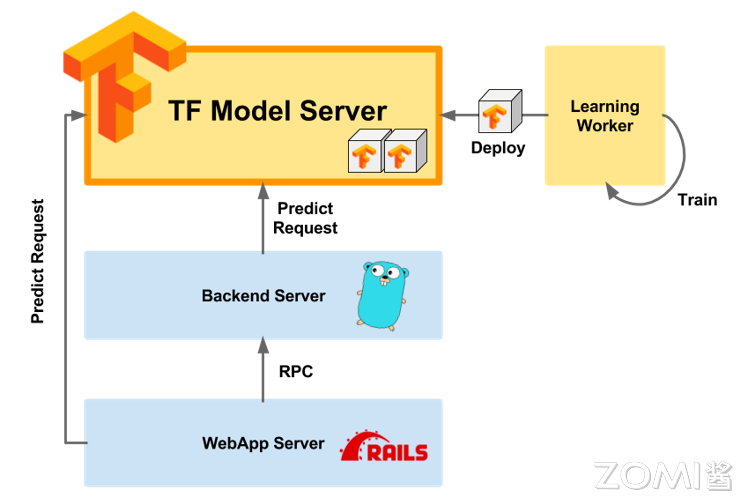
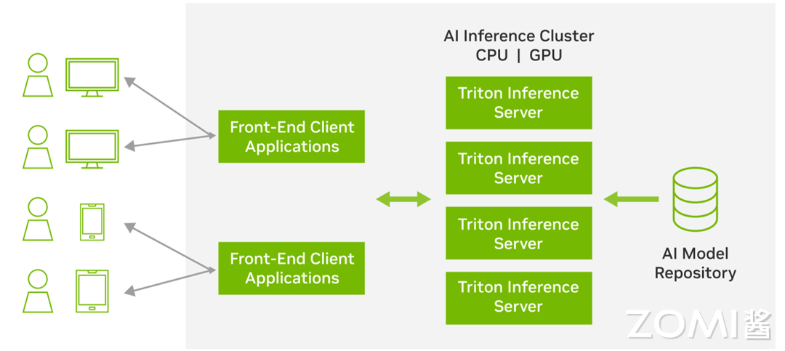
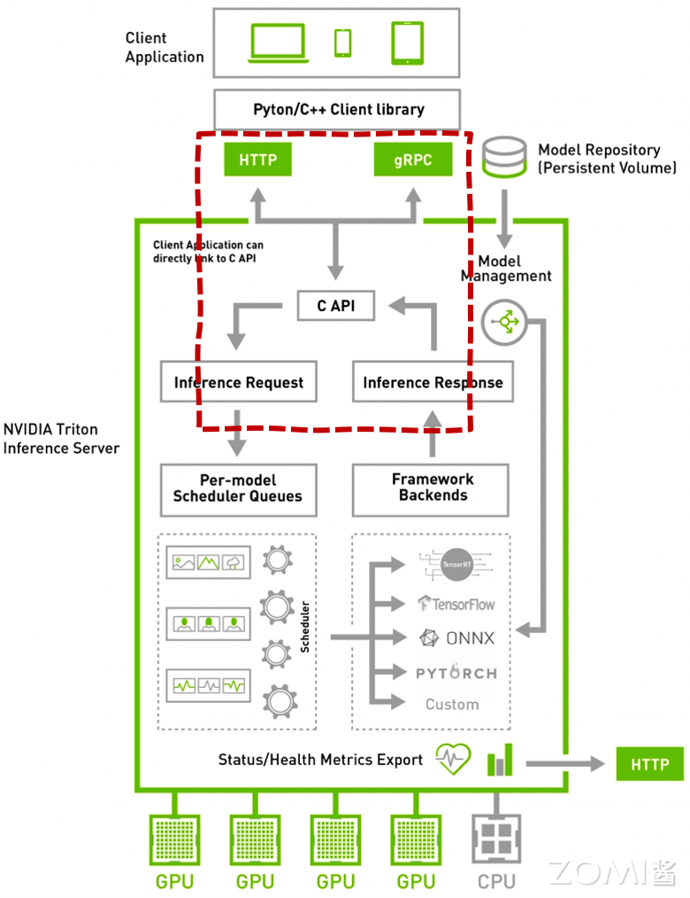
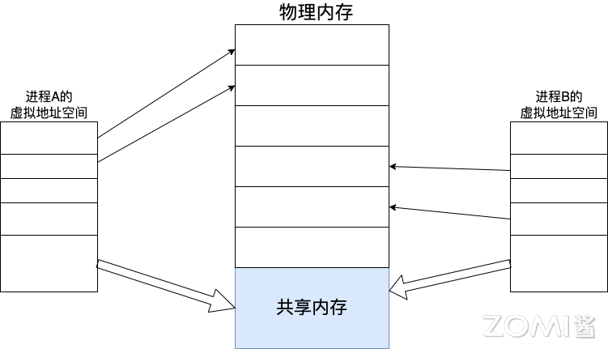
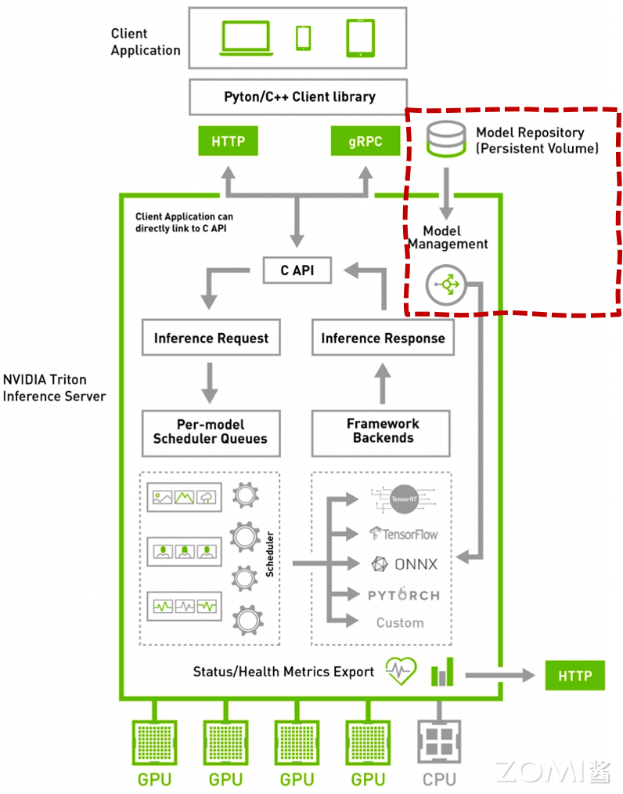
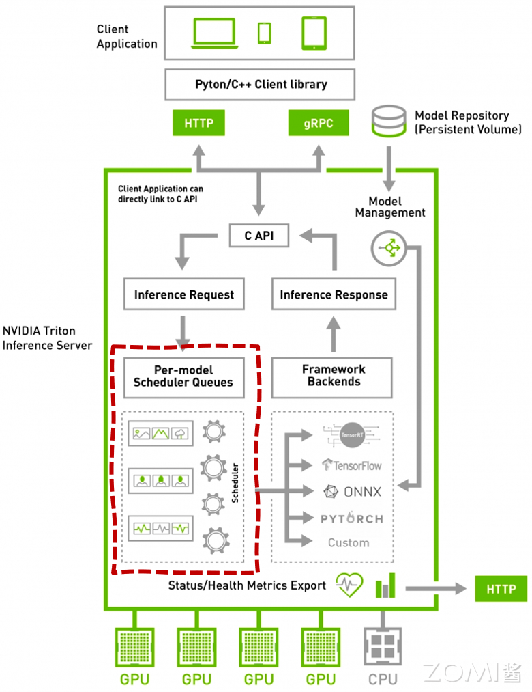
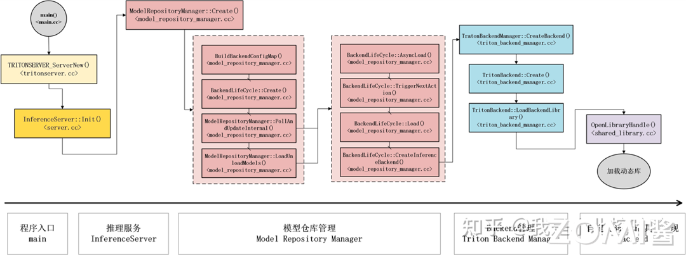

<!--Copyright © 适用于[License](https://github.com/chenzomi12/AISystem)版权许可-->

# 推理系统架构

推理系统架构是人工智能领域中的一个关键组成部分，它负责将训练好的模型应用于实际问题，从而实现智能决策和自动化。在构建一个高效的推理系统时，我们不仅需要考虑其性能和准确性，还需要确保系统的可扩展性、灵活性以及对不同业务需求的适应性。在本节中，我们将主要以 NVIDIA Triton Inference Server 为基础深入探讨推理系统架构的各个方面。

## 推理、部署、服务化

推理、部署和服务化是构建高效、可靠的机器学习系统不可或缺的三个环节。它们共同构成了从模型训练到实际应用的桥梁，确保了模型能够在真实世界中发挥其预测和决策的能力。推理阶段关注于利用训练好的模型进行高效计算和生成输出；部署阶段涉及将模型迁移到生产环境并优化其性能；服务化阶段则将模型转化为可以被实际应用调用的服务。接下来，我们将探讨推理、部署和服务化这三个阶段，以及它们如何协同工作，共同支撑起一个高效、稳定的推理系统。通过对这些环节的深入理解和实践，我们可以确保机器学习模型在各种应用场景中实现最佳性能，并为用户提供可靠的解决方案。

### 推理（Inference）

推理是指在机器学习和深度学习中使用训练好的模型对新数据进行处理并生成输出结果的过程。这个过程可以看作是模型前向计算的一部分。模型接受输入数据，通过其内部的参数和架构进行计算，最终输出预测结果。推理阶段的高效性和准确性是衡量一个模型实用价值的重要标准。

推理与预测虽然有时被混用，但在技术细节和应用场景上有所不同。推理侧重于模型内部的计算过程，而预测则更多涉及统计学和数据分析领域。在实际应用中，推理通常是模型运行的一部分，而预测可能包括更多的统计处理和数据解读。

推理过程的优化是一个重要研究方向。为了加快推理速度、减少计算资源的消耗，工程师们常常会使用模型压缩技术，如量化、剪枝和蒸馏。此外，硬件加速（如 GPU、TPU）和专用芯片（如 AI 加速器）也是提高推理效率的重要手段。

### 部署（Deployment）

训练得到的模型并不仅仅是为了学术研究，最终目的是应用于实际问题的解决。因此，模型的部署是一个至关重要的阶段。模型部署涉及将训练好的模型从开发环境迁移到生产环境，使其能够处理真实世界的数据并生成有用的结果。

模型部署的过程包括多个步骤和挑战：

- **移植**：将模型从开发环境迁移到生产环境，这可能涉及不同的操作系统、硬件平台和软件框架。

- **压缩**：为了在有限的计算资源下运行，模型需要进行压缩。常见的方法包括模型剪枝、量化和蒸馏，这些技术可以减少模型的参数数量和计算复杂度。

- **加速**：使用专用的硬件（如 GPU、TPU）和优化的算法（如图计算库、并行计算）来加速模型的推理过程。

- **监控和维护**：部署后的模型需要持续监控其性能，并进行必要的维护和更新，以确保其在实际应用中始终保持高效和准确。

### 服务化（Serving）

在模型部署的过程中，服务化是实现模型高效应用的关键步骤。服务化指的是将模型封装成一个可以供其他系统或用户调用的服务。这种服务化可以通过多种方式实现，包括 SDK 封装、应用集成和 Web 服务。

- SDK 封装：将模型的推理功能封装成一个软件开发工具包（SDK），开发者可以将其集成到自己的应用程序中。这种方式适用于需要在本地设备上进行推理的应用，如移动应用和嵌入式系统。

- 应用集成：直接将模型集成到现有的应用程序中，使其成为应用的一部分。这种方式适用于那些需要紧密结合模型功能和业务逻辑的场景。

- Web 服务：将模型部署为一个 Web 服务，对外暴露 API 接口（如 HTTP(S)、RPC 等）。这种方式使得模型可以被远程调用，适用于需要跨平台、跨设备访问模型的场景。

服务化的优势在于可以灵活地将模型功能暴露给不同的用户和系统，支持多种访问方式，并且可以方便地进行版本管理和更新。此外，通过 Web 服务，可以实现模型的分布式部署和负载均衡，从而提高系统的可用性和响应速度。



一个早期的服务化框架是 Google 在 2016 年针对 TensorFlow 推出的 TensorFlow Serving，它能够把 TensorFlow 模型以 web 服务的方式对外暴露接口，通过网络请求方式接受来自客户端（Client）的请求数据，计算得到前向推理结果并返回。这成为了模型服务化的重要里程碑。除此之外，业界还涌现了许多其他优秀的服务化框架，如 TorchServe、Triton、BentoML、Kubeflow 和 Seldon Core 等。

| 服务框架 | 支持的模型 | 开源仓库地址 | 开源时间 |
| --------- | ----------- | ------------- | --------- |
| TensorFlow Serving | TensorFlow | <https://github.com/tensorflow/serving> | 2016 |
| TorchServe | PyTorch | <https://github.com/pytorch/serve> | 2020 |
| Triton | TensorFlow/PyTorch 等 | <https://github.com/triton-inference-server/server> | 2018 |
| BentoML | TensorFlow/PyTorch 等 | <https://github.com/bentoml/BentoML> | 2019 |
| Kubeflow | TensorFlow/PyTorch 等 | <https://github.com/kubeflow/kfserving> | 2019 |
| Seldon Core | TensorFlow/PyTorch 等 | <https://github.com/SeldonIO/seldon-Core> | 2018 |

## NVIDIA Triton Inference Server

NVIDIA Triton Inference Server（简称 Triton）是一个高性能、可扩展的开源推理框架，由 NVIDIA 等公司推出。Triton 旨在为用户提供云和边缘推理的部署解决方案，支持多种深度学习模型和框架。



Triton 的主要特点包括：

- **高性能**：通过优化模型加载、执行和卸载的流程，Triton 显著提高了推理性能。

- **可扩展性**：支持水平扩展和垂直扩展，能够适应不同的计算资源和负载需求。

- **多框架支持**：兼容 TensorFlow、PyTorch、ONNX 等主流深度学习框架。

- **模型优化**：集成 TensorRT 等优化工具，进一步提升模型推理性能。

- **灵活性**：提供灵活的部署选项，支持公有云、私有云和边缘设备。

- **安全性**：支持安全传输和访问控制，保障推理服务的安全性。

作为一个强大的推理框架，Triton 能够满足多样化的 AI 应用需求，帮助企业和开发者构建高效、可靠的推理服务。Triton 还拥有活跃的开源社区，提供了丰富的文档、示例和工具，帮助开发者快速上手和部署推理服务。本小节将以 Triton 为例，介绍推理系统的架构和实现原理。

### Triton 接入层

Triton 通过提供多种接入方式，支持不同场景下的模型推理需求。



#### HTTP/REST 协议支持

HTTP/REST 是一种广泛使用的网络通信协议，它基于 HTTP 协议，使用 RESTful 架构风格。Triton 通过支持 HTTP/REST 协议，允许用户通过标准的 HTTP 请求来调用模型推理服务。

- **优点**：

  - 易于理解和实现。

  - 广泛的客户端支持。

  - 可以利用现有的 HTTP 基础设施和工具。

- **缺点**：

  - 相比于 GRPC，HTTP/REST 通常在性能上稍逊一筹。

  - 不如 GRPC 灵活，特别是在处理复杂数据结构时。

#### GRPC 协议支持

GRPC 是一个高性能、开源和通用的 RPC 框架，由 Google 主导开发。它使用 Protocol Buffers 为接口定义语言，支持多种编程语言。Triton 通过支持 GRPC 协议，提供了一种高效的通信机制，特别适用于需要高性能和低延迟的场景。

- **优点**：

  - 高性能和低延迟。

  - 支持流式调用，可以处理大量数据。

  - 支持多种编程语言，易于集成。

- **缺点**：

  - 相比于 HTTP/REST，GRPC 的学习曲线可能更陡峭。

  - 需要特定的客户端库支持。

#### 共享内存 IPC 通信机制

共享内存是一种进程间通信（IPC）方式，允许多个进程共享同一块内存区域。Triton 通过支持共享内存 IPC，可以显著提高数据传输效率，特别是在高负载和大数据量的场景中。

**基本工作原理**：

1. **创建共享内存区域**：操作系统首先创建一个共享内存区域。这个区域可以被多个进程访问，并且可以包含任意类型的数据。
2. **映射共享内存**：各个进程将共享内存区域映射到自己的地址空间中。映射操作使得进程能够像访问自己的内存一样访问共享内存区域。
3. **数据交换**：进程通过读写共享内存区域来交换数据。由于数据直接在内存中交换，这减少了数据复制的开销，提高了通信效率。
4. **同步机制**：由于多个进程可以同时访问共享内存，因此需要同步机制来避免数据竞争和一致性问题。这通常通过信号量、互斥锁等同步原语来实现。
5. **内存管理**：操作系统负责管理共享内存的生命周期，包括创建、销毁和权限控制。当共享内存不再需要时，操作系统会负责回收资源。



- **优点**：

  - 极高的数据传输效率，因为避免了数据的复制。

  - 适用于高负载和大数据量的场景。

  - 可以减少 CPU 的使用，因为减少了数据传输的开销。

- **缺点**：

  - 实现复杂度较高，需要处理好同步和内存管理。

  - 不同操作系统和平台上的支持可能有所不同。

在实际应用中，开发者可以根据具体需求选择合适的接入方式。例如，对于需要快速开发和部署的 Web 应用，可以选择 HTTP/REST 协议；对于追求极致性能的分布式系统，可以选择 GRPC 协议；而对于需要处理大量数据的高性能计算场景，共享内存 IPC 则是最佳选择。

### Triton 模型仓库

Triton 的模型仓库是一个用于存储和管理机器学习模型的地方，它支持本地存储和云存储解决方案，并且可以处理多个模型以及模型编排。



#### 本地模型仓库

本地模型仓库指的是将模型文件存储在物理服务器或虚拟机的磁盘上。这种方式的优点是简单、直接，并且可以提供快速的模型访问速度。

- **优点**：

  - 本地存储通常能够提供较低的延迟和较快的数据访问速度。

  - 用户对存储介质有完全的控制权，可以灵活管理存储资源。

- **缺点**：

  - 相比于云存储，本地存储的扩展性较差。

  - 如果物理硬件发生故障，可能会影响模型的可用性。

#### 云模型仓库

云模型仓库指的是将模型文件存储在云服务提供商的存储服务上，如 Google Cloud Platform (GCP)的 Cloud Storage 或 Amazon Web Services (AWS) 的 S3。

- **优点**：
  - 云存储服务通常提供良好的扩展性，可以根据需要轻松调整存储容量。

  - 云服务提供商通常会提供数据备份和恢复服务，增强数据的可靠性。

  - 可以从全球任何地方通过网络访问云存储中的模型。

- **缺点**：
  - 长期使用云存储服务可能会产生较高的费用。

  - 网络延迟可能会影响模型的加载和访问速度。

### Triton 模型预编排

Triton 模型预编排允许用户在模型部署之前，通过定义模型的执行方式，来优化模型的运行效率和资源分配，从而实现更好的性能和成本效益。

模型预编排的核心在于根据请求的具体内容智能地调度和组织模型的加载、运行与资源分配。这涉及到对模型执行流程的细粒度控制，确保每个请求都能以最优路径得到处理。在 Triton 中，这一过程始于对请求 URL 的解析，通过分析请求中携带的信息，如模型名称、版本号及特定的输入参数等，预编排系统能够确定下一步的执行逻辑。



Pre-Model Scheduler Queues 是模型编排的核心工作区，负责解析请求的 URL，并根据解析结果从模型仓库中查询到编排信息，然后执行模型编排。

#### Pre-Model Scheduler Queues 的工作流程

- **请求解析**：当一个推理请求到达 Triton Server 时，首先通过调度器进行初步处理。调度器会解析请求的 URL，提取出请求所指定的模型及其版本信息，这是预编排流程的起点。

- **模型编排信息查询**：利用从请求中获取的信息，Triton 会在模型仓库中查找对应的模型配置。这些配置文件不仅定义了模型的结构和参数，还可能包含了预编排指令，比如模型间依赖关系、优先级设置或特定的资源分配需求。

- **执行模型编排**：基于查询到的编排信息，Triton 会动态地安排模型的加载、卸载及执行顺序。例如，如果某个模型依赖于前一个模型的输出作为输入，预编排系统会确保这两个模型按正确的顺序执行。此外，它还会考虑资源利用率，尽可能并行化处理，减少等待时间。

- **资源管理和优化**：预编排机制还包括了对 GPU、CPU 等硬件资源的智能分配与回收，确保高负载情况下也能维持服务的稳定性和低延迟。它能根据当前系统负载动态调整模型实例的数量，避免资源浪费或过度竞争。

### Triton 推理引擎

Triton 的一大亮点在于其高度灵活且强大的推理引擎支持体系，将 TensorFlow、TensorRT、PyTorch、ONNX Runtime 等主流框架统一整合为“Backends”。这一设计极大地促进了深度学习模型部署的标准化和效率，使得开发者能够在一个统一的平台上轻松管理多样化的模型，而无需关注底层实现细节，获得具有多后端架构的优势。


- **无缝迁移与混合部署**：通过将不同框架的模型推理能力抽象为统一的 Backend 接口，Triton 允许用户在不修改模型代码的情况下，自由选择或切换推理引擎。这意味着，开发者可以在 TensorFlow 模型和 PyTorch 模型之间轻松迁移，甚至在同一服务中混合部署多种框架的模型，极大提升了开发效率和灵活性。

- **性能优化与硬件加速**：Triton 集成的每个 Backend 都针对特定框架进行了优化，尤其是 TensorRT，作为 NVIDIA 开发的高性能推理加速库，能显著提高 GPU 上的推理速度。此外，Triton 还能自动利用硬件加速特性，如 FP16、INT8 量化，进一步提升吞吐量和降低延迟。

- **资源高效利用**：多后端架构使得 Triton 能够根据模型特性和硬件资源情况智能选择最合适的推理引擎。例如，对于某些模型，使用 TensorRT 可能比原生 TensorFlow 提供更好的性能；而对于复杂的 PyTorch 模型，直接利用 PyTorch Backend 可能更为合适。这种动态适配策略有助于最大化资源利用率。

#### 启动时的模型加载与管理

Triton 在其初始化序列中采用了一套精细且高效的模型管理机制，远超简单的模型加载范畴。这一过程深入到了模型生命周期管理的核心，确保了从模型仓库到生产环境的无缝过渡。

在模型加载之前，Triton 执行详尽的验证步骤，这不仅仅局限于文件的存在性和格式正确性，还包括对模型结构的深入分析，验证模型输入输出的合规性、数据类型一致性以及模型间依赖关系的完整性。这一层次的验证是确保模型能够在生产环境中稳定运行的基础。

根据模型的具体需求及系统当前的资源分配状况，Triton 采用先进的资源调度算法来决定模型的最优存放位置（内存或 GPU 显存）。此过程综合考虑了模型尺寸、预期的推理延迟要求、以及 GPU 的内存使用情况等多维度因素，力求达到资源使用的最优化。对于 GPU 密集型模型，Triton 会尝试最大化 GPU 并行度，同时考虑内存带宽限制，避免资源争抢。

针对每个模型，Triton 会基于选定的 Backend 定制化创建推理引擎。这一步骤包含了模型的优化，比如图优化、算子融合、内核选择等，以及针对特定硬件的编译。特别是对于 TensorRT Backend，Triton 会利用其深度学习网络优化器自动执行量化、层融合、内存优化等高级策略，以减少计算和内存开销。

为了加速首次推理请求的响应时间，Triton 会在模型加载后执行一系列预推理操作，即所谓的“热身”。这个过程会生成并缓存执行计划，包括计算图的优化布局、内存分配方案等，确保后续请求能够直接利用这些预计算结果，从而显著减少冷启动延迟。

#### 动态服务与资源管理

Triton 的动态服务能力进一步扩展了其灵活性和响应速度，使模型部署和调整成为持续优化的过程，而非一次性配置。

- **即时模型更新与加载**：Triton 支持在线模型更新，无需中断服务即可加载新版本模型或添加全新模型。这一功能基于其动态模型发现与加载机制，使得 AI 应用能够迅速适应市场需求变化，如模型精度提升、新功能上线等。配合版本控制和滚动更新策略，可确保服务连续性不受影响。

- **资源按需调配与负载均衡**：在运行时，Triton 能够根据推理请求的实时流量和复杂度动态调整资源分配。当检测到某个模型负载过重时，可以自动增加其处理能力，或将请求分流至其他可用资源，保持整体服务的高效和稳定。同时，它还能根据长期趋势预测未来资源需求，提前进行资源预留或释放，实现资源的高效循环利用。

### Triton 返回与监控

Triton 的返回与监控功能为用户提供了强大的支持，确保了模型推理服务的高效运行和稳定监控。通过 Inference Response 机制，用户可以及时准确地获取推理结果；而通过 Status/Health Metrics Export 接口与 Prometheus 的集成，用户可以方便地实现服务的监控和管理。


#### Inference Response 机制

Triton 推理响应（Inference Response）机制是连接模型推理结果与最终用户的关键环节，其设计旨在保障数据的高效、准确传递。这一过程不仅涉及结果数据的组织与封装，还融入了对性能优化和错误处理的考量。

正如之前所提到的，Triton 支持多种协议，如 gRPC 和 HTTP/REST，以适应不同客户端的需求。推理完成后，模型输出会被转换成符合相应协议规定的格式，如 Protobuf 或 JSON，确保数据能够无损地跨网络传输。此外，Triton 还支持批量处理响应，允许一次请求中包含多个样本的推理结果，提高了通信效率。

为了提高系统的健壮性，Triton 对推理过程中可能遇到的各种错误进行了细致的处理和分类。无论是模型内部的异常、资源不足还是数据不合规，Triton 都会生成详细的错误码和描述信息，封装进响应中返回给客户端。这种透明化的错误反馈机制有助于快速定位问题，加速故障排查。

考虑到延迟敏感的应用场景，Triton 在设计推理响应流程时，特别注重减少不必要的处理延迟。通过异步 IO、批处理技术和高效的序列化/反序列化算法，即使是高并发请求也能获得快速响应。此外，对于连续的推理任务，Triton 支持会话（Session）管理，进一步减少了客户端与服务端之间的握手和认证开销。

#### Status/Health Metrics Export

Triton 提供了与 Prometheus 监控系统集成的能力，通过标准化的指标导出接口，使得模型服务的健康状态、性能指标和资源使用情况变得一目了然。这一特性对于维护大规模部署尤其重要。

Triton 导出的指标既包括了通用的系统级健康状态（如服务是否运行、CPU/GPU 使用率），也涵盖了模型和服务层面的详细指标，如推理请求的吞吐量、延迟、错误率等。此外，用户还可以自定义指标，以满足特定应用的监控需求。

在推理过程中，通过 Prometheus 的拉取（Pull）机制，Triton 定期向 Prometheus Server 报告指标数据，使得这些数据能够被 Prometheus 的各种仪表板工具（如 Grafana）所可视化。这使得运维团队可以实时监控服务状态，快速识别性能瓶颈或故障点，并作出响应。

集成 Prometheus 后，运维人员可以设置阈值告警，一旦关键指标超出预设范围，立即触发通知或自动化的修复动作。例如，当 GPU 内存使用率达到高危水平时，系统可以自动调度任务，平衡负载，或甚至动态扩展资源，保障服务稳定性。

### 基于 Triton 集成推理引擎

本小节将介绍如何基于 Triton 开发自己的 Backend 推理引擎。

Triton 推理服务器通过其精心设计的架构，将推理服务的复杂性进行了有效的分层处理，其中"Backend"作为核心组件，专注于模型的加载、前向推理计算及卸载等关键操作，而网络请求处理、模型编排等周边功能则由 Triton 服务框架统一管理。这一设计极大地简化了推理引擎的开发与集成过程，同时也保证了服务的高效与灵活性。



上图展示了 Backend 在 Triton 主分支代码的加载逻辑，Triton 推理引擎加载用户自定义后端的逻辑是统一的。首先，初始化 InferenceServer 类，它是整个 Triton 推理服务的入口。在 InferenceServer 类的 Init() 方法中，核心步骤是创建 ModelRepositoryManager 类，该类负责管理模型仓库。它会访问指定的模型仓库地址，获取所有可用的模型。对于每一个模型，ModelRepositoryManager 通过调用 BackendLifeCycle::CreateInferenceBackend() 来创建后端，最终 TritonBackend::LoadBackendLibrary() 通过 dlfcn 库加载用户定义的推理引擎库。

用户自定义的后端推理引擎库通过这种方式被加载到 Triton 中。

接下来，我们分析 LoadBackendLibrary() 方法的实现：

```C++
Status TritonBackend::LoadBackendLibrary()
{
    RETURN_IF_ERROR(OpenLibraryHandle(libpath_, &dlhandle_));

    TritonBackendInitFn_t bifn;
    TritonBackendFiniFn_t bffn;
    TritonModelInitFn_t mifn;
    TritonModelFiniFn_t mffn;
    TritonModelInstanceInitFn_t iifn;
    TritonModelInstanceFiniFn_t iffn;
    TritonModelInstanceExecFn_t iefn;

    // Backend initialize and finalize functions, optional
    RETURN_IF_ERROR(GetEntrypoint(
        dlhandle_, "TRITONBACKEND_Initialize", true /* optional */,
        reinterpret_cast<void**>(&bifn)));
    RETURN_IF_ERROR(GetEntrypoint(
        dlhandle_, "TRITONBACKEND_Finalize", true /* optional */,
        reinterpret_cast<void**>(&bffn)));

    // Model initialize and finalize functions, optional
    RETURN_IF_ERROR(GetEntrypoint(
        dlhandle_, "TRITONBACKEND_ModelInitialize", true /* optional */,
        reinterpret_cast<void**>(&mifn)));
    RETURN_IF_ERROR(GetEntrypoint(
        dlhandle_, "TRITONBACKEND_ModelFinalize", true /* optional */,
        reinterpret_cast<void**>(&mffn)));

    // Model instance initialize and finalize functions, optional
    RETURN_IF_ERROR(GetEntrypoint(
        dlhandle_, "TRITONBACKEND_ModelInstanceInitialize", true /* optional */,
        reinterpret_cast<void**>(&iifn)));
    RETURN_IF_ERROR(GetEntrypoint(
        dlhandle_, "TRITONBACKEND_ModelInstanceFinalize", true /* optional */,
        reinterpret_cast<void**>(&iffn)));

    // Model instance execute function, required
    RETURN_IF_ERROR(GetEntrypoint(
        dlhandle_, "TRITONBACKEND_ModelInstanceExecute", false /* optional */,
        reinterpret_cast<void**>(&iefn)));

    backend_init_fn_ = bifn;
    backend_fini_fn_ = bffn;
    model_init_fn_ = mifn;
    model_fini_fn_ = mffn;
    inst_init_fn_ = iifn;
    inst_fini_fn_ = iffn;
    inst_exec_fn_ = iefn;

    return Status::Success;
}
```

在 LoadBackendLibrary() 方法中，首先通过 OpenLibraryHandle() 函数获取用户自定义的后端推理引擎库的句柄。然后，从动态库中获取以下函数的入口点：

- TRITONBACKEND_Initialize 和 TRITONBACKEND_Finalize：后端初始化和清理函数，是可选的。

- TRITONBACKEND_ModelInitialize 和 TRITONBACKEND_ModelFinalize：模型初始化和清理函数，是可选的。

- TRITONBACKEND_ModelInstanceInitialize 和 TRITONBACKEND_ModelInstanceFinalize：模型实例初始化和清理函数，是可选的。

- TRITONBACKEND_ModelInstanceExecute：模型实例执行函数，是必需的。

因此，自定义的后端推理引擎必须实现上述 7 个 API。接下来，我们将详细讲解如何开发自定义的后端推理引擎。

#### 自定义 Backend 推理引擎编码

要开始开发自定义的 Triton 后端推理引擎，首先需要获取官方提供的后端代码模板库。这可以通过访问 Triton Inference Server GitHub 仓库（<https://github.com/triton-inference-server/backend>）来完成。下载后，需要清理 src/ 和 include/ 目录，删除其中的所有文件，但要保留 src/backend_common.cc 文件，因为它是必需的。

根据之前的讨论，自定义后端必须实现七个核心 API 方法：

- TRITONBACKEND_Initialize：用于初始化自定义后端推理引擎。这是全局的初始化，通常只执行一次，用于准备环境和设置全局变量。

- TRITONBACKEND_Finalize：用于释放自定义后端推理引擎的资源。通常仅在退出 Triton 时调用。

- TRITONBACKEND_ModelInitialize：用于初始化每个模型仓库中的模型。这通常只执行一次，主要任务是检查模型配置并设置默认值。

- TRITONBACKEND_ModelFinalize：用于释放模型资源。通常仅在模型从模型仓库中移除时调用。

- TRITONBACKEND_ModelInstanceInitialize：用于实例化模型的初始化。如果启动 N 个服务实例，对于每个模型，该方法将被调用 N 次，主要用于根据模型配置加载模型到内存或显存。

- TRITONBACKEND_ModelInstanceFinalize：用于实例化模型的释放。通常仅在模型服务实例被移除时调用。

- TRITONBACKEND_ModelInstanceExecute：执行模型的前向推理计算。当模型服务接收到用户的推理请求时，将调用此方法进行计算。

对于后端开发者来说，以下三个 API 的实现尤为关键：

- TRITONBACKEND_ModelInstanceInitialize：加载模型到内存或显存。

- TRITONBACKEND_ModelInstanceFinalize：卸载模型资源。

- TRITONBACKEND_ModelInstanceExecute：执行模型的前向推理。

为了帮助开发者编写自己的后端，Triton 官方在仓库的 src/backends/backend/examples 目录下提供了多个后端示例代码。这些示例对于理解如何开发自定义后端非常有帮助。

#### 编译和部署

编译和部署自定义 Triton 后端时，官方提供的后端代码模板库中包含了一个结构精良的 CMake 文件，它为编译过程提供了便利。大多数情况下，开发者仅需要替换 add_library() 函数中的参数，将其指向自己编写的 C 或 C++ 源文件。如果课程结构较为复杂，或者需要对安装过程进行定制，那么需要自行对 CMake 文件进行相应的修改来满足特定的构建和部署需求。

## 模型生命周期管理

模型版本管理是机器学习和深度学习课程中不可或缺的一部分。它允许开发者跟踪、比较和部署不同版本的模型。版本管理可能会产生于不同需求，比如随着数据的积累和算法的改进，模型需要不断迭代以提高性能；或是在模型开发过程中，需要记录不同实验的结果，以便比较和选择最佳模型；如果新部署的模型表现不佳，需要能够快速回滚到之前的稳定版本；而在团队中，往往需支持并行开发，即允许多个团队或个人同时在不同版本上进行开发，而不互相干扰。


金丝雀策略和回滚策略是模型生命周期管理中的典型实践，它们帮助确保模型的持续迭代和稳定性。金丝雀策略通过逐步部署新版本来降低风险，而回滚策略则提供了一种快速恢复到稳定状态的方法。

### 金丝雀策略

金丝雀发布（Canary Deployment）是一种逐步部署和验证新版本软件的策略，得名于过去矿工用金丝雀检测矿井中是否存在有毒气体的做法。在机器学习模型或软件服务的上下文中，该策略旨在最小化新版本可能引入的风险，通过逐步将一小部分流量导向新版本，同时保持大部分流量在已知稳定的旧版本上。

首先，需要一个灵活的路由系统，能够根据预定义的规则（如用户 ID 的哈希值、地理位置或随机分配）将请求分发到新旧两个模型版本。这样可以确保每个版本都处理一部分真实用户请求，为性能和准确性提供实际测试环境。

在推理服务过程中需要进行监控与评估，关键在于实时监控两个版本的表现，这包括但不限于精度、响应时间、资源消耗等指标。利用 A/B 测试框架，对比新旧模型在相同条件下的表现差异，确保新模型不仅在理论上改进，而且在实践中也确实提升了用户体验或业务指标。

基于监控数据，系统可以自动判断新模型是否达到预期标准，或者提供给运维人员决策依据。如果新模型表现不佳，应能快速回滚到之前的稳定版本；如果表现良好，则可逐步增加流向新模型的流量比例，直至完全替换旧版本。

- **优势**：

  - **风险降低**：通过逐步部署新模型，降低了全面部署可能带来的风险。

  - **性能比较**：允许直接比较新旧模型的性能，为决策提供数据支持。

  - **灵活性**：提供了灵活的切换机制，根据性能评估结果调整部署策略。

实施金丝雀策略需要额外的计算资源来并行运行两个模型版本，尤其是在大规模服务中。因此，合理规划资源分配，确保在高峰期也能维持服务稳定性，是成功实施的关键因素之一，以避免用户暴露于可能存在缺陷的模型。

### 回滚策略

回滚策略是故障恢复机制的重要组成部分，旨在快速应对生产环境中发现的严重问题，通过恢复到一个已知稳定的状态来最小化影响。

回滚具有快速响应机制，一旦检测到新部署的模型存在严重缺陷或性能下降，系统应立即触发回滚流程。这要求监控系统具备高度敏感性和准确性，能够迅速识别问题并触发报警。

为了实现高效的回滚，必须维护一个清晰的模型版本历史记录，并能够快速定位和部署指定的旧版本。这通常涉及到版本控制系统和模型仓库的使用，确保每个模型版本的可追溯性和可部署性。

回滚过程应该尽可能平滑，减少对用户的影响。这意味着卸载有问题的新版本和装载选定的旧版本的操作顺序要经过精心设计，确保服务中断时间最短，甚至实现无中断切换。

完成回滚后，重要的是分析问题原因，修复缺陷，并通过再次实施金丝雀发布等策略安全地重新部署修复后的版本。此外，建立从回滚中学到的经验教训反馈机制，有助于优化未来的部署流程和提高系统的韧性。

- **优势**：

  - **快速响应**：允许快速从问题版本回滚到稳定版本，减少服务中断时间。

  - **灵活性**：提供了灵活的配置选项，适应不同的回滚需求。

  - **稳定性保障**：确保服务的稳定性和可靠性，保护用户免受缺陷影响。

## 本节视频

<html>
<iframe src="https://player.bilibili.com/player.html?bvid=BV1Gv4y1i7Tw&as_wide=1&high_quality=1&danmaku=0&t=30&autoplay=0" width="100%" height="500" scrolling="no" border="0" frameborder="no" framespacing="0" allowfullscreen="true"> </iframe>
</html>

## 参考文献

1. Deep Learning Inference in Facebook Data Centers: Characterization, Performance Optimizations and Hardware Implications
2. Clipper: A Low-Latency Online Prediction Serving System
3. TFX: A TensorFlow-Based Production-Scale Machine Learning Platform
4. TensorFlow-Serving: Flexible, High-Performance ML Serving
5. Optimal Aggregation Policy for Reducing Tail Latency of Web Search
6. A Survey of Model Compression and Acceleration for Deep Neural Networks
7. CSE 599W: System for ML - Model Serving
8. [Deep Learning Performance Training Inference](https://developer.nvidia.com/deep-learning-performance-training-inference)
9. DEEP COMPRESSION: COMPRESSING DEEP NEURAL NETWORKS WITH PRUNING, TRAINED QUANTIZATION AND HUFFMAN CODING
10. Learning both Weights and Connections for Efficient Neural Networks
11. DEEP LEARNING DEPLOYMENT WITH NVIDIA TENSORRT
12. Halide: A Language and Compiler for Optimizing Parallelism, Locality, and Recomputation in Image Processing Pipelines
13. TVM: An Automated End-to-End Optimizing Compiler for Deep Learning
14. 8-bit Inference with TensorRT
15. [Microsoft AI System](https://github.com/microsoft/AI-System)
16. [模型推理服务化之 Triton：如何基于 Triton 开发自己的推理引擎？](https://zhuanlan.zhihu.com/p/354058294)
