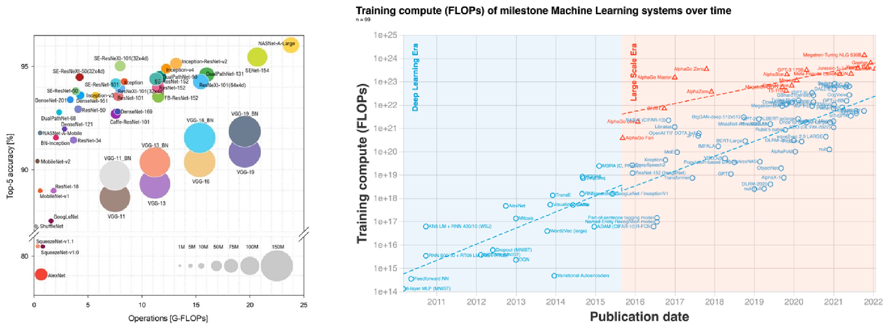

<!--Copyright © XcodeHW 适用于[License](https://github.com/chenzomi12/DeepLearningSystem)版权许可-->

# 推理参数

本章节将介绍 AI 模型网络参数方面的一些基本概念，以及硬件相关的性能指标，为后面让大家更 了解模型轻量化做初步准备。值得让人思考的是，随着深度学习的发展，神经网络被广泛应用于各种领域，模型性能的提高同时也引入了巨大的参数量和计算量（如下图右所示），一般来说模型参数量越大，精度越高，性能越好。(如下图左所示)。但由于大部分的深度神经网络模型的参数量很大，无法满足直接部署到移动端的条件，因此在不严重影响模型性能的前提下对模型进行重新设计，来减少网络参数量和计算复杂度，提升运算能力是目前相当热门的研究方向。同时也希望在后续的章节中，让大家更了解模型轻量化的一些经典网络结构。

## 复杂度分析

模型参数量和计算量是两个重要的考量因素。模型参数量指的是模型中的参数数量，对应于数据结构中空间复杂度的概念。而计算量则对应于时间复杂度的概念，与网络执行时间的长短有关。计算量和复杂度的衡量指标主要是 FLOPs（浮点运算次数），FLOPS（每秒所执行的浮点运算次数），MACCs（乘-加操作次数），Params（模型含有多少参数），MAC（内存访问代价），内存带宽（内存带宽)。

### FLOPs

FLOPs 是 floating point operations 的缩写（s 表复数），指浮点运算次数，可以用来衡量算法/模型的复杂度，表示计算量。论文中常用的还有 GFLOPs 和 TFLOPs。

### FLOPS

每秒所执行的浮点运算次数（Floating-point Operations Per Second ），理解为计算速度，是一个衡量硬件性能/模型速度的指标，即一个芯片的算力。

### 单位换算

- 一个 MFLOPS（MegaFLOPS）等于每秒一百万（$=10^{6}$）次浮点运算。

- 一个 GFLOPS（GigaFLOPS）等于每秒十亿（$=10^{9}$）次浮点运算。

- 一个 TFLOPS（TeraFLOPS）等于每秒一万亿（$=10^{12}$）次浮点运算。

- 一个 PFLOPS（PetaFLOPS）等于每秒一千万亿（$=10^{15}$）次浮点运算。

- 一个 EFLOPS（ExaFLOPS）等于每秒一百京（$=10^{18}$）次浮点运算。

- 一个 ZFLOPS（ZettaFLOPS）等于每秒十万京（$=10^{1}$）次浮点运算。

GFLOPS 就是 Giga FLoating-point Operations Per Second，即每秒 10 亿次浮点运算，常作为 GPU 性能参数但不一定代表 GPU 的实际表现，因为还要考虑具体如何拆分多边形和像素、以及纹理填充，理论上该数值越高越好。1GFLOPs = 1000MFLOPs。

### MACCs

乘-加操作次数（Multiply-accumulate Operations），MACCs 大约是 FLOPs 的一半，将 $w*x+b$ 视为一个乘法累加或 1 个 MACC。

### MAdds

MACs 全称 Multiply–Accumulate Operations，即乘加累积操作，**1MACs 包含一个乘法操作与一个加法操作，大约包含 2FLOPs。**通常 MACs 与 FLOPs 存在一个 2 倍的关系。MACs 和 MAdds 是同一个含义。
关于神经网络利用率
假设用一个简单的 CNN 网络做 forward 时，对于硬件资源的利用情况称之为利用率，所以利用率的计算简单描述为：

- 计算网络的计算量，通常是乘累加的次数。

- 测量网络运行耗时。

- 乘累加次数除以耗时， 计算该网络的 GFLOPS。

- 用计算的网络 GFLOPS 除以硬件资源的理论 GFLOPS，即利用率。

### Params

模型含有多少参数，直接决定模型的大小，也影响推断时对内存的占用量，单位通常为 M，通常参数用 float32 表示，所以模型大小是参数数量的 4 倍。

### MAC

内存访问代价（ Memory Access Cost ），指的是输入单个样本，模型/卷积层完成一次前向传播所发生的内存交换总量，即模型的空间复杂度，单位是 Byte。

### 内存带宽

内存带宽决定了它将数据从内存（vRAM） 移动到计算核心的速度，是比计算速度更具代表性的指标，内存带宽值取决于内存和计算核心之间数据传输速度，以及这两个部分之间总线中单独并行链路数量。

### 神经网络的计算量

网络前向计算时，卷积运算占据耗时 90%以上。重点关注下如何计算卷积的运算量。为简化问题，以下讨论认为：卷积采用滑动窗口且忽略非线性计算的开销。
假设对于 CNN 网络，有卷积层的参数包括：输入 feature map 的 Cin，宽 Hin，高 Win，输出 feature map 的 Cout，宽 Hout，高 Wout，卷积核的尺寸 K，卷积核通道等于 Cin，卷积核个数等于 Cout。则该卷积核与 feature map 做卷积的运算量为：

$$
W_{out}=W_{in}/strie_{w},H_{out}=H_{in}/stride_{h}
$$

$$
FLOP_{s}=(K*K*C_{in}*2+1)*W_{out}*H_{out}*C_{out}
$$

其中的 1 表示偏置量。偏置值每个卷积核对应 1 个，共有 Cout 个。

## 典型结构对比

### 标准卷积层 Std Conv

- Params

$$
k_{h}\times k_{w}\times c_{in}\times c_{out}
$$

- FLOPs

$$
k_{h}\times k_{w}\times c_{in}\times c_{out}\times H \times W
$$

其中$k_{h}$与$k_{w}$分别为卷积核的高宽,$c_{in}$与 $c_{out}$分别是输入输出维度。

### 全连接层 FC

- Params
$$
c_{in}\times c_{out}
$$

- FLOPs

$$
c_{in}\times c_{out}
$$

其中$c_{in}$与 $c_{out}$分别是输入输出维度。

### Group Conv

- Params

$$
(k_{h}\times k_{w}\times c_{in}/g\times c_{out}/g)\times g  = k_{h}\times k_{w}\times c_{in}\times c_{out}/g
$$

- FLOPs

$$
k_{h}\times k_{w}\times c_{in}\times c_{out}\times H \times W /g
$$

### Depth-wise Conv

- Params

$$
k_{h}\times k_{w}\times c_{in}\times c_{out}/c_{in} = k_{h}\times k_{w}\times c_{out}
$$

- FLOPs

$$
k_{h}\times k_{w}\times c_{out}\times H \times W
$$

## 硬件性能参数

首先是硬件的浮点计算能力，得区分不同精度的浮点数。半精度、单精度、双精度这些概念是在 IEEE 754 标准里定义的，浮点计数是利用浮动小数点的方式使用不同长度的二进制来表示一个数字，与之对应的是定点数。同样的长度下浮点数能表达的数字范围相比定点数更大，但浮点数并不能精确表达所有实数，而只能采用更加接近的不同精度来表达。单精度的浮点数采用 4 个字节也就是 32 位二进制来表达一个数字，双精度浮点数采用 8 个字节也就是 64bits 来表达，当然半精度浮点数也就是采用 16bits 了。因为采用不同位数的浮点数的表达精度不一样，所以造成的计算误差也不一样，对于需要处理的数字范围大而且需要精确计算的科学计算来说，就要求采用双精度浮点数，而对于常见的多媒体和图形处理计算，32 位的单精度浮点计算已经足够了，对于要求精度更低的机器学习等一些应用来说，半精度 16 位浮点数就可以甚至 8 位浮点数就已经够用了。
CPU 和 GPU 最大的不同在于内部计算单元数量的差异以及处理方式的不同，CPU 内部的核心数较少而且设计上更倾向于顺序串行处理数据，GPU 则因为只需要支持相对单一的数据类型和计算方式，所以计算单元较小但数量更多而且更倾向于并行处理数据。一个简单的比较是现在的 Intel CPU 最多也就支持 24 核但 GPU 则动不动就支持几千个核了。

GPU 的计算能力的衡量指标：

- 显存大小。

- CUDA 核心数。

- Boost 主频。

描述 GPU 计算能力的指标：

- 计算峰值。

- 存储器带宽。

其中最为重要的就是 GPU 的计算峰值，这个在我们进行边缘计算的时候，更加重要。
GPU 的浮点计算能力理论峰值计算公式：

$$
理论峰值=GPU 芯片数量 \times GPU Boost 主频 \times CUDA 核心数 \times 单个时钟周期内能处理的浮点计算次数
$$

只不过在 GPU 里单精度和双精度的浮点计算能力需要分开计算，以最新的 Tesla P100 为例：

$$
双精度理论峰值 ＝ 1 \times FP64 Cores  \times GPU Boost Clock \times 2 ＝ 1 \times 1792 \times 1.48GHz  \times 2 = 5.3 TFLOPS
$$

$$
单精度理论峰值 ＝ 1  \times FP32 cores  \times GPU Boost Clock  \times 2 ＝ 1  \times 3584  \times 1.58GHz  \times 2 ＝ 10.6 TFLOPS
$$

因为 P100 还支持在一个 FP32 里同时进行 2 次 FP16 的半精度浮点计算，所以半精度的理论峰值是单精度浮点数计算能力的两倍也就是达到了 21.2TFLOPS。

以英伟达 T4 为例，来介绍具体的参数指标，如下图所示

### 重点参数

- Tensor 核心数

Tensor 核心是专为执行张量或矩阵运算而设计的专用执行单元，而这些运算正是深度学习所采用的核心计算函数，它能够大幅加速处于深度学习神经网络训练和推理运算核心的矩阵计算。Tensor Core 使用的计算能力要比 Cuda Core 高得多，这就是为什么 Tensor Core 能加速处于深度学习神经网络训练和推理运算核心的矩阵计算，能够在维持超低精度损失的同时大幅加速推理吞吐效率。

- CUDA 核心数

CUDA™是一种通用并行计算架构，该架构使 GPU 能够解决复杂的计算问题。CUDA 核心是每一个 GPU 始终执行一次值乘法运算，CUDA 核心数量决定了 GPU 并行处理的能力，一般来说，同等计算架构下，CUDA 核心数越高，计算能力会递增。在深度学习、机器学习等并行计算类业务下，CUDA 核心多意味着性能好一些。

- 单精度

Float32 是在深度学习中最常用的数值类型，称为单精度浮点数，每一个单精度浮点数占用 4Byte 的显存。

- 混合精度

混合精度是指在底层硬件算子层面，使用半精度(FP16)作为输入和输出，使用全精度(FP32)进行中间结果计算从而不损失过多精度的技术，而不是网络层面既有 FP16 又有 FP32。

- INT8

TOPS 处理器运算能力单位，1TOPS 代表处理器每秒钟可进行一万亿次（10^12）操作，在 INT8 上算力为 130TOPS。

- INT4

英伟达 Tesla T4 在 INT4 上的算力为 260TOPS。

- GPU 显存

显存容量指的是显存能够存储的数据量，单位是 GB，显存容量越大，能够存储的画面就越多，显存带宽指的是显示芯片与显存之间的数据传输速率，单位是 GB/s。

- 互联带宽

PCLe 桥传输的速率，属于设备外的传输。

## 小结与讨论

本章节主要是介绍深度学习网络结构中基本组件，同时对网络结构参数、硬件算力参数进行初步的介绍，了解相关概念后才能更好理解网络轻量化设计的原理。

## 参考文献

1.[Alex Krizhevsky, Ilya Sutskever, and Geoffrey E. Hinton. ImageNet Classification with Deep Convolutional Neural Networks. In NIPS, 2012](https://dl.acm.org/doi/10.1145/3065386)

2.[Alex Krizhevsky, Ilya Sutskever, and Geoffrey E. Hinton. 2017. ImageNet classification with deep convolutional neural networks. Commun. ACM 60, 6 (June 2017), 84–90. https://doi.org/10.1145/3065386](https://dl.acm.org/doi/10.1145/3065386)

3.[Silver, D., Huang, A., Maddison, C. et al. Mastering the game of Go with deep neural networks and tree search. Nature 529, 484–489 (2016). https://doi.org/10.1038/nature16961](https://www.nature.com/articles/nature16961)

4.[Karen Simonyan and Andrew Zisserman. Very deep convolutional networks for large-scale image recognition. arXiv:1409.1556, 2014.](https://arxiv.org/abs/1409.1556)

5.[Mohamed S Abdelfattah, David Han, Andrew Bitar, Roberto DiCecco, Shane O’Connell, Nitika Shanker, Joseph Chu, Ian Prins, Joshua Fender, Andrew C Ling, et al. Dla: Compiler and
fpga overlay for neural network inference acceleration. In International Conference on Field
Programmable Logic and Applications, pages 411–4117. IEEE, 2018.](Compiler and
fpga overlay for neural network inference acceleration)

## 本节视频

<html>
<iframe src="https://player.bilibili.com/player.html?bvid=BV1KW4y1G75J&as_wide=1&high_quality=1&danmaku=0&t=30&autoplay=0" width="100%" height="500" scrolling="no" border="0" frameborder="no" framespacing="0" allowfullscreen="true"> </iframe>
</html>
