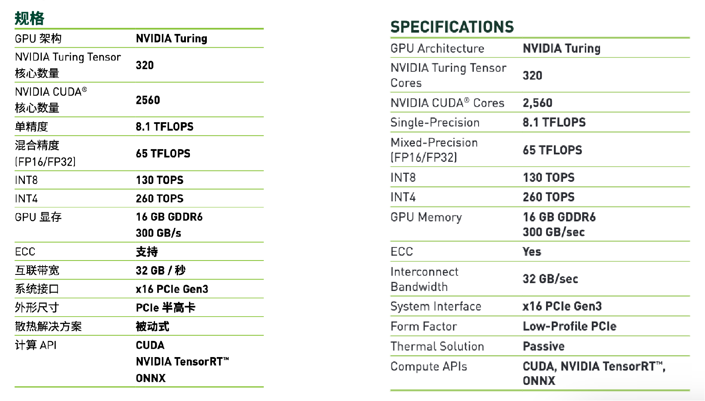

<!--适用于[License](https://github.com/chenzomi12/DeepLearningSystem/blob/main/LICENSE)版权许可-->

# 推理参数

随着深度学习的发展，神经网络被广泛应用于各种领域，模型性能的提高同时也引入了巨大的参数量和计算量（如下图右所示）。一般来说模型参数量越大，精度越高，性能越好。(如下图左所示)。

## 复杂度分析

模型参数量和计算量是两个重要的考量因素。模型参数量指的是模型中的参数数量，对应于数据结构中空间复杂度的概念。而计算量则对应于时间复杂度的概念，与网络执行时间的长短有关。计算量和复杂度的衡量指标主要是 FLOPs（浮点运算次数），FLOPS（每秒所执行的浮点运算次数），MACCs（乘-加操作次数），Params（模型含有多少参数），MAC（内存访问代价），内存带宽（内存带宽)。

### FLOPs

浮点运算次数（Floating-point Operation），理解为计算量，可以用来衡量算法/模型时间的复杂度。

### FLOPS

每秒所执行的浮点运算次数（Floating-point Operations Per Second ），理解为计算速度，是一个衡量硬件性能/模型速度的指标，即一个芯片的算力。

### MACCs

乘-加操作次数（Multiply-accumulate Operations），MACCs 大约是 FLOPs 的一半，将 $w*x+b$ 视为一个乘法累加或 1 个 MACC。

### Params

模型含有多少参数，直接决定模型的大小，也影响推断时对内存的占用量，单位通常为 M，通常参数用 float32 表示，所以模型大小是参数数量的 4 倍。

### MAC

内存访问代价（ Memory Access Cost ），指的是输入单个样本，模型/卷积层完成一次前向传播所发生的内存交换总量，即模型的空间复杂度，单位是 Byte。

### 内存带宽

内存带宽决定了它将数据从内存（vRAM） 移动到计算核心的速度，是比计算速度更具代表性的指标，内存带宽值取决于内存和计算核心之间数据传输速度，以及这两个部分之间总线中单独并行链路数量

## 典型结构对比

### 标准卷积层 Std Conv

#### Params

$k_{h}\times k_{w}\times c_{in}\times c_{out}$

#### FLOPs

$k_{h}\times k_{w}\times c_{in}\times c_{out}\times H \times W$

其中$k_{h}$与$k_{w}$分别为卷积核的高宽,$c_{in}$与 $c_{out}$分别是输入输出维度。

### 全连接层 FC

#### Params
$ c_{in}\times c_{out}$

#### FLOPs

$c_{in}\times c_{out}$

其中$c_{in}$与 $c_{out}$分别是输入输出维度。

### Group Conv

#### Params

$(k_{h}\times k_{w}\times c_{in}/g\times c_{out}/g)\times g  = k_{h}\times k_{w}\times c_{in}\times c_{out}/g$

#### FLOPs
$k_{h}\times k_{w}\times c_{in}\times c_{out}\times H \times W /g$

### Depth-wise Conv

#### Params：

$k_{h}\times k_{w}\times c_{in}\times c_{out}/c_{in} = k_{h}\times k_{w}\times c_{out}$

#### FLOPs

$k_{h}\times k_{w}\times c_{out}\times H \times W$

## 案例

以英伟达T4为例，来介绍具体的参数指标，如下图所示

### 重点参数

#### Tensor核心数

Tensor 核心是专为执行张量或矩阵运算而设计的专用执行单元，而这些运算正是深度学习所采用的核心计算函数，它能够大幅加速处于深度学习神经网络训练和推理运算核心的矩阵计算。Tensor Core使用的计算能力要比Cuda Core高得多，这就是为什么Tensor Core能加速处于深度学习神经网络训练和推理运算核心的矩阵计算，能够在维持超低精度损失的同时大幅加速推理吞吐效率。

#### CUDA核心数

CUDA™是一种通用并行计算架构，该架构使GPU能够解决复杂的计算问题。CUDA核心是每一个GPU始终执行一次值乘法运算，CUDA核心数量决定了GPU并行处理的能力，一般来说，同等计算架构下，CUDA核心数越高，计算能力会递增。在深度学习、机器学习等并行计算类业务下，CUDA核心多意味着性能好一些。

####  单精度

Float32 是在深度学习中最常用的数值类型，称为单精度浮点数，每一个单精度浮点数占用4Byte的显存。

#### 混合精度

混合精度是指在底层硬件算子层面，使用半精度(FP16)作为输入和输出，使用全精度(FP32)进行中间结果计算从而不损失过多精度的技术，而不是网络层面既有 FP16 又有 FP32。

#### INT8

TOPS处理器运算能力单位，1TOPS代表处理器每秒钟可进行一万亿次（10^12）操作，在INT8上算力为130TOPS。

#### INT4

英伟达Tesla T4在INT4上的算力为260TOPS。

#### GPU显存

显存容量指的是显存能够存储的数据量，单位是GB，显存容量越大，能够存储的画面就越多，显存带宽指的是显示芯片与显存之间的数据传输速率，单位是GB/s。

####  互联带宽

PCLe桥传输的速率，属于设备外的传输。

## 本节视频

<html>
<iframe src="https://player.bilibili.com/player.html?bvid=BV1KW4y1G75J&as_wide=1&high_quality=1&danmaku=0&t=30&autoplay=0" width="100%" height="500" scrolling="no" border="0" frameborder="no" framespacing="0" allowfullscreen="true"> </iframe>
</html>
