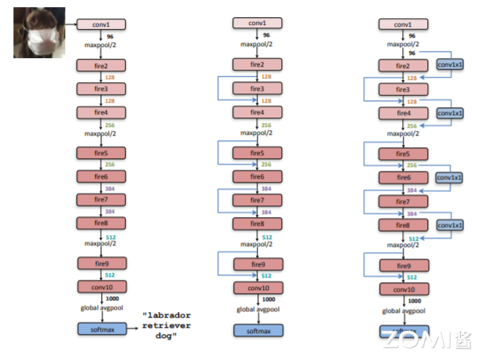
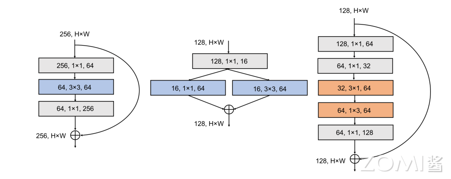

<!--Copyright © XcodeHw 适用于[License](https://github.com/chenzomi12/AISystem)版权许可-->

# SqueezeNet 系列(DONE)

本节将介绍 SqueezeNet 系列网络，在轻量化模型这个范畴中，Squeezenet 是最早的研究。主要针对了一些组件进行轻量化。与以往的网络都只讲网络如何设计不同。SqueezeNext 则从硬件角度分析如何加速，从而更全面地了解网络结构的设计。

## SqueezeNet

**SqueezeNet**：是轻量化主干网络中比较著名的，它发表于 ICLR 2017，在达到了 AlexNet 相同的精度的同时，只用了 AlexNet 1/50 的参数量。SqueezeNet 核心贡献在于使用 **Fire Module**(如下图所示)，即由 Squeeze 部分和 Expand 部分组成，Squeeze 部分是一组连续的 $1 \times 1$ 卷积组成，Expand 部分则是由一组连续的 $1 \times 1$ 卷积和 $3 \times 3$ 卷积 cancatnate 组成，在 Fire 模块中，Squeeze 部分的 $1\times1$ 卷积的通道数记做 $s_{1\times 1}$，Expand 部分 $1 \times 1$ 卷积和 $3 \times 3$ 卷积的通道数分别记做 $e_{1 \times 1}$ 和 $e_{3 \times 3}$。

在 Fire 中文章作者建议 $s_{1\times 1}$<$e_{1 \times 1}$+$e_{3 \times 3}$，这么做相当于两个 $3 \times 3$ 卷积中加入了瓶颈层。


### 压缩策略

SqueezeNet 算法的主要目标是构建轻量参数的 CNN 架构，同时不损失精度。为了实现这一目标，作者总共采用了三种策略来设计 CNN 架构，具体如下：

1. 减少卷积核大小：将 3×3 卷积替换成 1×1 卷积，可以使参数量减少 9 倍；
2. 减少卷积通道：减少 3×3 卷积通道数，一个 3×3 卷积的计算量是 3 × 3 × M × N ，通过将 M 和 N 减少以降低参数数量；
3. 下采样延后：将下采样操作延后，这样卷积层就有了大的激活图，保留更多信息。

### Fire 模块

**Fire 模块**组成：主要包括挤压层（squeeze） 和拓展层（expand）；

- **Squeeze**：只有 1×1 卷积滤波器 ；
- **Expand**：混合有 1×1 和 3×3 卷积滤波器 ；

并引入了三个调节维度的超参数 ：

- $s_{1\times1}$：squeeze 中 1 x 1 卷积滤波器个数；
- $e_{1\times1}$：expand 中 1 x 1 卷积滤波器个数；
- $e_{3\times3}$：expand 中 3 x 3 卷积滤波器个数；

```python
#Fire Module
class fire(nn.Module):
    def __init__(self,in_channel, out_channel):
        super(fire, self).__init__()
        self.conv1 = nn.Conv2d(in_channel,out_channel//8,kernel_size=1)        #  1x1 卷积
        self.conv2_1 = nn.Conv2d(out_channel//8,out_channel//2,kernel_size=1)   # 1x1 卷积
        self.conv2_2 = nn.Conv2d(out_channel//8,out_channel//2,kernel_size=3,padding= 3//2)   # 3x3 卷积
        self.BN1 = nn.BatchNorm2d(out_channel//4) # BN
        self.ReLU = nn.ReLU() #ReLU 激活函数
        
	#Fire Module 前向过程
    def forward(self,x):
        out = self.ReLU(self.BN1(self.conv1(x)))
        out1 = self.conv2_1(out)
        out2 = self.conv2_2(out)
        out  = self.ReLU(torch.cat([out1,out2],1)) # cat 进行拼接特征图
        return out
```

### 网络结构

在**Fire Module**的基础上搭建 SqueezeNet 神经网络，结构如下图所示。以卷积层开始，后面是 8 个 Fire Module，最后以卷积层结束，激活函数默认使用 ReLU，每个 Fire Module 中的通道数目逐渐增加，另外网络在 conv1、fire4、fire8、conv10 的后面使用了最大池化。

相同分辨率的 Fire Module 数量前面要少一点，后面要多一点，通道数通常以 32 或 64 的倍数增加。在通道数相同的层之间，添加旁路相加结构（short-cut）可以明显提升准确性（top-1 和 top-5 分别提升 2.9% 和 2.2%）。带有卷积的旁路结构可以在任意层之间添加（1*1 卷积调控 depth），准确性提升较小，模型增大。



```python
#导入所需的 pytorch 库
import torch
import torch.nn as nn

#SqueezeNet 网络
class SQUEEZENET(nn.Module):
    #初始化一些层和变量
    def __init__(self,in_channel, classses):
        super(SQUEEZENET, self).__init__()
        channels = [96,128,128,256,256,384,384,512,512]
        self.conv1 = nn.Conv2d(in_channel,channels[0],7,2,padding=7//2) #7x7 卷积
        self.pool1 = nn.MaxPool2d(kernel_size=3,stride=2) #最大池化
        self.BN1 = nn.BatchNorm2d(channels[0])
        self.block = fire  #fire Module
        self.block1 = nn.ModuleList([])
        #block 叠加
        for i in range(7):
            self.block1.append(self.block(in_channel = channels[i],out_channel = channels[i+1]))
            if i in [3,6]:
                self.block1.append(nn.MaxPool2d(kernel_size=3,stride=2))
        self.block1.append(self.block(channels[-2],channels[-1]))
        #Dropout 1x1 卷积激活函数
        self.conv10 = nn.Sequential(
            nn.Dropout(0.5),
            nn.Conv2d(channels[-1],classses,kernel_size=1,stride=1),
            nn.ReLU())

        self.pool2 = nn.MaxPool2d(kernel_size=13) #最大池化
	
    #SQUEEZENET 前向过程
    def forward(self,x):
        x = self.conv1(x)
        x = self.pool1(x)
        x = self.BN1(x)
        for block in self.block1:
            x = block(x)
        x = self.conv10(x)
        out = self.pool2(x)
        return out
```

## SqueezeNext

**SqueezeNext**：现有神经网络需要大的内存和计算资源是将其部署到嵌入式设备上的最大障碍。SqueezeNext 引入了神经网络加速技术。本文介绍的 SqueezeNext 可以达到 AlexNet 的准确度且参数数量比前者少 112 倍。另一版本的 SqueezeNext 模型可以达到 VGG-19 的精度且参数数量比原始 VGG-19 网络少 31 倍，仅为 4.4 Million。

SqueezeNext 在比 MobeilNet 参数数量少 1.3 倍的情况下取得了比其更好的 Top-5 分类精度，同时也没有使用在很多移动式设备上不足够高效的分离卷积。作者在相比 SqueezeNet/AlexNet 没有精度损失的情况下，设计出了比其运算速度快 2.59/8.26 倍的网络，且耗能比原来少 2.25/7.5 倍。

### Bottle 模块

Bottle 模块，加入 Shortcut ,Bottleneck module 和 Low Rank Filter 。改进如下:

- 将 expand 层的 3x3 卷积替换为 1x3 + 3x1 卷积，同时移除了 expand 层的拼接 1x1 卷积、添加了 1x1 卷积来恢复通道数。
- 通过两阶段的 squeeze 得到更激进的通道缩减，每个阶段的 squeeze 都将通道数减半。

```python
class Bottle(nn.Module):
    def __init__(self,in_channel,out_channel, stride):
        super(Bottle, self).__init__()
        '''
        3x3 卷积替换为 1x3 + 3x1 卷积，同时移除了 expand 层的拼接 1x1 卷积、添加了 1x1 卷积来恢复通道数。
        '''
        self.block = nn.Sequential(
            CONV_BN_RELU(in_channel, in_channel // 2, kernel_size=1,stride = stride,padding=0),
            CONV_BN_RELU(in_channel // 2, in_channel // 4, kernel_size=1,padding=0),
            CONV_BN_RELU(in_channel // 4, in_channel // 2, kernel_size=(1,3), padding=(0,3//2)),
            CONV_BN_RELU(in_channel // 2, in_channel//2, kernel_size=(3,1),padding=(3//2,0)),
            CONV_BN_RELU(in_channel//2 , out_channel, kernel_size=1,padding=0),
        )
        self.shortcut = nn.Sequential()
        '''
        Shortcut
        '''
        if stride==2 or out_channel!=in_channel:
            self.shortcut = nn.Sequential(
                nn.Conv2d(in_channel, out_channel, kernel_size=3,stride = stride, padding=1),
                nn.BatchNorm2d(out_channel)
            )

    def forward(self,x):
        out1 = self.block(x)
        out2 = self.shortcut(x)
        x = out1+out2
        return x
```

### 两阶段 Bottleneck

每一个卷积层中的参数数量正比于 $C_{i}$ 和 $C_{o}$ 的乘积。所以，减少输入通道的数量可以有效减少模型的大小。一种思路是使用分离卷积减少参数数量，但是某些嵌入式系统由于其用于计算的带宽的限制，分离卷积的性能较差。另一种思路是 squeezeNet 中提出的在 $3 \times 3$ 卷积之前使用 squeeze 层以减少 $3 \times3$ 卷积的输入通道数目。这里作者在 SqueezeNet 的基础上进行了演化，使用了如下图所示的两层 squeeze 层。

在 SqueezeNext 模块中，使用了两层 bottleneck，每一层都将通道数减小为原来的 1/2，然后使用了两个分离卷积层。最后使用了一层 $1 \times 1$ 卷积的扩充层，进一步减少了分离卷积输出数据的通道数。



### 低秩过滤器

假设网络第 $i$ 层的输入为 $x∈R^{H\times W \times C_{i}}$，卷积核大小为 $K \times K$，输出大小为 $y∈R^{H\times W \times C_{o}}$，这里假设输入和输出的空间尺寸相同，输入和输出的通道数分别是 $C_{i}$ 和 $C_{o}$。该层的总的参数数量为 $K^{2}C_{i}C_{o}$，即 $C_{o}$ 个大小为 $K \times K \times C_{i}$ 的卷积核。

在对已有模型进行压缩的实现中，尝试对现有参数 W 压缩成 $\hat{W}$ 可以通过 CP 或者 Tucker 分解获取 $ \hat{W}$。通过这些方法减小的参数量正比于原始参数矩阵 W 的秩。

然而，检查当前各主流模型的参数 W，可以发现其都有比较高的秩。所以，当前模型压缩方法都进行了一定的重训练以恢复准确率。主流的模型压缩方法包括对参数进行剪枝以减少非零参数的数量，或者减小参数的精度。

另外一种思路是使用低秩参数矩阵 $\hat{W}$ 重新设计网络，这也是本文作者所采用的方法。作者所作的第一个变化是将 $K \times K$ 的矩阵分解为两个独立的 $1 \times K$ 和 $ K \times 1$ 卷积。这样做有效地将参数数量从 $K^2$ 减少成了 2K，同时增加了网络的深度。两个卷积层后都使用了 ReLu 激活函数和 BN 层。

### 全连接层

AlexNet96%的参数来自于全连接层，SqueezeNet 和 ResNet 中都只包含一个全连接层。假设输入数据为 $H \times W \times C_{i}$ ，那么最后的全连接层的参数数量为 $H \times W \times C_{i} \times L_{i}$，L 表示输出的类别数。SqueezeNext 在最后一个全连接层之前使用了一个 bottleneck 层，进一步减少了参数数量。


### 网络结构与实现

SqueezeNext 的设计就是不断的堆叠上图的 block，在模拟硬件性能实验结果中发现，维度越低，计算性能也越低效，于是将更多的层操作集中在维度较高的 block。

SqueezeNext-23 结构如下图所示:


其代码实现具体如下所示：

```python
import torch
import torch.nn as nn

#卷积+BN+激活函数
class CONV_BN_RELU(nn.Module):
    def __init__(self,in_channel,out_channel,kernel_size,padding,stride=1):
        super(CONV_BN_RELU, self).__init__()

        self.conv = nn.Sequential(
            nn.Conv2d(in_channel,out_channel,kernel_size,stride = stride, padding = padding),
            nn.BatchNorm2d(out_channel),
            nn.ReLU()
        )
    def forward(self,x):
        x = self.conv(x)
        return x

#SqueezeNext 网络
class SQUEEZENEXT(nn.Module):
    
    #初始化一些层和变量
    def __init__(self, in_channel, classes):
        super(SQUEEZENEXT, self).__init__()
        channels = [64,32,64,128,256]
        depth = [6,6,8,1]

        self.conv1 = nn.Sequential(nn.Conv2d(in_channel,channels[0],7,2,padding=7//2),
                                   nn.MaxPool2d(kernel_size=3,stride=2),
                                   nn.BatchNorm2d(channels[0]),
                                   nn.ReLU())
        self.block = Bottle
        self.stage1 = self._make_stage(6,channels[0],channels[1],stride = 1)
        self.stage2 = self._make_stage(6, channels[1], channels[2], stride=2)
        self.stage3 = self._make_stage(8, channels[2], channels[3], stride=2)
        self.stage4 = self._make_stage(1, channels[3], channels[4], stride=2)
        self.pool = nn.MaxPool2d(7)
        self.fc = nn.Linear(channels[4],classes)
        
	#每个 stage 层中所含的 block
    def _make_stage(self, num_stage, inchannel, ouchannel, stride):
        strides = [stride] + [1]*(num_stage-1)
        layer = []
        for i in range(num_stage):
            layer.append(self.block(inchannel,ouchannel,strides[i]))
            inchannel = ouchannel
        return nn.Sequential(*layer)

	#前向传播过程
    def forward(self,x):
        x = self.conv1(x)
        x = self.stage1(x)
        x = self.stage2(x)
        x = self.stage3(x)
        x = self.stage4(x)
        x = self.pool(x)
        x = x.view(x.size(0),-1)
        x = self.fc(x)
        return x
```

## 小结与思考

- SqueezeNet 系列是比较早期且经典的轻量级网络，其使用 Fire 模块进行参数压缩，而 SqueezeNext 则在此基础上加入分离卷积进行改进。

- 虽然 SqueezeNet 系列不如 MobieNet 使用广泛，但其架构思想和实验结论还是可以值得借鉴的。

## 本节视频

<html>
<iframe src="https://player.bilibili.com/player.html?bvid=BV1Y84y1b7xj&as_wide=1&high_quality=1&danmaku=0&t=30&autoplay=0" width="100%" height="500" scrolling="no" border="0" frameborder="no" framespacing="0" allowfullscreen="true"> </iframe>
</html>
