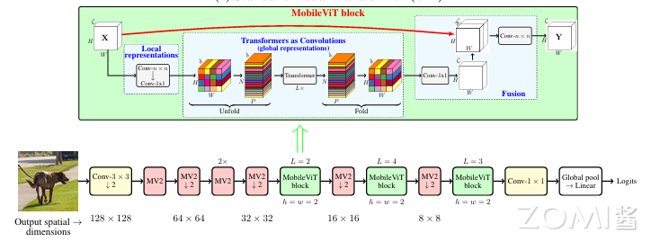
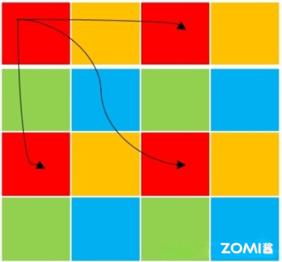
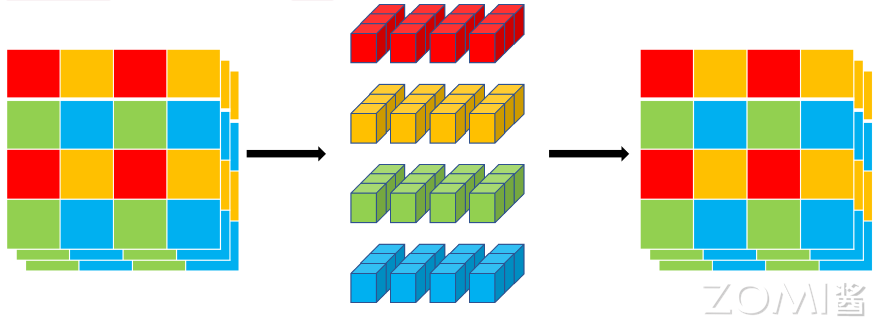
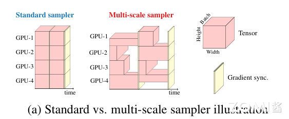
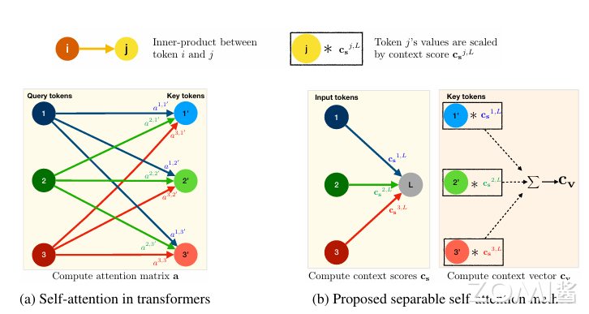
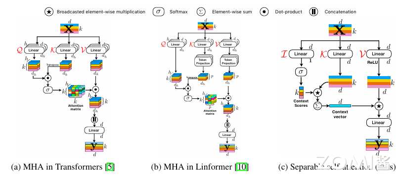
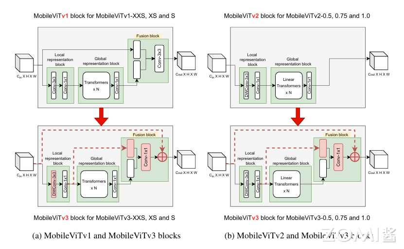

<!--Copyright © XcodeHw 适用于[License](https://github.com/chenzomi12/AISystem)版权许可-->

# MobileVit 系列

自 Vision Transformer 出现之后，人们发现 Transformer 也可以应用在计算机视觉领域，并且效果还是非常不错的。但是基于 Transformer 的网络模型通常具有数十亿或数百亿个参数，这使得它们的模型文件非常大，不仅占用大量存储空间，而且在训练和部署过程中也需要更多的计算资源。所以在本节中会介绍关于 Transformer 一些轻量化工作。

## MobileVit V1 模型

**MobileVit  V1** :MobileViT 是一种基于 ViT（Vision Transformer）架构的轻量级视觉模型，旨在适用于移动设备和嵌入式系统。ViT 是一种非常成功的神经网络模型，用于图像分类和其他计算机视觉任务，但通常需要大量的计算资源和参数。MobileViT 的目标是在保持高性能的同时，减少模型的大小和计算需求，以便在移动设备上运行，据作者介绍，这是第一次基于轻量级 CNN 网络性能的轻量级 ViT 工作，性能 SOTA。性能优于 MobileNetV3、CrossviT 等网络。

### Mobile ViT 块

标准卷积涉及三个操作：展开+局部处理+折叠，利用 Transformer 将卷积中的局部建模替换为全局建模，这使得 MobileViT 具有 CNN 和 ViT 的性质。MobileViT Block 如下图所示:



 从上面的模型可以看出，首先将特征图通过一个卷积层，卷积核大小为 $n\times n$，然后再通过一个卷积核大小为 $1\times 1$ 的卷积层进行通道调整，接着依次通过 Unfold、Transformer、Fold 结构进行全局特征建模，然后再通过一个卷积核大小为 $1\times 1$ 的卷积层将通道调整为原始大小，接着通过 shortcut 捷径分支与原始输入特征图按通道 concat 拼接，最后再通过一个卷积核大小为 $n\times n$ 的卷积层进行特征融合得到最终的输出。这里可能会对 folod 和 unfold 感到迷惑，所以这个地方的核心又落到了 global representation 部分(图中中间蓝色字体部分)。



我们以单通道特征图来分析 global representation 这部分做了什么，假设 patch 划分的大小为 $2\times 2$，实际中可以根据具体要求自己设置。在 Transformer 中对于输入的特征图，我们一般是将他整体展平为一维向量，在输入到 Transformer 中，在 self-attention 的时候，每个图中的每个像素和其他的像素进行计算，这样计算量就是：

$$
P_{1}= WHC 
$$

其中，W、H、C 分别表示特征图的宽，高和通道个数。

在 Mobile-ViT 中的是先对输入的特征图划分成一个个的 patch，再计算 self-attention 的时候只对相同位置的像素计算，即图中展示的颜色相同的位置。这样就可以相对的减少计算量，这个时候的计算量为:

$$
P_{2} = \frac{WHC}{4}
$$

简单理解一张图像的每个像素点的周围的像素值都差不多，并且分辨率越高相差越小，所以这样做并不会损失太多的信息。而且 Mobile-ViT 在做全局表征之前已经做了一次局部表征了(图中的蓝色字体)。

我们再来介绍下 unfold 和 fold 到底是什么意思。unfold 就是将颜色相同的部分拼成一个序列输入到 Transformer 进行建模。最后再通过 fold 是拼回去。如下图所示：



Local representations 表示输入信息的局部表达。在这个部分，输入 MobileViT Block 的数据会经过一个 $n \times n$ 的卷积块和一个 $1 \times 1$ 的卷积块。

从上文所述的 CNN 的空间归纳偏差就可以得知：经过 $ n \times n$ 的卷积块的输出获取到了输入模型的局部信息表达（因为卷积块是对一个整体块进行操作，但是这个卷积核的 n 是远远小于数据规模的，所以是局部信息表达，而不是全局信息表达）。另外，$1 \times 1$ 的卷积块是为了线性投影，将数据投影至高维空间。例如：对于 $9\times 9$ 的数据，使用 $3\times 3$ 的卷积层，获取到的每个数据都是对 $9\times 9$ 数据的局部表达。

Transformers as Convolutions (global representations)

Transformers as Convolutions (global representations) 表示输入信息的全局表示。在 Transformers as Convolutions 中首先通过 Unfold 对数据进行转换，转化为 Transformer 可以接受的 1D 数据。然后将数据输入到 Transformer 块中。最后通过 Fold 再将数据变换成原有的样子。

**Fusion 融合**

在 Fusion 中，经过 Transformers as Convolutions 得到的信息与原始输入信息 $(A ∈ R^{H\times W\times C}) $ 进行合并，然后使用另一个 $n\times n$ 卷积层来融合这些连接的特征。这里得到的信息指的是全局表征 $X_{F}\in R^{H\times W\times C}$

```python
#Mobile Vit 块的实现
class MobileViTBlock(nn.Module):

    def __init__(
        self,
        in_channels: int,
        transformer_dim: int,
        ffn_dim: int,
        n_transformer_blocks: int = 2,
        head_dim: int = 32,
        attn_dropout: float = 0.0,
        dropout: float = 0.0,
        ffn_dropout: float = 0.0,
        patch_h: int = 8,
        patch_w: int = 8,
        conv_ksize: Optional[int] = 3,
        *args,
        **kwargs
    ) -> None:
        super().__init__()

        # 下面两个卷积层：Local representations
        conv_3x3_in = ConvLayer(
            in_channels=in_channels,
            out_channels=in_channels,
            kernel_size=conv_ksize,
            stride=1
        )
        conv_1x1_in = ConvLayer(
            in_channels=in_channels,
            out_channels=transformer_dim,
            kernel_size=1,
            stride=1,
            use_norm=False,
            use_act=False
        )

        # 下面两个卷积层：Fusion
        conv_1x1_out = ConvLayer(
            in_channels=transformer_dim,
            out_channels=in_channels,
            kernel_size=1,
            stride=1
        )
        conv_3x3_out = ConvLayer(
            in_channels=2 * in_channels,
            out_channels=in_channels,
            kernel_size=conv_ksize,
            stride=1
        )

        # 局部表征
        self.local_rep = nn.Sequential()
        self.local_rep.add_module(name="conv_3x3", module=conv_3x3_in)
        self.local_rep.add_module(name="conv_1x1", module=conv_1x1_in)

        assert transformer_dim % head_dim == 0
        num_heads = transformer_dim // head_dim

        # 全局表征
        global_rep = [
            TransformerEncoder(
                embed_dim=transformer_dim,
                ffn_latent_dim=ffn_dim,
                num_heads=num_heads,
                attn_dropout=attn_dropout,
                dropout=dropout,
                ffn_dropout=ffn_dropout
            )
            for _ in range(n_transformer_blocks)
        ]
        global_rep.append(nn.LayerNorm(transformer_dim))
        self.global_rep = nn.Sequential(*global_rep)

        # Fusion
        self.conv_proj = conv_1x1_out
        self.fusion = conv_3x3_out

        self.patch_h = patch_h
        self.patch_w = patch_w
        self.patch_area = self.patch_w * self.patch_h

        self.cnn_in_dim = in_channels
        self.cnn_out_dim = transformer_dim
        self.n_heads = num_heads
        self.ffn_dim = ffn_dim
        self.dropout = dropout
        self.attn_dropout = attn_dropout
        self.ffn_dropout = ffn_dropout
        self.n_blocks = n_transformer_blocks
        self.conv_ksize = conv_ksize

    def unfolding(self, x: Tensor) -> Tuple[Tensor, Dict]:
        patch_w, patch_h = self.patch_w, self.patch_h
        patch_area = patch_w * patch_h
        batch_size, in_channels, orig_h, orig_w = x.shape

        new_h = int(math.ceil(orig_h / self.patch_h) * self.patch_h)
        new_w = int(math.ceil(orig_w / self.patch_w) * self.patch_w)

        interpolate = False
        if new_w != orig_w or new_h != orig_h:
            # 注意：Padding 是可以完成的，但需要在注意力函数中进行处理
            x = F.interpolate(x, size=(new_h, new_w), mode="bilinear", align_corners=False)
            interpolate = True

        # 宽度和高度上的 patch 数量
        num_patch_w = new_w // patch_w  # n_w
        num_patch_h = new_h // patch_h  # n_h
        num_patches = num_patch_h * num_patch_w  # N

        # [B, C, H, W] -> [B * C * n_h, p_h, n_w, p_w]
        x = x.reshape(batch_size * in_channels * num_patch_h, patch_h, num_patch_w, patch_w)
        # [B * C * n_h, p_h, n_w, p_w] -> [B * C * n_h, n_w, p_h, p_w]
        x = x.transpose(1, 2)
        # [B * C * n_h, n_w, p_h, p_w] -> [B, C, N, P] where P = p_h * p_w and N = n_h * n_w
        x = x.reshape(batch_size, in_channels, num_patches, patch_area)
        # [B, C, N, P] -> [B, P, N, C]
        x = x.transpose(1, 3)
        # [B, P, N, C] -> [BP, N, C]
        x = x.reshape(batch_size * patch_area, num_patches, -1)

        info_dict = {
            "orig_size": (orig_h, orig_w),
            "batch_size": batch_size,
            "interpolate": interpolate,
            "total_patches": num_patches,
            "num_patches_w": num_patch_w,
            "num_patches_h": num_patch_h,
        }

        return x, info_dict

    def folding(self, x: Tensor, info_dict: Dict) -> Tensor:
        n_dim = x.dim()
        assert n_dim == 3, "Tensor should be of shape BPxNxC. Got: {}".format(
            x.shape
        )
        # [BP, N, C] --> [B, P, N, C]
        x = x.contiguous().view(
            info_dict["batch_size"], self.patch_area, info_dict["total_patches"], -1
        )

        batch_size, pixels, num_patches, channels = x.size()
        num_patch_h = info_dict["num_patches_h"]
        num_patch_w = info_dict["num_patches_w"]

        # [B, P, N, C] -> [B, C, N, P]
        x = x.transpose(1, 3)
        # [B, C, N, P] -> [B*C*n_h, n_w, p_h, p_w]
        x = x.reshape(batch_size * channels * num_patch_h, num_patch_w, self.patch_h, self.patch_w)
        # [B*C*n_h, n_w, p_h, p_w] -> [B*C*n_h, p_h, n_w, p_w]
        x = x.transpose(1, 2)
        # [B*C*n_h, p_h, n_w, p_w] -> [B, C, H, W]
        x = x.reshape(batch_size, channels, num_patch_h * self.patch_h, num_patch_w * self.patch_w)
        if info_dict["interpolate"]:
            x = F.interpolate(
                x,
                size=info_dict["orig_size"],
                mode="bilinear",
                align_corners=False,
            )
        return x

    def forward(self, x: Tensor) -> Tensor:
        res = x

        fm = self.local_rep(x)

        # 转换 feature map to patches
        patches, info_dict = self.unfolding(fm)

        # 学习全局表征
        for transformer_layer in self.global_rep:
            patches = transformer_layer(patches)

        # [B x Patch x Patches x C] -> [B x C x Patches x Patch]
        fm = self.folding(x=patches, info_dict=info_dict)

        fm = self.conv_proj(fm)

        fm = self.fusion(torch.cat((res, fm), dim=1))
        return fm
```

### 多尺度采样训练

在基于 ViT 的模型中，学习多尺度表示的标准方法是微调。例如，在不同尺寸上对经过 224×224 空间分辨率训练的 DeiT 模型进行了独立微调。由于位置嵌入需要根据输入大小进行插值，而网络的性能受插值方法的影响，因此这种学习多尺度表示的方法对 vit 更有利。与 CNN 类似，MobileViT 不需要任何位置嵌入，它可以从训练期间的多尺度输入中受益。

先前基于 CNN 的研究表明，多尺度训练是有效的。然而，大多数都是经过固定次数的迭代后获得新的空间分辨率。

例如，YOLOv2 在每 10 次迭代时从预定义的集合中采样一个新的空间分辨率，并在训练期间在不同的 gpu 上使用相同的分辨率。这导致 GPU 利用率不足和训练速度变慢，因为在所有分辨率中使用相同的批大小(使用预定义集中的最大空间分辨率确定)。



### 网络结构实现

在论文中，关于 MobileViT 作者提出了三种不同的配置，分别是 MobileViT-S(small)，MobileViT-XS(extra small)和 MobileViT-XXS(extra extra small)。三者的主要区别在于特征图的通道数不同。下图为 MobileViT 的整体框架，最开始的 3x3 卷积层以及最后的 1x1 卷积层、全局池化、全连接层不去赘述，主要看下图中的标出的 Layer1~5，这里是根据源码中的配置信息划分的。下面只列举了部分配置信息。


组成部分（从左至右）：

普通卷积层：用于对输入图像进行预处理和特征提取。

MV2（MobileNetV2 中的 Inverted Residual block）：一种轻量级的卷积块结构，用于在网络中进行下采样操作。

MobileViT block：MobileViT 的核心组件，由多个 Transformer block 组成，用于对图像特征进行全局上下文的建模和特征融合。

全局池化层：用于将特征图进行降维，得到全局特征。

全连接层：用于将全局特征映射到最终的预测输出。

```python
# MV2 结构
class InvertedResidual(nn.Module):


    def __init__(
        self,
        in_channels: int,
        out_channels: int,
        stride: int,
        expand_ratio: Union[int, float],
        skip_connection: Optional[bool] = True,
    ) -> None:
        assert stride in [1, 2]
        hidden_dim = make_divisible(int(round(in_channels * expand_ratio)), 8)

        super().__init__()

        block = nn.Sequential()
        if expand_ratio != 1:
            block.add_module(
                name="exp_1x1",
                module=ConvLayer(
                    in_channels=in_channels,
                    out_channels=hidden_dim,
                    kernel_size=1
                ),
            )

        block.add_module(
            name="conv_3x3",
            module=ConvLayer(
                in_channels=hidden_dim,
                out_channels=hidden_dim,
                stride=stride,
                kernel_size=3,
                groups=hidden_dim
            ),
        )

        block.add_module(
            name="red_1x1",
            module=ConvLayer(
                in_channels=hidden_dim,
                out_channels=out_channels,
                kernel_size=1,
                use_act=False,
                use_norm=True,
            ),
        )

        self.block = block
        self.in_channels = in_channels
        self.out_channels = out_channels
        self.exp = expand_ratio
        self.stride = stride
        self.use_res_connect = (
            self.stride == 1 and in_channels == out_channels and skip_connection
        )

    def forward(self, x: Tensor, *args, **kwargs) -> Tensor:
        if self.use_res_connect:
            return x + self.block(x)
        else:
            return self.block(x)
```

## MobileVit V2 模型

**MobileVit V2 **:MobileViT 的主要效率瓶颈是 Transformer 中的多头自注意力（MHA），它需要相对于 tokens（或 patches）数量 k 的时间复杂度。此外，MHA 需要昂贵的操作来计算自注意力，从而影响资源受限设备的延迟。MobileVit V2 则是一种具有 O(k)线性复杂度的可分离的自注意力方法。所提出方法的一个简单而有效的特征是它使用元素操作来计算自注意力，使其成为资源受限设备的不错选择。

### 可分离的自注意力

MHA（下图 a）允许 Transformer 对 tokens 间的关系进行编码。具体来说，MHA 将输入喂到三个分支，即查询 Q、键 K 和值 V。每个分支（Q、K 和 V）由输入 $x\in R^{k \times d}$ 组成，其中包含 k 个 d 维 tokens（或 patches）嵌入。每个分支包含(Q、K 和 V)包含 h 个头（或层），可以使 Transformer 学习输入的多个视角。然后将输入 x 馈入所有 h 个头，然后进行 softmax 操作 σ 以在 Q 和 K 的线性层的输出之间产生注意力（或上下文映射）点积，然后同时计算矩阵 
 $a\in R^{k\times k \times h}$。然后在 a 和 V 线性层的输出之间计算另一个点积，以产生加权和输出 $y_{w}\in R^{k\times d_{h}\times h}$，其中 $d_{h}=\frac{d}{h}$ 是头部尺寸。这 h 个头的输出被连接起来产生一个带有 k 个 d 维 tokens 的张量，馈送到另一个具有权重 $W_{o}\in R^{d \times d}$ 的线性层以产生 MHA $y \in R^{k \times d}$ 的输出。然后在数学上，这个操作可以描述为：

$$
y=Concat\Bigg(\underbrace{<σ(<xW_{Q}^{0},xW_{k}^{0}>),xW_{v}^{0}>}_{a^{0} \in R^{k \times k}}..., \underbrace{<σ(<xW_{Q}^{h},xW_{k}^{h}>),xW_{v}^{h}>}_{a^{h} \in R^{k \times k}}
\Bigg)W_{o}\tag{1}
$$

其中 $W_{Q}^{i} \in R^{d \times d_{h}}$,$W_{K}^{i} \in R^{d \times d_{h}}$,$W_{V}^{i} \in R^{d \times d_{h}}$ 是第 i 个线性层的(或头部)分别在 Q、K 和 V 分支中的权重。符号<.,.>表示点积运算。



可分离自注意力的结构则受到了 MHA 的启发。与 MHA 类似，输入 x 使用三个分支处理，即输入 I、键 K 和值 V。输入分支 I 映射上图 b 中的每个 d 维潜在节点 L。该线性映射是内积运算，并使用权重 $W_{I} \in R^{d}$ 的线性层将 x 中的 tokens 计算为标量。权重 $W_{I}$ 用作潜在 token L 和 x 之间的距离，从而产生一个 k 维向量。然后将 softmax 操作应用于这个 k 维向量以产生上下文分数 $c_{s} \in R^{k}$。与针对所有 k 个 tokens 计算每个 tokens 的注意力（或上下文）分数的 Transformer 不同，所提出的方法仅计算关于潜在 tokens L 的上下文分数。这降低了计算注意力（或上下文）分数的成本 $O(k^{2})$ 到 O(k)。

上下文分数 $c_{s}$ 用于计算上下文向量 $c_{v}$。具体来说，输入 x 是线性输出 $x_{K}\in R^{k \times d}$。使用权重 $W_{K} \in R^{d \times d}$ 的键分支 K 映射到 d 维空间，以产生输出 $x_{K}$ 。然后将上下文向量 $c_{v}\in R^{d}$ 计算为 $x_{K}$ 的加权和：

$$
c_{v} = \sum_{i=1}^{k}c_{s}(i)x_{K(i)} \tag{2} 
$$

上下文向量 $c_{v}$ 在某种意义上类似等式(1)中的注意力矩阵 a,它也编码输入 x 中所有 tokens 的信息，但计算成本较低。

$c_{v}$ 中编码的上下文信息与 x 中的所有 tokens 共享。为此，输入 x 然后通过广播的逐元素乘法运算传播到 $x_{V}$。结果输出后跟 ReLU 激活函数以产生输出 $x_{V} \in R^{k\times d }$。$c_{v}$ 中的上下文信息使用权重 $W_{v} \in R^{d\times d}$ 的值分支 V 线性映射到 d 维空间，然后将其馈送到权重 $W_{o} \in R^{d \times d}$ 的另一个线性层以产生最终输出 $y \in R^{k \times d}$。在数学上，可分离自注意力可以定义为:

$$
y = \Bigg( \underbrace{\sum \bigg( \overbrace{σ(xW_{I})}^{c_{s}\in R^{k}} *xW_{K} \bigg)}_{c_{v} \in R^{d}}*ReLU(xW_{V})       \Bigg )
$$

其中*和 $\sum$ 分别是可广播的逐元素乘法和求和运算。

与自注意力方法的比较。下图将所提出的方法与 Transformer 和 Linformer 进行了比较。由于自注意力方法的时间复杂度没有考虑用于实现这些方法的操作成本，因此某些操作可能会成为资源受限设备的瓶颈。为了整体理解，除了理论指标外，还测量了具有不同 k 的单个 CPU 内核上的模块级延迟。与 Transformer 和 Linformer 中的 MHA 相比，所提出的可分离自注意力快速且高效。



除了这些模块级结果之外，当我们用 MobileViT 架构中提出的可分离自注意力替换 Transformer 中的 MHA 时，我们观察到在 ImageNet-1k 数据集上具有相似性能的推理速度提高了 3 倍（表 1）。这些结果显示了所提出的可分离自注意力在架构级别的有效性。请注意，Transformer 和 Linformer 中的自注意力对 MobileViT 产生了类似的结果。这是因为与语言模型相比，MobileViT 中的 tokens k 数量更少（k ≤ 1024），其中 Linformer 明显快于 Transformer。

| Attention unit | Latency $\downarrow$ | Top-1 $\uparrow$     |
| -- | --- | - |
| Self-attention in Transformer | 9.9ms | **78.4** |
| Self.attention in Linformer | 10.2ms | 78.2 |
| Separable self-attention | **3.4**ms | 78.1 |

**与加法的关系。** 所提出的方法类似于 Bahdanau 等人的注意力机制，它还通过在每个时间步取 LSTM 输出的加权和来对全局信息进行编码。不同之处，输入 tokens 通过递归进行交互，所提出方法中的输入 tokens 仅与潜在 tokens 交互。

### 网络结构实现

为了证明所提出的可分离自注意力在资源受限设备上的有效性，将可分离自注意力与最近基于 ViT 的模型 MobileViT 相结合。MobileViT 是一个轻量级、对移动设备友好的混合网络，其性能明显优于其他基于 CNN、基于 Transformer 或混合模型的竞争模型，包括 MobileNets。

MobileViTv2 将 MobileViTv1 中的 Transformer 块中的 MHA 替换为提出的可分离自注意力方法。也没有在 MobileViT 块中使用 skip-connection 连接和融合块，因为它略微提高了性能。此外，为了创建不同复杂度的 MobileViTv2 模型，我们使用宽度乘数 α ∈ {0.5, 2.0} 统一缩放 MobileViTv2 网络的宽度。这与为移动设备训练三种特定架构（XXS、XS 和 S）的 MobileViTv1 形成对比。

```python
#线性注意力
class LinearAttnFFN(nn.Module):

    def __init__(self,
                 embed_dim: int,
                 ffn_latent_dim: int,
                 dropout: Optional[float] = 0.1,
                 attn_dropout: Optional[float] = 0.0,
                 ffn_dropout: Optional[float] = 0.0,
                 attn_act: Optional[Union[nn.Module, dict]] = nn.ReLU,
                 attn_norm_layer: Optional[Union[nn.Module, dict]] = nn.LayerNorm,
                 inplace: Optional[bool] = False):
        super(LinearAttnFFN, self).__init__()

        attn_unit = LinearSelfAttention(embed_dim=embed_dim,
                                        attn_dropout=attn_dropout,
                                        inplace=inplace,
                                        bias=True)
        self.pre_norm_attn = nn.Sequential(
            attn_norm_layer(embed_dim) if isinstance(attn_norm_layer, nn.Module) else eval(
                attn_norm_layer['name'])(embed_dim),
            attn_unit,
            nn.Dropout(dropout, inplace=inplace))

        self.pre_norm_ffn = nn.Sequential(
            attn_norm_layer(embed_dim) if isinstance(attn_norm_layer, nn.Module) else eval(attn_norm_layer['name'])(
                embed_dim),
            nn.Conv2d(in_channels=embed_dim, out_channels=ffn_latent_dim, kernel_size=1, stride=1, bias=True),
            attn_act() if isinstance(attn_act, nn.Module) else eval(attn_act['name'])(**attn_act['param']),
            nn.Dropout(ffn_dropout, inplace=inplace),
            nn.Conv2d(in_channels=ffn_latent_dim, out_channels=embed_dim, kernel_size=1, stride=1, bias=True),
            nn.Dropout(dropout, inplace=inplace)
        )

    def forward(self, x: torch.Tensor):
        x = x + self.pre_norm_attn(x)
        # 前馈网络
        x = x + self.pre_norm_ffn(x)
        return x


class LinearSelfAttention(nn.Module):

    def __init__(
            self,
            embed_dim: int,
            attn_dropout: Optional[float] = 0.0,
            inplace: Optional[bool] = False,
            bias: Optional[bool] = True):
        super().__init__()

        self.inplace = inplace
        self.qkv_proj = nn.Conv2d(in_channels=embed_dim, out_channels=1 + (2 * embed_dim), bias=bias, kernel_size=1)
        self.attn_dropout = nn.Dropout(p=attn_dropout, inplace=inplace)
        self.out_proj = nn.Conv2d(in_channels=embed_dim, out_channels=embed_dim, bias=bias, kernel_size=1)
        self.embed_dim = embed_dim

    def forward(self, x):
        qkv = self.qkv_proj(x)
        # 映射 x 到 query, key and value
        # Query --> [B, 1, P, N]
        # value, key --> [B, d, P, N]
        query, key, value = torch.split(qkv,
                                        split_size_or_sections=[1, self.embed_dim, self.embed_dim],
                                        dim=1)
   
        context_scores = F.softmax(query, dim=-1)
        # 
        context_scores = self.attn_dropout(context_scores)
        # 计算上下文向量
        # [B, d, P, N] x [B, 1, P, N] -> [B, d, P, N]
        context_vector = key * context_scores
        # [B, d, P, N] --> [B, d, P, 1]
        context_vector = torch.sum(context_vector, dim=-1, keepdim=True)
        # combine context vector with values
        # [B, d, P, N] * [B, d, P, 1] --> [B, d, P, N]
        out = F.relu(value, inplace=self.inplace) * context_vector.expand_as(value)
        out = self.out_proj(out)
        return out
```

## MobileVit V3 模型

虽然 Mobilevit V1 具有竞争力的最先进的结果，但 Mobilevit v1 块中的融合模块比较复杂难以学习。在 MobileVit V3 版本则提出对融合块进行简单有效的修改，以创建 mobilevitv3 块，解决了伸缩问题，简化了学习任务。

### MobileViTV3 模块

在ＭobileViTv2 体系结构中删除了融合块，并使用了线性复杂度的 Transformer 得到了比 MobileViTv1 更好的性能。将本文提出的融合块添加到 MobileViTv2 中，以创建 MobileViTv3-0.5,0.75 和 1.0 模型，如下图所示。



**1、 融合块中用 1x1 卷积层替换 3x3 卷积层。**优势就在于 1x1 卷积核会使用更少的权重参数数量。在输入尺寸不发生改变的情况下而增加了非线性，所以会增加整个网络的表达能力。

在融合模块中替换 3×3 卷积层存在两个主要动机。首先，融合部分独立于特征图中其他位置的局部和全局特征，以简化融合模块的学习任务。从概念上讲，3×3 卷积层融合了输入特征、全局特征以及其他位置的输入和全局特征，这是一项复杂的任务。融合模块的目标可以简化，因为它可以融合输入和全局特征，而不依赖于特征图中的其他位置。因此，作者在融合中使用 1×1 卷积层，而不是 3×3 卷积层。

其次，将 3×3 卷积层替换为 1×1 卷积层是消除 MobileViTv1 架构扩展中的主要限制之一。通过改变网络宽度并保持深度恒定，将 MobileViT-v1 从 XXS 扩展到 S。更改 MobileViTv1 Block 的宽度（输入和输出通道数）会导致参数和 FLOP 的数量大幅增加。例如，如果输入和输出通道在 MobileViTv1 Block 中加倍（2×），则融合模块内 3×3 卷积层的输入通道数增加 4×，输出通道数增加 2×，因为输入到 3×3 卷积层的是输入和全局表示块特征的串联。这导致 MobileViTv1 Block 的参数和 FLOP 大幅增加。使用 1×1 卷积层可避免在缩放时参数和 FLOP 的大幅增加。

**2、本地和局部特征融合。**在融合层，来自本地和全局表示块的特征被连接到我们提出的 MobileViTv3 块中，而不是输入和全局表示特征。这是因为与输入特征相比，局部表示特征与全局表示特征更密切相关。局部表示块的输出通道略高于输入特征的通道。这导致输入特征映射到融合块的 1x1 卷积层的数量增加，但由于 3x3 卷积层改为 1x1 卷积层，参数和 flop 的总数明显少于基线 MobileViTv1 块

**3、融合输入。**在论文中说：ResNet 和 DenseNet 等模型中的残余连接已证明有助于优化体系结构中的更深层次。并且增加了这个残差结构后，消融实验证明能够增加 0.6 个点。如下表所示。

| Model | Conv 3x3 | Conv 1x1 | Input Concat | Local Concat | Input Add | DW Conv | Top-1(%)$\uparrow$ |
| -- | -- | -- | --- | --- | --- | - | - |
| MobileVitv1-s | √ |          | √ |              |           |         | 73.7($\uparrow$ 0.0%) |
| MobileVitv3-s |          | √ | √ |              |           |         | 74.8($\uparrow$ 1.1%) |
| MobileVitv3-s |          | √ |              | √ |           |         | 74.7($\uparrow$ 1.0%) |
| MobileVitv3-s |          | √ |              | √ | √ |         | 75.3($\uparrow$ 1.6%) |
| MobileVitv3-s |          | √ |              | √ | √ | √ | 75.0($\uparrow$ 1.3%) |

**4、在融合模块中将一般卷积变成了深度可分离卷积。**这一部分的改进从消融研究结果中可以看出，这一变化对 Top-1 ImageNet-1K 的精度增益影响不大，从上表最后一行看出，掉了 0.3 个点，但是能够提供了良好的参数和精度权衡。

通过上面的几点，可以更好的对 MobileViT 块进行扩展，带来的优势也是非常巨大的，如下表所示，在参数量控制在 6M 以下，达到的效果也是非常惊人的，Top-1 的精确度都快接近 80%了。

| Layer    | Size    | Stride | Repeat | XXS  | XS   | S    |
| -- | - | --- | --- | - | - | - |
| Image    | 256x256 | 1      |        |      |      |      |
| Conv 3x3$\downarrow$ 2 | 128x128 | 2 | 1 | 16 | 16 | 16 |
| MV2 | 128x128 | 2 | 1 | 16 | 32 | 32 |
| MV2$\downarrow$ 2 | 64x64 | 4 | 1 | 24 | 48 | 64 |
| MV2 | 64x64 | 4 | 2 | 24 | 48 | 64 |
| MV2$\downarrow$ 2 | 32x32 | 8 | 1 | 64(1.3x) | 96(1.5x) | 128(1.3x) |
| MobileViTblock(L=2) | 32x32 | 8 | 1 | 64(1.3x) | 96(1.5x) | 128(1.3x) |
| MV2$\downarrow$ 2 | 16x16 | 16 | 1 | 80(1.3x) | 160(2.0x) | 256(2.0x) |
| MobileViTblock(L=4) | 16x16 | 16 | 1 | 80(1.3x) | 160(2.0x) | 256(2.0x) |
| MV2$\downarrow$ 2 | 8x8 | 32 | 1 | 128(1.6x) | 160(1.7x) | 320(2.0x) |
| MobileViTblock(L=3) | 8x8 | 32 | 1 | 128(1.6x) | 160(1.7x) | 320(2.0x) |
| Conv-1x1 | 8x8 | 32 | 1 | 512(1.6x) | 160(1.7x) | 1280(2.0x) |
| Global pool | 1x1 | 256 | 1 | 512 | 640 | 1280 |
| Linear | 1x1 | 256 | 1 | 1000 | 1000 | 1000 |
| Parameters(M) |  |  |  | 1.25 | 2.5 | 5.8 |
| FLOPs(M) |  |  |  | 289 | 927 | 1841 |
| Top-1 Accuracy(%) |  |  |  | 71.0 | 76.7 | 79.3 |

### 网络结构实现

如上表格所示，过增加层的宽度（通道数量）来扩展的 MobileViTv 3 架构。表中列出了 MobileViTv 3-S、XS 和 XXS 架构，其每层中具有输出通道、缩放因子、参数和 FLOP。

```python
class MobileViT_v3_Block(Layer):
    def __init__(
        self,
        ref_version: str = "v1",
        out_filters: int = 64,
        embedding_dim: int = 90,
        transformer_repeats: int = 2,
        num_heads: Optional[int] = 4,
        patch_size: Optional[Union[int, tuple]] = (2, 2),
        attention_drop: float = 0.0,
        linear_drop: float = 0.0,
        **kwargs,
    ):
        super().__init__(**kwargs)

        self.ref_version = ref_version
        self.out_filters = out_filters
        self.embedding_dim = embedding_dim
        self.patch_size = patch_size
        self.transformer_repeats = transformer_repeats

        self.patch_size_h, self.patch_size_w = patch_size if isinstance(self.patch_size, tuple) else (self.patch_size // 2, self.patch_size // 2)
        self.patch_size_h, self.patch_size_w = tf.cast(self.patch_size_h, tf.int32), tf.cast(self.patch_size_w, tf.int32)
        local_rep_layers = [
            DepthwiseConv2D(kernel_size=3, strides=1, padding="same", use_bias=False),
            BatchNormalization(),
            Activation("swish"),
            ConvLayer(num_filters=self.embedding_dim, kernel_size=1, strides=1, use_bn=False, use_activation=False, use_bias=False),
        ]
        self.local_rep = Sequential(layers=local_rep_layers)

        transformer_layers = [
            Transformer(
                ref_version=self.ref_version,
                num_heads=num_heads,
                embedding_dim=self.embedding_dim,
                linear_drop=linear_drop,
                attention_drop=attention_drop,
            )
            for _ in range(self.transformer_repeats)
        ]

        transformer_layers.append(LayerNormalization(epsilon=1e-6))

        # 重复 transformer blocks
        self.transformer_blocks = Sequential(layers=transformer_layers)

        self.concat = Concatenate(axis=-1)

        # Fusion blocks
        self.project = False

        if self.ref_version == "v1":
            self.conv_proj = ConvLayer(num_filters=self.out_filters, kernel_size=1, strides=1, use_bn=True, use_activation=True)
            self.project = True

        self.fusion = ConvLayer(
            num_filters=self.out_filters, kernel_size=1, strides=1, use_bn=True, use_activation=True if self.ref_version == "v1" else False
        )

    def call(self, x):
        local_representation = self.local_rep(x)

        # Transformer as Convolution Steps
        # --
        # # Unfolding

        batch_size, fmH, fmW = tf.shape(x)[0], tf.shape(x)[1], tf.shape(x)[2]
        num_patches_h = tf.math.floordiv(fmH, self.patch_size_h)
        num_patches_w = tf.math.floordiv(fmW, self.patch_size_w)

        unfolded = unfolding(
            local_representation,
            B=batch_size,
            D=self.embedding_dim,
            patch_h=self.patch_size_h,
            patch_w=self.patch_size_w,
            num_patches_h=num_patches_h,
            num_patches_w=num_patches_w,
        )

        # # Infomation sharing/mixing --> global representation
        global_representation = self.transformer_blocks(unfolded)

        # # Folding
        folded = folding(
            global_representation,
            B=batch_size,
            D=self.embedding_dim,
            patch_h=self.patch_size_h,
            patch_w=self.patch_size_w,
            num_patches_h=num_patches_h,
            num_patches_w=num_patches_w,
        )
  
        # New Fustion Block
        if self.project:
            folded = self.conv_proj(folded)

        fused = self.fusion(self.concat((folded, local_representation)))

        # For MobileViTv3: Skip connection
        final = x + fused

        return final
```

## 小结

- MobileViT V1 模型是基于 Vision Transformer (ViT) 的轻量级神经网络，专为移动设备和嵌入式系统设计。它结合了 CNN 和 ViT 的优点，通过 MobileViT Block 实现全局特征建模，并使用多尺度采样训练提高性能，不依赖位置嵌入。

- MobileViT V2 模型通过引入具有 O(k) 线性复杂度的可分离自注意力方法来解决 Transformer 中的多头自注意力（MHA）计算成本高的问题。这种方法通过元素操作计算自注意力，显著减少了计算量，同时保持了模型性能。

- MobileViT V3 模型对 MobileViT V1 中的融合模块进行了简化，使用 1x1 卷积层替换 3x3 卷积层，增加了非线性表达能力，同时简化了学习任务，解决了可伸缩性问题。此外，MobileViT V3 还引入了局部特征融合和深度可分离卷积，进一步提升了模型性能和效率。

## 本节视频

<html>
<iframe src="https:&as_wide=1&high_quality=1&danmaku=0&t=30&autoplay=0" width="100%" height="500" scrolling="no" border="0" frameborder="no" framespacing="0" allowfullscreen="true"> </iframe>
</html>
