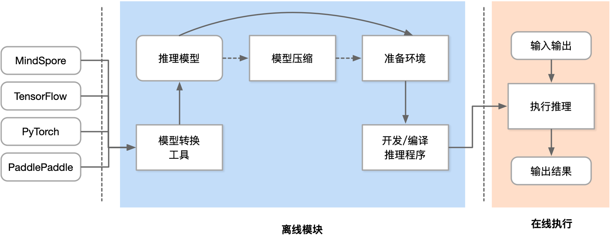

<!--Copyright © 适用于[License](https://github.com/chenzomi12/AISystem)版权许可-->

# 基本介绍 

随着深度学习模型的复杂性和规模不断增加，模型对存储空间和计算资源的需求越来越多，使得部署和运行成本显著上升。模型压缩的目标是通过减少模型的存储空间、减少计算量或提高模型的计算效率，从而在保持模型性能的同时，降低模型部署的成本。

模型压缩的目标可以概括为以下几点：

1. 减少模型显存占用：通过压缩模型参数或使用更高效的表示方式，可以显著减少模型所需的存储空间，从而降低模型在部署和执行过程中的存储成本。

2. 加快推理速度：通过减少模型计算过程中的乘法和加法操作，可以降低模型的计算开销，达到模型运算加速的目的。

3. 减少精度损失：在模型压缩过程中，尽可能地减小对模型性能的影响，保持模型在任务上的精度损失最小化。这需要在压缩技术选择和参数调优过程中进行细致的权衡和实验验证，确保模型在压缩后仍能够保持较高的性能水平。

## 模型压缩四件套

模型压缩的目标是降低表示、计算权重和中间激活的成本，这些成本占模型成本的大部分。我们根据如何降低权重和激活成本对 模型压缩算法进行分类：

- 模型量化（quantization）：旨在通过减少模型参数的表示精度来降低模型的存储空间和计算复杂度。

- 参数剪枝（pruning）：旨在通过删除模型中的不重要连接或参数来减少模型的大小和计算量。

- 知识蒸馏（knowledge distillation）：指通过构建一个轻量化的小模型，利用性能更好的大模型的监督信息，来训练这个小模型，以期达到更好的性能和精度。

- 低秩分解（low-rank factorization）：旨在通过将模型中的大型矩阵分解为低秩的子矩阵，从而减少模型参数的数量和计算复杂度。在低秩分解中，矩阵被分解为两个或多个低秩矩阵的乘积形式。

模型压缩算法分为低成本和高成本算法，与上述分类标准无关。高成本的压缩算法需要基于大型数据集进行再训练过程。因此，它们可以生成更准确的压缩模型，但需要更多的时间来压缩模型。另一方面，低成本压缩算法仅基于少量校准数据执行简单的权重调整过程，但是需要注意可能的精度损失。训练后量化是常用的低成本压缩算法。

##  模型压缩流程

模型压缩通常处于机器学习模型训练和生产部署之间的阶段。它在模型训练完成后，准备将模型部署到目标环境之前进行。

## 模型压缩应用场景

模型压缩技术在许多应用场景中都有广泛的应用，特别是在资源受限的环境下或对模型性能要求较高的场景。以下是一些常见的模型压缩应用场景：

1. **移动端应用**：在移动设备上部署深度学习模型时，由于存储空间和计算资源的限制，模型压缩变得至关重要。模型压缩可以使得模型在移动设备上运行更加高效，并降低对设备资源的消耗，从而实现更好的用户体验。

2. **物联网设备**：在物联网（IoT）领域，许多设备的存储和计算资源极为有限。模型压缩可以帮助将深度学习模型部署到这些设备上，并在保持模型性能的同时减少资源消耗。

3. **在线模型服务系统**：在推荐/搜索等在线系统中，模型需要实时地处理大量的用户数据，模型压缩可以提高系统的响应速度和吞吐量，从而改善用户体验并降低系统的成本。

4. **大模型压缩**：大语言模型通常具有数以亿计的参数和复杂的网络结构，对存储空间和计算资源要求巨大。通过模型压缩技术，可以将大模型压缩为更小、更高效的版本，以适应资源受限的部署环境，并在保持模型性能的同时降低计算成本。

5. **自动驾驶**：在自动驾驶领域，由于对实时性能和计算资源的要求，模型压缩可以帮助优化深度学习模型以适应相应的场景。

## 本节视频

<html>
<iframe src="https://player.bilibili.com/player.html?aid=608053162&bvid=BV1384y187tL&cid=973975092&page=1&as_wide=1&high_quality=1&danmaku=0&t=30&autoplay=0" width="100%" height="500" scrolling="no" border="0" frameborder="no" framespacing="0" allowfullscreen="true"> </iframe>
</html>