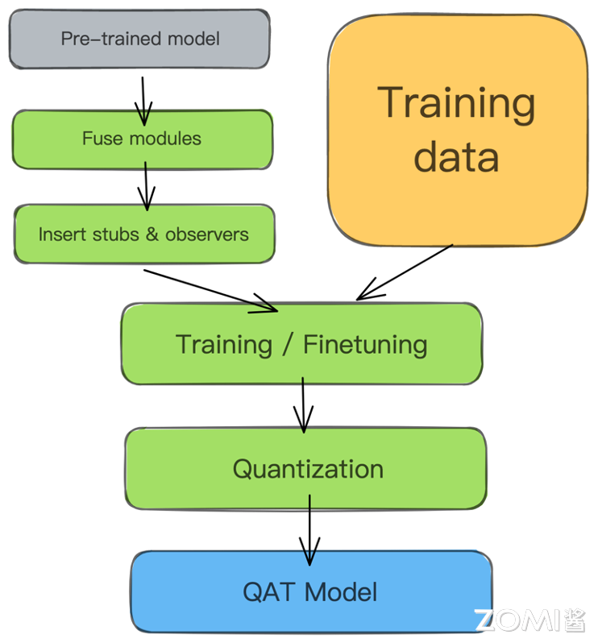
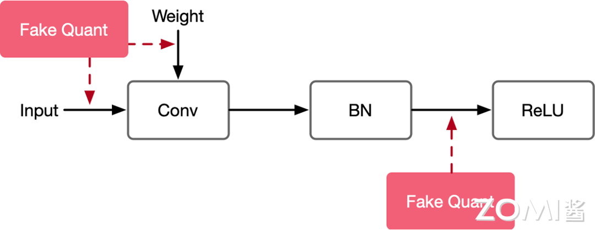
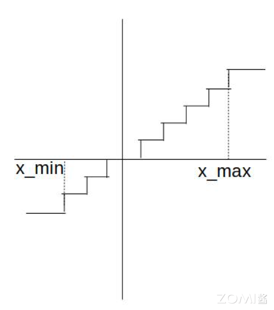
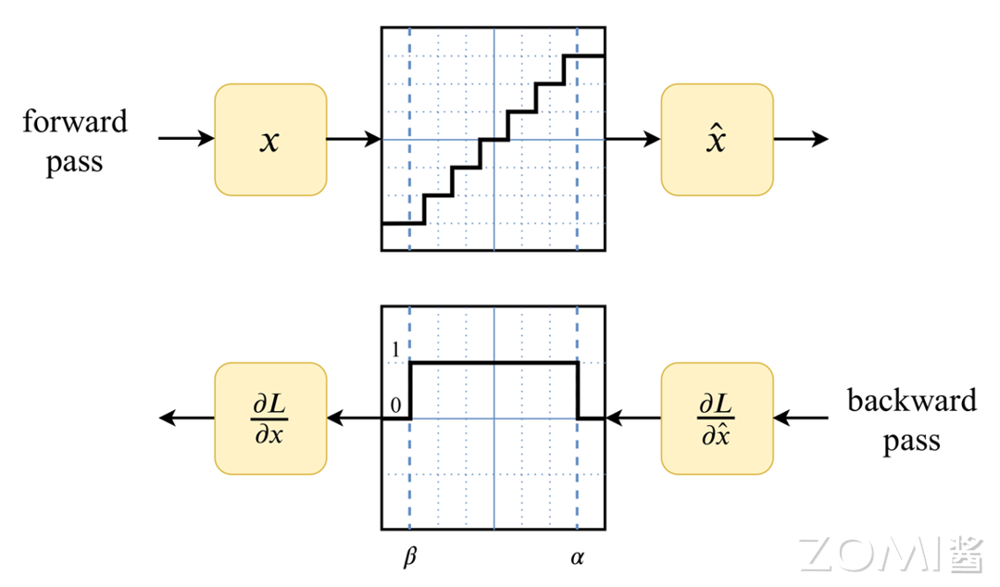
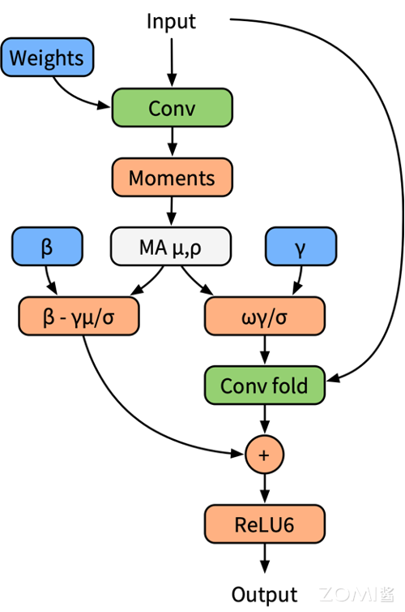
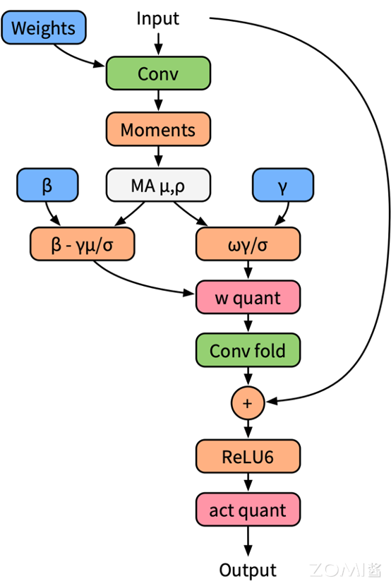

<!--Copyright © 适用于[License](https://github.com/chenzomi12/AISystem)版权许可-->

# 感知量化训练 QAT

## 感知量化训练流程

传统的训练后量化将模型从 FP32 量化到 INT8 精度时会产生较大的数值精度损失。感知量化训练（Aware Quantization Training）通过在训练期间模拟量化操作，可以最大限度地减少量化带来的精度损失。

QAT 的流程如下图所示，首先基于预训练好的模型获取计算图，对计算图插入伪量化算子。准备好训练数据进行训练或者微调，在训练过程中最小化量化误差，最终得到 QAT 之后对神经网络模型。QAT 模型需要转换去掉伪量化算子，为推理部署做准备。

QAT 时会往模型中插入伪量化节点 FakeQuant 来模拟量化引入的误差。端测推理的时候折叠 FakeQuant 节点中的属性到 tensor 中，在端侧推理的过程中直接使用 tensor 中带有的量化属性参数。

### 伪量化节点

在 QAT 过程中，所有权重和偏差都以 FP32 格式存储，反向传播照常进行。然而，在正向传播中，通过 FakeQuant 节点模拟量化。之所以称之为“fake”量化，是因为它们对数据进行量化并立即反量化，添加了类似于在量化推理过程中可能遇到的量化噪声，以模拟训练期间量化的效果。最终损失 loss 值因此包含了预期内的量化误差，使得将模型量化为 INT8 不会显著影响精度。

FakeQuant 节点通常插入在模型的以下关键部分：

- 卷积层（Conv2D）前后：这可以帮助卷积操作在量化后适应低精度计算。
- 全连接层（Fully Connected Layer）前后：这对于处理密集矩阵运算的量化误差非常重要。
- 激活函数（如 ReLU）前后：这有助于在非线性变换中保持量化精度。

这些插入位置可以确保模型在训练期间模拟量化引入的噪声，从而在推理阶段更好地适应量化环境。

下面是一个计算图，同时对输入和权重插入伪量化算子：

伪量化节点的作用：

1. 找到输入数据的分布，即找到 MIN 和 MAX 值；
2. 模拟量化到低比特操作的时候的精度损失，把该损失作用到网络模型中，传递给损失函数，让优化器去在训练过程中对该损失值进行优化。

#### 正向传播

在正向传播中，FakeQuant 节点将输入数据量化为低精度（如 INT8），进行计算后再反量化为浮点数。这样，模型在训练期间就能体验到量化引入的误差，从而进行相应的调整。为了求得网络模型 tensor 数据精确的 Min 和 Max 值，因此在模型训练的时候插入伪量化节点来模拟引入的误差，得到数据的分布。对于每一个算子，量化参数通过下面的方式得到：

$$
Q = \frac{R}{S}+Z \\
 \\
S = \frac{R_{max}-R_{min}}{Q_{max}-Q_{min}}\\
 \\
Z=Q_{max}-\frac {R_{max}}{S}
$$

FakeQuant 量化和反量化的过程：

$$
\begin{align*}
Q(x) &= FakeQuant(x) \\
&= DeQuant(Quant(x)) \\
&= s * (Clamp(round(x/s)-z)+z)
\end{align*}
$$

原始权重为 W，伪量化之后得到浮点值 Q(W)，同理得到激活的伪量化值 Q(X)。这些伪量化得到的浮点值虽然表示为浮点数，但仅能取离散的量化级别。

正向传播的时候 FakeQuant 节点对数据进行了模拟量化规约的过程，如下图所示：

#### 反向传播

在反向传播过程中，模型需要计算损失函数相对于每个权重和输入的梯度。梯度通过 FakeQuant 节点进行传递，这些节点将量化误差反映到梯度计算中。模型参数的更新因此包含了量化误差的影响，使模型更适应量化后的部署环境。按照正向传播的公式，因为量化后的权重是离散的，反向传播的时候对 $W$ 求导数为 0：

$$
\frac{\partial Q(W)}{\partial W} = 0
$$

因为梯度为 0，所以网络学习不到任何内容，权重 $W$ 也不会更新：

$$
g_W = \frac{\partial L}{\partial W} = \frac{\partial L}{\partial Q(W)} \cdot \frac{\partial Q(W)}{\partial W}=0
$$

这里可以使用直通估计器（Straight-Through Estimator，简称 STE）简单地将梯度通过量化传递，近似来计算梯度。这使得模型能够在前向传播中进行量化模拟，但在反向传播中仍然更新高精度的浮点数参数。STE 近似假设量化操作的梯度为 1，从而允许梯度直接通过量化节点：

$$
g_W = \frac{\partial L}{\partial W} = \frac{\partial L}{\partial Q(W)}
$$

如果被量化的值在 $[x_{min}, x_{max}] $ 范围内，STE 近似的结果为 1，否则为 0。这种方法使模型能够在训练期间适应量化噪声，从而在实际部署时能够更好地处理量化误差。如下图所示：

#### BN折叠

在卷积或全连接层后通常会加入批量归一化操作（Batch Normalization），以归一化输出数据。在训练阶段，BN作为一个独立的算子，统计输出的均值和方差（如下左图）。然而，为了提高推理阶段的效率，推理图将批量归一化参数“折叠”到卷积层或全连接层的权重和偏置中。也就是说，Conv和BN两个算子在正向传播时可以融合为一个算子，该操作称为BN折叠（如右下图）。

为了准确地模拟量化效果，我们需要模拟这种折叠，并在通过批量归一化参数缩放权重后对其进行量化。我们通过以下方式做到这一点：

$$
w_{fold} := \frac{\gamma w}{\text{EMA}(\sigma_B^2) + \epsilon}
$$

其中 $\gamma$ 是批量归一化的尺度参数，$\text{EMA}(\sigma_B^2)$ 是跨批次卷积结果方差的移动平均估计，$\epsilon$ 是为了数值稳定性的常数。

#### 推理过程：

假设我们有一层的输入为 $x$，应用BN后得到输出 $y$，其基本公式为：

1. 归一化：
$$
\hat{x}_i = \frac{x_i - \mu_B}{\sqrt{\sigma_B^2 + \epsilon}}
$$

其中，$\mu_B$ 是均值，$\sigma_B^2$ 是方差。

2. 缩放和平移：

$$
y_i = \gamma \hat{x}_i + \beta
$$

为了将 BN 折叠到前一层的权重和 bias 中，将 BN 的过程应用到上面的公式中，可以得到：

$$
y_i = \gamma \frac{z_i - \mu_B}{\sqrt{\sigma_B^2 + \epsilon}} + \beta
$$

可得：

$$
y_i = \gamma \frac{w x_i + b - \mu_B}{\sqrt{\sigma_B^2 + \epsilon}} + \beta
$$

将上式拆解为对权重 w 和偏置 b 的调整：

1. 调整后的权重 $w_{fold}$ 

$$
w_{fold} = \frac{\gamma w}{\sqrt{\sigma_B^2 + \epsilon}}
$$

2. 调整后的偏置 $b_{fold}$ 

$$
b_{fold} = \frac{\gamma (b - \mu_B)}{\sqrt{\sigma_B^2 + \epsilon}} + \beta
$$

在量化感知训练中应用 BN 折叠的过程涉及将 BN 层的参数合并到前一层的权重和偏置中，并对这些合并后的权重进行量化。

BN 折叠的训练模型：

BN 折叠感知量化训练模型：

## 感知量化训练的技巧

1. 从已校准的表现最佳的 PTQ 模型开始

与其从未训练或随机初始化的模型开始感知量化训练，不如从已校准的 PTQ 模型开始，这样能为 QAT 提供更好的起点。特别是在低比特宽量化情况下，从头开始训练可能会非常困难，而使用表现良好的 PTQ 模型可以帮助确保更快的收敛和更好的整体性能。

2. 微调时间为原始训练计划的 10%

感知量化训练不需要像原始训练那样耗时，因为模型已经相对较好地训练过，只需要调整到较低的精度。一般来说，微调时间为原始训练计划的 10% 是一个不错的经验法则。

3. 使用从初始训练学习率 1% 开始的余弦退火学习率计划

1. 为了让 STE 近似效果更好，最好使用小学习率。大学习率更有可能增加 STE 近似引入的方差，从而破坏已训练的网络。

2. 使用余弦退火学习率计划可以帮助改善收敛，确保模型在微调过程中继续学习。从较低的学习率(如初始训练学习率的 1%)开始有助于模型更平稳地适应较低的精度，从而提高稳定性。直到达到初始微调学习率的 1%(相当于初始训练学习率的 0.01%)。在 QAT 的早期阶段使用学习率预热和余弦退火可以进一步提高训练的稳定性。

4. 使用带动量的 SGD 优化器而不是 ADAM 或 RMSProp

尽管 ADAM 和 RMSProp 是深度学习中常用的优化算法，但它们可能不太适合量化感知微调。这些方法会按参数重新缩放梯度，可能会扰乱感知量化训练的敏感性。使用带动量的 SGD 优化器可以确保微调过程更加稳定，使模型能够更有控制地适应较低的精度。

通过 QAT，神经网络模型能够在保持高效推理的同时，尽量减少量化带来的精度损失，是模型压缩和部署的重要技术之一。在大多数情况下，一旦应用感知量化训练，量化推理精度几乎与浮点精度完全相同。然而，在 QAT 中重新训练模型的计算成本可能是数百个 epoch。

## 本节视频

<html>
<iframe src="https://player.bilibili.com/player.html?isOutside=true&aid=223192791&bvid=BV1s8411w7b9&cid=982178790&p=1&as_wide=1&high_quality=1&danmaku=0&t=30&autoplay=0" width="100%" height="500" scrolling="no" border="0" frameborder="no" framespacing="0" allowfullscreen="true"> </iframe>
</html>