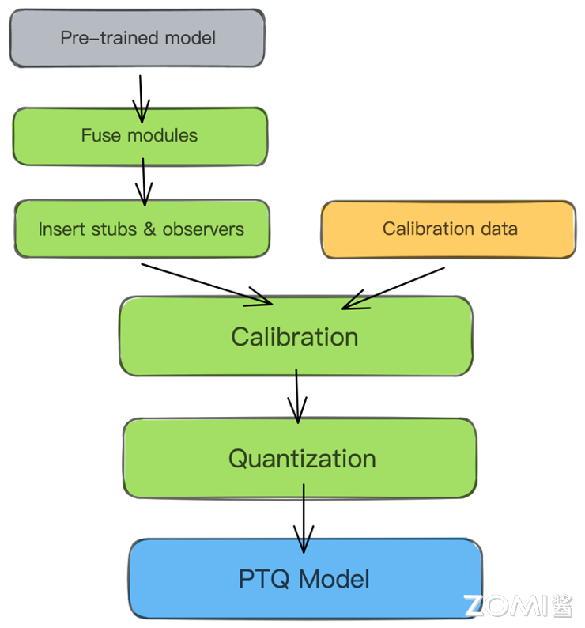
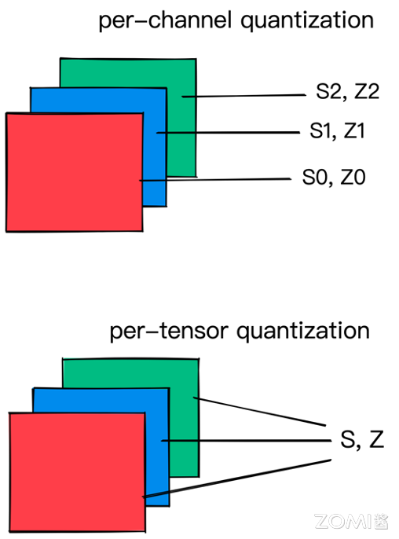
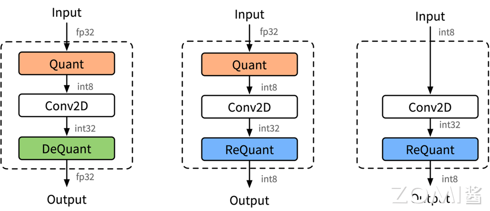

<!--Copyright © 适用于[License](https://github.com/chenzomi12/AISystem)版权许可-->

# 训练后量化与部署

本节将会重点介绍训练后量化技术的两种方式：动态和静态方法，将模型权重和激活从浮点数转换为整数，以减少模型大小和加速推理。并以 KL 散度作为例子讲解校准方法和量化粒度控制来平衡模型精度和性能。

## 训练后量化的方式

训练后量化的方式主要分为动态和静态两种。

### 动态离线量化

动态离线量化（Post Training Quantization Dynamic, PTQ Dynamic）仅将模型中特定算子的权重从 FP32 类型映射成 INT8/16 类型，主要可以减小模型大小，对特定加载权重费时的模型可以起到一定加速效果。但是对于不同输入值，其缩放因子是动态计算。动态量化的权重是离线转换阶段量化，而激活是在运行阶段才进行量化。因此动态量化是几种量化方法中性能最差的。

不同的精度下的动态量化对模型的影响：

- 权重量化成 INT16 类型，模型精度不受影响，模型大小为原始的 1/2；
- 权重量化成 INT8 类型，模型精度会受到影响，模型大小为原始的 1/4。


动态离线量化将模型中特定算子的权重从 FP32 类型量化成 INT8 等类型，该方式的量化有两种预测方式：

1. 反量化推理方式，即是首先将 INT8/FP16 类型的权重反量化成 FP32 类型，然后再使用 FP32 浮运算运算进行推理；

2. 量化推理方式，即是推理中动态计算量化算子输入的量化信息，基于量化的输入和权重进行 INT8 整形运算。

### 静态离线量化

静态离线量化（Post Training Quantization Static, PTQ Static）同时也称为校正量化或者数据集量化，使用少量无标签校准数据。其核心是计算量化比例因子，使用静态量化后的模型进行预测，在此过程中量化模型的缩放因子会根据输入数据的分布进行调整。相比量化训练，静态离线量化不需要重新训练，可以快速得到量化模型。

$$
uint8 = round(float/scale) - offset
$$

静态离线量化的目标是求取量化比例因子，主要通过对称量化、非对称量化方式来求，而找最大值或者阈值的方法又有 MinMax、KL 散度、ADMM、EQ，MSE 等方法。

静态离线量化的步骤如下：

1. 加载预训练的 FP32 模型，配置用于校准的数据加载器；
2. 读取小批量样本数据，执行模型的前向推理，保存更新待量化算子的量化 scale 等信息；
3. 将 FP32 模型转成 INT8 模型，进行保存。



一些常用的计算量化 scale 的方法：

| 量化方法 | 方法详解 |
| -- | ------ |
| $abs_{max}$  | 选取所有激活值的绝对值的最大值作为截断值α。此方法的计算最为简单，但是容易受到某些绝对值较大的极端值的影响，适用于几乎不存在极端值的情况。|
| $KL$       | 使用参数在量化前后的 KL 散度作为量化损失的衡量指标。此方法是 TensorRT 所使用的方法。在大多数情况下，使用 KL 方法校准的表现要优于 abs_max 方法。|
| $avg $     | 选取所有样本的激活值的绝对值最大值的平均数作为截断值α。此方法计算较为简单，可以在一定程度上消除不同数据样本的激活值的差异，抵消一些极端值影响，总体上优于 abs_max 方法。|

### 量化粒度

量化参数可以针对层的整个权重张量计算，也可以针对每个通道分别计算。在逐张量量化中，同一剪切范围将应用于层中的所有通道。在模型量化过程中分为权重量化和激活量化：

- 权重量化：即需要对网络中的权重执行量化操作。可以选择逐张量（per-tensor）或者逐通道（per-channel）的量化粒度，也就是说每个通道选取一个量化 scale。对于卷积神经网络，per- channel 通常对应通道轴。在任何一种情况下，量化因子的精度都是 FP32。per-channel 的量化粒度比 per-tensor 的更细粒度，模型效果更好，但带来的是推理过程中的计算复杂度增加。需要注意的是部分部署硬件有可能不支持 per-channel 量化推理。

- 激活量化：即对网络中不含权重的激活类算子进行量化。一般采用逐张量（per-tensor）的粒度，也可以选择逐 token（per-token）的量化粒度。



## KL 散度校准法

下面以静态离线量化中的 KL 散度作为例子，看看静态离线量化的具体步骤。

### KL 散度原理

KL 散度校准法也叫相对熵，其中 p 表示真实分布，q 表示非真实分布或 p 的近似分布：

$$
𝐷_{KL} (P_f || Q_q)=\sum\limits^{N}_{i=1}P(i)*log_2\frac{P_f(i)}{Q_q(i)}
$$

相对熵，用来衡量真实分布与非真实分布的差异大小。目的就是改变量化域，实则就是改变真实的分布，并使得修改后得真实分布在量化后与量化前相对熵越小越好。

### 流程和实现

1. 选取验证数据集中一部分具有代表的数据作为校准数据集（Calibration）；
2. 对于校准数据进行 FP32 的推理，对于每一层：
     1. 收集 activation 的分布直方图；
     2. 使用不同的阈值来生成一定数量的量化好的分布；
     3. 计算量化好的分布与 FP32 分布的 KL divergence；
     4. 选取使 KL 最小的阈值作为 saturation 的阈值。

主要注意的点：

- 需要准备小批量数据（500~1000 张图片）校准用的数据集；
- 使用校准数据集在 FP32 精度的网络下推理，并收集激活值的直方图；
- 不断调整阈值，并计算相对熵，得到最优解

通俗地理解，算法收集激活 Act 直方图，并生成一组具有不同阈值的 8 位表示法，选择具有最少 KL 散度的表示；此时的 KL 散度在参考分布（FP32 激活）和量化分布之间（即 8 位量化激活）之间。

KL 散度校准法的伪代码实现：

```
Input: FP32 histogram H with 2048 bins: bin[0], … , bin[2047]

For i in range(128, 2048):
     reference distribution P = [bin[0], …, bin[i-1]]
     outliers count = sum(bin[i], bin[i+1], …, bin[2047])
     reference distribution P[i-1] += outliers count 
     P /= sum(P)
     candidate distribution Q = quantize [bin[0], …, bin[i-1]] into 128 levels
     expand candidate distribution Q to I bins
     Q /= sum(Q)
     divergence[i] = KL divergence(reference distribution P, candidate distribution Q)
End For

Find index m for which divergence[m] is minimal

threshold = (m+0.5) * (width of a bin)
```

## 端侧量化推理部署

### 推理结构

端侧量化推理的结构方式主要由 3 种，分别是下图 (a) FP32 输入 FP32 输出、(b) FP32 输入 INT8 输出、(c) INT8 输入 INT32 输出



INT8 卷积如下图所示，里面混合里三种不同的模式，因为不同的卷积通过不同的方式进行拼接。使用 INT8 进行 inference 时，由于数据是实时的，因此数据需要在线量化，量化的流程如图所示。数据量化涉及 Quantize，Dequantize 和 Requantize 等 3 种操作：


### 量化过程

#### 量化

将 FP32 数据量化为 INT8。离线转换工具转换的过程之前，根据量化原理的计算出数据量化需要的 scale 和 offset：

$$
scale = (x_{max}-x_{min})/(Q_{max}-Q{min})
$$

$$
offset = Q_{min}-round(\frac{x_{min}}{scale})
$$

$$
uint8 = round(\frac{float}{scale})-offset
$$

$$
float=scale \times (uint+offset)
$$

#### 反量化

INT8 相乘、加之后的结果用 INT32 格式存储，如果下一个算子需要 FP32 格式数据作为输入，则通过 Dequantize 反量化操作将 INT32 数据反量化为 FP32。Dequantize 反量化推导过程如下：

$$
\begin{align*}
y &= x \cdot w \\
&= x_{\text{scale}} \cdot (x_{\text{int}} + x_{\text{offset}}) \cdot w_{\text{scale}} \cdot (w_{\text{int}} + w_{\text{offset}})\\
&= (x_{\text{scale}} \cdot w_{\text{scale}}) \cdot (x_{\text{int}} + x_{\text{offset}}) \cdot (w_{\text{int}} + w_{\text{offset}})\\
&= (x_{\text{scale}} \cdot w_{\text{scale}}) \cdot (x_{\text{int}} \cdot w_{\text{int}} + x_{\text{int}} \cdot x_{\text{offset}} + w_{\text{int}} \cdot x_{\text{offset}} + w_{\text{offset}} \cdot x_{\text{offset}})\\
&= (x_{\text{scale}} \cdot w_{\text{scale}}) \cdot (INT32_{result} + x_{\text{int}} \cdot x_{\text{offset}} + w_{\text{int}} \cdot x_{\text{offset}} + w_{\text{offset}} \cdot x_{\text{offset}})\\
&\approx (x_{\text{scale}} \cdot w_{\text{scale}}) \cdot INT32_{result}
\end{align*}
$$

#### 重量化

INT8 乘加之后的结果用 INT32 格式存储，如果下一层需要 INT8 格式数据作为输入，则通过 Requantize 重量化操作将 INT32 数据重量化为 INT8。重量化推导过程如下：

$$
\begin{align*}
y &= x \cdot w \\
&= x_{\text{scale}} \cdot (x_{\text{int}} + x_{\text{offset}}) \cdot w_{\text{scale}} \cdot (w_{\text{int}} + w_{\text{offset}}) \\
&= (x_{\text{scale}} \cdot w_{\text{scale}}) \cdot (x_{\text{int}} + x_{\text{offset}}) \cdot (w_{\text{int}} + w_{\text{offset}}) \\
&= (x_{\text{scale}} \cdot w_{\text{scale}}) \cdot \text{INT32\_result}
\end{align*}
$$

其中 y 为下一个节点的输入，即 $y=x_{next}$:

$$
y=y_{scale}*(y_{int}+y_{offset})
$$

这里是对 $y$ 进行量化，$x_{next int}=y_{int}$,有：

$$
x_{next int}=\frac{x_{scale} \cdot w_{scale}}{x_{next scale}}\cdot INT32_{result}-x_{next offset}
$$

因此重量化需要本算子输入 input 和 weight 的 scale，以及下一个算子的 input 输入数据的 scale 和 offset。

## 训练后量化的技巧

1. 对权重使用每通道（per-channel）粒度，对激活使用每张量（per-tensor）粒度

权重张量在不同通道中的值分布差异很大，如果使用单一的缩放因子进行量化，可能会导致较大的精度损失。通过对权重使用每通道粒度，可以在量化过程中更好地保留每个通道内的值分布。此外，推理框架会将每通道的缩放因子整合到 kernel 中，因此在推理过程中不会增加计算开销。由于神经网络通常会使用权重衰减，通道内的权重分布一般较为集中，因此使用最大校准器来捕捉所有动态范围对权重进行量化是有益的。

另一方面，激活在不同通道之间通常较为一致，但会包含来自不同输入数据的异常值。对每层激活张量使用单一的缩放因子，有助于减小异常值的影响，特别是使用基于直方图的方法。此外，由于这些缩放因子不能整合到 kernel 中，仅对每个张量使用一个缩放因子可以减少计算开销。

2. 通过替换块分别量化残差连接

残差连接是许多神经网络模型（如 ResNet）中的重要组成部分，因为它们有助于减轻训练期间可能出现的梯度消失问题。然而，在量化过程中，残差连接可能会带来挑战。这是因为像英伟达的 TensorRT 这样的推理框架需要对所有操作使用单一的数据类型，以便将它们融合到一个内核中。如果残差连接使用的数据类型与模型中的其他层不同，则可能会阻止这些层的融合，从而导致性能下降。

解决这个问题的最好方法是将残差连接与模型中的其他层分开量化。这可以通过替换每个残差连接为一个包含量化后的恒等映射的量化块来实现，将其添加到量化块的输入中。通过这样做，残差连接可以被量化为与其他层相同的数据类型，从而允许它们融合在一起并提高性能。

3. 识别敏感层并跳过它们的量化

虽然许多层可以在不牺牲太多精度的情况下有效地量化，但某些层在量化过程中可能会带来挑战。这些层包括模型中的瓶颈层，以及需要较高精度以保持准确性的操作层。

一个常见的例子是检测模型的最后一层，该层执行边界框坐标回归。这一层通常需要高精度以准确预测目标边界框的坐标，量化它可能会导致显著的精度损失。因此，通常建议跳过这一层的量化。

为了确定特定模型中哪些层可能对量化敏感并需要跳过，通常需要进行敏感性分析。这包括对模型进行量化，并在验证集上评估其精度，以确定哪些层受量化的影响最大。敏感性分析的一种常见方法是分层分析技术，这涉及逐层量化模型并在每一步评估其精度，从而帮助识别对量化最敏感的层并需要跳过的层。

## 小结与思考

- 训练后量化方式：分为动态离线量化（PTQ Dynamic）和静态离线量化（PTQ Static）。动态量化将权重从 FP32 映射到 INT8/16，而激活在运行时量化，可能导致性能下降；静态量化使用少量校准数据计算量化比例因子，无需重新训练，快速获得量化模型。

- KL 散度校准法：一种静态量化方法，通过最小化量化分布和 FP32 分布之间的 KL 散度来确定最优的量化阈值，适用于选择量化比例因子。

- 端侧量化推理部署：涉及量化、反量化和重量化操作，根据输入输出数据类型和硬件平台要求，选择不同的推理结构和量化策略，以实现模型在端侧设备上的高效部署。

## 本节视频

<html>
<iframe src="https://player.bilibili.com/player.html?isOutside=true&aid=735701535&bvid=BV1HD4y1n7E1&cid=976970991&p=1&as_wide=1&high_quality=1&danmaku=0&t=30&autoplay=0" width="100%" height="500" scrolling="no" border="0" frameborder="no" framespacing="0" allowfullscreen="true"> </iframe>
</html>
