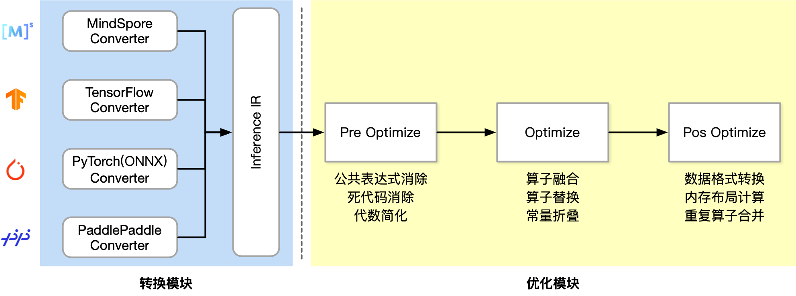

# 基本介绍

模型转换的主要任务是实现模型在不同框架之间的流转。随着深度学习技术的发展，训练框架和推理框架的功能逐渐分化。训练框架通常侧重于易用性和研究人员的算法设计，提供了分布式训练、自动求导、混合精度等功能，旨在让研究人员能够更快地生成高性能模型。而推理框架则更专注于针对特定硬件平台的极致优化和加速，以实现模型在生产环境中的快速执行。由于训练框架和推理框架的职能和侧重点不同，且各个框架内部的模型表示方式各异，因此没有一个框架能够完全涵盖所有方面。因此，模型转换成为了必不可少的环节，用于连接训练框架和推理框架，实现模型的顺利转换和部署。

## 推理引擎

推理引擎是推理系统中用来完成推理功能的模块。推理引擎分为2个主要的阶段：

- **优化阶段：** 模型转换工具，由模型转换和图优化构成；模型压缩工具、端侧学习和其他组件组成。
- **运行阶段：** 实际的推理引擎，负责AI模型的加载与执行，可分为调度与执行两层。

本节主要介绍优化阶段的模型转换工具。模型转换工具模块有两个部分：

1. **模型格式转换：** 把不同框架的格式转换到自己推理引擎的一个IR（Intermediate Representation，中间表示）或者格式。
2. **计算图优化：** 计算图是深度学习编译框架的第一层中间表示。图优化是通过图的等价变换化简计算图，从而降低计算复杂度或内存开销。

## 转换模块挑战与目标

1. **AI框架算子的统一。** 
   - **问题：** AI模型本身包含众多算子，它们的重合度高但不完全相同。推理引擎需要用有限的算子去实现不同框架的算子。  

   | 框架         | 导出方式         | 导出成功率 | 算子数（不完全统计） | 冗余度 |
   |:----------:|:------------:|:-----:|:----------:|:---:|
   | Caffe      | Caffe        | 高     | 52         | 低   |
   | Tensorflow | I.X          | 高     | 1566       | 高   |
   |            | Tflite       | 中     | 141        | 低   |
   |            | Self         | 中     | 1200+      | 高   |
   | Pytorch    | Onnx         | 中     | 165        | 低   |
   |            | TorchScripts | 高     | 566        | 高   |
   
   不同AI框架的算子冲突度非常高，其算子的定义也不太一样，例如PytTorch的Padding和TensorFlow的Padding，它们pad的方式和方向不同（Pytorch的Conv类可以任意指定padding步长，而TensorFlow的Conv类不可以指定padding步长，如果有此需求，需要用tf.pad类来指定）。推理引擎不可能把每一个框架的算子都实现一遍，所以用有限的算子去对接或者实现不同的AI框架训练出来的网络模型。
   - **解决：** 推理引擎拥有自己的算子定义和格式，来对接不同AI框架的算子层。

2. **支持不同框架的模型文件格式。** 
   - **问题：** 主流的 Tensorflow、PyTorch、Keras 等框架导出的模型文件格式不同，不同的AI框架训练出来的网络模型、算子之间是有差异的。同一框架的不同版本间也存在算子的增改。
   - **解决：** 推理引擎需要自定义计算图IR来对接不同AI框架及其版本

3. **需要支持 CNN、RNN、Transformer 等主流网络结构。** 
   - **问题：** 不同网络结构有各自擅长的领域，CNN 常用于图像处理、RNN 适合处理序列数据、Transformer 则适用于自然语言处理领域。
   - **解决：** 推理引擎要有丰富Demo和Benchmark，提供主流模型性能和功能基准，来保证推理引擎的可用性。

4. **需要支持各类输入输出。** 
   - **问题：** 如多输入多输出，任意维度的输入输出，动态输入（即输入数据的形状可能在运行时改变）），带控制流的模型（即模型中包含条件语句、循环语句等）。
   - **解决：**  为了解决这些问题，推理引擎需要具备一些特性，比如可扩展性（即能够灵活地适应不同的输入输出形式）和 AI 特性（例如动态形状，即能够处理动态变化的输入形状）。此外，还需要对不同任务进行大量的集成测试验证，以确保引擎能够胜任各种任务，如计算机视觉领域中的检测、分割、分类等，以及自然语言处理领域中的掩码处理等。

## 优化模块挑战与目标

1. **结构冗余：** 
   - **问题：** 深度学习网络模型中存在的一些无效计算节点、重复的计算子图或相同的结构模块，它们在保留相同计算图语义的情况下可以被无损地移除。
   - **解决：** 通过计算图优化，采取算子融合（将多个算子合并成一个）、算子替换（用更高效的算子替换低效的）、常量折叠（将常量计算提前执行）等方法来减少结构冗余。
2. **精度冗余：** 
   - **问题：** 推理引擎数据单元是张量，一般为FP32浮点数，FP32表示的特征范围在某些场景存在冗余，可压缩到 FP16/INT8 甚至更低；数据中可能存大量0或者重复数据。
   - **解决：** 通过模型压缩技术，如低比特量化（将参数和激活量化为更低位）、剪枝（删除不重要的连接或神经元）、蒸馏（使用较小的模型学习大模型的行为）等方法来减少精度冗余。
3. **算法冗余：** 
   - **问题：** 算子或者Kernel层面的实现算法本身存在计算冗余，比如均值模糊的滑窗与拉普拉斯的滑窗实现方式相同。
   - **解决：** 推理引擎需要统一算子和计算图表达，针对发现的计算冗余，进行统一，提升Kernel的繁华性。
4. **读写冗余：** 
   - **问题：** 在一些计算场景重复读写内存，或者内存访问不连续导致不能充分利用硬件缓存，产生多余的内存传输。
   - **解决：** 通过数据排布优化（改变数据在内存中的布局）和内存分配优化等方法来减少读写冗余，提高内存访问的效率。

## 离线模块架构

### 转换模块架构

Converter由Frontends和Graph Optimize构成。前者负责支持不同的AI训练框架；后者通过算子融合、算子替代、布局调整等方式优化计算图。

- **格式转换：** 图中IR上面的部分。不同的AI框架有不同的API，不能通过一个Converter就把所有的AI框架都转换过来。针对MindSpore，有MindSpore Converter；针对PyTorch，有ONNX Converter。通过不同的Converter，把不同的AI框架统一转换成自己的推理引擎的IR（Intermediate Representation，中间表示），后面的图优化都是基于这个IR进行修改。
- **图优化：** （如何通过优化计算图的结构和执行方式来提高模型的效率和性能）
  - 算子融合：深度学习模型中，通常会有多个算子（操作）连续地作用于张量数据。算子融合就是将这些连续的算子合并成一个更大的算子，以减少计算和内存访问的开销。例如，将卷积操作和激活函数操作合并成一个单独的操作，这样可以避免中间结果的存储和传输，提高计算效率。
  - 算子替换：算子替换是指用一个算子替换模型中的另一个算子，使得在保持计算结果不变的前提下，模型在在线部署时更加友好，更容易实现高效执行。例如，将复杂的卷积算子替换为更简单的等效算子，以加速推理过程。
  - 布局调整：优化张量布局是指重新组织模型中张量的存储方式，以更高效地执行依赖于数据格式的运算。不同的硬件或软件框架可能对数据的布局有不同的偏好，因此通过调整张量的布局，可以提高模型在特定环境下的性能。
  - 内存分配：在深度学习模型的计算过程中，会涉及大量的内存操作，包括内存分配和释放。优化内存分配可以通过分析计算图来检查每个运算的峰值内存使用量，并在必要时插入 CPU-GPU 内存复制操作，以将 GPU 内存中的数据交换到 CPU，从而减少峰值内存使用量，避免内存溢出或性能下降的问题。

## 离线模块流程

通过不同的转换器，把不同AI框架训练出来的网络模型转换成推理引擎的IR，再进行后续的优化。优化模块分成三段（具体内容见第三章 AI编译原理）：
- Pre Optimize：主要是语法上的检查
  - 公共表达式消除：通过消除常见的子表达式并简化算术语句来简化算术运算。
  - 死代码消除：消除执行之后没有任何作用的代码。
  - 代数简化：代数简化的目的是利用交换律、结合律等规律调整图中算子的执行顺序，或者删除不必要的算子，提高整体的计算效率。可以通过子图替换的方式完成。
- Optimize：主要是对算子的处理
  - 算子融合：向量化的多个算子的操作可以合并成一个向量化操作。
  - 算子替换：算子替换，即将模型中某些算子替换计算逻辑一致但对于在线部署更友好的算子。
  - 常量折叠：在可能的情况下，通过折叠图中的常量节点静态推断张量的值，并使用常量具体化结果。
- Pos Optimize：主要是对读写冗余的优化
  - 数据格式转换
  - 内存布局计算
  - 重复算子合并

## 总结

本节主要介绍了推理引擎优化阶段的模型转换工具，它由转换模块和图优化模块组成。我们介绍了转换模块和优化模块的挑战和目标，并简要介绍了其架构和工作流程。具体的流程细节和优化策略将在后续文章中介绍。

## 参考文章

1. [AI 框架部署方案之模型转换](https://zhuanlan.zhihu.com/p/396781295)
2. [AI技术方案（个人总结）](https://zhuanlan.zhihu.com/p/658734035)
3. [人工智能系统 System for AI   课程介绍 Lecture Introduction](https://microsoft.github.io/AI-System/SystemforAI-9-Compilation%20and%20Optimization.pdf)
4. [【AI】推理引擎的模型转换模块](https://blog.csdn.net/weixin_45651194/article/details/132921090)
5. [Pytorch和TensorFlow在padding实现上的区别](https://zhuanlan.zhihu.com/p/535729752)
6. [训练模型到推理模型的转换及优化](https://openmlsys.github.io/chapter_model_deployment/model_converter_and_optimizer.html)
7. [使用 Grappler 优化 TensorFlow 计算图](https://www.tensorflow.org/guide/graph_optimization?hl=zh-cn)
8. [死代码消除](https://decaf-lang.gitbook.io/decaf-book/rust-kuang-jia-fen-jie-duan-zhi-dao/pa4-zhong-jian-dai-ma-you-hua/si-dai-ma-xiao-chu)
9. [AI编译器之前端优化-下（笔记）](https://zhuanlan.zhihu.com/p/599949051)

## 本节视频

<html>
<iframe src="https://www.bilibili.com/video/BV1724y1z7ep/?spm_id_from=333.880.my_history.page.click&vd_source=57ec244afa109ba4ee6346389a5f32f7" width="100%" height="500" scrolling="no" border="0" frameborder="no" framespacing="0" allowfullscreen="true"> </iframe>
</html>