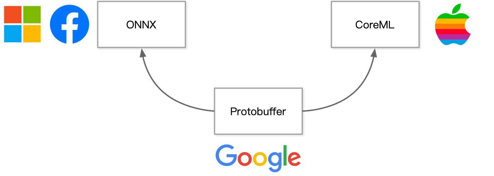

# 架构与文件格式

在训练好一个模型后，需要将其保存下来，以便在需要时重新加载并进行推理或进一步的训练。为了实现这一目标，需要一种有效的方式来将模型的参数、结构等保存起来。本文主要介绍模型的序列化与反序列化、不同的模型序列化方法，以及Protobuf和FlatBuffers两种模型文件格式。

## 模型序列化

模型序列化是模型部署的第一步，如何把训练好的模型存储起来，以供后续的模型预测使用，是模型部署的首先要考虑的问题。

### 序列化与反序列化

训练好的模型通常存储在计算机的内存中。然而，内存中的数据是暂时的，不具备长期存储的能力。因此，为了将模型保存供将来使用，我们需要将其从内存中移动到硬盘上进行永久存储。这个过程被称为模型的保存和加载，或者说是序列化和反序列化。在这个过程中，模型的参数、结构和其他相关信息会被保存到硬盘上的文件中，以便在需要时重新加载到内存中。


- 模型序列化：模型序列化是模型部署的第一步，如何把训练好的模型存储起来，以供后续的模型预测使用，是模型部署的首先要考虑的问题。
- 模型反序列化：将硬盘当中的二进制数据反序列化的存储到内存中，得到网络模型对应的内存对象。无论是序列化与反序列的目的是将数据、模型长久的保存。

### 序列化分类

- 跨平台跨语言通用序列化方法
  - 主要有四种格式：XML，JSON，Protobuffer和flatbuffer。前两种是文本格式，人和机器都可以理解，后两种是二进制格式，只有机器能理解，但在存储传输解析上有很大的速度优势。使用最广泛为Protobuffer。
  
  下图中的[ONNX](https://onnx.ai/)使用的就是是Protobuf这个序列化数据结构去存储神经网络的权重信息。
  
  [CoreML](https://developer.apple.com/cn/documentation/coreml/)既是一种文件格式，又是一个强大的机器学习运行时环境，它使用了 Protocol Buffer 的二进制序列化格式，并在所有苹果操作系统平台上提供了高效的推理和重新训练功能。

  
- 模型本身提供的自定义序列化方法
  - 文本或者二进制格式
  - 语言专有或者跨语言跨平台自定义格式
  
- 语言级通用序列化方法
  - Python - [pickle](https://docs.python.org/3/library/pickle.html)
  - Python - [joblib](https://joblib.readthedocs.io/en/latest/persistence.html)
  - R - [rda](https://www.rdocumentation.org/packages/base/versions/3.6.1/topics/save)
  
  joblib在序列化大numpy数组时有性能优势，pickle的c实现cpickle速度也很快。

- 用户自定义序列化方法
  - 以上方法都无法达到要求，用户可以使用自定义序列化格式，以满足自己的特殊部署需求：部署性能、模型大小、环境要求等等。但这种方法在模型升级维护以及版本兼容性上是一个大的挑战。

选择模型序列化方法，可以优先使用跨平台跨语言通用序列化方法，最后再考虑使用自定义序列化方法。

### Pytorch模型序列化方法

Pytorch模型序列化有两种方法，一种是基于Pytorch内部格式，另一种是使用ONNX。前者只保存了网络模型的参数、结构，不能保存网络模型的信息计算图。

- [Pytorch内部格式](https://pytorch.org/tutorials/beginner/saving_loading_models.html)
  - PyTorch 内部格式只存储已训练模型的状态，主要是对网络模型的权重等信息加载。
  - PyTorch 内部格式类似于Python语言级通用序列化方法[pickle](https://docs.python.org/3/library/pickle.html)。
  - 包括weights、biases、Optimizer
  
```
# Saving & Loading Model for Inference

  torch.save(model.state_dict(), PATH)

  model = TheModelClass(*args, **kwargs)
  model.load_state_dict(torch.load(PATH))
  model.eval()
```
  - torch.save：将序列化对象保存到磁盘。该函数使用 Python 的 pickle实用程序进行序列化。使用此函数可以保存各种对象的模型、张量和字典。
  - torch.nn.Module.load_state_dict ：使用反序列化的state_dict加载模型的参数字典 。在 PyTorch 中，模型的可学习参数（即权重和偏差） torch.nn.Module包含在模型的参数中 （通过 访问model.parameters()）。state_dict只是一个 Python 字典对象，它将每个层映射到其参数张量。请注意，只有具有可学习参数的层（卷积层、线性层等）和注册缓冲区（batchnorm 的 running_mean）在模型的state_dict中具有条目。优化器对象 ( torch.optim) 还有一个state_dict，其中包含有关优化器状态以及所使用的超参数的信息。由于state_dict对象是 Python 字典，因此可以轻松保存、更新、更改和恢复它们，从而为 PyTorch 模型和优化器添加大量模块化功能。
  
- [ONNX](https://pytorch.org/docs/master/onnx.html)：内部支持torch.onnx.export。
  
  以下代码将预训练的 AlexNet 导出到名为`alexnet.onnx`的 ONNX 文件。调用torch.onnx.export运行模型一次以跟踪其执行情况，然后将跟踪的模型导出到指定文件。
  
  ```
    import torch
    import torchvision

    dummy_input = torch.randn(10, 3, 224, 224, device="cuda")
    model = torchvision.models.alexnet(pretrained=True).cuda()

    input_names = [ "actual_input_1" ] + [ "learned_%d" % i for i in range(16) ]
    output_names = [ "output1" ]

    torch.onnx.export(model, dummy_input, "alexnet.onnx", verbose=True, input_names=input_names, output_names=output_names)
  ```

  然后，可以运行如下代码来加载模型：

  ```
    import onnx

    # Load the ONNX model
    model = onnx.load("alexnet.onnx")

    # Check that the model is well formed
    onnx.checker.check_model(model)

    # Print a human readable representation of the graph
    print(onnx.helper.printable_graph(model.graph))
  ```

## 目标文件格式

在序列化与反序列化的过程中，选择合适的目标文件格式至关重要，它决定了数据的存储方式、传输效率和系统的整体性能。下文将介绍Protobuf和FlatBuffers两种流行的目标文件格式。

### Protocol Buffers

**Protobuf**是“Protocol Buffers”的缩写，是一种高效、与语言无关的数据序列化机制。它使开发人员能够在文件中定义结构化数据`.proto`，然后使用该文件生成可以从不同数据流写入和读取数据的源代码。

特点：语言无关、平台无关；比XML更小更快更为简单；扩展性、兼容性好。

Protobuf最初是由Google的工程师开发的，他们需要一种有效的方法来跨各种内部服务序列化结构化数据。

#### Protobuf文件语法详解

- **基本语法：** 字段规则 数据类型 名称 = 域值 [选项 = 选项值]
  
  ```
  // 字段规则 数据类型 名称 = 域值 [选项 = 选项值]

  message Net{      // message属于Net域；
    optional string name = 'conv_1*1_0_3';
    repeated Layer layer = 2;
  }
  ```
- **字段规则**
  - required：一个格式良好的消息一定要含有1个这种字段。表示该值是必须要设置的。
  - optional：消息格式中该字段可以有0个或1个值（不超过1个）。
  - repeated：在一个格式良好的消息中，这种字段可以重复任意多次（包括0次）。重复的值的顺序会被保留。表示该值可以重复，相当于java中的List。 
  
#### Protobuf Define the MNIST Network

我们将编写一个caffe::NetParameter（或在Python中caffe.proto.caffe_pb2.NetParameter）protobuf。

- 编写数据层
  ```
    layer {
    name: "mnist"
    type: "Data"
    transform_param {
        scale: 0.00390625
    }
    data_param {
        source: "mnist_train_lmdb"
        backend: LMDB
        batch_size: 64
    }
    top: "data"
    top: "label"
    }
  ```
- 编写卷积层
  ```
    layer {
    name: "conv1"
    type: "Convolution"
    param { lr_mult: 1 }
    param { lr_mult: 2 }
    convolution_param {
        num_output: 20
        kernel_size: 5
        stride: 1
        weight_filler {
        type: "xavier"
        }
        bias_filler {
        type: "constant"
        }
    }
    bottom: "data"
    top: "conv1"
    }
  ```
  池化层、全连接层等内容可以参考[Training LeNet on MNIST with Caffe](https://github.com/BVLC/caffe/blob/master/examples/mnist/readme.md)。

#### Tensorflow中Protocol Buffer对象的编码和解码

```
// 将给定的 Protocol Buffer对象编码为字节字符串

tf.io.encode_proto(
    sizes: Annotated[Any, _atypes.Int32],
    values,
    field_names,
    message_type: str,
    descriptor_source: str = 'local://',
    name=None
) -> Annotated[Any, _atypes.String]

// 将给定的字节字符串解码为 Protocol Buffer对象

tf.io.decode_proto(
    bytes: Annotated[Any, _atypes.String],
    message_type: str,
    field_names,
    output_types,
    descriptor_source: str = 'local://',
    message_format: str = 'binary',
    sanitize: bool = False,
    name=None
)
```
#### Protobuf编码模式

- 计算机里一般常用的是二进制编码，如int类型由32位组成，每位代表数值2的n次方，n的范围
是0-31。Protobuf采用TLV编码模式，即把一个信息按照tag-length-value的模式进行编码。tag和value部分类似于字典的key和value，length表示value 的长度，此外Protobuf用message来作为描述对象的结构体。

#### Protobuf编解码过程

1. 根message由多个TLV形式的field组成，解析message的时候逐个去解析field。
2. 由于field是TLV形式，因此可以知道每个field的长度，然后通过偏移上一个field长度找到下一个field的起始地址。其中field的value也可以是一个嵌套message。
3. 对于field先解析tag得到field_num和type。field_num是属性ID，type帮助确定后面的value一种编码算法对数据进行解码。

### FlatBuffers

FlatBuffers是一个开源的、跨平台的、高效的、提供了多种语言接口的序列化工具库。实现了与 Protocal Buffers类似的序列化格式。主要由 Wouter van Oortmerssen编写，并由Google开源。

FlatBuffers主要针对部署和对性能有要求的应用。相对于Protocol Buffers，FlatBuffers 不需要解析，只通过序列化后的二进制buffer即可完成数据访问。FlatBuffers的主要特点有：

1. 数据访问不需要解析
   
   - 将数据序列化成二进制buffer，之后的数据访问直接读取这个buffer，所以读取的效率很高。
2. 内存高效、速度快
    - 数据访问只在序列化后的二进制buffer，不需额外的内存分配。
    - 数据访问速度接近原生的struct，只多了一次解引用（根据起始地址和偏移量，然后取值）
  
3. 生成的代码量小
   
   - 只需依赖一个头文件
  
4. 可扩展性强
5. 强类型检测
6. 易于使用

使用Flatbuffers和Protobuf很相似, 都会用到先定义一个schema文件, 用于定义我们要序列化的数据结构的组织关系。

很多AI推理框架都是用的FlatBuffers，最主要的有以下两个：
- [MNN](https://github.com/alibaba/MNN/blob/master/README_CN.md)
  - 阿里巴巴的深度神经网络推理引擎，是一个轻量级的深度神经网络引擎，支持深度学习的推理与训练。
  - 适用于服务器/个人电脑/手机/嵌入式各类设备。目前，MNN已经在阿里巴巴的手机淘宝、手机天猫、优酷等30多个App中使用，覆盖直播、短视频、搜索推荐、商品图像搜索、互动营销、权益发放、安全风控等场景。
  - MNN模型文件采用的存储结构是 FlatBuffers。
  
- [MindSpore Lite](https://www.mindspore.cn/lite/en)
  - 一种适用于端边云场景的新型开源深度学习训练/推理框架。 
  - MindIR全称MindSpore IR，一种基于图表示的函数式IR，定义了可扩展的图结构以及算子IR表示，存储了MindSpore基础数据结构。
  - MindIR作为MindSpore的统一模型文件，同时存储了网络结构和权重参数值。同时支持部署到云端Serving和端侧Lite平台执行推理任务。
  - 由于端侧轻量化需求，提供了模型小型化和转换功能，支持将原始MindIR模型文件由Protocol Buffers格式转化为FlatBuffers格式存储。


### Protobuf VS FlatBuffers

|        | Proto Bufers                                                                                                           | Flatbuffers                                                                                   |
|--------|------------------------------------------------------------------------------------------------------------------------|-----------------------------------------------------------------------------------------------|
| 支持语言   | C/C++, C#, Go, Java, Python, Ruby, Objective-C, Dart                                                                   | C/C++, C#, Go, Java, JavaScript, TypeScript, Lua, PHP, Python, Rust, Lobster                  |
| 版本     | 2.x/3.x，不相互兼容                                                                                                          | 1.x                                                                                           |
| 协议文件   | .proto，需指定协议文件版本                                                                                                       | .fbs                                                                                          |
| 代码生成工具 | 有（生成代码量较多）                                                                                                             | 有（生成代码量较少）                                                                                    |
| 协议字段类型 | bool, bytes, int32, int64, uint32, uint64, sint32, sint64, fixed32, fixed64, sfixed32, sfixed64, float, double, string | bool, int8, uint8, int16, uint16, int32, uint32, int64, uint64, float, double, string, vector |

## 总结

本文介绍了模型的序列化与反序列化过程，以及不同的序列化方法和文件格式。在训练好一个模型后，为了将其保存以便在需要时重新加载并进行推理或进一步的训练，需要将模型的参数、结构等保存起来。选择合适的序列化方法和文件格式对于系统的性能和效率至关重要，需要考虑系统的性能、跨平台兼容性和部署需求等因素。在需要跨平台、跨语言的场景下，可以选择Protobuf，因为它具有良好的兼容性和高效的数据传输速度。如果系统对性能要求很高，特别是在移动端或嵌入式设备上部署模型时，可以考虑使用FlatBuffers，它在序列化后不需要转换/解包的操作就可以获得原数据，反序列化消耗的时间极短，且生成的代码量较少，运行比较轻量，CPU占用较低，内存占用较少。

## 本节视频

<html>
<iframe src="https://www.bilibili.com/video/BV13P4y167sr/?vd_source=57ec244afa109ba4ee6346389a5f32f7" width="100%" height="500" scrolling="no" border="0" frameborder="no" framespacing="0" allowfullscreen="true"> </iframe>
</html>

## 参考文章

1. [PyTorch学习—19.模型的加载与保存（序列化与反序列化）](https://blog.csdn.net/weixin_46649052/article/details/119763872)
2. [开源AI模型序列化总结](https://github.com/aipredict/ai-models-serialization)
3. [ONNX学习笔记](https://zhuanlan.zhihu.com/p/346511883)
4. [深入CoreML模型定义](https://blog.csdn.net/volvet/article/details/85013830)
5. [Swift loves TensorFlow and CoreML](https://medium.com/@JMangiaswift-loves-tensorflow-and-coreml-2a11da25d44)
6. [什么是 Protobuf？](https://blog.postman.com/what-is-protobuf/)
7. [Protobuf 语法指南](https://colobu.com/2015/01/07/Protobuf-language-guide/)
8. [深入浅出 FlatBuffers之Schema](https://halfrost.com/flatbuffers_schema/)
9. [FlatBuffers，MNN模型存储结构基础 ---- 无法解读MNN模型文件的秘密](https://www.jianshu.com/p/8eb153c12a4b)
10. [华为昇思MindSpore详细教程（一）](https://blog.csdn.net/m0_37605642/article/details/125691987)

