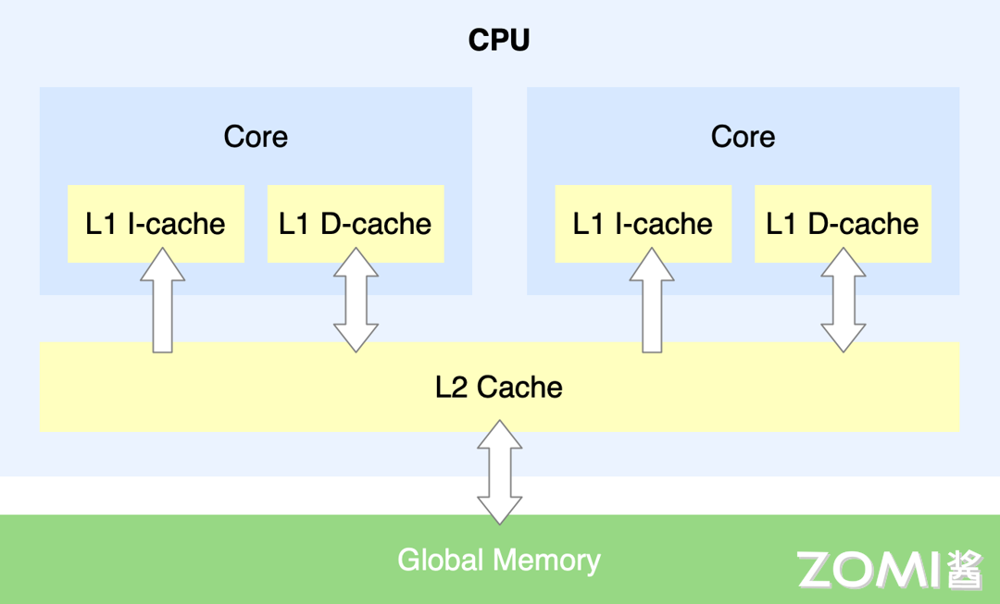
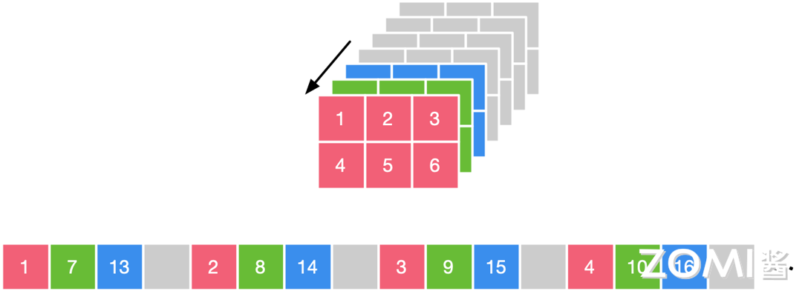
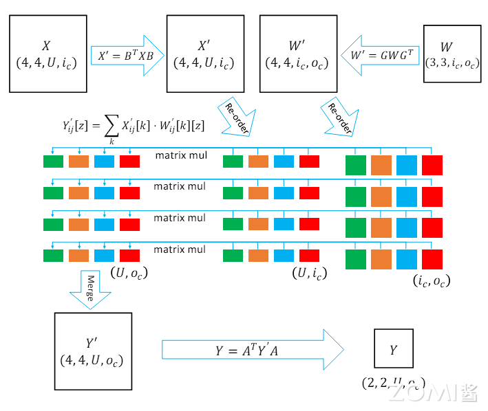

<!--Copyright © ZOMI 适用于[License](https://github.com/chenzomi12/AISystem)版权许可-->

# 推理内存布局

从前文的简单介绍中，我们提到了可以从内存布局上对推理引擎的 Kernel 进行优化，接下来，我们将先介绍 CPU 和 GPU 的基础内存知识，NCHWX 内存排布格式以及详细展开描述 MNN 这个针对移动应用量身定制的通用高效推理引擎中通过数据内存重新排布进行的内核优化。

## 内存

CPU 内存主要架构图如下图所示，其中比较关键的是有主存，以及其上的多级缓存架构，CPU 运行的速度太快，相对而言内存的读写速度就非常慢。如果 CPU 每次都要等内存操作完成，才可以继续后续的操作，那效率会非常低下。由此设计出了多级缓存架构，缓存级别越小，越靠近 CPU，同样也意味着速度越快，但是对应的容量越少。

当 CPU 需要取数据时，如果通过索引得知缓存中没有该数据，那么此时 CPU 需要从 RAM 主存中先获取数据，然后将该数据及其临近数据加载到 Cache 缓存中，以便利用访问局部性提升访问命中率。当然多级缓存也会带来问题，即数据同步问题，当出现多核和乱序时，如何保证数据同步也需要提供一种内存屏障的规则。

GPU 内存主要架构图如下图所示，在主缓存等主要架构上，与 CPU 没太多的区别，也是多级缓存架构，其调度执行模式主要是按照 SIMT 模式进行，由许多 SM 组成。

SM（Streaming Multiprocessors）：可以理解为一个 GPU 计算单元的小集合，好比多核 CPU 的一个核 —— 但 CPU 的一个核一般运行一个线程，而 SM 能够运行多个轻量线程，每一个 SM 有自己的 Wrap scheduler 、寄存器（Register）、指令缓存、L1 缓存、共享内存。Wrap scheduler：运算规划器，可以理解为运算时一个 warp 抓一把线程扔进了 cores 里面进行计算。

GPU 互相之间一般是通过 PCIe 桥直接传输数据，或者是通过 NVLink 这种专用的超高速数据传输通道来传输数据。

## NCHWX

在推理引擎中，或者底层 Kernel 层实际上为了更加适配到 DSA 或者 ASIC 专用芯片会使用 NCHWX 内存排布格式，那么下面我们来详细了解一下 NCHWX 数据排布格式。

由于典型的卷积神经网络随着层数的增加，其特征图在下采样后的长和宽逐渐减小，但是通道数随着卷积的过滤器的个数不断增大是越来越大的，经常会出现通道数为 128，256 等很深的特征图。这些很深的特征图与过滤器数很多的卷积层进行运算的运算量很大。为了充分利用有限的矩阵计算单元，进行了通道维度的拆分是很有必要的。根据不同数据结构特点，常见的有分别对 Channel 维进行了 Channel/4，Channel/32 和 Channel/64 的拆分，下图为 NCHWX 的物理存储结构。

具体来说，先取 Channel 方向的数据，按照 NCHW4 来进行举例，先取 17/13/X，再取 W 方向的数据，再取 H 方向的数据。

由于典型的卷积神经网络随着层数的增加，其特征图在下采样后的长和宽逐渐减小，但是通道数随着卷积的过滤器的个数不断增大是越来越大的，经常会出现通道数为 128，256 等很深的特征图。这些很深的特征图与过滤器数很多的卷积层进行运算的运算量很大。

为了充分利用有限的矩阵计算单元，进行了通道维度的拆分是很有必要的。根据不同数据结构特点，常见的有分别对 Channel 维进行了 Channel/4，Channel/32 和 Channel/64 的拆分，下图为 NCHWX 的物理存储结构。具体来说，先取 Channel 方向的数据，按照 NCHW4 来进行举例，先取 17/13/X，再取 W 方向的数据，再取 H 方向的数据。

## MNN

MNN 是一个轻量级的深度学习端侧推理引擎，核心解决深度神经网络模型在端侧推理运行问题，涵盖深度神经网络模型的优化、转换和推理。

其对 WinoGrad 卷积计算进行内核优化，重新排布了其数据格式，下面我们来进行详细介绍。

### WinoGrad 卷积计算

首先我们先给出针对 WinoGrad 二维卷积计算的公式：

$$
\begin{align}
Y = A^T[[GWG^T]\odot[B^XB]]A
\end{align}
$$

其中，$W$ 为 $r \times r$ 的卷积核，$X$ 为 $(m + r -1) \times (m + r -1)$ 的图像块。

可以看出 Hadamard 积是 Winograd 卷积中必不可少的步骤（见上公式）。但它存在内存访问耗时较长的问题，拖累了整个计算过程。

事实上，对 Hadamard 积的求和可以转换为点积。

将多个点积组合在一起可以得到矩阵乘法，这是并行性和分摊内存访问开销的不错的方式。

通过这种方式，我们在数据布局重新排序的基础上将 Hadamard 积转换为矩阵乘法。

MNN 在 WinoGrad 卷积计算优化中使用的数据排布格式为 NC4HW4。它将 4 个数据元素拆分为一个单元，为张量创建一个新维度。4 个元素连续放置在内存中，以便利用 CPU 中的矢量寄存器在单个指令（即 SIMD）中计算这 4 个数据。

MNN 中数据重新排布后，对 WinoGrad 卷积的计算如下图所示：

我们看数据格式重新排布后的重要计算公式：

$$
\begin{align}
Y’_{ij}[z] = \sum_kX’_{ij}[k]\ast W’_{ij}[k][z]
\end{align}
$$

令参与计算的 X’矩阵与 W’矩阵以及中间矩阵 Y’的前两个维度都为 4。

CPU 中的矢量寄存器在单个指令中能够一次计算 4 组在内存中连续存储的数据，一个指令就可以计算 4 次 matrix mul，充分利用了 SIMD 的并行计算能力。

总结一下，MNN 对数据格式进行 NC4HW4 重排后，可以充分利用 ARM CPU 指令集的特性，实现对卷积等操作进行加速；同时可以较少 cache miss，提高内存命中率。

当然，对于较大的 feature 特征图，如果其 channel 不是 4 的倍数，则会导致补充 0 过多，导致内存占用过高，同时也相应的增加计算量。

## 小结

在本节中我们介绍了

1.CPU 和 GPU 内存中都有重要的多级缓存架构，来保证 CPU/GPU 核要访问内存时，不用每次都等内存操作完成，才可以继续后续的操作，可以从缓存中读取。

2.NCHWX 的格式能够更好的适配 SIMT，为了充分利用有限的矩阵计算单元，进行了通道维度的拆分，还对 Cache 更友好，减少 Cache 未命中的概率；Kernel 实现层面易进行 Padding，减少边界分支判断，代码逻辑简单。

3.MNN 中针对 WinoGrad 卷积计算进行内核优化，重新排布了其数据格式为 NC4HW4，CPU 中的矢量寄存器在单个指令中能够一次计算 4 组在内存中连续存储的数据，充分利用了 SIMD 的并行计算能力。

## 本节视频

<html>
<iframe src="https://player.bilibili.com/player.html?isOutside=true&aid=352822140&bvid=BV1eX4y1X7mL&cid=1034535797&p=1&as_wide=1&high_quality=1&danmaku=0&t=30&autoplay=0" width="100%" height="500" scrolling="no" border="0" frameborder="no" framespacing="0" allowfullscreen="true"> </iframe>
</html>
