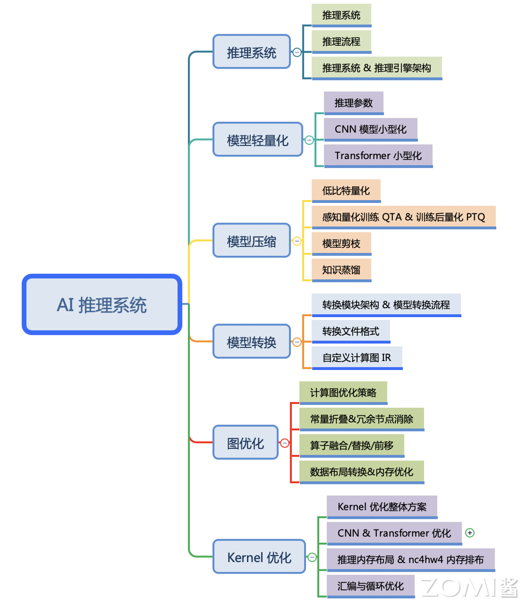

<!--Copyright © ZOMI 适用于[License](https://github.com/chenzomi12/AISystem)版权许可-->

# 推理系统&引擎概述(DONE)

训练过程通过设定数据处理方式，并设计合适的网络模型结构以及损失函数和优化算法，在此基础上将数据集以小批量（mini-batch）反复进行前向计算并计算损失，然后反向计算梯度利用特定的优化函数来更新模型，来使得损失函数达到最优的结果。训练过程最重要的就是梯度的计算和反向传播。

而推理就是在训练好的模型结构和参数基础上，做一次前向传播得到模型输出的过程。相对于训练而言，推理不涉及梯度和损失优化。推理的最终目标是将训练好的模型部署生产环境中。真正让 AI 能够运用起来。推理引擎可以将深度学习模型部署到云（Cloud）端或者边缘（Edge）端，并服务用户的请求。模型训练过程好比是传统软件工程中的代码开发的过程，而开发完的代码势必要打包，部署给用户使用，那么推理系统就负责应对模型部署的生命周期中遇到的挑战和问题。

当推理系统将完成训练的模型进行部署，并在服务时还需要考虑设计和提供负载均衡，请求调度，加速优化，多副本和生命周期管理等支持。相比深度学习框架等为训练而设计的系统，推理系统不仅关注低延迟，高吞吐，可靠性等设计目标，同时受到资源，服务等级协议（Service-Level Agreement），功耗等约束。本章将围绕深度学习推理系统的设计，实现与优化内容展开，同时还会在最后介绍部署和 MLOps 等内容。

移动端的推理引擎应该挺多的了，谷歌在 2017 年推出了 TF-Lite，腾讯在 2017 年推出了 ncnn，Apple 在 2017 也推出了 CoreML，阿里在 2018 年推出了 MNN，华为 2019 年推出了 MindSpsore-Lite。距今已经过去了快 5 年的时间，技术上也接近收敛。下面让我们一起打开推理引擎的技术吧！

## 课程简介

- 《推理系统》推理系统是本分享的重点概述，推理就是在训练好的模型结构和参数基础上，执行前向传播得到模型输出的过程。相对于训练而言，推理不涉及梯度和损失优化。推理的最终目标是将训练好的模型部署生产环境中，真正让 AI 能够运用起来。推理引擎可以将深度学习模型部署到云（Cloud）端或者边缘（Edge）端，并服务用户的请求。模型训练过程好比是传统软件工程中的代码开发的过程，而开发完的代码势必要打包，部署给用户使用，那么推理系统就负责应对模型部署的生命周期中遇到的挑战和问题。

- 《轻量网络》在端侧推理引擎中，主要是执行轻量的模型结构。主要思想是针对神经网络模型设计更高效的网络计算方式，从而使神经网络模型的参数量减少的同时，不损失网络精度，并进一步提高模型的执行效率。本节主要集中介绍模型小型化中需要注意的参数和指标，接着深入了解 CNN 经典的轻量化模型和 Transformer 结构的轻量化模型。

- 《模型压缩》模型压缩跟轻量化网络模型不同，压缩主要是对轻量化或者非轻量化模型执行剪枝、蒸馏、量化等压缩算法和手段，使得模型更加小、更加轻便、更加利于执行。

- 《模型转换&优化》在这一节当中分为模型转换和模型优化，在整体架构图中属于离线模型转换模块。一方面，推理引擎需要把不同 AI 框架训练得到的模型进行转换；另外一方面需要对转换后的模型进行图优化等技术。

- 《Kernel 优化》在上层应用或者 AI 网络模型中，看到的是算子；但是在推理引擎实际执行的是具体的 Kernel，而推理引擎中 CNN 占据了主要是得执行时间，因此其 Kernel 优化尤为重要。

## 课程脑图

## 备注

文字课程开源在 [AISys](https://chenzomi12.github.io/)，系列视频托管[B 站](https://space.bilibili.com/517221395)和[油管](https://www.youtube.com/@ZOMI666/videos)，PPT 开源在[github](https://github.com/chenzomi12/AISystem)，欢迎取用！！！

> 非常希望您也参与到这个开源课程中，B 站给 ZOMI 留言哦！
> 
> 欢迎大家使用的过程中发现 bug 或者勘误直接提交代码 PR 到开源社区哦！
>
> 欢迎大家使用的过程中发现 bug 或者勘误直接提交 PR 到开源社区哦！
>
> 请大家尊重开源和 ZOMI 的努力，引用 PPT 的内容请规范转载标明出处哦！

## 参考文献

1. [Deep Learning Inference in Meta Data Centers: Characterization, Performance Optimizations and Hardware Implications](https://arxiv.org/abs/1811.09886)
2. [Clipper: A Low-Latency Online Prediction Serving System](https://www.usenix.org/system/files/conference/nsdi17/nsdi17-crankshaw.pdf)
3. [TFX: A TensorFlow-Based Production-Scale Machine Learning Platform](https://www.kdd.org/kdd2017/papers/view/tfx-a-TensorFlow-based-production-scale-machine-learning-platform)
4. [TensorFlow-Serving: Flexible, High-Performance ML Serving](https://arxiv.org/abs/1712.06139)
5. [Optimal Aggregation Policy for Reducing Tail Latency of Web Search](https://www.microsoft.com/en-us/research/wp-content/uploads/2016/02/samehe-2015sigir.optimalaggregation.pdf)
6. [A Survey of Model Compression and Acceleration for Deep Neural Networks](https://arxiv.org/pdf/1710.09282.pdf)
7. [CSE 599W: System for ML - Model Serving](http://dlsys.cs.washington.edu/pdf/lecture12.pdf)
8. [https://developer.NVIDIA.com/deep-learning-performance-training-inference](https://developer.NVIDIA.com/deep-learning-performance-training-inference)
9. [DEEP COMPRESSION:   COMPRESSING DEEP NEURAL NETWORKS WITH PRUNING, TRAINED QUANTIZATION AND HUFFMAN CODING](https://arxiv.org/pdf/1510.00149.pdf)
10. [Learning both Weights and Connections for Efficient Neural Networks](https://pdfs.semanticscholar.org/1ff9/a37d766e3a4f39757f5e1b235a42dacf18ff.pdf)
11. [DEEP LEARNING DEPLOYMENT WITH NVIDIA TENSORRT](http://on-demand.GPUtechconf.com/gtcdc/2017/presentation/dc7172-shashank-prasanna-deep-learning-deployment-with-NVIDIA-tensorrt.pdf)
12. [Halide: A Language and Compiler for Optimizing Parallelism,Locality, and Recomputation in Image Processing Pipelines](https://people.csail.mit.edu/jrk/halide-pldi13.pdf)
13. [TVM: An Automated End-to-End Optimizing Compiler for Deep Learning](https://www.usenix.org/system/files/osdi18-chen.pdf)
14. [8-bit Inference with TensorRT](http://on-demand.GPUtechconf.com/gtc/2017/presentation/s7310-8-bit-inference-with-tensorrt.pdf)
15. [https://github.com/microsoft/AI-System](https://github.com/microsoft/AI-System)
16. [推理系统&引擎](https://chenzomi12.github.io/040Inference/README.html) 
17. [NCNN、OpenVino、 TensorRT、MediaPipe、ONNX，各种推理部署架构，到底哪家强？](https://zhuanlan.zhihu.com/p/423551635)
18. [【AI System】第 8 章：深度学习推理系统](https://zhuanlan.zhihu.com/p/665146747)
19. [【AI】推理系统和推理引擎的整体架构](https://blog.csdn.net/weixin_45651194/article/details/132872588)

1. Deep Learning Inference in Meta Data Centers: Characterization, Performance Optimizations and Hardware Implications
2. Clipper: A Low-Latency Online Prediction Serving System
3. TFX: A TensorFlow-Based Production-Scale Machine Learning Platform
4. TensorFlow-Serving: Flexible, High-Performance ML Serving
5. Optimal Aggregation Policy for Reducing Tail Latency of Web Search
6. A Survey of Model Compression and Acceleration for Deep Neural Networks
7. CSE 599W: System for ML - Model Serving
8. [Deep Learning Performance Training Inference](https://developer.nvidia.com/deep-learning-performance-training-inference)
9. DEEP COMPRESSION: COMPRESSING DEEP NEURAL NETWORKS WITH PRUNING, TRAINED QUANTIZATION AND HUFFMAN CODING
10. Learning both Weights and Connections for Efficient Neural Networks
11. DEEP LEARNING DEPLOYMENT WITH NVIDIA TENSORRT
12. Halide: A Language and Compiler for Optimizing Parallelism, Locality, and Recomputation in Image Processing Pipelines
13. TVM: An Automated End-to-End Optimizing Compiler for Deep Learning
14. 8-bit Inference with TensorRT
15. [Microsoft AI System](https://github.com/microsoft/AI-System)
16. [模型推理服务化之 Triton：如何基于 Triton 开发自己的推理引擎？](https://zhuanlan.zhihu.com/p/354058294)