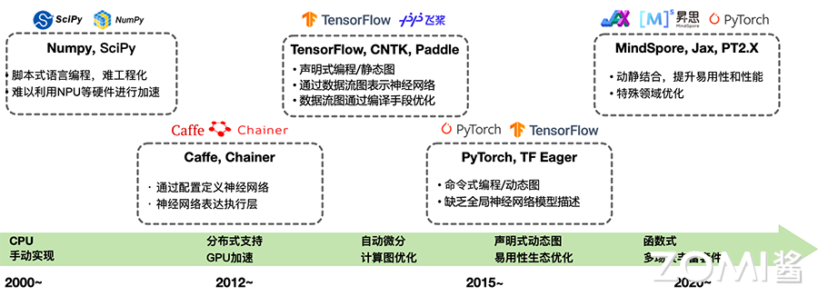
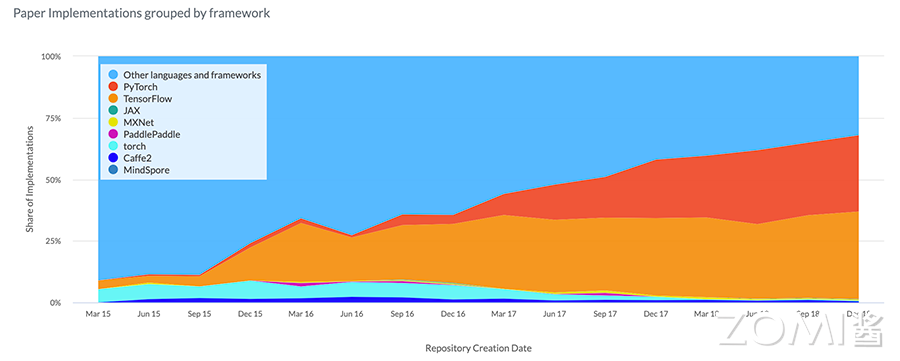
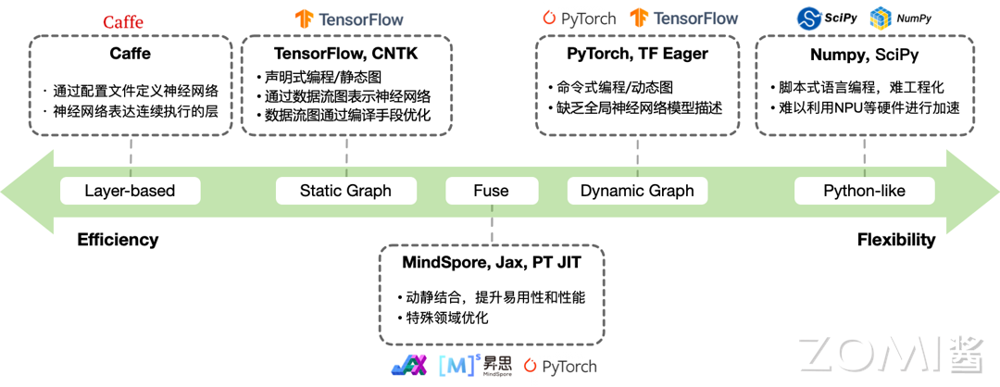

<!--Copyright © ZOMI 适用于[License](https://github.com/chenzomi12/AISystem)版权许可-->

# AI 框架之争

在前面的内容主要是讲述了 AI 框架在数学上对自动微分进行表达和处理，最后表示称为开发者和应用程序都能很好地去编写深度学习中神经网络的工具和库，整体流程如下所示：

除了要回答最核心的数学表示原理以外，实际上 AI 框架还要思考和解决许多问题，如 AI 框架如何对实际的神经网络实现多线程算子加速？如何让程序执行在 GPU/NPU 上？如何编译和优化开发者编写的代码？因此，一个能够商用版本的 AI 框架，需要系统性梳理每一层中遇到的具体问题，以便提供相关更好的开发特性：

- 前端（面向用户）：如何灵活的表达一个神经网络模型？

- 算子（执行计算）：如何保证每个算子的执行性能和泛化性？

- 微分（更新参数）：如何自动、高效地提供求导运算？

- 后端（系统相关）：如何将同一个算子跑在不同的加速设备上？

- 运行时：如何自动地优化和调度网络模型进行计算？

本节内容将会去总结 AI 框架的目的，其要求解决的技术问题和数学问题；了解了其目的后，真正地去根据时间的维度和和技术的维度梳理 AI 框架的发展脉络，并对 AI 框架的未来进行思考。

## AI 框架的目的

神经网络是机器学习技术中一类具体算法分枝，通过堆叠基本处理单元形成宽度和深度，构建出一个带拓扑结构的高度复杂的非凸函数，对蕴含在各类数据分布中的统计规律进行拟合。传统机器学习方法在面对不同应用时，为了达到所需的学习效果往往需要重新选择函数空间设计新的学习目标。

相比之下，神经网络方法能够通过调节构成网络使用的处理单元，处理单元之间的堆叠方式，以及网络的学习算法，用一种较为统一的算法设计视角解决各类应用任务，很大程度上减轻了机器学习算法设计的选择困难。同时，神经网络能够拟合海量数据，深度学习方法在图像分类，语音识别以及自然语言处理任务中取得的突破性进展，揭示了构建更大规模的神经网络对大规模数据进行学习，是一种有效的学习策略。

然而，神经网络应用的开发需要对软件栈的各个抽象层进行编程，这对新算法的开发效率和算力都提出了很高的要求，进而催生了 AI 框架的发展。AI 框架可以让开发者更加专注于应用程序的业务逻辑，而不需要关注底层的数学和计算细节。同时 AI 框架通常还提供可视化的界面，使得开发者可以更加方便地设计、训练和优化自己的模型。在 AI 框架之上，还会提供了一些预训练的网络模型，可以直接用于一些常见的应用场景，例如图像识别、语音识别和自然语言处理等。

AI 框架的目的是为了在计算加速硬件（GPU/NPU）和 AI 集群上高效训练神经网络而设计的可编程系统，需要同时兼顾以下互相制约设计目标可编程性与性能。

1. **提供灵活的编程模型和编程接口**

- 自动推导计算图：根据客户编写的神经网络模型和对应的代码，构建自动微分功能，并转换为计算机可以识别和执行的计算图。

- 较好的支持与现有生态融合：AI 应用层出不穷，需要提供良好的编程环境和编程体系给开发者方便接入，这里以 PyTorch 框架为例对外提供超过 2000+ API。

- 提供直观的模型构建方式，简洁的神经网络计算编程语言：使用易用的编程接口，用高层次语义描述出各类主流神经网络模型和训练算法。而在编程范式主要是以声明式编程和命令式编程为主，提供丰富的编程方式，能够有效提提升开发者开发效率，从而提升 AI 框架的易用性。

2. **提供高效和可扩展的计算能力**

- 自动编译优化算法：为可复用的处理单元提供高效实现，使得 AI 算法在真正训练或者推理过程中，执行得更快，需要对计算图进行进一步的优化，如子表达式消除、内核融合、内存优化等算法，支持多设备、分布式计算等。

- 根据不同体系结构和硬件设备自动并行化：体系结构的差异主要是指针对 GPU、NPU、TPU 等 AI 加速硬件的实现不同，有必要进行深度优化，而面对大模型、大规模分布式的冲击需要对自动分布式化、扩展多计算节点等进行性能提升。

- 降低新模型的开发成本：在添加新计算加速硬件（GPU/NPU）支持时，降低增加计算原语和进行计算优化的开发成本。

## AI 框架的发展

AI 框架作为智能经济时代的中枢，是 AI 开发环节中的基础工具，承担着 AI 技术生态中操作系统的角色，是 AI 学术创新与产业商业化的重要载体，助力 AI 由理论走入实践，快速进入了场景化应用时代，也是发展 AI 所必需的基础设施之一。随着重要性的不断凸显，AI 框架已经成为了 AI 产业创新的焦点之一，引起了学术界、产业界的重视。

### 时间维度

结合 AI 的发展历程，AI 框架在时间维度的发展大致可以分为四个阶段，分别为 1）2000 年初期的萌芽阶段、2）2012~2014 年的成长阶段、3）2015 年~2019 年的爆发阶段，和 4）2020 年以后深化阶段。

其在时间的发展脉络与 AI ，特别是深度学习范式下的神经网络技术的异峰突起有非常紧密的联系。

- **萌芽阶段**

在 2020 年前，早期受限于计算能力不足，萌芽阶段神经网络技术影响力相对有限，因而出现了一些传统的机器学习工具来提供基本支持，也就是 AI 框架的雏形，但这些工具或者不是专门为神经网络模型开发定制的，或者 API 极其复杂对开发者并不友好，且并没有对异构加速算力（如 GPU/NPU 等）进行支持。缺点在于萌芽阶段的 AI 框架并不完善，开发者需要编写大量基础的工作，例如手写反向传播、搭建网络结构、自行设计优化器等。

其以 Matlab 的神经网络库为代表作品。

- **成长阶段**

2012 年，Alex Krizhevsky 等人提出了 AlexNet 一种神经网络架构，在 ImageNet 数据集上达到了最佳精度，并碾压第二名提升 15%以上的准确率，引爆了神经网络的热潮。

自此极大地推动了 AI 框架的发展，出现了 Caffe、Chainer 和 Theano 等具有代表性的早期 AI 框架，帮助开发者方便地建立复杂的神经网络模型（如 CNN、RNN、LSTM 等）。不仅如此，这些框架还支持多 GPU 训练，让开展更大、更深的模型训练成为可能。在这一阶段，AI 框架体系已经初步形成，声明式编程和命令式编程为下一阶段的 AI 框架发展的两条截然不同的道路做了铺垫。

- **爆发阶段**

2015 年，何恺明等人提出的 ResNet，再次突破了图像分类的边界，在 ImageNet 数据集上的准确率再创新高，也凝聚了产业界和学界的共识，即深度学习将成为下一个重大技术趋势。

2016 年谷歌开源了 TensorFlow 框架，Meta AI 研究团队也发布了基于动态图的 AI 框架 PyTorch，该框架拓展自 Torch 框架，但使用了更流行的 Python 进行重构整体对外 API。Caffe 的发明者加入了 Meta（现更名为 Meta）并发布了 Caffe2 并融入了 PyTorch 的推理生态；与此同时，微软研究院开发了 CNTK 框架。Amazon 采用了这是华盛顿大学、CMU 和其他机构的联合学术课程 MXNet。国内百度则率先布局了 PaddlePaddle 飞桨 AI 框架并于 2016 年发布。

在 AI 框架的爆发阶段，AI 系统也迎来了繁荣，而在不断发展的基础上，各种框架不断迭代，也被开发者自然选择。经过激烈的竞争后，最终形成了两大阵营，TensorFlow 和 PyTorch 双头垄断。2019 年，Chainer 团队将他们的开发工作转移到 PyTorch，Microsoft 停止了 CNTK 框架的积极开发，部分团队成员转而支持 PyTorch；Keras 被 TensorFlow 收编，并在 TensorFlow2.X 版本中成为其高级 API 之一。

- **深化阶段**

随着 AI 的进一步发展，AI 应用场景的扩展以及与更多领域交叉融合进程的加快，新的趋势不断涌现，越来越多的需求被提出。

例如超大模型的出现（GPT-3、ChatGPT 等），新的趋势给 AI 框架提出了更高的要求。例如超大模型的出现（GPT-3、ChatGPT 等）；如对全场景多任务的支持、对异构算力支持等。这就要求 AI 框架最大化的实现编译优化，更好地利用算力、调动算力，充分发挥集群硬件资源的潜力。此外，AI 与社会伦理的痛点问题也促使可信赖 AI 、或则 AI 安全在 AI 框架层面的进步。

基于以上背景，现有的主流 AI 框架都在探索下一代 AI 框架的发展方向，如 2020 年华为推出昇思 MindSpore，在全场景协同、可信赖方面有一定的突破；旷视推出天元 MegEngine，在训练推理一体化方面深度布局；PyTorch 捐赠给 Linux 基金会，并面向图模式提出了新的架构和新的版本 PyTorch2.X。

在这一阶段，AI 框架正向着全场景支持、大模型、分布式 AI、 超大规模 AI、安全可信 AI 等技术特性深化探索，不断实现新的突破。

### 技术维度

以技术维度的角度去对 AI 框架进行划分，其主要经历了三代架构，其与深度学习范式下的神经网络技术发展和编程语言、及其编程体系的发展有着紧密的关联。

- **第一代 AI 框架**

第一代 AI 框架在时间上主要是在 2010 年前，面向需要解决问题有：1）机器学习 ML 中缺乏统一的算法库，2）提供稳定和统一的神经网络 NN 定义。其对应的 AI 框架框架其实广义上并不能称为 AI 框架，更多的是对机器学习中的算法进行了统一的封装，并在一定程度上提供了少量的神经网络模型算法和 API 的定义。具体形态有 2 种：

第一种的主要特点的是以库（Library）的方式对外提供脚本式编程，方便开发者通过简单配置的形式定义神经网络，并且针对特殊的机器学习 ML、神经网络 NN 算法提供接口，其比较具有代表性意义的是 MATLAB 和 SciPy。另外还有针对矩阵计算提供特定的计算接口的 NumPy。优点是：面向 AI 领域提供了一定程度的可编程性；支持 CPU 加速计算。

第二种的在编程方面，以 CNN 网络模型为主，由常用的 layers 组成，如：Convolution, Pooling, BatchNorm, Activation 等，都是以 Layer Base 为驱动，可以通过简单配置文件的形式定义神经网络。模型可由一些常用 layer 构成一个简单的图，AI 框架提供每一个 layer 及其梯度计算实现。这方面具有代表性的作品是 Torch、Theano 等 AI 框架。其优点是提供了一定程度的可编程性，计算性能有一定的提升，部分支持 GPU/NPU 加速计算。

同时，第一代 AI 框架的缺点也比较明显，主要集中在 1）灵活性和 2）面向新场景支持不足。

首先是易用性的限制难以满足深度学习的快速发展，主要是层出不穷的新型网络结构，新的网络层需要重新实现前向和后向计算；其次是第一代 AI 框架大部分使用非高级语言实现，修改和定制化成本较高，对开发者不友好。最后是新优化器要求对梯度和参数进行更通用复杂的运算。

随着生成对抗网络模型 GAN、深度强化学习 DRL、Stable Diffusion 等新的结构出现，基于简单的“前向+后向”的训练模式难以满足新的训练模式。例如循环神经网络 LSTM 需要引入控制流、对抗神经网络 GAN 需要两个网络交替训练，强化学习模型 RL 需要和外部环境进行交互等众多场景没办法满足新涌现的场景。

- **第二代 AI 框架**

第二代 AI 框架在技术上，统一称为**基于数据流图（DAG）的计算框架**：将复杂的神经网络模型，根据数据流拆解为若干处理环节，构建数据流图，数据流图中的处理环节相互独立，支持混合编排控制流与计算，以任务流为最终导向，AI 框架将数据流图转换为计算机可以执行或者识别的任务流图，通过执行引擎（Runtime）解析任务流进行处理环节的分发调度、监控与结果回传，最终实现神经网络模型的构建与运行。

以数据流图描述神经网络，前期实践最终催生出了工业级 AI 框架，如 TensorFlow 和 PyTorch，这一时期同时伴随着如 Chainer，DyNet 等激发了 AI 框架设计灵感的诸多实验课程。TensorFlow 和 PyTorch 代表了现今 AI 框架框架的两种不同的设计路径：系统性能优先改善灵活性，和灵活性易用性优先改善系统性能。

这两种选择，随着神经网络算法研究和应用的更进一步发展，又逐步造成了 AI 框架在具体技术实现方案的分裂。

- **第三代 AI 框架**

在第三代 AI 框架中，面向通用化场景，如 CNN、LSTM、RNN 等场景开始走向统一的设计架构，不同的 AI 框架在一定程度都会模仿或者参考 PyTorch 的动态图 Eager 模式，提升自身框架的易用性，使其更好地接入 AI 生态中。

目前在技术上一定程度开始迈进第三代 AI 框架，其主要面向设计特定领域语言（Domain-Specific Language，DSL）。最大的特性是：1）兼顾编程的灵活性和计算的高效性；2）提高描述神经网络算法表达能力和编程灵活性；3）通过编译期优化技术来改善运行时性能。

具体面向不同的业务场景会有一些差异（即特定领域），如 JAX 是 Autograd 和 XLA 的结合，作为一个高性能的数值计算库，更是结合了可组合的函数转换库，除了可用于 AI 场景的计算，更重要的是可以用于高性能机器学习研究。例如 Taichi 面向图形图像可微分编程，作为开源并行计算框架，可以用于云原生的 3D 内容创作。

## AI 框架的未来

应对未来多样化挑战，AI 框架有以下技术趋势：

### 全场景

**AI 框架将支持端边云全场景跨平台设备部署**

网络模型需要适配部署到端边云全场景设备，对 AI 框架提出了多样化、复杂化、碎片化的挑战。随着云服务器、边缘设备、终端设备等 AI 硬件运算设备的不断涌现，以及各类 AI 运算库、中间表示工具以及编程框架的快速发展， AI 软硬件生态呈现多样化发展趋势。

但目前主流 AI 框架仍然分为训练部分和推理部分，两者不完全兼容。训练出来的模型也不能通用，学术科研课程间难以合作延伸，造成了 AI 框架的碎片化。目前业界并没有统一的中间表示层标准，导致各硬件厂商解决方案存在一定差异，以致应用模型迁移不畅，增加了应用部署难度。因此，基于 AI 框架训练出来的模型进行标准化互通将是未来的挑战。

### 易用性

**AI 框架将注重前端便捷性与后端高效性的统一**

AI 框架需要提供更全面的 API 体系以及前端语言支持转换能力，从而提升前端开发便捷性。AI 框架需要能为开发者提供完备度高、性能优异、易于理解和使用的 API 体系。

AI 框架需要提供更为优质的动静态图转换能力，从而提升后端运行高效性。从开发者使用 AI 框架来实现模型训练和推理部署的角度看，AI 框架需要能够通过动态图的编程范式，来完成在模型训练的开发阶段的灵活易用的开发体验，以提升模型的开发效率；通过静态图的方式来实现模型部署时的高性能运行；同时，通过动态图转静态图的方式，来实现方便的部署和性能优化。目前 PyTorch2.0 的图编译模式走在业界前列，不一定成为最终形态，在性能和易用性方面的兼顾仍然有待进一步探索。

### 大规模分布式

**AI 框架将着力强化对超大规模 AI 的支持**

OpenAI 于 2020 年 5 月发布 GPT-3 模型，包含 1750 亿参数，数据集（处理前）达到 45T，在多项 NLP 任务中超越了人类水平。随之谷歌不断跟进分布式技术，超大规模 AI 逐渐成为新的深度学习范式。

超大规模 AI 需要大模型、大数据、大算力的三重支持，对 AI 框架也提出了新的挑战，

1. 内存：大模型训练过程中需要存储参数、激活、梯度、优化器状态，

2. 算力：2000 亿参数量的大模型为例，需要 3.6EFLOPS 的算力支持，必要构建 AI 计算集群满足算力需求

3. 通信：大模型并行切分到集群后，模型切片之间会产生大量通信，从而通信就成了主要的瓶颈

4. 调优：E 级 AI 算力集群训练千亿参数规模，节点间通信复杂，要保证计算正确性、性能和可用性，手动调试难以全面兼顾，需要更自动化的调试调优手段

5. 部署：超大规模 AI 面临大模型、小推理部署难题，需要对大模型进行完美压缩以适应推理侧的部署需求

### 科学计算

**AI 框架将进一步与科学计算深度融合交叉**

传统科学计算领域亟需 AI 技术加持融合。计算图形可微编程，类似 Taichi 这样的语言和框架，提供可微物理引擎、可微渲染引擎等新功能。因此未来是一个 AI 与科学计算融合的时代，传统的科学计算将会结合 AI 的方法去求解既定的问题。至于 AI 与科学计算结合，看到业界在探索三个方向：

1. 利用 AI 神经网络进行建模替代传统的计算模型或者数值模型，目前已经有很大的进展了，如拿了戈登贝尔奖的分子动力学模型 DeepMD。

2. AI 求解，模型还是传统的科学计算模型，但是使用深度学习算法来求解，这个方向已经有一定的探索，目前看到不少基础的科学计算方程已经有对应的 AI 求解方法，比如 PINNs、PINN-Net 等，当然现在挑战还很大，特别是在精度收敛方面，如果要在 AI 框架上使用 AI 求解科学计算模型，最大的挑战主要在前端表达和高性能的高阶微分。

3. 使用 AI 框架来加速方程的求解，科学计算的模型和方法都不变的前提下，与深度学习使用同一个框架来求解，其实就是把 AI 框架看成面向张量计算的通用分布式计算框架。

## 小结与思考

- AI 框架作为智能经济时代的基础设施，其发展经历了从萌芽到成长、爆发和深化的四个阶段，目前正向着全场景支持、大模型、分布式 AI、超大规模 AI、安全可信 AI 等技术特性深化探索。

- AI 框架的核心目标是提供灵活易用的编程模型和高效可扩展的计算能力，以支持神经网络的训练和推理，同时兼顾可编程性和性能。

- 随着 AI 应用场景的扩展和新趋势的出现，AI 框架正面临支持全场景跨平台设备部署、强化大规模分布式 AI 支持、与科学计算深度融合交叉等多样化挑战。

- 未来 AI 框架将注重前端便捷性与后端高效性的统一，着力强化对超大规模 AI 的支持，并进一步探索与科学计算的深度融合，以适应不断涌现的新需求和场景。

## 本节视频

<html>
<iframe src="https://player.bilibili.com/player.html?aid=218826699&bvid=BV1C8411x7Kn&cid=911587969&page=1&as_wide=1&high_quality=1&danmaku=0&t=30&autoplay=0" width="100%" height="500" scrolling="no" border="0" frameborder="no" framespacing="0" allowfullscreen="true"> </iframe>
</html>
