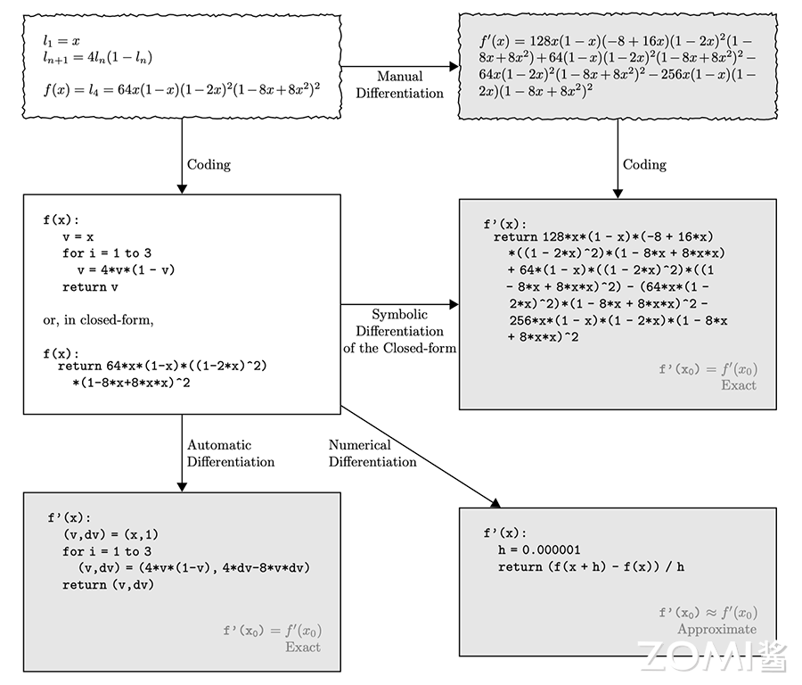
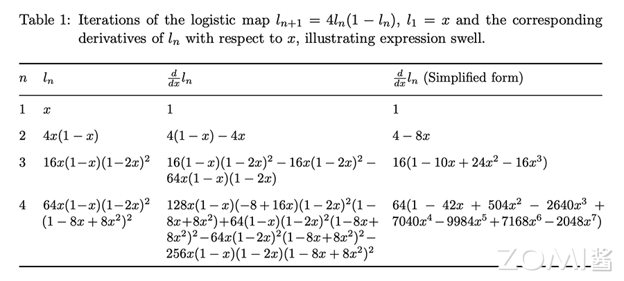

<!--适用于[License](https://github.com/chenzomi12/AISystem/blob/main/LICENSE)版权许可-->

# 什么是微分(DONE)

自动微分（Automatic Differentiation，AD）是一种对计算机程序进行高效准确求导的技术，一直被广泛应用于计算流体力学、大气科学、工业设计仿真优化等领域。

近年来，机器学习技术的兴起也驱动着对自动微分技术的研究进入一个新的阶段。随着自动微分和其他微分技术研究的深入，其与编程语言、计算框架、编译器等领域的联系愈发紧密，从而衍生扩展出更通用的可微编程概念。也是作为 AI 框架核心的功能，被广泛地应用。

本节将从常见的微分方法开始介绍，然后深入自动微分基本概念。

## 计算机求导方法

对计算机程序求导的方法可以归纳为以下四种：

- **手动求解法(Manual Differentiation) **：根据链式求导法则，手工求导并编写对应的结果程序，依据链式法则解出梯度公式，带入数值，得到梯度。

- **数值微分法(Numerical Differentiation)**：利用导数的原始定义，通过有限差分近似方法完成求导，直接求解微分值。

- **符号微分法(Symbolic Differentiation)**：基于数学规则和程序表达式变换完成求导。利用求导规则对表达式进行自动计算，其计算结果是导函数的表达式而非具体的数值。即，先求解析解，然后转换为程序，再通过程序计算出函数的梯度。

- **自动微分法(Automatic Differentiation)**：介于数值微分和符号微分之间的方法，采用类似有向图的计算来求解微分值，也是本文介绍的重点。

下面详细对上面 4 种不同的计算机求导方法进行详细说明。

## 手动微分

手动微分就是对每一个目标函数都需要利用求导公式手动写出求导公式，然后依照公式编写代码，带入数值，求出最终梯度。

这种方法准确有效，但是不适合工程实现，因为通用性和灵活性很差，每一次我们修改算法模型，都要修改对应的梯度求解算法。如果模型复杂或者课程频繁反复迭代，那么工作量将会是巨大的。

如图中 Manual Differentiation 所示，会把原始的计算公式根据链式求导法则进行展开。

## 数值微分

数值微分方式应该是最直接而且简单的一种自动求导方式，使用差分近似方法完成，其本质是根据导数的定义推导而来。

$$ f'(x)=lim_{h \to 0}\frac{f(x+h)-f(x)}{h} $$

当 $h$ 取很小的数值，比如 0.000001 时，导数是可以利用差分来近似计算出来的。只需要给出函数值以及自变量的差值，数值微分算法就可计算出导数值。单侧差分公式根据导数的定义直接近似计算某一点处的导数值。
观察导数的定义容易想到，当 $h$ 充分小时，可以用差商 $\frac{f(x+h)-f(x)}{h}$ 近似导数结果。而近似的一部分误差（截断误差，Truncation Error）可以由泰勒公式中的二阶及二阶后的所有余项给出：

$$ f(x \pm h)=f(x)\pm hf'(x)+\frac{h^2}{2!}f''(x) \pm \frac{h^3}{3!}f''(x) + ... + (\pm h)^n n!f^{(n)}(x) $$

因此数值微分中常用的三种计算方式及其对应的截断误差可以归纳为三种。

- 向前差商（Forward Difference）：

$$\frac{\delta f(x)}{\delta x} \approx \frac{f(x+h)-f(x)}{h} $$

其中 Forward Difference 的阶段误差为 $O(h)$。

- 向后差商（Reverse Difference）：

$$ \frac{\delta f(x)}{\delta x} \approx \frac{f(x)-f(x-h)}{h} $$

其中 Reverse Difference 的阶段误差为 $O(h)$。

- 中心差商（Center Difference）

$$ \frac{\delta f(x)}{\delta x} \approx \frac{f(x+h)-f(x-h)}{2h} $$

其中 Center Difference 的阶段误差为 $O(h^2)$。

可以看出来，数值微分中的截断误差与步长 $h$ 有关，$h$ 越小则截断误差越小，近似程序越高。

但实际情况数值微分的精确度并不会随着 $h$ 的减小而无限减小，因为计算机系统中对于浮点数的运算由于其表达方式存在另外一种误差（舍入误差，Round-off Error），而舍入误差则会随着 $h$ 变小而逐渐增大。

因此在截断误差和舍入误差的共同作用下，数值微分的精度将会形成一个变化的函数并在某一个 $h$ 值处达到最小值。

为了缓解截断错误，提出了中心微分近似（Center Difference Approximation），这方法仍然无法解决舍入误差，只是减少误差，但是它比单侧差分公式有更小的误差和更好的稳定性：

$$ \frac{\delta f(x)}{\delta x} \approx \frac{f(x+h)-f(x-h)}{2h}+O(h^2) $$

数值微分的优点是：

- 具有计算适用性，对大部分表达式适用；
- 对用户显式地隐藏了求导过程；
- 简单容易实现。

数值微分的缺点是：

- 计算量大，求解速度最慢，因为每计算一个参数的导数，都需要重新计算。
- 引入误差，因为是数值逼近，所以会不可靠，不稳定的情况，无法获得一个相对准确的导数值。如果 $h$ 选取不当，可能会得到与符号相反的结果，导致误差增大。
- 引入截断错误（Truncation error），在数值计算中 h 无法真正取零导致的近似误差。
- 引入舍入误差（Round-off Error），在计算过程中出现的对小数位数的不断舍入会导致求导过程中的误差不断累积。

## 符号微分

符号微分（Symbolic Differentiation）属符号计算的范畴，利用链式求导规则对表达式进行自动计算，其计算结果是导函数的表达式。符号计算用于求解数学中的公式解，得到的是解的表达式而非具体的数值。

符号微分适合符号表达式的自动求导，符号微分的原理是用下面的简单求导规则，对计算机程序中的表达式进行递归变换来完成求导替代手动微分：

$$ \frac{\delta}{\delta x}((f(x)+g(x))=\frac{\delta}{\delta x}f(x)+\frac{\delta}{\delta x}g(x) $$

另外有：

$$ \frac{\delta}{\delta x}(f(x)g(x))=(\frac{\delta}{\delta x}f(x))g(x)+f(x)(\frac{\delta}{\delta x}g(x)) $$

由于变换过程中并不涉及具体的数值计算且数学上是严格等价，因此其可以大大减小微分结果的误差（仅存在变换完成后计算过程中的舍入误差）。除此之外，符号微分的计算方式使其还能用于类似极值 $\frac{\delta}{\delta x}f(x)=0$ 的数学问题求解。

从某种角度看，这种递归思想和严格的程序变换让符号微分看上去是一种“完美”的计算过程。

符号微分利用代数软件，实现微分的一些公式，然后根据基本函数的求导公式以及四则运算、复合函数的求导法则，将公式的计算过程转化成微分过程，这样就可以对用户提供的具有闭包（closed form）的数学表达式进行"自动微分"求解。即先求解析解原始数学表达式，然后转换为程序，再通过程序计算出函数的梯度。

符号微分计算出的表达式需要用字符串或其他数据结构存储，如表达式树。因为符号微分的这些优点，其也在包括 Mathematica、Maple、matlab、Maxima 等现代代数系统工具软件中使用。

但符号微分的最大弊病在于其对表达式的严格展开和变换也导致了所谓的表达式膨胀（expression swell）问题。以递归表达式为例：

$$ l_{n+1}=4l_n(1-l_n) $$

可以看到在不同的迭代中其符号微分的结果相比人工简化后的结果复杂很多，且随着迭代次数而增大。

符号微分的优点是：

- 简单容易实现；

- 精度高，可适用于更复杂的数学问题求解等场景。

符号微分的缺点是：

- 表达式复杂时候，求导结果存在表达式膨胀问题；

- 表达式必须是闭包（closed form）形式，即必须能写成完整数学表达式，不能有编程语言中的循环结构、条件结构等，才能将整个问题转换为一个纯数学符号问题。

## 自动微分

其实，对于机器学习中的应用，不需要得到导数的表达式，而只需计算函数在某一点处的导数值，即对应神经网络、深度学习在确定层数中某个神经元的导数值。

### 基本原理

自动微分是介于数值微分和符号微分之间的方法，采用类似有向图的计算来求解微分值。

- 数值微分：直接代入数值近似求解；

- 符号微分：对代数表达式求解析解，再代入数值进行计算；

- 自动微分：对基本算子（函数）应用符号微分方法，其次代入数值进行计算，保留中间结果，最后通过链式求导法将中间结果应用于整个函数。这样可以做到完全向用户隐藏微分求解过程，也可以灵活于编程语言的循环结构、条件结构等结合起来。

关于解析解我们还要做一些说明。几乎所有机器学习算法在训练或预测时，都可以归结为求解最优化问题，如果目标函数可导，则问题就变为求训练函数的驻点。但是通常情况下我们无法得到驻点的解析解，因此只能采用数值优化算法，如梯度下降法，牛顿法，拟牛顿法等等。

这些数值优化算法都依赖于函数的一阶导数值或二阶导数值（包括梯度与 Hessian 矩阵）。因此需要解决如何求一个复杂函数的导数问题，自动微分技术是解决此问题的一种通用方法。

由于自动微分法只对基本函数或常数运用符号微分法则，所以它可以灵活结合编程语言的循环结构，条件结构等。使用自动微分和不使用自动微分对代码总体改动非常小，由于它实际是一种图计算，可以对其做很多优化，所以该方法在现代深度学习系统中得到广泛应用。

### 数学基础

在计算链式法则之前，我们先回顾一下复合函数。复合函数在本质上就是有关函数的函数（function of functions）。它将一个函数的返回值作为参数传递给另一个函数，并且将另一个函数的返回值作为参数再传递给下一个函数，也就是函数套函数，把几个简单的函数复合为一个较为复杂的函数。

链式法则是微积分中的求导法则，用于求一个复合函数的导数，是在微积分的求导运算中一种常用的方法。复合函数的导数将是构成复合这有限个函数在相应点的导数的乘积，就像锁链一样一环套一环，故称链式法则。

自动微分的思想则是将计算机程序中的运算操作分解为一个有限的基本操作集合，且集合中基本操作的求导规则均为已知在完成每一个基本操作的求导后，使用链式法则将结果组合得到整体程序的求导结果。即：

$$ (f \cdot g)'(x)=f'(g(x))g'(x) $$

比如对下式进行求导：

$$ y=sin(x^2+1) $$

链式求导，令：

$$ f(x)=sin(x),g(x)=x^2+1 $$

有：

$$ (f(g(x)))'=f'(g(x))g'(x)=[sin(x^2+1)]' \cdot 2x=2cos(x^2+1) \cdot x $$

### 自动微分精髓

自动微分的精髓在于它发现了微分计算的本质：微分计算就是一系列有限的可微算子的组合。

自动微分法被认为是对计算机程序进行非标准的解释。自动微分基于一个事实，即每一个计算机程序，不论它有多么复杂，都是在执行加减乘除这一系列基本算数运算，以及指数、对数、三角函数这类初等函数运算。

于是自动微分先将符号微分法应用于最基本的算子，比如常数，幂函数，指数函数，对数函数，三角函数等，然后代入数值，保留中间结果，最后再通过链式求导法则应用于整个函数。

通过将链式求导法则应用到这些运算上，我们能以任意精度自动地计算导数，而且最多只比原始程序多一个常数级的运算。

以如下为例，这是原始公式：

$$ y=f(g(h(x)))=f(g(h(w_0)))=f(g(w_1))=f(w_2)=w_3 $$

自动微分以链式法则为基础，把公式中一些部分整理出来成为一些新变量，然后用这些新变量整体替换这个公式，于是得到：

$$ w_0=x \\ w_1=h(w_0) \\ w_2=g(w_1) \\ w_3=f(w_2)=y $$

然后把这些新变量作为节点，依据运算逻辑把公式整理出一张有向无环图（DAG）。即原始函数建立计算图，数据正向传播，计算出中间节点，并记录计算图中的节点依赖关系。

因此，自动微分可以被认为是将一个复杂的数学运算过程分解为一系列简单的基本运算，其中每一项基本运算都可以通过查表得出来。

因此自动微分的优缺点可以简单总结如下：

- 优点：精度高，无表达式膨胀问题；

- 缺点：需要存储一些中间求导结果，内存占用会增加。

## 小结与思考

- 自动微分（AD）是一种高效准确的计算机程序求导技术，广泛应用于多个领域，包括机器学习，与编程语言、计算框架紧密相关，是AI框架的核心功能。

- 计算机求导方法包括手动求解法、数值微分法、符号微分法和自动微分法，每种方法都有其适用场景和优缺点。

- 自动微分结合了数值微分和符号微分的优点，通过构建计算图和应用链式法则，能够精确计算复杂函数的导数，适用于深度学习等领域，但会增加内存占用。

## 本节视频

<html>
<iframe src="https://player.bilibili.com/player.html?aid=345813308&bvid=BV1Ld4y1M7GJ&cid=911384582&page=1&as_wide=1&high_quality=1&danmaku=0&t=30&autoplay=0" width="100%" height="500" scrolling="no" border="0" frameborder="no" framespacing="0" allowfullscreen="true"> </iframe>
</html>