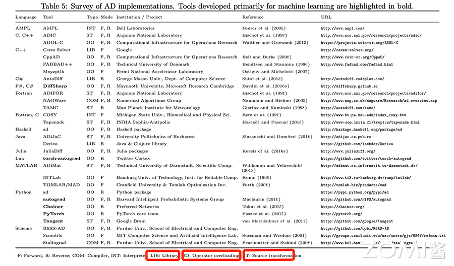

<!--适用于[License](https://github.com/chenzomi12/AISystem/blob/main/LICENSE)版权许可-->

# 微分实现方式(DONE)

在上一节了解到了正反向模式只是自动微分的原理模式，在实际代码实现的过程，正方向模式只是提供一个原理性的指导，在真正编码过程会有很多细节需要打开，例如如何解析表达式，如何记录反向求导表达式的操作等等。这一节中，希望通过介绍目前比较热门的方法给大家普及一下自动微分的具体实现。

## 微分实现关键步骤

了解自动微分的不同实现方式非常有用。在这里呢，我们将介绍主要的自动微分实现方法。在上一篇的文章中，我们介绍了自动微分的基本数学原理。可以总结自动微分的关键步骤为：

- 分解程序为一系列已知微分规则的基础表达式的组合

- 根据已知微分规则给出各基础表达式的微分结果

- 根据基础表达式间的数据依赖关系，使用链式法则将微分结果组合完成程序的微分结果

虽然自动微分的数学原理已经明确，包括正向和反向的数学逻辑和模式。但具体的实现方法则可以有很大的差异，2018 年，Siskind 等学者在其综述论文 Automatic Differentiation in Machine Learning: a Survey [1] 中对自动微分实现方案划分为三类：

**基本表达式**：基本表达式或者称元素库（Elemental Libraries），基于元素库中封装一系列基本的表达式（如：加减乘除等）及其对应的微分结果表达式，作为库函数。用户通过调用库函数构建需要被微分的程序。而封装后的库函数在运行时会记录所有的基本表达式和相应的组合关系，最后使用链式法则对上述基本表达式的微分结果进行组合完成自动微分。

**操作符重载**：操作符重载或者称运算重载（Operator Overloading，OO），利用现代语言的多态特性（例如 C++/JAVA/Python 等高级语言），使用操作符重载对语言中基本运算表达式的微分规则进行封装。同样，重载后的操作符在运行时会记录所有的操作符和相应的组合关系，最后使用链式法则对上述基本表达式的微分结果进行组合完成自动微分。

**源代码变换**：源代码变换或者叫做源码转换（Source Code Transformation，SCT）则是通过对语言预处理器、编译器或解释器的扩展，将其中程序表达（如：源码、AST 抽象语法树 或 编译过程中的中间表达 IR）的基本表达式微分规则进行预定义，再对程序表达进行分析得到基本表达式的组合关系，最后使用链式法则对上述基本表达式的微分结果进行组合生成对应微分结果的新程序表达，完成自动微分。

任何 AD 实现中的一个主要考虑因素是 AD 运算时候引入的性能开销。就计算复杂性而言，AD 需要保证算术量增加不超过一个小的常数因子。另一方面，如果不小心管理 AD 算法，可能会带来很大的开销。例如，简单的分配数据结构来保存对偶数（正向运算和反向求导），将涉及每个算术运算的内存访问和分配，这通常比现代计算机上的算术运算更昂贵。同样，使用运算符重载可能会引入伴随成本的方法分派，与原始函数的原始数值计算相比，这很容易导致一个数量级的减速。

下面这个图是论文作者回顾了一些比较通用的 AD 实现。



## 基本表达式

基本表达式法也叫做元素库（Elemental Libraries），程序中实现构成自动微分中计算的最基本的类别或者表达式，并通过调用自动微分中的库，来代替数学逻辑运算来工作。然后在函数定义中使用库公开的方法，这意味着在编写代码时，手动将任何函数分解为基本操作。

这个方法呢从自动微分刚出现的时候就已经被广泛地使用，典型的例子是 Lawson (1971) 的 WCOMP 和 UCOMP 库，Neidinger (1989) 的 APL 库，以及 Hinkins (1994) 的工作。同样，Rich 和 Hill (1992) 使用基本表达式法在 MATLAB 中制定了他们的自动微分实现。

以公式为例子：

$$ f(x1,x2)=ln(x1)+x1*x2−sin(x2) $$
:eqlabel:`diff_04_eq1`

用户首先需要手动将公式 1 中的各个操作，或者叫做子函数，分解为库函数中基本表达式组合：

```python
t1 = log(x)
t3 = sin(x)
t2 = x1 * x2
t4 = x1 + x2
t5 = x1 - x2
```

使用给定的库函数，完成上述函数的程序设计：

```python
// 参数为变量 x,y,t 和对应的导数变量 dx,dy,dt
def ADAdd(x, y, dx, dy, t, dt)

// 同理对上面的公式实现对应的函数
def ADSub(x, y, dx, dy, t, dt)
def ADMul(x, y, dx, dy, t, dt)
def ADLog(x, dx, t, dt)
def ADSin(x, dx, t, dt)
```

而库函数中则定义了对应表达式的数学微分规则，和对应的链式法则:

```python
// 参数为变量 x,y,t 和对应的导数变量 dx,dy,dt
def ADAdd(x, y, dx, dy, t, dt):
    t = x + y
    dt = dy + dx

// 参数为变量 x,y,t 和对应的导数变量 dx,dy,dt
def ADSub(x, y, dx, dy, t, dt):
    t = x - y
    dt = dy - dx

// ... 以此类推
```

针对公式 1 中基本表达式法，可以按照下面示例代码来实现正向的推理功能，反向其实也是一样，不过调用代码更复杂一点：

```python
x1 = xxx
x2 = xxx
t1 = ADlog(x1)
t2 = ADSin(x2)
t3 = ADMul(x1, x2)
t4 = ADAdd(t1, t3)
t5 = ADSub(t4, t2)
```

基本表达式法的**优点**可以总结如下：

- 实现简单，基本可在任意语言中快速地实现为库

基本表达式法的**缺点**可以总结如下：

- 用户必须使用库函数进行编程，而无法使用语言原生的运算表达式；
- 另外实现逻辑和代码也会冗余较长，依赖于开发人员较强的数学背景

基本表达式法在没有操作符重载 AD 的 80 到 90 年代初期，仍然是计算机中实现自动微分功能最简单和快捷的策略啦。

## 操作符重载

在具有多态特性的现代编程语言中，运算符重载提供了实现自动微分的最直接方式，利用了编程语言的第一特性（first class feature），重新定义了微分基本操作语义的能力。

在 C++ 中使用运算符重载实现的流行工具是 ADOL-C（Walther 和 Griewank，2012）。 ADOL-C 要求对变量使用启用 AD 的类型，并在 Tape 数据结构中记录变量的算术运算，随后可以在反向模式 AD 计算期间“回放”。 Mxyzptlk 库 (Michelotti, 1990) 是 C++ 能够通过前向传播计算任意阶偏导数的另一个例子。 FADBAD++ 库（Bendtsen 和 Stauning，1996 年）使用模板和运算符重载为 C++ 实现自动微分。对于 Python 语言来说，autograd 提供正向和反向模式自动微分，支持高阶导数。

在机器学习 ML 或者深度学习 DL 领域，目前 AI 框架中使用操作符重载的一个典型代表是 Pytroch，其中使用数据结构 Tape 来记录计算流程，在反向模式求解梯度的过程中进行 replay Operator。

1. 操作符重载来实现自动微分的功能里面，很重要的是利用高级语言的特性。下面简单看看伪代码，这里面我们定义一个特殊的数据结构 `Variable`，然后基于 `Variable` 重载一系列的操作如 `__mul__` 代替 * 操作。

```Python
class Variable:
    def __init__(self, value):
        self.value = value

    def __mul__(self, other):
        return ops_mul(self, other)

   # 同样重载各种不同的基础操作
   def __add__(self, other)
   def __sub__(self, other)
   def __div__(self, other)
```

2. 实现操作符重载后的计算。

```Python
def ops_mul(self, other):
    x = Variable(self.value * other.value)
```

3. 接着通过一个 Tape 的数据结构，来记录每次 `Variable` 执行计算的顺序，Tape 这里面主要是记录正向的计算，把输入、输出和执行运算的操作符记录下来。

```Python
class Tape(NamedTuple):
    inputs : []
    outputs : []
    propagate : (inputs, outpus)
```

4. 因为大部分 ML 系统或者 AI 框架采用的是反向模式，因此最后会逆向遍历 Tape 里面的数据（相当于反向传播或者反向模式的过程），然后累积反向计算的梯度。

```Python
# 反向求导的过程，类似于 Pytroch 的 backward 接口
def grad(l, results):

    # 通过 reversed 操作把带有梯度信息的 tape 逆向遍历
    for entry in reversed(gradient_tape):
        # 进行梯度累积，反向传播给上一次的操作计算
        dl_d[input] += dl_dinput
```

当然啦，我们会在下一节当中带着大家亲自通过操作符重载实现一个前向的自动微分和后向的自动微分。下面总结一下操作符重载的一个基本流程：

- 预定义了特定的数据结构，并对该数据结构重载了相应的基本运算操作符
- 程序在实际执行时会将相应表达式的操作类型和输入输出信息记录至特殊数据结构
- 得到特殊数据结构后，将对数据结构进行遍历并对其中记录的基本运算操作进行微分
- 把结果通过链式法则进行组合，完成自动微分

操作符重载法的**优点**可以总结如下：

- 实现简单，只要求语言提供多态的特性能力
- 易用性高，重载操作符后跟使用原生语言的编程方式类似

操作符重载法的**缺点**可以总结如下：

- 需要显式的构造特殊数据结构和对特殊数据结构进行大量读写、遍历操作，这些额外数据结构和操作的引入不利于高阶微分的实现
- 对于一些类似 if，while 等控制流表达式，难以通过操作符重载进行微分规则定义。对于这些操作的处理会退化成基本表达式方法中特定函数封装的方式，难以使用语言原生的控制流表达式

## 源代码转换

源码转换（Source Code Transformation，SCT）是最复杂的，实现起来也是非常具有挑战性。

源码转换的实现提供了对编程语言的扩展，可自动将算法分解为支持自动微分的基本操作。通常作为预处理器执行，以将扩展语言的输入转换为原始语言。简单来说就是利用源语言来实现领域扩展语言 DSL 的操作方式。

源代码转换的经典实例包括 Fortran 预处理器 GRESS（Horwedel 等人，1988 年）和 PADRE2（Kubo 和 Iri，1990 年），在编译之前将启用 AD 的 Fortran 变体转换为标准 Fortran。类似地，ADIFOR 工具 (Bischof et al., 1996) 给定一个 Fortran 源代码，生成一个增强代码，其中除了原始结果之外还计算所有指定的偏导数。对于以 ANSI C 编码的过程，ADIC 工具（Bischof 等人，1997）在指定因变量和自变量之后将 AD 实现为源代码转换。 Tapenade（Pascual 和 Hasco¨et，2008 年；Hasco¨et 和 Pascual，2013 年）是过去 10 年终 SCT 的流行工具，它为 Fortran 和 C 程序实现正向和反向模式 AD。 

除了通过源代码转换进行语言扩展外，还有一些实现通过专用编译器或解释器引入了具有紧密集成的 AD 功能的新语言。一些最早的 AD 工具，例如 SLANG (Adamson and Winant, 1969) 和 PROSE (Pfeiffer, 1987) 属于这一类。 NAGWare Fortran 编译器 (Naumann and Riehme, 2005) 是一个较新的示例，其中使用与 AD 相关的扩展会在编译时触发衍生代码的自动生成。

作为基于解释器的实现的一个例子，代数建模语言 AMPL (Fourer et al., 2002) 可以用数学符号表示目标和约束，系统从中推导出活动变量并安排必要的 AD 计算。此类别中的其他示例包括基于类似 Algol 的 DIFALG 语言的 FM/FAD 包 (Mazourik, 1991)，以及类似于 Pascal 的面向对象的 COZY 语言 (Berz et al., 1996)。

而华为全场景 AI 框架 MindSpore 则是基于 Python 语言使用源代码转换实现 AD 的正反向模式，并采用了函数式编程的风格，该机制可以用控制流表示复杂的组合。函数被转换成函数中间表达（Intermediate Representation，IR），中间表达构造出一个能够在不同设备上解析和执行的计算图。在执行前，计算图上应用了多种软硬件协同优化技术，以提升端、边、云等不同场景下的性能和效率。

其主要流程是：分析获得源程序的 AST 表达形式；然后基于 AST 完成基本表达式的分解和微分操作；再通过遍历 AST 得到基本表达式间的依赖关系，从而应用链式法则完成自动微分。

因为源码转换涉及到底层的抽象语法树、编译执行等细节，因此这里就不给出伪代码了（实在太难了给不出来），我们通过下面这张图来简单了解下 SCT 的一般性过程。


从图中可以看到源码转换的整体流程分为编译时间和执行时间，以 MindSpore 为例，其在运行之前的第一个 epoch 会等待一段时间，是因为需要对源码进行编译转换解析等一系列的操作。然后再 run time 运行时则会比较顺畅，直接对数据和代码不断地按照计算机指令来高速执行。

编译阶段呢，在 Initialization 过程中会对源码进行 Parse 转换成为抽象语法树 AST，接着转换为基于图表示的中间表达 IR，这个基于图的 IR 从概念上理解可以理解为计算图，神经网络层数的表示通过图表示会比较直观。

接着对 Graph base IR 进行一些初级的类型推导，特别是针对 Tensor/List/Str 等不同的基础数据表示，然后进行宏展开，还有语言单态化，最后再对变量或者自变量进行类型推导。可以从图中看到，很多地方出现了不同形式的 IR，IR 其实是编译器中常用的一个中间表达概念，在编译的 Pass 中会有很多处理流程，每一步处理流程产生一个 IR，交给下一个 Pass 进行处理。

最后通过 LLVM 或者其他等不同的底层编译器，最后把 IR 编译成机器码，然后就可以真正地在 runtime 执行起来。

源码转换法的**优点**可以总结如下：

- 支持更多的数据类型（原生和用户自定义的数据类型） + 原生语言操作（基本数学运算操作和控制流操作）
- 高阶微分中实现容易，不用每次使用 Tape 来记录高阶的微分中产生的大量变量，而是统一通过编译器进行额外变量优化和重计算等优化
- 进一步提升性能，没有产生额外的 tape 数据结构和 tape 读写操作，除了利于实现高阶微分以外，还能够对计算表达式进行统一的编译优化

源码转换法的**缺点**可以总结如下：

- 实现复杂，需要扩展语言的预处理器、编译器或解释器，深入计算机体系和底层编译
- 支持更多数据类型和操作，用户自由度虽然更高，但同时更容易写出不支持的代码导致错误
- 微分结果是以代码的形式存在，在执行计算的过程当中，特别是深度学习中大量使用 for 循环过程中间错误了，或者是数据处理流程中出现错误，并不利于深度调试

## 本节视频

<html>
<iframe src="https://player.bilibili.com/player.html?aid=901075118&bvid=BV1BN4y1P76t&cid=911355268&page=1&as_wide=1&high_quality=1&danmaku=0&t=30&autoplay=0" width="100%" height="500" scrolling="no" border="0" frameborder="no" framespacing="0" allowfullscreen="true"> </iframe>
</html>
