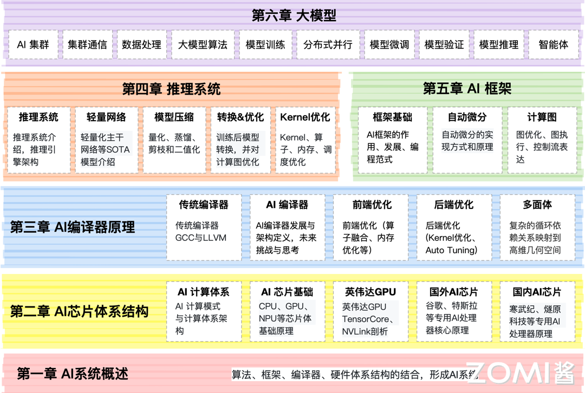

# Deep Learning System & AI System

文字课程内容正在一节节补充更新，尽可能抽空继续更新正在 [AISys](https://chenzomi12.github.io/) ，希望您多多鼓励和参与进来！！！

文字课程开源在 [AISys](https://chenzomi12.github.io/)，系列视频托管[B站](https://space.bilibili.com/517221395)和[油管](https://www.youtube.com/@zomi6222/videos)，PPT开源在[github](https://github.com/chenzomi12/DeepLearningSystem)，欢迎取用！！！

> 非常希望您也参与到这个开源项目中，B站给ZOMI留言哦！
>
> 欢迎大家使用的过程中发现bug或者勘误直接提交代码PR到开源社区哦！

## 项目背景

这个开源项目英文名字叫做 **Deep Learning System** 或者 **AI System(AISys)**，中文名字叫做 **深度学习系统** 或者 **AI系统**。

本开源项目主要是跟大家一起探讨和学习人工智能、深度学习的系统设计，而整个系统是围绕着 ZOMI 在工作当中所积累、梳理、构建 AI 系统全栈的内容。希望跟所有关注 AI 开源项目的好朋友一起探讨研究，共同促进学习讨论。

## 课程内容大纲

课程主要包括以下六大模块：

第一部分，AI基础知识和AI系统的全栈概述的<u>**AI系统概述**</u>，以及深度学习系统的系统性设计和方法论，主要是整体了解AI训练和推理全栈的体系结构内容。

第二部分，硬核篇介绍<u>**AI芯片概况**</u>，这里就很硬核了，从芯片基础到AI芯片的范围都会涉及，芯片设计需要考虑上面AI框架的前端、后端编译，而不是停留在天天喊着吊打英伟达，被现实打趴。

第三部分，进阶篇介绍<u>**AI编译器原理**</u>，将站在系统设计的角度，思考在设计现代机器学习系统中需要考虑的编译器问题，特别是中间表达乃至后端优化。

第四部分，实际应用<u>**推理系统与引擎**</u>，讲了太多原理身体太虚容易消化不良，还是得回归到业务本质，让行业、企业能够真正应用起来，而推理系统涉及一些核心算法和注意的事情也分享下。

第五部分，介绍<u>**AI框架核心技术**</u>，首先介绍任何一个AI框架都离不开的自动微分，通过自动微分功能后就会产生表示神经网络的图和算子，然后介绍AI框架前端的优化，还有最近很火的大模型分布式训练在AI框架中的关键技术。

第六部分，汇总篇介绍<u>**大模型与AI系统**</u>，大模型是基于AI集群的全栈软硬件性能优化，通过最小的每一块AI芯片组成的AI集群，编译器使能到上层的AI框架，训练过程需要分布式并行、集群通信等算法支持，而且在大模型领域最近持续演进如智能体等新技术。

## 课程设立目的

本课程主要为本科生高年级、硕博研究生、AI系统从业者设计，帮助大家：

1. 完整了解AI的计算机系统架构，并通过实际问题和案例，来了解AI完整生命周期下的系统设计。

2. 介绍前沿系统架构和AI相结合的研究工作，了解主流框架、平台和工具来了解AI系统。

**先修课程:** C++/Python，计算机体系结构，人工智能基础

## 课程部分

### **[一. AI系统概述](./01Introduction/)**

| 编号  | 名称                                  | 具体内容                        |
|:---:|:----------------------------------- |:--------------------------- |
| 1      | [AI 系统](./01Introduction/) | 算法、框架、体系结构的结合，形成AI系统        |

### **[二. AI芯片体系结构](./02Hardware/)**

| 编号  | 名称                                  | 具体内容                        |
|:---:|:----------------------------------- |:--------------------------- |
| 1      | [AI 计算体系](./02Hardware/01Foundation/) | 神经网络等AI技术的计算模式和计算体系架构        |
| 2      | [AI 芯片基础](./02Hardware/02ChipBase/)   | CPU、GPU、NPU等芯片体系架构基础原理       |
| 3      | [图形处理器 GPU](./02Hardware/03GPUBase/)  | GPU的基本原理，英伟达GPU的架构发展         |
| 4      | [英伟达 GPU 详解](./02Hardware/04NVIDIA/) | 英伟达GPU的TensorCore、NVLink深度剖析 |
| 5      | [国外 AI 处理器](./02Hardware/05Abroad/)   | 谷歌、特斯拉等专用AI处理器核心原理        |
| 6      | [国内 AI 处理器](./02Hardware/06Domestic/)   | 寒武纪、燧原科技等专用AI处理器核心原理        |

### **[三. AI编译原理](./03Compiler/)**

| 编号  | 名称                                  | 具体内容                        |
|:---:|:----------------------------------- |:--------------------------- |
| 1      | [传统编译器](./03Compiler/01Tradition/)    | 传统编译器GCC与LLVM，LLVM详细架构          |
| 2      | [AI 编译器](./03Compiler/02AICompiler/)  | AI编译器发展与架构定义，未来挑战与思考            |
| 3      | [前端优化](./03Compiler/03Frontend/)      | AI编译器的前端优化(算子融合、内存优化等)          |
| 4      | [后端优化](./03Compiler/04Backend/)       | AI编译器的后端优化(Kernel优化、AutoTuning) |
| 5      | 多面体                                 | 待更ing...                        |
| 6      | [PyTorch2.0](./03Compiler/06PyTorch/) | PyTorch2.0最重要的新特性：编译技术栈         |

### **[四. AI推理系统](./04Inference/)**

| 编号  | 名称                                  | 具体内容                        |
|:---:|:----------------------------------- |:--------------------------- |
| 1      | [推理系统](./04Inference/01Inference/)  | 推理系统整体介绍，推理引擎架构梳理          |
| 2      | [轻量网络](./04Inference/02Mobilenet/)  | 轻量化主干网络，MobileNet等SOTA模型介绍 |
| 3      | [模型压缩](./04Inference/03Slim/)       | 模型压缩4件套，量化、蒸馏、剪枝和二值化       |
| 4      | [转换&优化](./04Inference/04Converter/) | AI框架训练后模型进行转换，并对计算图优化      |
| 5      | [Kernel优化](./04Inference/05Kernel/) | Kernel层、算子层优化，对算子、内存、调度优化  |

### **[五. AI框架核心技术](./05Framework/)**

| 编号  | 名称                                  | 具体内容                        |
|:---:|:----------------------------------- |:--------------------------- |
| 1   | [AI框架基础](./05Framework/01Foundation/) | AI框架的作用、发展、编程范式             |
| 2   | [自动微分](./05Framework/02AutoDiff/)     | 自动微分的实现方式和原理                |
| 3   | [计算图](./05Framework/03DataFlow/)      | 计算图的概念，图优化、图执行、控制流表达        |

### **[六. 大模型训练](./06Foundation/)**

| 编号  | 名称                                  | 具体内容                        |
|:---:|:----------------------------------- |:--------------------------- |
| 1   | [课程介绍](./06Foundation/)    | 大模型整体架构和大模型全流程           |
| 2   | [AI 集群](./06Foundation/02AICluster/)    | AI集群服务器整体组成相关技术           |
| 3   | [集群通信](./06Foundation/03Network/)    | AI 片内通信、AI集群通信拓扑与集合通信原理           |

### 知识清单

## 贡献者

<!-- readme: collaborators,contributors -start -->

<!-- readme: collaborators,contributors -end -->

## 备注

> 这个仓已经到达疯狂的8G啦（ZOMI把所有制作过程、高清图片都原封不动提供），如果你要git clone会非常的慢，因此建议优先到  [Releases · chenzomi12/DeepLearningSystem](https://github.com/chenzomi12/DeepLearningSystem/releases) 来下载你需要的内容。
